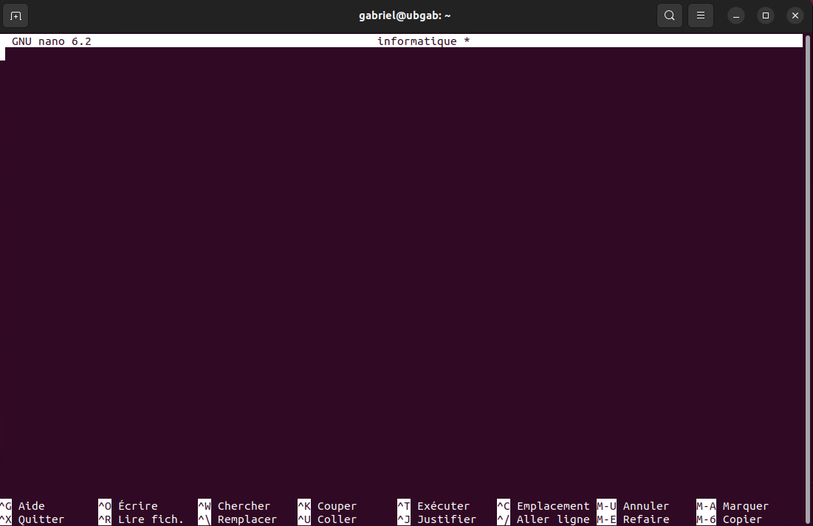
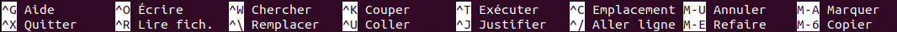

## Les éditeurs de texte
Ce n'est pas parce que nous travaillons dans le terminal de Linux qu'il est impossible d'éditer des fichiers. En effet, lorsque vient le temps d'éditer des fichiers dans le terminal, Linux vous offre deux possibilités: VIM et NANO.

Dans cette page, nous nous attarderons aux deux. Commençons d'abord par Nano, il est plus simple d'utilisation et donc plus apprécié chez ceux et celles qui apprennent Linux.

### Nano

Pour lancer l'éditeur de texte Nano, vous n'avez qu'à entrer le nom de l'éditeur suivi du fichier à éditer. Si le fichier n'existe pas, Nano le créera automatiquement:

```bash
nano informatique
```
Voici à quoi ressemble l'éditeur de texte Nano¸:


Une fois dans cette fenêtre, vous pourrez dès lors, taper du texte. Évidemment, taper du texte ou l'effacer, ca n'a rien d'impressionnant et ca ne relève pas de la sorcellerie. Cela dit, Nano est équipé de quelques fonctions intéressantes. Remarquez au bas de l'écran le menu des actions disponibles.



Le caractère `^` représente la touche `ctrl` du clavier. Le caractère `M` qui précède certaines actions du menu, quant à lui, représente la touche `alt` du clavier.

Vous pouvez consulter l'aide de Nano à tout moment en appuyant simultanément sur les touches `ctrl` + `g`. Vous y trouverez de l'information pour vous aider dans l'utilisation de Nano.