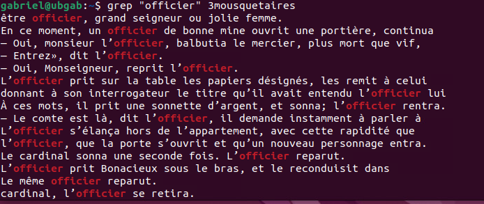

## GREP et les expressions régulières 🧪

La commande `grep` est sans doute l'une des plus utiles du terminal et c'est pourquoi elle se mérite une section à elle seule. En fait, `grep` est l'aconyme de "Global Regular Expression Print". La commande vous permet donc de rechercher du texte sur la base d'un modèle. Quel genre de modèle me demanderez-vous ? Prenons un exemple simple, je cherche à trouver un numéro de téléphone dans un fichier. Cela dit, je ne connais pas le numéro de téléphone que je recherche. Par contre, je sais qu'un numéro de téléphone correspond au modèle suivant: XXX-XXX-XXXX. Je pourrais donc demander à `grep` de chercher le contenu d'un fichier qui correspond à ce modèle.

### REGEX

Ce modèle, c'est ce que l'on nomme une expression régulière. Il s'agit d'une expression permettant d'indiquer à `grep` le genre de texte que je recherche. La composition d'une expression régulière passe par l'utilisation de metacaractère et de texte. Nous étudierons le tout.

Pour les prochains exemples d'utilisation de `grep`, j'utiliserai le livre "Les 3 mousquetaires" que pouvez [télécharger](https://gutenberg.org/ebooks/13951.txt.utf-8) gratuitement sur le site du projet Gutenberg.

### Rechercher un mot

Dans son utilisation la plus simple, `grep` permet de rechercher un mot. Par exemple, si je recherchais le mot "officier" dans le texte des 3 mousquetaires, la commande ressemblerait à :

```bash
grep "officier" 3mousquetaires
```
Voici le résultat obtenu:



Chaque ligne du résultat représente une ligne de texte où l'expression recherchée a été repérée. Sur l'image, vous n'en voyez qu'une partie. Ce mot revient très souvent dans le texte. 

### Somme d'une expression

Combien de fois le mot "officier" apparait-il en fait ?