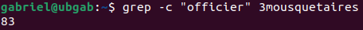
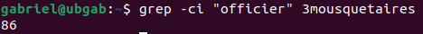
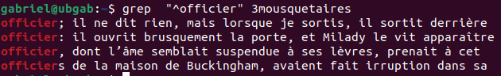
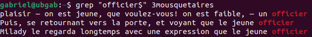
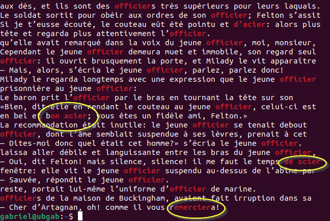
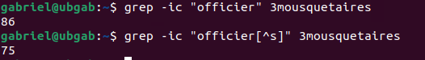

## GREP et les expressions régulières 🧪

La commande `grep` est sans doute l'une des plus utiles du terminal et c'est pourquoi elle se mérite une section à elle seule. En fait `grep` est l'acronyme de "Global Regular Expression Print". La commande vous permet donc de rechercher du texte sur la base d'un modèle. Quel genre de modèle me demanderez-vous ? Prenons un exemple simple, je cherche à trouver un numéro de téléphone dans un fichier. Cela dit, je ne connais pas le numéro de téléphone que je recherche. Par contre, je sais qu'un numéro de téléphone correspond au modèle suivant: XXX-XXX-XXXX. Je pourrais donc demander à `grep` de chercher le contenu d'un fichier qui correspond à ce modèle.

### REGEX

Ce modèle, c'est ce que l'on nomme une expression régulière. Il s'agit d'une expression permettant d'indiquer à `grep` le genre de texte que je recherche. La composition d'une expression régulière passe par l'utilisation de métacaractère et de texte. Nous étudierons le tout.

Pour les prochains exemples d'utilisation de `grep`, j'utiliserai le livre "Les 3 mousquetaires" que pouvez [télécharger](https://gutenberg.org/ebooks/13951.txt.utf-8) gratuitement sur le site du projet Gutenberg.

### Rechercher un mot

Dans son utilisation la plus simple, `grep` permet de rechercher un mot. Par exemple, si je recherchais le mot "officier" dans le texte des 3 mousquetaires, la commande ressemblerait à :

```bash
grep "officier" 3mousquetaires
```
Voici le résultat obtenu:


Chaque ligne du résultat représente une ligne de texte où l'expression recherchée a été repérée. Sur l'image, vous n'en voyez qu'une partie. Ce mot revient très souvent dans le texte. 

### Somme d'une expression

Combien de fois le mot "officier" apparait-il en fait ? Il est possible de demander à `grep` en utilisant le commutateur `-c`.

```bash
grep -c "officier" 3mousquetaires
```



Le mot "officier" apparaitrait donc 83 fois...ou presque. En fait, il ne faut pas négliger le fait que Linux est un système "sensible à la casse". Pour Linux, le mot "officier" et le mot "Officier" sont différents. Pour ignorer cette différenciation que Linux fait entre majuscules et minuscules, nous ajouterons le commutateur `-i`.

```bash
grep -ci "officier" 3mousquetaires
```



Cette fois ça y est! Nous avons toutes les occurrences.

### Correspondance d'ancrage

Les ancres sont des caractères spéciaux me permettant de déterminer à quel endroit sur une ligne de texte un modèle est considéré comme valable. Reprenons notre exemple avec le mot ""officier". Je sais qu'il y a un total de 86 occurrences du mot "officier" dans le texte concerné. Cela dit, j'aimerais retrouver seulement les mots "officier" qui sont en début de ligne. Le métacaractère `^` permet donc ce genre de correspondance par ancrage. Nous l'utiliserons comme suit:

```bash
grep "^officier" 3mousquetaires
```


Nous avons donc un total de 4 lignes dans le roman qui débutent par le mot "officier".

Qu'en est-il pour les fins de ligne ? Vous l'aurez compris, il est tout à fait possible de rechercher le mot "officier" en fin de ligne également. On utilisera alors le métacaractère `$` comme suit:

```bash
grep "officier$" 3mousquetaires
```



### Métacaractères

Les métacaractères sont des caractères spéciaux ayant une signification particulière dans une expression régulière. Nous allons étudier les principaux et analyser leur fonctionnement à l'aide d'exemples.

* Le point `.`

    Le point symbolise n'importe quel caractère unique. Dans une expression régulière, le point peut être remplacé par un espace, une lettre, un chiffre, etc. Par exemple, je vais remplacer une partie du mot "officier" par des points pour en observer le résultat:

    ```bash
    grep "....cier" 3mousquetaires
    ```

    

    On voit tout de suite que ce n'est plus seulement le mot "officier" qui correspond à l'expression régulière mais bien tout ce qui comporte 4 caractères quelconque, suivi des lettres "cier". Nous retrouvons notre expression régulière à l'intérieur du mot "remerciera" par exemple.

* L'étoile `*`

    L'étoile est ce que l'on appelle un quantificateur dans le jargon des expressions régulières. Elle permet d'indiquer une quantité recherchée. Plus précisémment, l'étoile signifie que l'on recherche zéro ou plusieurs occurences du caractère qui le précède. Par exemple, dans le cas du mot "officier", nous pourrions l'utiliser comme suit:

    ```bash
    grep "of*icier" 3mousquetaires
    ```

    Cela me permet d'indiquer qu'il peut y avoir entre 0 et plusieurs lettres "f" dans le mot que je recherche.

* Le plus `+`

    Le symbole `+` est également un quantificateur. Il s'utilise donc de la même manière que l'étoile. Ce symbole fera correspondre une ou plusieurs occurences du caractère qui le précède à la différence de l'étoile qui peut également faire correspondre aucune occurence \(0\). Exemple:

    ```bash
    grep "of+icier" 3mousquetaires
    ```

* Le point d'interrogation `?`

    Le symbole `?` est aussi un quantificateur. Il s'utilise de la même manière que l'étoile et le symbole `+`. Celui-ci fera correspondre zéro ou une occurence du caractère qui le précède. Cela  signifie que si nous le plaçon au même endroit que dans l'exemple avec l'étoile et le plus, nous n'aurons pas de correspondance avec le mot "officier" puisque celui-ci comporte 2 lettres "f".

    ```bash
    grep "of?icier" 3mousquetaires
    ```

- Les crochets `[]`

    Les crochets jouent plusieurs rôles dans les expressions réguliuères, nous allons donc voir chacun de ces rôles:

    - Choix d'un caractère parmi une liste:
    Les crochets peuvent représenter le choix parmi une liste de caractères donnée. Par exemple, dans le cas du mot "officier", je pourrais utiliser la commande suivante:
    ```bash
    grep "[ou]ficier" 3mousquetaires
    ```
    J'aurai alors un match avec le terme "officier" ou "ufficier".

    - Utilisation de classes de caractère:
    Les classes de caractère permettent de donner des indications abrégées à GREP. Les classes sont toujours placées entre crochets:
        - \[a-z\] : Indique que l'on souhaite faire correspondre n'importe quelle lettre minuscule.
        - \[A-Z\] : Indique que l'on souhaite faire correspondre n'importe quelle lettre majuscule.
        - \[a-zA-Z\]: Indique que l'on souhaite faire correspondre n'importe quelle lettre.
        - \[:alpha:\]: Indique que l'on souhaote faire correspondre n'importe quelle lettre.
        - \[0-9\]: Indique que l'on souhaite faire correspondre n'importe quel chiffre.
        - \[a-zA-Z0-9\]: Indique que l'on souhaite faire correspondre n'importe quel chiffre ou lettre.
        - \[:alnum:\]: Indique que l'on souhaite faire correspondre n'importe quel chiffre ou lettre.
    
    - Négation:
    On utilise également les crochets pour indiquer une négation. C'est-à-dire un élément avec lequel on ne souhaite pas correspondre. Par exemple, si je désirais retrouver toutes les occurences du mot "officier", à l'exception des fois où le mot est inscrit au pluriel.
    ```bash
    grep "officier[^s]" 3mousquetaires
    ```

    D'ailleurs, en faisant la somme des occurences, nous voyons bien la différence:

    

