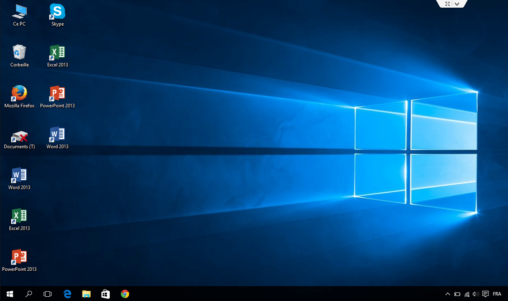
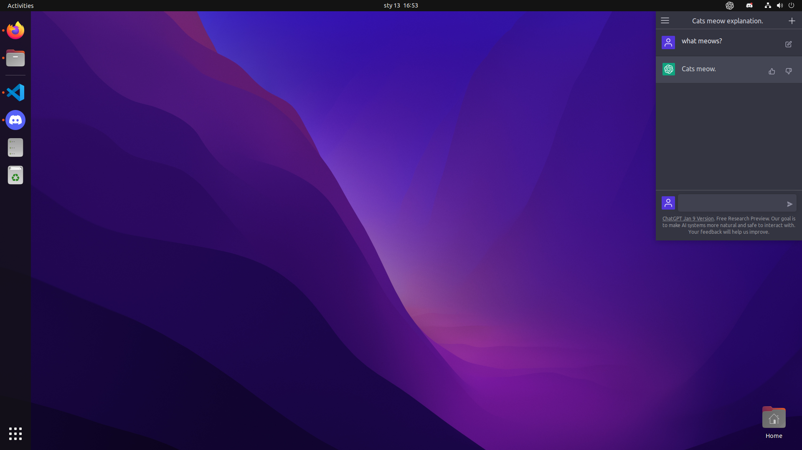
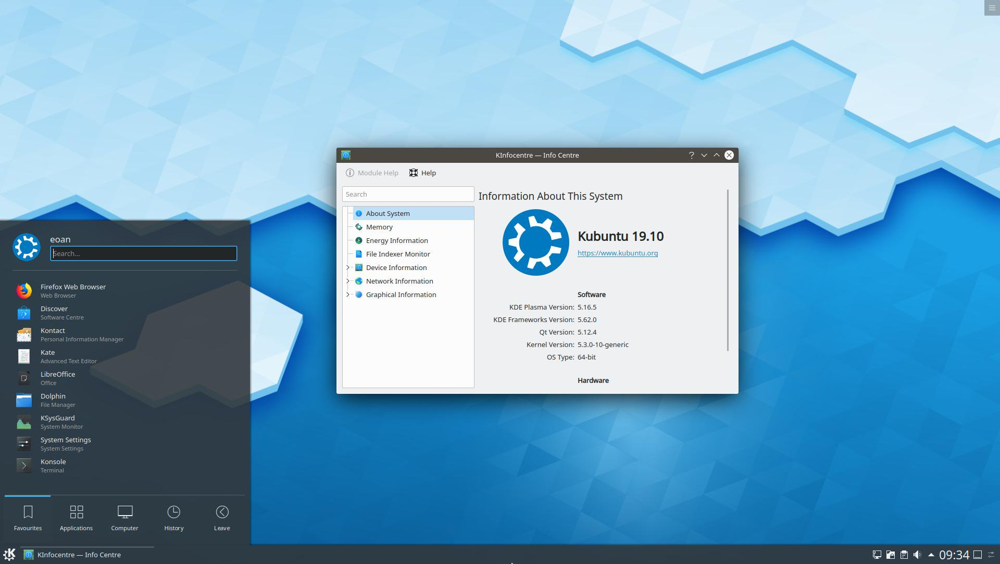
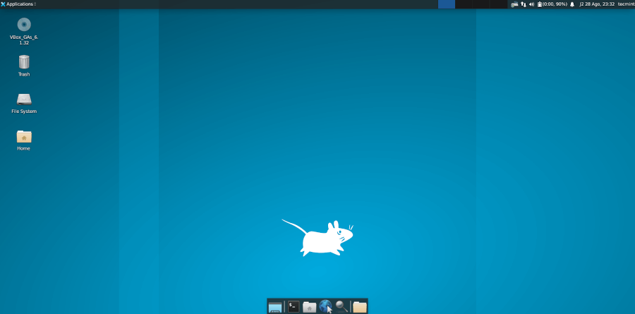
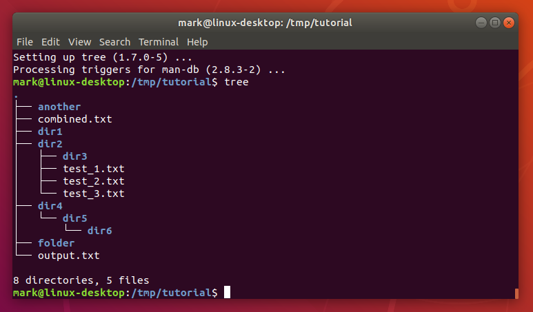

# Linux

Linux est avant tout un système d'exploitation, ou devrais-je plutôt dire une famille de systèmes d'exploitation ? Tout comme Windows d'ailleurs. Je ne dresserai pas l'historique de Linux sur cette page. Vous pouvez consulter [wikipédia](https://fr.wikipedia.org/wiki/Linux) à cet effet. J'aborderai plutôt la conception du système et son utilisation. Prenez note que je 

* * *

## Architecture

Pour la plupart du commun des mortels, la racine d'un disque dur est représentée par une lettre `C:`. C'est une notion qui a été inculquée dût à la manière dont fonctionne Windows. Or, chez Linux, on a plutôt opté pour le caractère `/`. En effet, la barre oblique représente le début de l'arborescence système chez Linux. Il s'en suit alors une arborescence complète, tout comme chez Windows d'ailleurs. Nous retrouvons donc les dossiers suivants:

* `/` C'est la racine du disque dur

* `/bin` C'est le diminutif de _binaries_. Ce dossier contient les essentiels du système pour les utilisateurs. Les commandes _ls_, _pwd_, et _cp_ y sont stockés par exemple.

* `/boot` Ce dossier contient les fichiers nécessaires au démarrage et le noyau du système. 

*  `/dev` C'est le diminutif de _devices_. C'est le point d'entrée de tous les périphériques. \(Clavier, webcam, Clé USB, etc.\)

* `/etc` C'est l'acronyme d'_Editing Text Config_. C'est là que sont la plupart des fichiers de configuration du système et des services.

* `/home` C'est ici que sont stockés les répertoires personnels des utilisateurs.

* `/lib` Diminutif de _libraries_. Contiens des bibliothèques partagées essentielles au système lors du démarrage.

* `/proc` Diminutif de _process_. Contiens des fichiers spéciaux dans lesquels nous retrouvons de l'information sur le système.

* `/root` Répertoire personnel du superutilisateur.

* `/usr` Acronyme de _Unix System Ressources_ contient diverses ressources qui sont partagées entre les utilisateurs du système.

* `/var/` Diminutif de _variable_ Contient des données variant en fonction des systèmes et des logiciels installés sur le système.

* * *

## Interfaces graphiques \(GUI\)

Une interface graphique est un environnement permettant aux humains de communiquer des instructions à une machine par l'entremise d'objets qui sont affichés sur un écran. On y retrouve généralement des fenêtres, des boutons, des icônes et un pointeur \(souris\). L'interface graphique de Windows est généralement bien connue.

Or, sous Linux, l'interface graphique est interchangeable. Nous pouvons donc opérer un système d'exploitation Linux donné, tout en exploitant l'une ou l'autre des interfaces qui nous intéressent le plus. Voici donc quelques-unes des interfaces graphiques les plus connues sous Linux:

* ### GNOME \(GNU Network Object Model\)
GNOME est sans doute l'une des interfaces graphiques les plus populaires chez Linux. Elle a d'ailleurs été longtemps l'interface graphique par défaut d'Ubuntu. 

* ### KDE \(Kool Desktop Environment\)
KDE est très souvent le petit préféré des nouveaux adeptes de Linux. C'est parce qu'il partage plusieurs similarités avec l'interface graphique de Windows. On y retrouve un menu en bas à gauche comprenanant les différents logiciels installés ainsi qu'une barre des tâches au bas de l'écran.

* ### XFCE
Rapidité, économie de ressources et simplicité sont les trois prémices qui ont mené au développement de l'environnement graphique XFCE. Cette interface est effectivement très légère et peut facilement s'exécuter sur des ordinateurs qui ont peu de performances à offrir.

* ### Le terminal \(Absence d'interface graphique\)
Même s'il peut vous refroidir aux premiers abords, le terminal Linux est un réel charme à utiliser lorsque nous nous y sommes habitués. Utiliser le terminal procure de réels avantages: l'économie de ressources, la rapidité d'exécution versus l'interface graphique et il est même possible d'automatiser certaines tâches. Nous nous attarderons longuement au terminal linux dans la prochaine section.

Sachez qu'il existe encore d'autres interfaces graphiques. L'objectif était seulement de vous en présenter quelques-unes afin que vous pussiez vous en faire une idée et réaliser que cet aspect interchangeable de Linux diffère de Windows.

* * *

