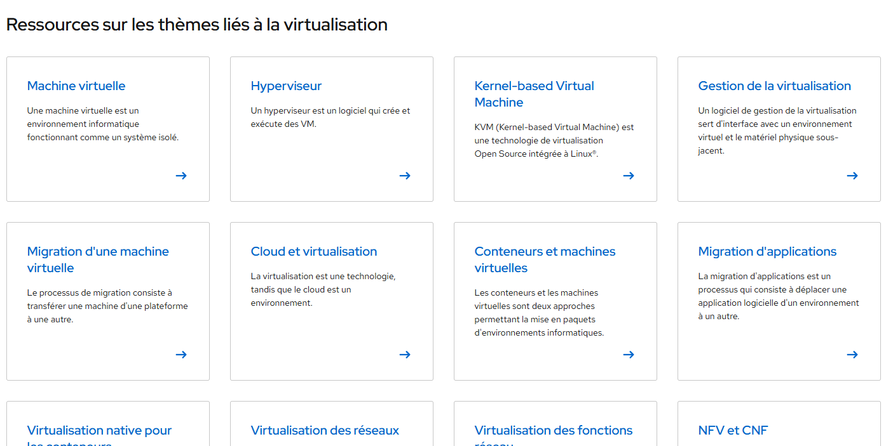

# Laboratoire 1

Ce premier laboratoire n'en est pas tout à fait un vrai. Il consiste plutôt à lire, consulter et écouter les différents médias que je vous dépose ici.

## Les médias à consulter 👇

### 1- C'est quoi la virtualisation

<iframe width="100%" style={{"aspect-ratio": "16 / 9"}} src="https://www.youtube.com/embed/8ZPy4MovrOM?si=gXBcKRDjdIA6BsEH" title="YouTube video player" frameborder="0" allow="accelerometer; autoplay; clipboard-write; encrypted-media; gyroscope; picture-in-picture; web-share" referrerpolicy="strict-origin-when-cross-origin" allowfullscreen></iframe>

### 2- Un mot sur l'hyperconvergence

<iframe width="100%" style={{"aspect-ratio": "16 / 9"}} src="https://www.youtube.com/embed/kLMhlTh1Ofg?si=sCHjePGPQ9H50urF" title="YouTube video player" frameborder="0" allow="accelerometer; autoplay; clipboard-write; encrypted-media; gyroscope; picture-in-picture; web-share" referrerpolicy="strict-origin-when-cross-origin" allowfullscreen></iframe>

### 3 - Lectures intéressantes

Consultez [cette page](https://www.redhat.com/fr/topics/virtualization) pour en apprendre davantage sur les diverses ressources sur les thèmes liés à la virtualisation.

