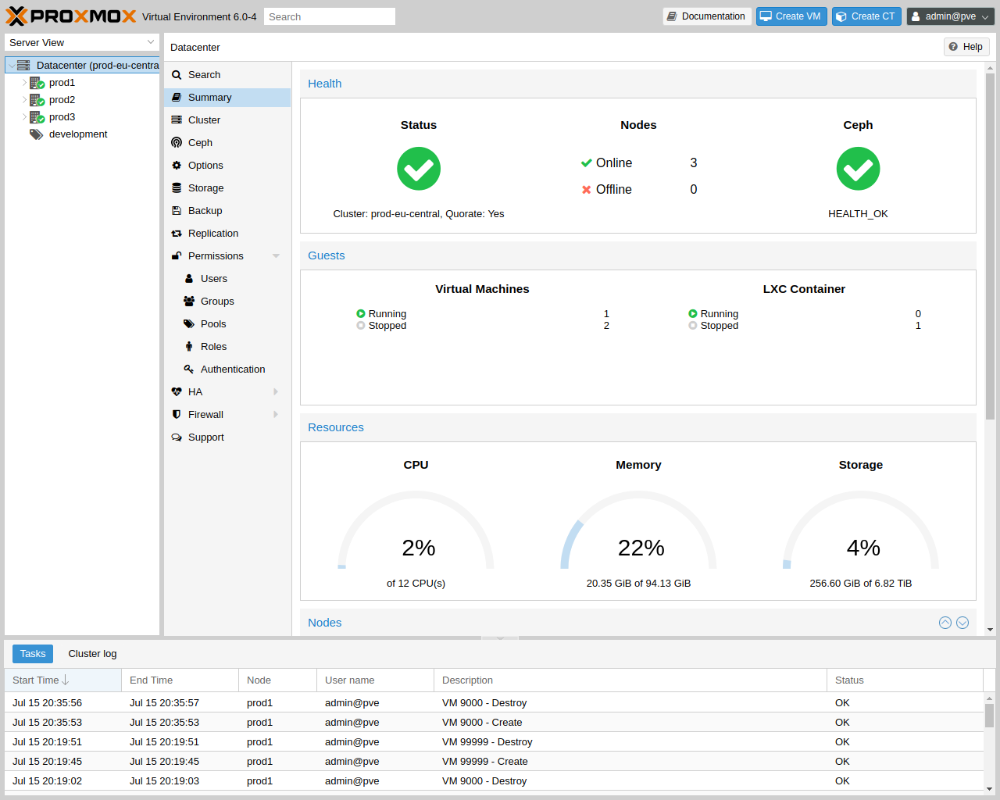
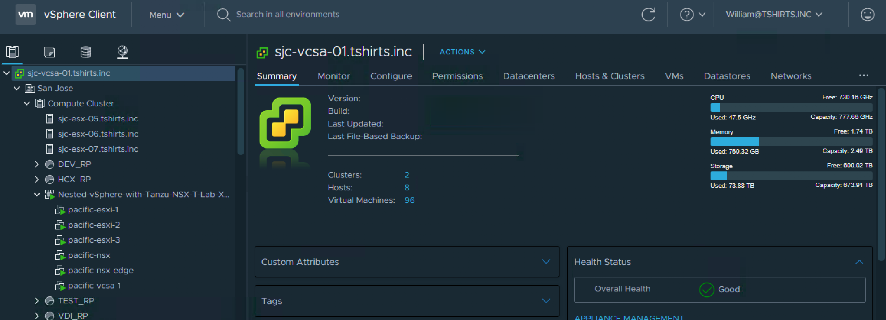

import useBaseUrl from '@docusaurus/useBaseUrl';
import ThemedImage from '@theme/ThemedImage';
import Tabs from '@theme/Tabs';
import TabItem from '@theme/TabItem';

# Cours 2

## Architecture matérielle/logicielle d'un hyperviseur et gestion des ressources 🏗️

Dans ce deuxième cours, nous ouvrons le capot des hyperviseurs et analysons leur fonctionnement. Jusqu'à aujourd'hui, dans vos différents cours, vous avez exploité une panoplie de technologies liées à la virtualisation pour faire tourner des serveurs et des postes de travail entièrement virtualisés. Cela dit, qu'est-ce qui se passe en coulisses ? Comment l'hyperviseur fait la gestion de toutes les ressources à sa disposition et comment il priorise ses différentes charges de travail ?

Nous faisons donc un premier tour d'horizon des différentes technologies présentent dans les hyperviseurs. **<u>Nul besoin de tout retenir par coeur</u>**, nous reparlerons de tout ces éléments un à un au fur et à mesure que la session avancera.

### Définition et rôle de l'hyperviseur

Un **hyperviseur** est une couche logicielle qui s'intercale entre le matériel physique et les machines virtuelles. Son rôle est de:

- Faire abstraction des ressources matérielles
- Isoler les machines virtuelles les unes des autres
- Prioriser l'accès aux ressources partagées
- Maintenir la sécurité et la stabilité du système

### 1. Types d'hyperviseurs

#### 1.1 Hyperviseur de type 1 (Bare Metal)

- S'exécute directement sur le matériel
- Possède un contrôle absolu sur les ressources
- Performances optimisées pour la virtualisation

**Exemples:** VMware vSphere/ESXi, Microsoft Hyper-V, Citrix XenServer, KVM, etc.

**Architecture:**

<div style={{textAlign: 'center'}}>
    <ThemedImage
        alt="Schéma"
        sources={{
            light: useBaseUrl('/img/Virtu/Hyperviseur_Type1_W.svg'),
            dark: useBaseUrl('/img/Virtu/Hyperviseur_Type1_D.svg'),
        }}
    />
</div>

#### 1.2 Hyperviseur de type 2 (Hosted)

- S'exécute sur un OS hôte existant (Windows, Ubuntu, etc.)
- Dépend de l'OS hôte pour l'accès au matériel
- Plus facile à déployer mais moins performant

**Exemples:** VMware Workstation, VirtualBox, Parallels Desktop, etc.

**Architecture:**

<div style={{textAlign: 'center'}}>
    <ThemedImage
        alt="Schéma"
        sources={{
            light: useBaseUrl('/img/Virtu/Hyperviseur_Type2_W.svg'),
            dark: useBaseUrl('/img/Virtu/Hyperviseur_Type2_D.svg'),
        }}
    />
</div>

### 2. Composants architecturaux clés

#### 2.1 Le Kernel de l'hyperviseur (Noyau central)

Le kernel de l'hyperviseur est le coeur du système de virtualisation. Il s'exécute en mode privilégié et coordonne toutes les ressources matérielles, un peu comme un chef d'orchestre qui dirige plusieurs musiciens simultanément. 🎶

#### 2.2 Scheduler (ordonnanceur de vCPUs)

Le scheduler détermine quels processeurs virtuels (vCPUs) s'exécutent sur quels coeurs physiques et à quel moment. L'objectif est d'optimiser l'utilisation des coeurs physiques. 

Imaginez un professeur qui doit faire passer un examen à 100 étudiants et qui n'a que 3 salles d'examen à sa disposition. Le professeur devra alors s'organiser pour optimiser au maximum l'utilisation de ses salles d'examen en déterminant quel étudiant passera son examen dans quelle salle et à quelle heure.

D'un point de vue plus technique, le *scheduler*:

- Maintient des **files d'attente** des vCPUs prêts à s'exécuter.
- Applique des **algorithmes d'ordonnancement** (*round-robin*, gestion de priorités, *fair-share*)
- Gère les tranches de temps allouées.
- Surveille les **métriques de performance** pour optimiser les répartition

L'hyperviseur peut faire appel à plusieurs techniques pour s'assurer que les *VMs* aient un accès aux processeurs physiques:

| Algorithme|Principe|Exemple pratique|Avantages|Inconvénients|Cas d’usage idéal|
|-----------|------------------|---------------------|--------------------|------------------------------|--------------------------------------|
|**Round Robin**|Chaque VM reçoit une tranche de temps CPU égale, puis passe la main| Cœur 1 : VM1 (10 ms) → VM2 (10 ms) → VM3 (10 ms) → VM1…|Équitable pour tous|Ne s’adapte pas aux besoins réels|Environnements homogènes, tests simples|
|**Priority-based**|Les VMs sont servies selon leur priorité définie| VM-DB : HIGH (50 %) ; VM-Web : MEDIUM (30 %) ; VM-Test : LOW (20 %)|Garantit les ressources aux charges critiques|Les faibles priorités peuvent être ralenties|Production avec charges critiques identifiées|
|**Fair Share**|Allocation proportionnelle ajustée selon l’utilisation réelle|Si VM1 utilise peu, VM2 et VM3 récupèrent le surplus|Optimise l’utilisation globale des ressources|Plus complexe à mettre en œuvre|Workloads variables|

#### 2.3 Gestionnaire de mémoire (*Memory Manager*)

Le memory manager gère la mémoire RAM comme un bibliothécaire très organisé qui sait exactement où placer chaque livre et comment les retrouver rapidement.

D'un oeil plus technique:

- Il maintient la table de correspondance (*mapping tables*) entre les adresses de la mémoire virtuelle utilisées par les *VMs* et les adresses physiques réelles de l'hôte (mémoire physique).

    ```yaml
    Mapping mémoire simplifié :

    VM1 demande adresse 0x1000 → Memory Manager traduit → Adresse physique 0x5A000
    VM2 demande adresse 0x1000 → Memory Manager traduit → Adresse physique 0x7B000

    Chaque VM pense avoir sa propre mémoire, mais tout est géré centralement

    ```
- Il optimise la mémoire à l'aide de différentes techniques 👇

    |Technique|Principe (analogie)|Fonctionnement technique  clé|Avantages|Inconvénients / Risques|
    |---------|-------------------|-----------------------------|---------|-----------------------|
    |**Memory Ballooning** (Gonflage mémoire)|Libérer des places de parking pour d’autres invités|Driver balloon dans la VM alloue de la mémoire « factice » → OS invité croit qu’elle est utilisée → Hyperviseur récupère la RAM physique et la réattribue|- Redistribution dynamique de la RAM<br/>- Évite le swap<br/>- Transparent pour les applis |- Peut dégrader les performances de la VM « gonflée »<br/>- Dépend du support du driver    |
    |**Memory Compression** (Compression mémoire)|Ranger ses affaires en optimisant l'espace au maximum|Pages peu utilisées compressées en RAM (LZ4 rapide, ZSTD efficace) → Décompression à l’accès| - Réduit la pression mémoire<br/>- 150× plus rapide que le swap SSD| - Plus lent que RAM native (×3)<br/>- Consomme du CPU pour compresser/décompresser|
    |**Transparent Page Sharing** (TPS)|Partager une photocopieuse pour éviter les doublons| Détection de pages identiques (hash + vérif byte-à-byte) → Une seule copie physique → Copy-on-Write si modifiée| - Économie mémoire massive (jusqu’à 75 %)<br/>- Idéal pour VMs identiques| - Risque de canal auxiliaire (side-channel attack)<br/>- Souvent désactivé par défaut|

- Il gère le *swap* (extension de la mémoire sur disque) quand la RAM est insuffisante.
- Surveille l'**utilisation mémoire** en temps réel.


#### 2.4 Pile d'entrée/sortie virtualisée (*I/O stack*)

L'I/O Stack intercepte et gère toutes les demandes d'accès aux périphériques (réseau, disque, USB). On pourrait le comparer à un service de messagerie qui achemine tous les courriers entre les appartements d'un immeuble et l'extérieur.

Mécanismes techniques:

- **Interception** des instructions d'I/O via les *VM exits*
- **Translation** des requêtes virtuelles vers le matériel physique
- **QOS (Quality Of Service)**: Priorisation et limitation des débits
- **Mise en file d'attente** et optimisation des accès

```yaml
Flux d'une requête réseau :

VM: "Je veux envoyer un paquet réseau"
    ↓ (VM exit - interruption)

I/O Stack: "Je traduis et route vers la carte réseau physique"
    ↓ (transmission)

Carte réseau: "Paquet envoyé sur le réseau"
```

#### 2.5 Module de sécurité (*Security Module*)

Le module de sécurité assure l'isolation entre les *VMs*. On pourrait le comparer à un système de sécurité d'immeuble qui garantit que chaque locataire reste dans son appartement.

Fonctions techniques:
- **Isolation des machines virtuelles:** empêche les *VMs* d'accéder à la mémoire des autres.
- **Contrôle des privilèges:** validation des instructions sensibles.
- **IOMMU (Input-Output Memory Management Unit):** isolation de l'accès aux différents périphériques physiques.
- **Audit et Logging:** traçabilité des événements

#### 2.6 Carte réseau virtuelle

Chaque *VM* voit une carte réseau qui lui semble bien réelle, mais c'est en fait une interface logicielle qui traduit ses demandes. L'implémentation de cette carte réseau virtuelle peut se faire de différentes façons:

- **Émulation complète:** La *VM* n'y voit que du feu et pense qu'elle possède une carte réseau Intel e1000 « classique »
- **Paravirtualisation:** Pilote optimisé (virtio-net). Contrairement à l'émulation complète, ce pilote « *sait* » qu'il a affaire avec une carte réseau virtuelle et adapte son comportement. Ainsi, la traduction est moins lourde qu'avec l'émulation et les performances s'en trouvent grandemment améliorées.
- **SR-IOV:** Un accès direct à une portion de la carte réseau physique.

Nous reviendrons plus en profondeur sur la virtualisation des réseaux ultérieurement dans la session.

#### 2.7 Contrôleur de stockage virtuel

Le contrôleur de stockage virtuel fait croire à chaque *VM* qu'elle a son propre disque dur, alors qu'en réalité tout est stocké dans des fichiers ou partagé sur un SAN. Le contrôleur peut:

- **Émuler** des contrôleurs SCSI, SATA ou NVMe standards
- **Traduire** directement les commandes destinées au stockage (Ex: lire secteur 1000 --­­> lire offset 512KB dans vm1.vmdk)
- **Gère** et **optimise** l'utilisation de mémoire cache
- **Offre** la possibilité de faire des *snapshots*

Lorsqu'on aborde le stockage en virtualisation, deux éléments clés définissement celui-ci : Le *type de stockage* et *l'approvisionnement*. Le type de stockage représente la manière avec laquelle nous conserveront les données des machines virtuelles.

| Type de stockage | Description | Avantages | Inconvénients | Cas d’usage typiques |
|------------------|-------------|-----------|---------------|----------------------|
| **Fichiers disques virtuels** (.vmdk, .vhd/.vhdx, .qcow2, .raw) | Chaque disque virtuel est un fichier sur le système de fichiers de l’hôte. | - Facile à gérer et déplacer<br/>- Snapshots simples<br/>- Compatibilité large | - Légère perte de performance par rapport au direct<br/>- Dépend du FS hôte | Environnements flexibles, lab, snapshots fréquents |
| **LUNs directs (SAN)** | Volume logique sur baie SAN présenté directement à la VM. | - Performance native<br/>- Pas d’overhead fichier | - Moins flexible<br/>- Snapshots plus complexes | Bases de données, workloads critiques |
| **Stockage distribué** (vSAN, Ceph, GlusterFS) | Pool de stockage partagé entre plusieurs serveurs, avec réplication et tolérance aux pannes. | - Haute dispo<br/>- Scalabilité<br/>- Réplication automatique | - Complexité de mise en place<br/>- Besoin réseau performant | Cloud privé, clusters haute dispo |

Quant à l'approvisionnement, il s'agit de la méthode avec laquelle nous attribuons l'espace disque.

| Type d’approvisionnement | Description | Avantages | Inconvénients | Cas d’usage typiques |
|--------------------------|-------------|-----------|---------------|----------------------|
| **Thick Provisioning** (allocation complète) | L’espace total est réservé dès la création du disque virtuel. | - Performance constante<br/>- Espace garanti<br/>- Pas de fragmentation | - Gaspillage initial si peu utilisé<br/>- Création plus lente | Production critique, stockage abondant |
| **Thin Provisioning** (allocation dynamique) | L’espace est alloué au fur et à mesure de l’utilisation réelle. | - Économie d’espace<br/>- Création rapide<br/>- Overcommit possible | - Perf variable<br/>- Risque de “disk full” imprévu<br/>- Surveillance nécessaire | Cloud mutualisé, environnements dynamiques |


#### 2.8 Carte graphique virtuelle

Vous l'aurez sans doute compris, c'est elle qui assurera l'affichage des *VMs*, depuis ka console de texte jusqu'à l'accélération 3D pour les jeux. Un peu comme avec la carte réseau virtuelle, il existe trois niveau de virtualisation pour l'affichage:

|Niveau|Description|Cas d'usage|Performance|
|------|-----------|-----------|-----------|
|**Émulation VGA Basique**|L'hyperviseur simule une carte VGA standard, suffisante pour l'affichage console et le démarrage|Installation d'OS, dépannage, affichage minimal.|Faible (pas d'accélération matérielle)|
|**2D/3D accélérée**|Utilisation de pilotes virtuels optimisés (ex. VMware SVGA, virtio-gpu) avec support d’API comme OpenGL.|Applications graphiques, bureautique, rendu 3D léger.|Moyenne à élevée selon l’implémentation.|
|**GPU Passthrough**|La VM accède directement à une carte graphique physique dédiée via des technologies comme IOMMU.|Jeux vidéo, calcul GPU, rendu 3D intensif.|Native (quasi identique à un usage hors VM).|

#### 2.9 Console de gestion

La console de gestion est ni plus ni moins votre *cockpit* pour visualiser et contrôler l'infrastructure virtualisée. Vous y retrouverez:

- **Tableau de bord en temps réel:** métriques CPU, mémoire, stockage, réseau
- **Wizards de configuration:** assistants pour créer et configurer vos *VMs*
- **Gestion des templates:** modèles pré-configurés pour déploiment rapide
- **Contrôle des permissions:** qui peut faire quoi sur quelle ressource

*Console de gestion de proxmox* 👇



*Console de gestion de VMware vSphere* 👇



#### 2.10 Monitoring et métriques

Le système de *monitoring* collecte en permanence des données sur le fonctionnement de l'infrastructure.

Type de données collectées:

- **Métriques performance :** % CPU, GB RAM utilisés, IO disque, Réseau
- **Événements système :** démarrage/arrêt VMs, migrations, pannes
- **Logs applicatifs :** messages d'erreur, warnings, informations de debug
- **Seuils et alertes :** notifications automatiques quand quelque chose dépasse les limites

### 3. Hyperviseur Explosé 💥

Je fais partie de ces gens qui ont besoin d'un support visuel pour intégrer certains apprentissages. Je vous offre un schéma récapitulatif où vous pourrez voir les différents éléments d'un hyperviseur ainsi que les relations entre eux.

<div style={{textAlign: 'center'}}>
    <ThemedImage
        alt="Schéma"
        sources={{
            light: useBaseUrl('/img/Virtu/Hyperviseur_W.svg'),
            dark: useBaseUrl('/img/Virtu/Hyperviseur_D.svg'),
        }}
    />
</div>