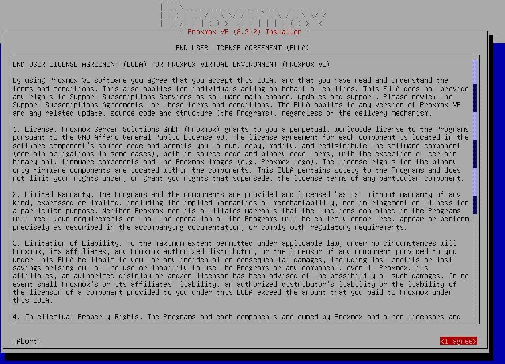
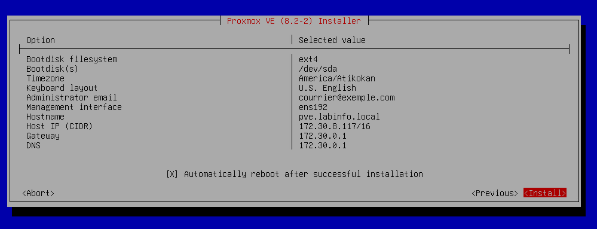
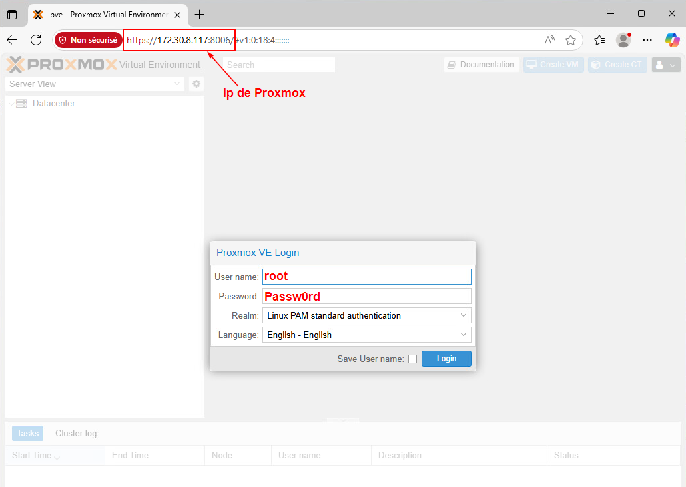

# Laboratoire 2

* * *

## Installation de l'hyperviseur Proxmox

## Préalables

- Avoir consulté la théorie en lien avec ce cours.

## Objectifs

- Faire l'installation de l'hyperviseur Proxmox
- Naviguer à travers l'interface, découvrir les menus et les options.

## Étapes de réalisation

Dans ce laboratoire, vous aurez l'occasion d'installer l'hyperviseur Proxmox. Pour l'instant, vous l'installerez dans une machine virtuelle 🤔

> *eummm...tu veux vraiment qu'on installe un hyperviseur en tant que machine virtuelle...!?!? Ce n'est pas un peu contre-productif ?*
>
> *-Les étudiants*

C'est effectivement contre-productif 😆, et ce n'est pas quelque chose que l'on fait normalement. L'objectif est simplement de vous faire expérimenter l'installation et l'interface. Ne vous en faites pas, vous travaillerez avec de vrais serveurs dans la salle des équipements très bientôt.

### Création de la machine virtuelle

La première étape consiste à créer la machine virtuelle sur laquelle vous installerez Proxmox. Dirigez-vous donc sur [labinfo](https://labinfo.cegepmontpetit.ca) et créez vous une machine virtuelle qui correspond aux spécificités suivantes:

- 🧮 **CPU:** 4
- 📝 **Mémoire:** 16 Go
- 💾 **Stockage:** 120 Go
- 🌐 **Réseau:** Accès Internet

**<u>Proxmox est basé sur la distribution Debian de Linux.</u>** Cette information pourrait vous être utile lors de la création de votre *VM*.

:::caution
Dans une machine physique, il faudrait vous assurer d'activer la virtualisation matérielle dans le UEFI/BIOS de votre serveur. La virtualisation matérielle, c'est ni plus ni moins la technologie qui vous  Or, ici nous travaillons avec une machine virtuelle. Vous devez donc vous assurez d'activer la virtualisation matérielle en cochant une option dans les paramètres de votre machine virtuelle.

:::

### Installation de Proxmox

Insérez le média d'installation de Proxmox dans votre machine virtuelle. Vous le retrouverez dans **Logiciels** > **Linux** > **Proxmox** > **Proxmox-ve_8.2-2.iso**. Démarrez ensuite votre *VM*.

#### Étape 1

Vous serez alors amené à choisir un type d'installation (via GUI ou Terminal). Pour ma part j'ai choisi le mode `terminal` pour l'économie de ressources à l'installation, mais dans tous les cas, l'installation est similaire.

#### Étape 2

Une fois les conditions d'utilisation et d'installation acceptés, vous devrez sélectionner le disque cible pour effectuer l'installation. Vous n'avez qu'un seul disque...le choix devrait être relativement évident 😉.

Par contre, j'attire votre attention sur le bouton `<Advanced Options>`. Dirigez-vous dans cette section et regardez les différentes options disponibles:

|Nom de l'option|Explications détaillées|Bonnes pratiques (valeurs optimales pour 120 Go)|
|---------------------|-------------------------------|-----------------------------------------------------------|
|**Filesystem**|Le système de fichiers détermine comment les données sont organisées sur le disque. `ext4` est un format classique, fiable et bien supporté par Linux.| Choisir `ext4` pour sa simplicité et sa compatibilité. Éviter `zfs` ou `btrfs` sauf si vous avez des besoins spécifiques (Nous y reviendrons)|
|**Total size**|C’est la taille totale du disque dur utilisé pour installer Proxmox.|Ici, le disque fait `120 Go`. Assurez-vous que le disque est dédié à Proxmox pour éviter les conflits avec d'autres systèmes.|
|**Swap size**|Le swap est une zone du disque utilisée comme extension de la mémoire RAM quand celle-ci est saturée.|Mettre `8 Go` si vous avez entre 8 et 16 Go de RAM. Cela aide à éviter les plantages si la mémoire est pleine.|
|**Maximum root volume size**|C’est l’espace réservé pour le système Proxmox lui-même (fichiers système, journaux, etc.).|`16 Go` suffisent pour le système. Ne pas trop allouer ici pour garder de la place pour les machines virtuelles.|
|**Maximum data volume size**| C’est l’espace utilisé pour stocker les machines virtuelles (VM), conteneurs et leurs données.| Allouer `90 Go` pour les VM et conteneurs. C’est là que vous installerez vos systèmes invités.|
|**Minimum free LVM space**|LVM (Logical Volume Manager) permet de gérer dynamiquement les partitions. Cet espace libre est utile pour les snapshots ou les modifications futures.|Garder `6 Go` libres pour pouvoir créer des snapshots ou redimensionner les volumes plus tard.|

:::important[La petite histoire du SWAP]
Historiquement, le swap servait à compenser un manque de mémoire vive (RAM) en utilisant une portion du disque dur comme mémoire temporaire. Cette technique permettait d’éviter les plantages lorsque la RAM était saturée. Cependant, avec les serveurs modernes équipés de grandes quantités de RAM (souvent 16 Go, 32 Go ou plus), le swap est devenu moins essentiel. Il reste utile dans certains cas extrêmes ou pour des opérations spécifiques (comme l’hibernation ou certains traitements lourds), mais son usage est aujourd’hui marginal. Dans un environnement Proxmox bien dimensionné, le swap agit surtout comme filet de sécurité, et ne devrait pas être activement sollicité.
:::

**Voici donc la configuration à mettre en place:**

#### Étape 3

Configurez le fuseau horaire et votre clavier comme vous le feriez pour n'importe quel système.

#### Étape 4

Définissez le mot de passe du superutilisateur `root`. Pour le moment, vous pouvez utiliser le mot de passe `Passw0rd` car il ne s'agit que d'une première installation qu'on ne conservera pas à long terme. Quant au courriel, inutile d'en mettre un vrai, Proxmox ne sera pas en mesure de communiquer avec celui-ci. Contentez-vous simplement de mettre quelque chose comme `courrier@exemple.com`.

#### Étape 5

La prochaine étape consiste à configurer le réseau. Normalement, on prévoierait une IP statique (manuelle ou via le DHCP). Encore une fois, il ne s'agit que d'un premier exercice d'installation. Vous pouvez conserver l'adressage IP que vous avez obtenu via le DHCP.

#### Étape 6

Confirmez les paramètres d'installation et lancez celle-ci!

Une fois que l'installation sera terminée, Proxmox redémarrera et vous devriez finir par voir un écran semblable à celui-ci:

### Accès à l'interface

Une fois que votre hyperviseur Proxmox sera installé, vous devrez utiliser un poste de travail standard pour accéder à son interface web. Créez donc un poste de travail sous Windows 10 ou Windows 11 dans votre profil d'étudiant dans [labinfo](https://labinfo.cegepmontpetit.ca). <mark> Cette machine virtuelle doit être relié au même réseau que votre machine Proxmox. </mark>

Autrement dit, si vous avez branché Proxmox sur `Accès Internet 2`, vous devez faire de même pour votre poste de travail virtualisé.

Une fois votre poste de travail en place, démarrez ce-dernier et entrez l'adresse IP de Proxmox, suivi du port 8006, dans la barre d'adresse du navigateur web. Vous atteindrez alors la console de gestion de Promox.

Une fois que vous aurez entrez vos identifiants et ouvert une session, vous verrez apparaitre un petit message vous signalant que vous n'avez pas souscrit à une licence officielle. <u>**Vous pouvez ignorer ce message.**</u> Les licences officielles de Proxmox permettent d'obtenir du support professionnelle. Elles sont surtout destinées aux entreprises qui souhaitent bénéficier d'un support immédiat en cas de problème technique.

À partir d'ici, vous avez accès à l'entièreté du système. Explorez-le! Naviguez dans les menus, observez les différentes options et les paramètres auxquels vous avez accès.

### Téléchargement d'ISO

Pour installer des machines virtuelles dans Proxmox, vous aurez besoin d'images d'installation (iso). Proxmox permet le téléchargement de celles-ci directement depuis le web.
Dans le volet de gauche, sélectionnez le stockage nommé `local`, puis sélectionnez `ISO Images`. Cliquez sur `Download from URL` et utilisez les URL ci-dessous pour procéder à vos téléchargements:

**URL Ubuntu desktop :** https://releases.ubuntu.com/24.04.3/ubuntu-24.04.3-desktop-amd64.iso?_gl=1*1c316wo*_gcl_au*MTI2NjMyOTgzMi4xNzU2MTQ3NzY2  
**URL Windows 10:** https://cloud.tonprof.ca/index.php/s/TCfQqKiEJPJWQaq/download/W10_22H2_FR_x64.iso

