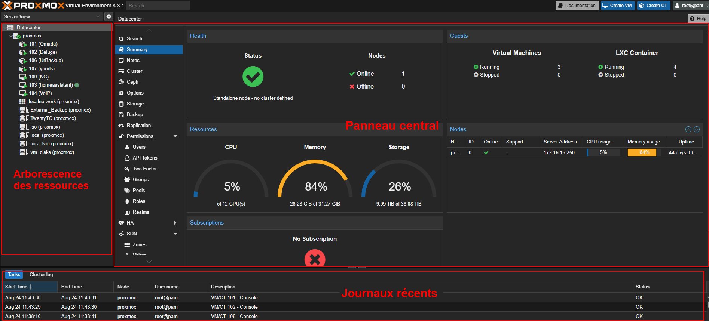
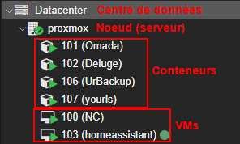
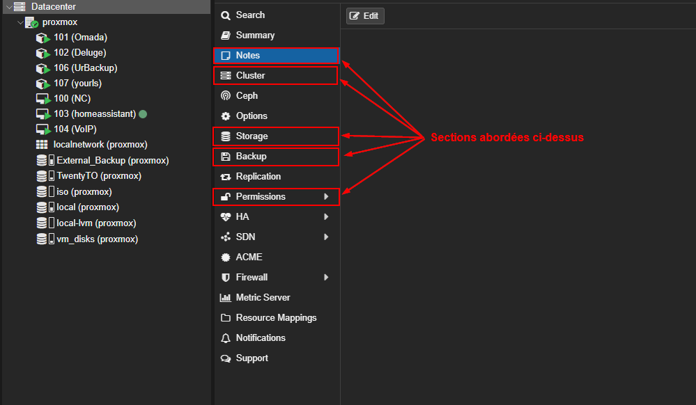
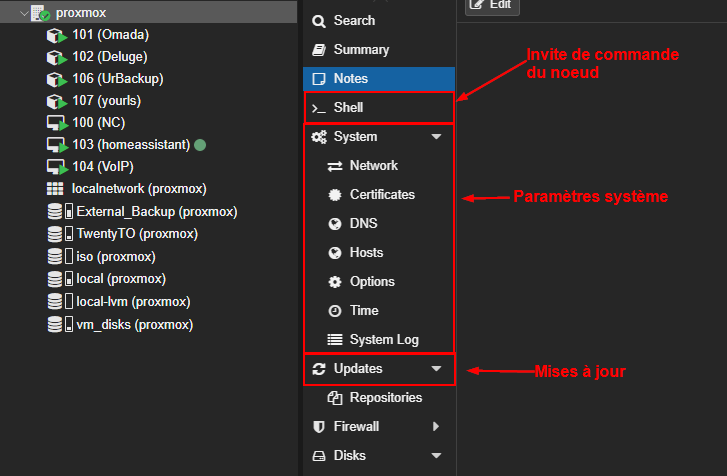
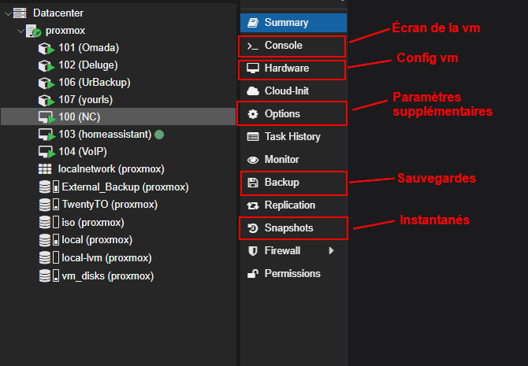
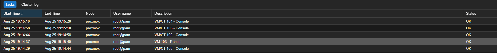
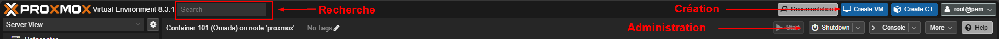

import useBaseUrl from '@docusaurus/useBaseUrl';
import ThemedImage from '@theme/ThemedImage';
import Tabs from '@theme/Tabs';
import TabItem from '@theme/TabItem';

# Cours 3

## Prise en main de Proxmox

Au dernier cours, nous avons analysé ensemble les différentes composantes qui constituaient un hyperviseur tel que Proxmox. Aujourd'hui, nous nous attarderons un peu plus à la prise en main de Proxmox. Autrement dit, une fois que l'hyperviseur est installé, il nous faut l'initialiser correctement.

## Vue d'ensemble de l'interface

L'interface web de Proxmox suit un modèle découpé en trois panneaux:

- **Panneau de gauche:** Arborescence des ressources
- **Panneau central:** Contenu principal et onglets
- **Panneau en bas:** Journaux récents

### Arborescence des ressources 🌳

L'arborescence des ressources est une structure hiérarchique pouvant contenir différents éléments:

#### Datacenter (centre de données) 🏢

<table>
    <tr>
        <th class="green-text">Rôle</th>
        <th class="green-text">Fonctions</th>
    </tr>
    <tr>
        <td rowspan="5"><b>Point central de gestion de toute l'infrastructure.</b></td>
        <td>1. Configure les paramètres globaux qui s'appliquent à tous les nœuds</td>
    </tr>
    <tr>
        <td>2. Gère les utilisateurs et leurs permissions d'accès</td>
    </tr>
    <tr>
        <td>3. Définit les politiques de sauvegarde pour toutes les VMs</td>
    </tr>
    <tr>
        <td>4. Coordonne les clusters (groupes de serveurs)</td>
    </tr>
    <tr>
        <td>5. Centralise la surveillance et les alertes</td>
    </tr>
</table>

**<mark>Sans le *datacenter*, il est impossible de gérer plusieurs serveurs ensemble ou de partager des ressources entre eux.</mark>**

#### Noeuds (serveurs physiques) 🪢

<table>
    <tr>
        <th class="green-text">Rôle</th>
        <th class="green-text">Fonctions</th>
    </tr>
    <tr>
        <td rowspan="4"><b>Machines physiques qui hébergent les *VMs* et les conteneurs.</b></td>
        <td>1. Fournissent les ressources matérielles (CPU, RAM, Stockage).</td>
    </tr>
    <tr>
        <td>2. Exécutent l'hyperviseur.</td>
    </tr>
    <tr>
        <td>3. Communiquent entre eux lorsqu'ils sont en cluster.</td>
    </tr>
    <tr>
        <td>4. Gèrent localement leurs *VMs* et conteneurs.</td>
    </tr>
</table>

#### *VMs* (machines virtuelles) 💻

<table>
    <tr>
        <th class="green-text">Rôle</th>
        <th class="green-text">Fonctions</th>
    </tr>
    <tr>
        <td rowspan="4"><b>Ordinateurs virtuels complets avec leur propre système d'exploitation</b></td>
        <td>1. Émulent un ordinateur physique complet</td>
    </tr>
    <tr>
        <td>2. Possèdent leur BIOS/UEFI, disque dur virtuel, carte réseau virtuelle, etc.</td>
    </tr>
    <tr>
        <td>3. Peuvent faire tourner leur propre système d'exploitation.</td>
    </tr>
    <tr>
        <td>4. Isolées les unes des autres.</td>
    </tr>
</table>

#### Conteneurs LXC 📦

<table>
    <tr>
        <th class="green-text">Rôle</th>
        <th class="green-text">Fonctions</th>
    </tr>
    <tr>
        <td rowspan="4"><b>Environnements légers partageant le noyau du système hôte</b></td>
        <td>1. Consomment moins de ressources que les *VMs* standards</td>
    </tr>
    <tr>
        <td>2. Démarrent plus rapidement</td>
    </tr>
    <tr>
        <td>3. Partagent le noyaux Linux de Proxmox (l'hôte)</td>
    </tr>
    <tr>
        <td>4. Idéaux pour les applications Linux</td>
    </tr>
</table>

:::caution[LXC ≠ DOCKER]
Les conteneurs LXC ne sont pas identiques aux conteneurs Docker dont nous parlerons un peu plus tard dans le cours. Ne faites pas l'erreur de les confondre. Le niveau de conteneurisation n'est pas le même. Nous aurons l'occasion d'en reparler, mais en attendant, sachez les distinguer.
:::

#### Stockages 💾

<table>
    <tr>
        <th class="green-text">Rôle</th>
        <th class="green-text">Fonctions</th>
    </tr>
    <tr>
        <td rowspan="4"><b>Espaces de stockage où sont conservées les données</b></td>
        <td>1. Stockent les disques durs virtuels des *VMs*</td>
    </tr>
    <tr>
        <td>2. Conservent les sauvegardes et les *snapshots*</td>
    </tr>
    <tr>
        <td>3. Peuvent être locaux ou partagés</td>
    </tr>
    <tr>
        <td>4. Gèrent la réplication des données</td>
    </tr>
</table>

**Types courants de stockage sous Proxmox:**

- **Local:** Disque dur du serveur
- **NFS:** Stockage réseau partagé
- **iSCSI:** Stockage SAN professionnel
- **Ceph:** Stockage distribué haute disponibilité

#### Réseaux (*Localnetwork*) 🛜

<table>
    <tr>
        <th class="green-text">Rôle</th>
        <th class="green-text">Fonctions</th>
    </tr>
    <tr>
        <td rowspan="4"><b>Interfaces et segments réseau configurés sur le noeud</b></td>
        <td>1. Définissent la connectivité réseau des *VMs* et conteneurs</td>
    </tr>
    <tr>
        <td>2. Gèrent les VLANs et la segmentation réseau</td>
    </tr>
    <tr>
        <td>3. Contrôlent l'accès internet et inter-VMs</td>
    </tr>
    <tr>
        <td>4. Configurent les ponts (*bridges*) réseau</td>
    </tr>
</table>

**Types de réseaux sous Proxmox:**

- **vmbr0, vmbr1...:** Ponts réseau principaux (bridges)
- **Local network :** Réseau local du datacenter
- **VLAN networks :** Réseaux segmentés par VLAN
- **SDN (Software Defined Network):** Réseaux virtuels avancés

    

### Le panneau central 📊

Le panneau central diffère dépendemment de l'élément de la structure hiérarchique sélectionné.

#### Niveau Datacenter - Gestion globale

**Rôle:** Tableau de bord général de l'infrastructure. Il offre une vision d'ensemble et permet de surveiller la charge de travail.

- Statistiques globales: nombre de *VMs*, conteneurs, noeuds
- Utilisation des ressources totales (CPU, RAM, Stockage)
- Graphiques de performance consolidés
- État de santé global du cluster

**Quelques sections à connaitre dès maintenant:** 

1️⃣ **Notes: Documentation centralisée** 
    - Notes sur la configuration du serveur
    - Procédures de maintenance
    - Contacts et informations importantes
    - Historique des changements majeurs

2️⃣ **Cluster: Coordination des noeuds** 
    - Ajouter/retirer des noeuds au cluster
    - Gérer la haute disponibilité (HA)
    - Synchroniser les configurations
    - Élection du noeud maître

3️⃣ **Stockage: Configuration centralisée des espaces de stockage** 
    - Ajout de nouveaux stockages (NFS, iSCSI, Ceph)
    - Configuration des permissions d'accès
    - Définition des types de contenu (images, sauvegardes, ISO)
    - Monitoring de l'espace disponible

4️⃣ **Sauvegardes: Planification automatisée des backups** 
    - Création de tâches de sauvegarde récurrentes
    - Sélection des VMs/conteneurs à sauvegarder
    - Configuration de la rétention (combien de backups garder)
    - Notification en cas d'échec

5️⃣ **Permissions: Contrôle d'accès et sécurité** 
    - Création d'utilisateurs et groupes
    - Attribution de rôles (administrateur, utilisateur, lecture seule)
    - Définition des permissions sur les ressources
    - Configuration de l'authentification (LDAP, Active Directory)

#### Niveau Noeud - Gestion du serveur physique

**Rôle:** Monitoring en temps réel du serveur physique. Il affiche en temps réel:

- Utilisation CPU par coeur
- Consommation de la mémoire (utilisée/totale/disponible)
- Charge système et processus actifs
- Température et ventilation
- Trafic réseau par interface.

**Quelques sections à connaître dès maintenant:**

1️⃣ **Shell: Accès au noeud en ligne de commande**
    - Configuration avancée non accessible via l'interface web
    - Diagnostique et dépannage système
    - Installation de paquets supplémentaires
    - Scripts d'administration personnalisés

2️⃣ **Système: Configuration système et réseau**
    - Réseau : Configuration des interfaces, VLAN, ponts, etc.
    - DNS: Serveurs DNS et résolution de noms
    - Temps: Synchro. NTP et fuseau horaire
    - Syslog: Configuration des logs système

3️⃣ **Mises à jour: Gestion des paquets logiciels**
    - Mise à jour de Proxmox VE
    - Installation de paquets additionnels
    - Configuration des dépôts (APT)

#### Niveau VM/Conteneur - Gestion individuelle

**Rôle:** Monitoring spécifique d'une *VM* ou d'un conteneur à l'aide de différentes métriques telles que:

- Utilisation du CPU en pourcentage
- Consommation de mémoire effective
- I/O disque (lecture/écriture)
- Trafic réseau
- *Uptime*

**Quelques sections à connaître dès maintenant:**

1️⃣ **Console: Accès direct à l'écran de la VM**
    - Console web : via le navigateur
    - Console Spice: Protocole haute performance

2️⃣ **Hardware: Configuration des composants virtuels**
    - Processeur: Nombre de coeurs, type d'émulation
    - Mémoire: RAM Allouée, *balloning*
    - Disques durs: Taille, type (IDE, SCSI, VirtIO), cache
    - Réseau: Interfaces, modèles de cartes, VLAN
    - CD/DVD: Lecteurs virtuels et images ISO

3️⃣ **Options: Paramètres et réglages avancés**
    - Démarrage: Ordre de boot, délai, démarrage automatique
    - Sécurité: Protection contre la suppression
    - Performance: Priorités CPU, optimisations I/O

4️⃣ **Sauvegardes: Gestion des backups spécifiques à cette VM**
    - Liste des sauvegardes existantes
    - Restauration depuis une sauvegarde
    - Création d'une sauvegarde immédiate
    - Configuration des exclusions

5️⃣ **Instantanés: Points de restauration rapides**
    - Création avant une modification risquée
    - Test de mises à jour avec possibilité de retour arrière
    - Sauvegarde de l'état à un moment précis
    - Restauration rapide

### Journal des activités 📰

Le journal des activités (aussi appelé "Task Log" ou "Journal des tâches") est un panneau d'information en temps réel qui affiche toutes les opérations et processus en cours d'exécution sur votre cluster Proxmox (même si votre cluster n'est composé que d'un seul noeud). Il s'agit d'un système de monitoring intégré qui permet aux administrateurs de suivre l'état des tâches système.

Vous y retrouverez deux onglets contenant des informations distinctes

| Aspect | Onglet Tasks | Onglet Cluster Log |
|--------|---------------|----------------------------------|
| **Type de contenu** | Tâches administratives et opérationnelles initiées par les utilisateurs ou le système | Messages système de bas niveau du cluster entier |
| **Niveau d'abstraction** | Vue orientée utilisateur des opérations de haut niveau | Vue technique système du cluster |
| **Exemples de contenu** | • Création/suppression de VMs • Sauvegardes et restaurations • Migrations de VMs • Mises à jour de packages • Tâches planifiées | • Messages de corosync • Événements de santé du cluster • Alertes de haute disponibilité (HA) • Événements de synchronisation • Messages de services système |
| **Format d'affichage** | Tableau structuré avec colonnes : - Type - Nœud - Utilisateur - Statut - Durée | Format de log traditionnel : - Timestamp - Message texte |
| **Fonctionnalités** | • ID unique par tâche • Logs détaillés cliquables • Indicateurs visuels de statut • Possibilité d'arrêter des tâches • Filtrage avancé | • Messages chronologiques • Informations de débogage • État de communication inter-nœuds • Événements critiques système |
| **Public cible** | Administrateurs pour le suivi opérationnel quotidien | Débogage avancé et diagnostics techniques |
| **Fréquence d'utilisation** | Consultation quotidienne normale | Consultation lors de problèmes spécifiques |
| **Ce que ça montre** | **Ce que vous faites** (actions utilisateur) | **Comment le système réagit** (infrastructure) |

### Barre supérieure 👆

La barre au haut de l'interface graphique comporte également plusieurs éléments intéressants:

- Un endroit pour effectuer une recherche à travers votre infrastructure. Cela peut sembler banal, mais si vous gérez plusieurs centaines de machines virtuelles et de conteneurs, cela s'avère très pratique pour en repérer une rapidement.

- Un bouton vers <mark>**toute la documentation**</mark> de l'hyperviseur Proxmox. Cette documentation vaut de l'or. Si vous avez une question quant à une action à réaliser ou une opération à effectuer, la réponse s'y trouve forcémment.

- Deux boutons pour la création de *VMs* et de conteneurs.

- Plusieurs boutons pour interragir avec vos *VMs* et conteneurs:
    - Démarrage
    - Arrêt
    - Accès à la console
    - etc.

