# Laboratoire 3

* * *

## Création d'une première machine virtuelle sous Proxmox

## Préalables

- Avoir un hyperviseur Proxmox prêt à être utilisé.
- Avoir consulté la théorie en lien avec ce cours.

## Objectifs

- Faire l'installation d'une première machine virtuelle sous Proxmox

## Étapes de réalisation

Dans ce laboratoire, nous passerons ensemble les différentes étapes nécessaires à la création d'une première machine virtuelle dans Proxmox. Nous analyserons les fenêtres et les options qui s'offrent à vous en prenant soin de les décortiquer.

### Étape 1 - Mise à jour de l'hyperviseur

Avant de se lancer dans la création de notre première *VM*, nous allons nous assurer que l'hyperviseur est bien à jour. Dans le volet de gauche, cliquez sur votre nœud, puis dans le panneau central, cliquez sur `Repositories`.

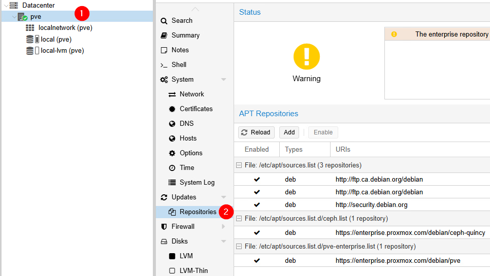

Vous verrez un avertissement concernant le catalogue de mise à jour *enterprise*. Ce catalogue de mise à jour est réservé aux entreprises qui paient une licence pour l'utilisation de Proxmox. Nous allons donc désactiver ce catalogue en cliquant sur celui-ci, puis sur `Disable`. Faites de même avec le catalogue *ceph-quincy*.

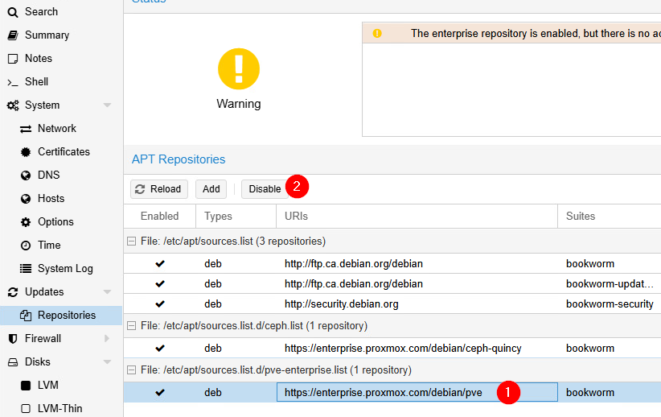

Proxmox vous avisera alors que vous n'avez plus accès à aucune mise à jour de l'hyperviseur. Pour régler cela, cliquez sur `Add` puis sélectionnez le catalogue `No-Subscription`. Cliquez sur `Reload` pour vous assurez que vos changements ont été pris en compte.

Cliquez maintenant sur `Updates` (juste au-dessus de `Repositories`). Cliquez sur `Refresh` pour effectuer une vérification des mises à jour et finalement sur `>_ Upgrade` pour lancer le processus de mise à jour du système.

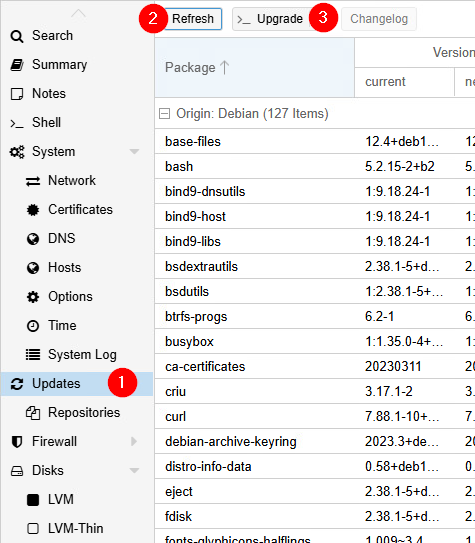

La console du nœud s'ouvrira automatiquement. Remarquez la commande qui a été lancée au haut de la fenêtre.

Que vous lanciez cette commande directement dans la console ou que vous passiez par l'interface graphique, le processus est exactement le même. Appuyez sur <kbd>enter</kbd> pour confirmer l'installation des mises à jour.

### Étape 2 - Création d'une VM Windows

Dans la barre supérieure de la console de gestion, cliquez sur le bouton `Create VM`.

#### Onglet général

Dans l'onglet général, vous aurez accès à différents éléments pour la création de votre VM:

- **Node:** Le serveur physique sur lequel créer votre machine virtuelle.

- **VM ID:** C'est un numéro unique à votre machine virtuelle et c'est <u>obligatoire</u>. Ces identifiants commencent à 100 et ne peuvent être inférieurs à ce nombre.

- **Name:** Le nom que vous désirez donner à votre machine.

- **Ressource Pool:** Les *pools* de ressource sont des rassemblements logiques auxquels vous pouvez associer plusieurs *VMs* ou *Containers*. Ce *pool* est ensuite utilisé principalement pour:
    - Organiser les ressources: Classer les ressources par équipe, par projet, par client, etc.
    - Contrôler les accès: Appliquer des *ACLs* à un pool plutôt qu'à chaque VM individuellement.
    - Administration simplifiée: Faciliter la gestion d'un ensemble de ressources liées.

- **Options de démarrage:** Section où vous pouvez déterminer certaines options de démarrage:
    - Start at boot: Détermine si la *VM* doit démarrer immédiatement après le démarrage de l'hyperviseur.
    - Start/Shutdown order: Détermine quelle *VM* doit démarrer et être arrêté en premier, deuxième, etc.
    - Startup Delay: Délai, en secondes, que l'hyperviseur doit attendre avant de lancer le démarrage automatique de la *VM*.
    - Shutdown Timeout: Temps, en secondes, que l'hyperviseur attendra pour un arrêt propre avant de forcer l'arrêt.

:::caution
Les options *Start order* et *Startup delay* ne sont valables que si l'option *Start at boot* est activée.
:::

- **Tags:** Permet tout simplement de catégoriser vos machines virtuelles et vos conteneurs.

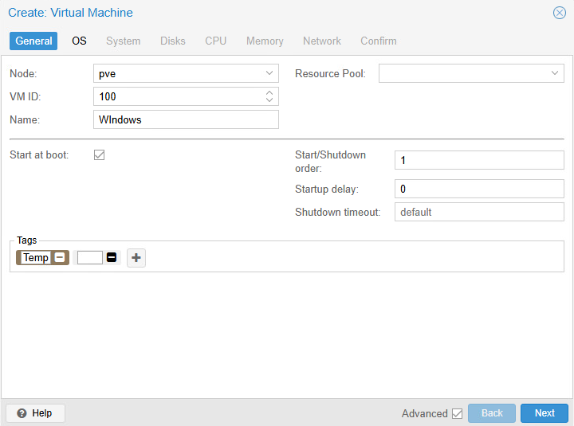

#### Onglet OS

Dans la fenêtre OS, vous pourrez sélectionner votre ISO d'installation. Dans le cas présent, l'ISO de Windows 10 22H2. Par défaut, l'iso que vous avez téléchargé se trouve dans votre stockage nommé **Local**. Sélectionnez-le.

Dans la section *Guest OS* de la fenêtre, il vous faudra indiquer que vous comptez installer Windows 10. Lorsque ce sera fait, une case supplémentaire fera son apparition. *Add additional drive for VirtIO drivers*. Les *VirtIO drivers* sont des pilotes qui permettent d'effectuer de la paravirtualisation, ce que Windows ne supporte pas toujours nativement. La paravirtualisation permet une meilleure gestion de l'accès au matériel physique. Par exemple, la technique du *ballooning* que le *memory manager* peut effectuer dans l'hyperviseur afin d'optimiser la mémoire vive est réalisée grâce à un pilote paravirtualisé.

Pour en connaître davantage sur les différences entre une émulation de pilote complète et la paravirtualisation, [consultez cette page.](https://developer.ibm.com/articles/l-virtio/)

Pour bénéficier de pilotes paravirtualisés sous Windows, il existe des pilotes libres de droits, disponibles sous un iso téléchargeable à partir de [ce lien](https://fedorapeople.org/groups/virt/virtio-win/direct-downloads/archive-virtio/virtio-win-0.1.271-1/virtio-win.iso). Au cours précédent, vous avez appris comment il était possible de télécharger un fichier iso directement sous Proxmox...à vous de jouer 😉

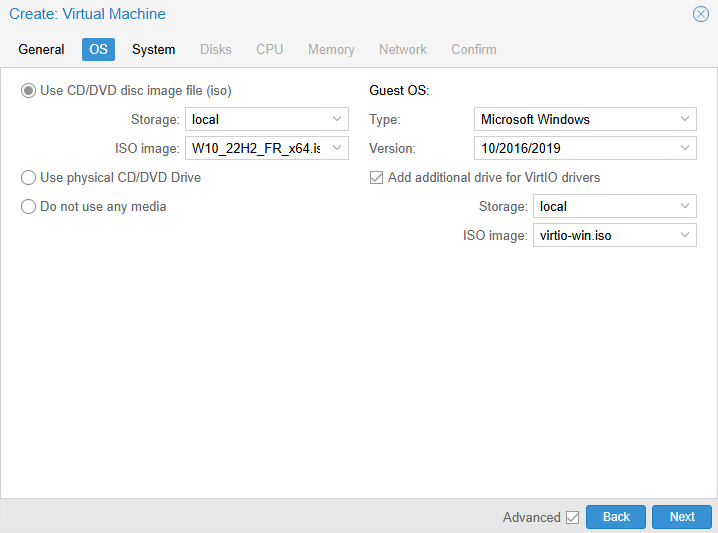

#### Onglet Système

* * *

**Carte graphique**  

Comme nous avons l'intention d'installer une série de pilotes paravirtualisés pour Windows, autant en profiter. Dans l'onglet suivant, choisissez `VirtIO-GPU` pour la carte graphique. L'accès au processeur graphique en sera amélioré. Vous avez sans doute remarqué qu'il existe une panoplie de possibilité pour la carte graphique. En voici un petit résumé:

|**Carte Graphique**|**Type de carte**|**Usage principal**|**Avantages**|**Inconvénients**|
|-------------------|-----------------|-------------------|-------------|-----------------|
|**Default**|Standard VGA|Usage général, minimaliste|Facilité d'utilisation et installation automatique|Performances graphiques limitées, pas de 3D ni d'accélération|
|**VGA Basique**| VGA Standard|Bureau, applications légères et basiques|Large compatibilité, simple à configurer|Pas d'accélération graphique, performances limitées|
|**VMware Compatible**|Compatible VMware|Applications avec besoin de compatibilité VMware|Compatible avec les outils VMware, bonne compatibilité|Limitations graphiques, pas d'accélération 3D|
|**Spice (1 ou plusieurs moniteurs)**|Spice|Utilisation avec plusieurs moniteurs ou environnement graphique de bureau|Support des environnements virtuels multimoniteurs, bonne interaction avec Spice|Moins performant graphiquement que d'autres solutions, dépend de Spice|
|**Serial Terminal**|Terminal série|Accès au terminal en ligne, sans interface graphique|Léger, utilisé pour administration à distance sans graphique|Pas d'interface graphique, ne supporte pas les applications graphiques|
|**VirtIO-GPU**|Paravirtualisé|Applications avec besoin d'une accélération légère (vidéos, graphiques légers)|Bonne accélération graphique, léger sur les ressources| Performances 3D limitées pour les applications lourdes|
|**VirGL GPU**|GPU partagé (OpenGL)|Accélération 3D, jeux légers, modélisation 3D|Meilleure performance graphique 3D, bon rendu OpenGL|Configuration plus complexe, nécessite un GPU hôte compatible|

**Machine**  

L'option `Machine` devrait plutôt se nommer *chipset*, car c'est vraiment ce dont on parle ici. L'option par défaut ici n'est pas la plus performante. En effet, le *chipset* **i440fx** en est un vieux. Ce *chipset* était utilisé sur d’anciennes cartes mères où l'on retrouvait principalement des processeurs en architecture x86. C'est très compatible, mais réellement peu performant avec des systèmes considérés modernes tels que Windows 10 ou Windows 11.

Le *chipset* **q35** est plus moderne et prend en charge des technologies plus récentes telles que le **PCIe** ou même le **USB3**. Il est beaucoup plus adapté à des systèmes d'exploitation récents comme Windows 10 & 11.

* * *

**Bios**  

Les différences entre le BIOS et le UEFI sont nombreuses. Si vous avez besoin de vous rafraichir la mémoire, [une section du cours de systèmes d'exploitation](../../OS/Windows/16-Démarrage.md#firmware) explique bien ces différences. Vous pouvez relire ces sections au besoin.

Dans notre cas, nous opterons pour l'option **UEFI**. J'imagine que vous savez très bien pourquoi, car vous avez pris soin de relire la section proposée ci-dessus... n'est-ce pas ? 😉

Or, un firmware de type **UEFI** a nécessairement besoin d'un espace de stockage. Sélectionnez tout simplement votre stockage `local-lvm`. L'option `Pre-Enroll Keys` permet de spécifier des clés qui seront ajoutées au démarrage sécurisé (*Secure Boot*) pour permettre la validation de certains fichiers de boot ou noyaux non signés ou signés de manière personnalisée. Dans le cas où nous n'utilisons pas *Secure Boot*, ou si nous n'avons pas de besoins spécifiques de sécurité pour l'environnement de machine virtuelle que nous déployons, cette option peut être ignorée.

* * *

**SCSI Controller**  

L'option `SCSI Controller` pourrait aussi se nommer *Disk Controller*. Plusieurs options s'offrent à vous, voici comment les distinguer:

|**Contrôleur**|**Type de contrôleur**|**Caractéristiques**|**Avantages**|**Inconvénients**|**Utilisation recommandée**|
|--------------|----------------------|--------------------|-------------|-----------------|---------------------------|
|**LSI 53C895A**|Contrôleur SCSI|Contrôleur SCSI classique basé sur l'architecture LSI 53C895A. Compatible avec des systèmes SCSI.|Bonne compatibilité avec les systèmes d'exploitation plus anciens|Performances limitées par rapport aux contrôleurs modernes|Systèmes d'exploitation anciens ou pour des configurations SCSI spécifiques|
|**LSI 53C810**|Contrôleur SCSI|Ancien contrôleur SCSI, utilisé dans des systèmes plus anciens avec des disques durs SCSI traditionnels.|Simple et efficace pour des environnements SCSI classiques|Pas optimisé pour les configurations modernes|Utilisation sur des systèmes SCSI anciens ou lorsque la compatibilité est requise|
|**MegaRAID SAS 8708EM2**|Contrôleur RAID SAS|Contrôleur RAID SAS avec gestion avancée des disques et support pour des configurations RAID complexes.|Support RAID, gestion avancée des disques et de la redondance|Coût plus élevé et complexité accrue dans la configuration|Environnements nécessitant des configurations RAID avancées|
|**VirtIO SCSI**|Paravirtualisé SCSI|Contrôleur paravirtualisé optimisé pour les environnements virtuels sous Linux et Windows.|Très bonnes performances, faible surcharge, optimisé pour la virtualisation | Nécessite l'installation de pilotes spécifiques (VirtIO)   | Machines virtuelles Linux/Windows nécessitant une performance élevée |
|**VirtIO SCSI Single**|Paravirtualisé SCSI (single)|Version simplifiée de VirtIO SCSI, avec un seul disque attaché. Utilisé pour une gestion de disques simple.|Moins de surcharge que les contrôleurs traditionnels, bon pour des VM avec un seul disque|Moins flexible que VirtIO SCSI si plusieurs disques sont nécessaires|Machines virtuelles avec un seul disque virtuel à hautes performances|
|**VMware PVSCSI**|Contrôleur SCSI VMware|Contrôleur SCSI optimisé pour la virtualisation VMware. Utilisé pour les VMs dans un environnement VMware. | Très performant dans des environnements VMware, faible surcharge | Moins adapté à d'autres environnements que VMware|Environnements VMware, surtout pour les machines avec des I/O disques élevés|

Dans le cas présent, nous utiliserons **VirtIO SCSI Single** qui correspond mieux à nos besoins.

* * *

**QEMU Agent**  

L'agent QEMU est un service qui s'exécute dans la machine virtuelle et communique avec Proxmox. Il permet, par exemple, de faire des arrêts de machines virtuelles dits « propres » et d'obtenir de l'information plus précise sur la *VM* en question.

<mark>La case en question n'installe pas l'agent.</mark> Elle ne fait que préciser à l'hyperviseur si oui ou non la *VM* utilise l'agent qemu. L'installation de l'agent doit se faire une fois le système d'exploitation installé.

* * *

**TPM**  

Le **TPM** est un composant récent que l'on retrouve sur plusieurs cartes mères modernes. D'ailleurs, ce composant est devenu obligatoire pour l'installation de Windows 11. Si vous devez vous rafraichir la mémoire quant au **TPM**, vous pouvez consulter ­[cette section du site.](../../OS/Windows/12-Securite.md#-tpm-trusted-platform-module-20)

Pour la création de notre *VM* aujourd'hui, le **TPM** est facultatif.

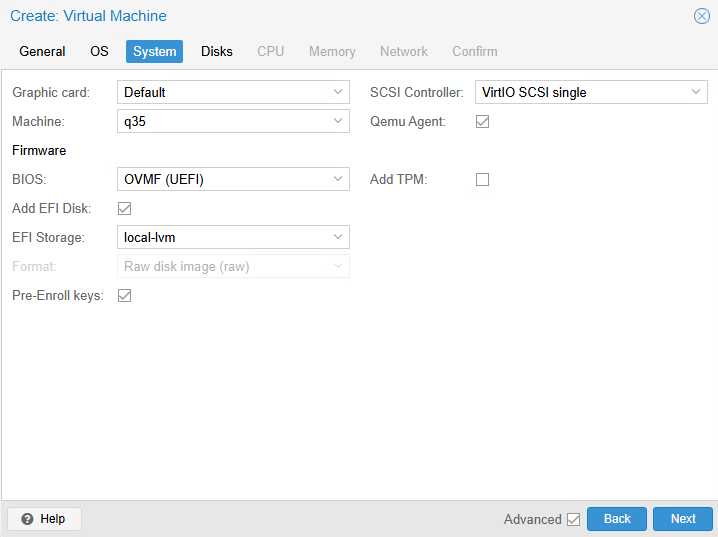

#### Onglet Disks

Il existe une panoplie d'options (encore une fois 😅) pour la configuration du disque dur. Analysons ces différents éléments ensemble:

**Colonne de gauche**  

Déjà, vous pourrez constater qu'à gauche, on retrouve une colonne où vous pouvez ajouter des disques durs. Nous pourrions par exemple créer une *VM* dans laquelle nous désirons configurer un *RAID*. Dans ce cas, nous aurions besoin de plusieurs disques durs. C'est dans cette colonne qu'il nous faudrait les ajouter.

* * *

**Bus/Device**  

C’est ici que nous choisissons le type de bus virtuel auquel notre disque est attaché. C’est ce que le système invité verra comme interface de disque. Quelques options sont disponibles:

- **IDE:** très compatible, mais très lent. À éviter sauf si vraiment nécessaire.
- **SATA:** meilleure compatibilité que IDE, un peu plus rapide.
- **SCSI:** très performant, moderne, supporte le hotplug, les snapshots et TRIM (avec l’agent).
- **VirtIO:** interface para-virtualisée ultra-performante, nécessite des pilotes VirtIO dans l’OS invité.

Comme nous avons sélectionné un contrôleur de disque **VirtIO SCSI Single** à la fenêtre précédente, il serait tout simplement logique d'utiliser un bus SCSI. D'ailleurs, lorsque vous le sélectionnerez, Proxmox fera immédiatement l'association avec votre contrôleur.

* * *
**Storage, Disk Size & Format**  

Il s'agit ni plus ni moins du stockage sur lequel le disque dur de notre *VM* sera créé. Il peut s'agir de disques locaux (comme dans notre cas), ou distants (Ceph, NFS, ZFS, etc.)

L'option *Disk Size*, quant à elle, vous aurez évidemment compris qu'il s'agit de l'espace maximal que l'on désire allouer à la machine virtuelle.

Finalement, le format du disque (*grisé dans notre cas*), permet de sélectionner deux formats de disques distincts:

- **RAW:** Plus rapide, mais ne supporte pas les snapshots de plus haut niveau.
- **qcow2:** Supporte les snapshots de haut niveau, mais un peu moins rapide.

> *Oui, mais Gabriel, est-ce qu'on va pouvoir faire des snapshots avec cette machine ?*
>
> *-Les étudiants*

**OUI!**, mais proxmox en fera la gestion différemment. Il fera des *snapshots* de type **LVM-Thin**. Ce sont des snapshots de plus bas niveau. Ils ne peuvent pas être compressés ou même renommés. Le format du disque dur est grisé, car nous stockons le disque dur de la *VM* sur un stockage de type *LVM*. Lorsque nous faisons cela, nous sommes contraints d'utiliser le format **RAW**.

* * *

**Cache, Discard & IO thread**  

La mémoire cache est une mémoire temporaire située en le système d'exploitation et le disque dur. Son objectif est d'améliorer la vitesse de lecture et d'écriture sur le disque dur. Cela dit, elle peut aussi poser un risque supplémentaire dans la perte de données involontaire. Dans Proxmox, voici comment se traduisent les options de cache:

- **No Cache:**
    - **Cache hôte (proxmox):** Désactivé ❌
    - **Cache disque physique:** Activé ✅
    - **Performance:** Bonne 🙂
    - **Sécurité:** Moyenne 😐
    - **Description:** Ce mode désactive le cache côté hôte (le système Proxmox), mais laisse actif le cache du disque physique. Cela permet une bonne performance tout en réduisant les risques de corruption en cas de panne. C’est le mode par défaut depuis Proxmox 2.x.

- **Direct Sync:**
    - **Cache hôte (proxmox):** Désactivé ❌
    - **Cache disque physique:** Désactivé ❌
    - **Performance:** Faible 😒
    - **Sécurité:** Très élevée 😃
    - **Description:** Le plus sûr, mais aussi **le plus lent.** Chaque écriture est directement synchronisée sur le disque physique sans passer par aucun cache. Idéal pour les environnements critiques où la **perte de données est inacceptable**, mais déconseillée si la performance est une priorité.

- **Write Through:**
    - **Cache hôte (proxmox):** Activé (lecture uniquement) ✅
    - **Cache disque physique:** Désactivé ❌
    - **Performance:** Moyenne 😐
    - **Sécurité:** Élevée 😀
    - **Description:** Les lectures bénéficient du cache hôte, mais chaque écriture est immédiatement synchronisée sur le disque. Cela garantit que les données sont bien écrites, tout en offrant une lecture plus rapide. Un bon compromis entre sécurité et performance.

- **Write Back:**
    - **Cache hôte (proxmox):** Activé ✅
    - **Cache disque physique:** Activé ✅
    - **Performance:** Élevée 😀
    - **Sécurité:** Moyenne à faible 😒
    - **Description:** Les écritures sont d’abord stockées dans le cache, puis écrites sur le disque plus tard. Cela améliore fortement les performances, **mais en cas de coupure de courant**, les données non encore écrites peuvent être **perdues.** Ce mode est acceptable si vous avez un **onduleur (UPS) ou un contrôleur RAID avec batterie (BBU)**.

- **Write Back (unsafe):**
    - **Cache hôte (proxmox):** Activé ✅
    - **Cache disque physique:** Activé ✅
    - **Performance:** Très élevée 😃
    - **Sécurité:** Très faible 😭
    - **Description:** Identique à Write Back, mais **ne force pas les flushs** (vidage du cache). Cela signifie que les données peuvent rester longtemps en mémoire avant d’être écrites. C’est le mode **le plus rapide**, mais aussi **le plus risqué**. À éviter sauf pour des tests ou des environnements non critiques.

Pour notre machine virtuelle, il n'y a pas vraiment de conséquence peu importe le choix que vous ferez. En ce qui me concerne, je vais laisser le choix par défaut: **No cache**.

L'option `Discard` permet au système d'exploitation invité (Windows ici) de <u>libérer de l'espace disque inutilisé</u>. On appelle cette technique d'optimisation de l'espace: *Trim*. Cela réduit l'espace effective utilisée par la machine dans l'hyperviseur. Cette option est recommandée si vous désirez économiser de l'espace disque.

L'option **IO Thread** permet d'activer un *thread* dédiée pour chaque disque ou groupe de disques. À titre d'information, un *thread* est une tâche au sein d'un service. Voici ce que cette option peut avoir comme impact:

**Sans IO Thread:**
- Tous les accès disque de la VM passent par le **même thread principal** que le reste de la virtualisation.
- Cela peut créer un **goulot d’étranglement**, surtout sur les VMs avec beaucoup d’activité disque.

**Avec IO Thread activé:**
- Chaque disque (ou groupe de disques) peut avoir son propre thread d’entrées/sorties.
- Les accès sont gérés **indépendamment du reste de la VM**, ce qui <u>réduit la latence, augmente les performances et améliore la réactivité.</u>

* * *

**SSD Emulation, Read-Only, Backup, Replication & Async IO**  

L'option `SSD Emulation` présentera votre disque dur comme un SSD au système d'exploitation invité. Cela peut permettre au système d'exploitation d'ajuster certains de ses comportements (optimisation, alignement, *trim*, etc.). Cette option est recommandée si le stockage réel est effectivement un SSD. Ce n'est pas notre cas ici.

L'option `Read-only` permet de monter votre disque dur en lecture seule. Ce n'est utile que lorsque vous effectuez du débogage ou des tests.

L'option `Backup` permet d'inclure automatiquement ce disque dur dans les sauvegardes automatiques de Proxmox. C'est une option intéressante si vous désirez protéger vos données.

`Skip replication` permet d'ignorer la réplication de ce disque dur dans le cas où vous auriez un cluster, donc plusieurs nœuds Proxmox. Ce n'est pas notre cas ici. Cette option n'aura donc aucune incidence pour le moment.

L'option `Async IO` est très technique, mais elle peut avoir une incidence sur les performances. Cette option décrit les mécanismes d'accès aux disques durs virtuels. Les systèmes d'exploitation modernes supportent le mode *io_uring*. Pour les systèmes un peu plus vieux, vous pouvez utiliser l'option *threads* pour assurer une compatibilité.

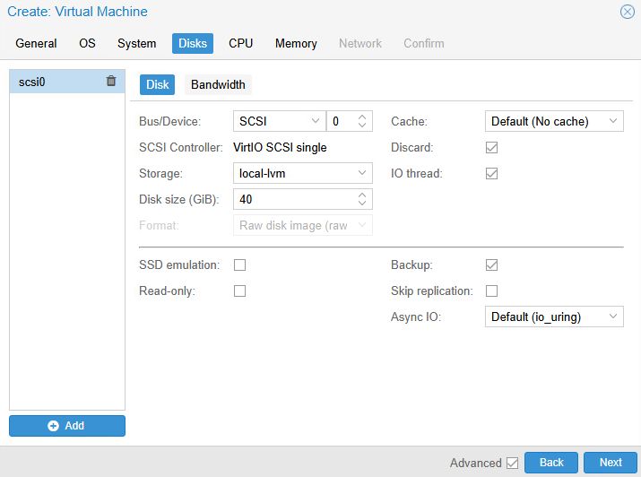

#### Onglet CPU

Allons-y maintenant avec la configuration du CPU. Si, comme moi, vous avez coché la case *Advanced*, vous serez à même de constater plusieurs options ici aussi.

- **Sockets / Cores**
    - **Sockets:** nombre de processeurs virtuels simulés (Équivalent de CPU physiques pour la VM).
    - **Cores:** nombre de cœurs par processeur physique.

:::caution
Respecter les ressources physiques que vous avez à votre disposition!
:::

- **Type:** Définit le modèle de CPU virtuel exposé à la *VM*. Même si cette option peut paraitre simpliste, elle peut avoir un impact important. Je vous recommande d'utiliser le processeur fourni par défaut, car ce dernier sera facilement compatible et migrable vers un autre serveur Proxmox. Si vous avez besoin de plus de performances, vous pouvez utiliser le type `host`. Dans ce cas, Proxmox utilisera le modèle physique de votre CPU. Cela réduit le besoin d'émulation et l'élimine parfois complètement.

- **VCPUs:** Nombre d'unités de traitement virtuelles allouées à la *VM*. Généralement égal au nombre de cœurs, mais peut être ajusté pour limiter l'utilisation du CPU.

- **CPU Limit:** Permet de restreindre la puissance CPU maximale que la VM peut utiliser. Peut éviter qu’une VM monopolise le CPU, mais réduit la performance.

- **Enable NUMA:** Active la topologie NUMA (Non-Uniform Memory Access). Améliore la performance sur les serveurs multisocket. À considérer pour les *VMs* gourmandes en ressources.

- **CPU Affinity:** - Permet de lier la VM à des cœurs spécifiques du CPU physique. Peut améliorer la performance ou l’isolation dans des cas spécifiques.

- **Extra CPU Flags:** Ces options permettent d’activer/désactiver des mitigations de vulnérabilités CPU.

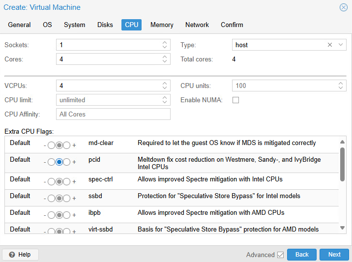

#### Onglet Memory

Dans l'onglet mémoire, vous pourrez évidemment octroyer une quantité de mémoire à votre machine virtuelle. Cela dit, il est intéressant de constater les deux champs distincts:

- **Memory:** C'est la quantité de mémoire que vous désirez donner à la machine, tout simplement.

- **Minimum Memory**: C'est la quantité de mémoire minimale que l'hyperviseur garantira à la machine en cas de *ballooning*.

Cela nous permet donc de surapprovisionner la RAM. Lorsque vous avez créé votre serveur Proxmox, vous avez configuré 16Go de RAM. Nous allons donc en allouer 8Go à Windows, **MAIS** nous allons utiliser le *balloning* pour faire des économies. Dans le champ `Memory`, inscrivez donc 8192. Puis, dans le champ `Minimum memory`. inscrivez 4096.

Le champ, `Shares` quant à lui, détermine les priorités des *VMs* par rapport au *ballooning*.

Par exemple:

|VM|Memory Max|Memory Min|Shares|
|--|----------|----------|------|
|VM1|4096 MB|1024 MB|100|
|VM2|4096 MB|1024 MB|200|
|VM3|4096 MB|1024 MB|50|

Si l'hôte (proxmox), venait à manquer de RAM, **VM3** serait la première *VM* à voir sans mémoire réduite.

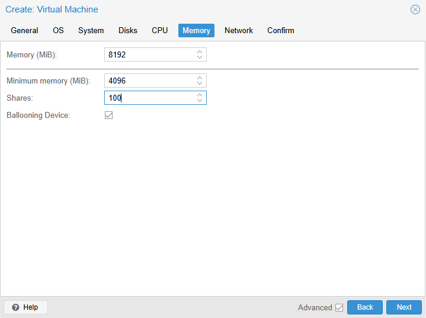

#### Onglet Network

Vous l'aurez compris. C'est ici que vous pourrez déterminer comment votre machine virtuelle se branchera au réseau. Pour l'instant vous n'avez qu'une seule possibilité, et il s'agit de `vmbr0`, le *bridge* par défaut, qui est l'équivalent d'une connexion par pont dans VMware Workstation.

Choisissez le modèle de carte paravirtualisée, car nous installerons les pilotes nécessaires. Évidemment, inutile de spécifier un *VLAN*, nous n'en avons pas. La MAC de cette carte réseau sera générée automatiquement, mais sachez que vous pourriez en spécifier une précise.

Laissez également les options avancées dans leur état par défaut. Tout un volet du cours sera dédié à la réseautique sous Proxmox, c'est pourquoi je ne vous présente pas tous les détails ici.

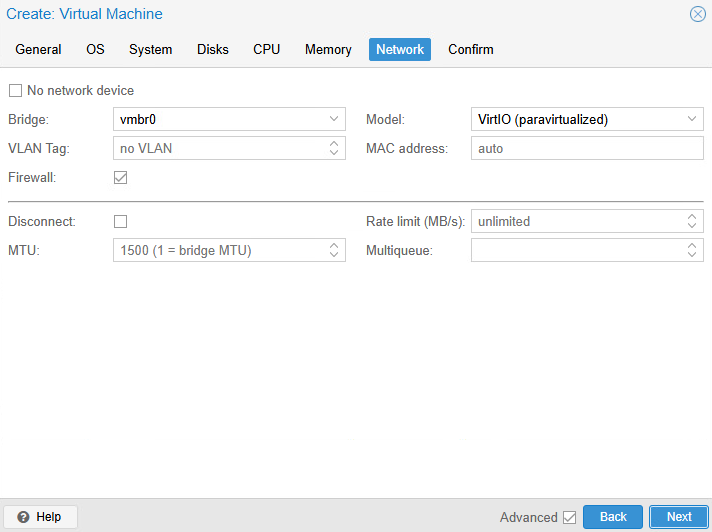

#### Onglet Confirm

ENFIN! Nous y voilà. Révisez vos paramètres et confirmez la création de votre machine virtuelle en cliquant sur `Finish`.

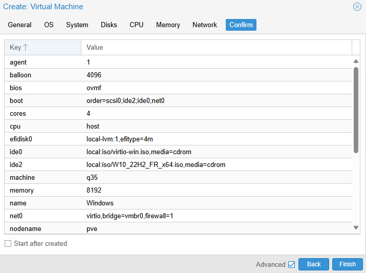

### Étape 3 - Installation Windows

Allez, lancez votre installation Windows! J'imagine qu'en session 5, vous ne devriez pas avoir besoin que je vous guide pas à pas pour installer Windows *right*?...*right?*.......*right*? 😉😉😉

*psssst:* On n’aurait pas ajouté un fichier *iso* contenant des pilotes durant la création de la *VM* nous ? 🤔

:::caution[Réseau instable sous Windows]
Durant la création des exercices pour ce cours, j'ai rencontré des difficultés avec la carte réseau paravirtualisé configurée pour Windows. Une minute j'avais un accès internet, puis l'autre minute pas d'accès. C'était très instable. En faisant mes recherches sur le web, j'ai découvert que certains paramètres avancés de Windows quant aux périphériques réseau pouvaient nuire à la bonne fonctionnalité de la paravirtualisation.

Si vous avez, vous aussi, de la difficulté à avoir un réseau stable avec la carte paravirtualisé, voici ce que vous pouvez entreprendre comme actions pour régler la situation:
- Ouvrez le gestionnaire de périphériques dans la *VM* Windows.
- Faites un clic à l'aide du bouton de droite sur la carte réseau *Red Hat VirtIO Ethernet Adapter*
- Sélectionnez **propriétés** puis allez dans l'onglet **avancé**.
- Modifiez les propriétés suivantes:
    - *Large Send Offload V2 (IPv4)*: **Disabled**
    - *IPv4 Checksum Offload*: **Disabled**
    - *Offload.Rx.Checksum*: **Disabled**
    - *Offload.Tx.Checksum*: **Disabled**
    - *TCP Checksum Offload (IPv4)*: **Disabled**
    - *UDP Checksum Offload (IPv4)*: **Disabled**

Une fois ces modifications apportées, vous devriez retrouver une meilleure stabilité du réseau.
:::