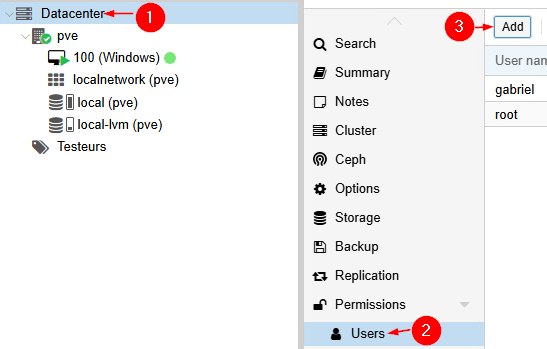
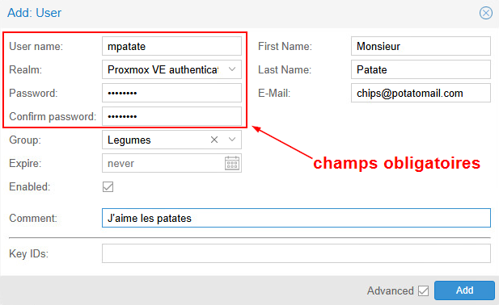
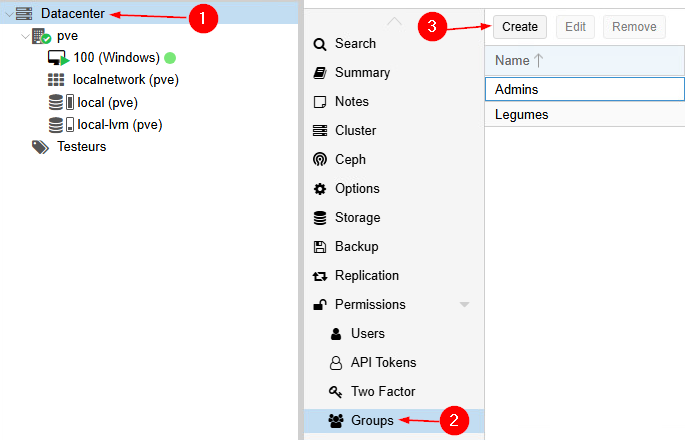
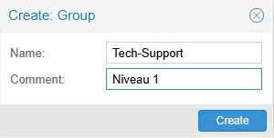
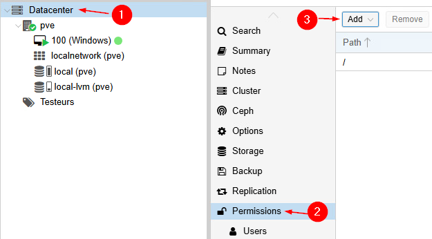
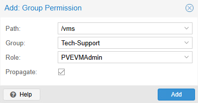
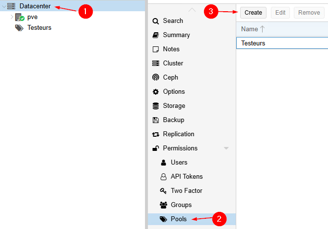
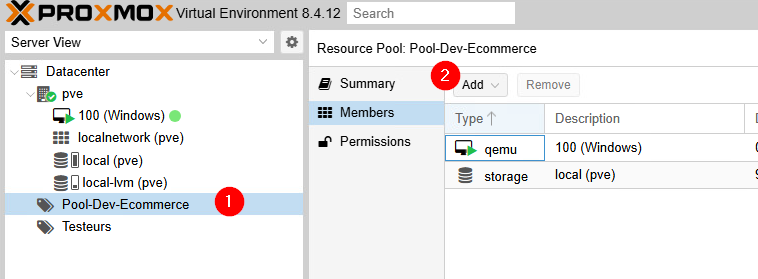

import useBaseUrl from '@docusaurus/useBaseUrl';
import ThemedImage from '@theme/ThemedImage';
import Tabs from '@theme/Tabs';
import TabItem from '@theme/TabItem';

# Cours 4

## Utilisateurs & permissions 👨‍👩‍👧‍👦

### Objectifs de ce cours ✅

À la fin de ce cours, vous serez capable de:

- Comprendre les mécanismes d'authentification et d'autorisation dans Proxmox VE
- Expliquer la différence entre utilisateurs, groupes, rôles et permissions
- Créer et configurer des utilisateurs avec différents systèmes d'authentification
- Mettre en place une architecture de permissions sécurisée et maintenable
- Implémenter l'authentification à deux facteurs pour renforcer la sécurité
- Automatiser la gestion des utilisateurs via les outils en ligne de commande

### Pourquoi ? 🤔

Dans un environnement de virtualisation comme Proxmox VE (ou VMware), plusieurs personnes peuvent avoir besoin d'accéder au système avec des besoins différents :

- **Administrateurs de l'hyperviseur:** Accès complet pour la maintenance et la configuration.

- **Administrateurs de VMs:** Gestion des machines virtuelles sans accès aux paramètres système.

- **Utilisateurs finaux:** Accès limité à leurs propres *VMs* (démarrer/arrêter, console)

- **Comptes d'application:** Accès automatisé via API pour l'intégration avec d'autres systèmes.

Une gestion granulaire permet de respecter le **principe du moindre privilège** : chaque utilisateur n'a que les permissions strictement nécessaires à ses fonctions.

### Principe RBAC 👍

Tout comme vous l'avez appris dans le cours *Serveurs 3 : Administration Centralisée*, Proxmox adopte aussi la méthode **RBAC** (*Role Base Access Control*). Cette méthodologie de gestion adopte une architecture à quatre niveaux:

```yaml
Utilisateur --> Groupe --> Rôle --> Permissions sur les ressources
```

<div style={{textAlign: 'center'}}>
    <ThemedImage
        alt="Schéma"
        sources={{
            light: useBaseUrl('/img/Virtu/RBAC_W.svg'),
            dark: useBaseUrl('/img/Virtu/RBAC_D.svg'),
        }}
    />
</div>

Cette façon de procéder permet une gestion plus granulaire des permissions et évite de perdre de vue quels utilisateurs possèdent quelles permissions.

### Domaine d'authentification 🔑

Un **domaine d'authentification** (ou *realm* en anglais) définit où et comment les identifiants des utilisateurs sont stockés et vérifiés. Proxmox permet l'utilisation de plusieurs domaines d'authentification pour se connecter. On distinguera alors l'utilisateur et le domaine d'authentification grâce au caractère `@`.

Exemples:

- `admin@pve` : Utilisateur « Admin » dans le domaine d'authentification Proxmox VE interne.
- `john@pam` : Utilisateur « John » dans le domaine d'authentification PAM.
- `marie@patate-ldap` : Utilisateur « Marie » dans le domaine LDAP de l'entreprise patate.

#### Linux PAM (Pluggable Authentication Modules)

PAM est un système d'authentification flexible utilisé par Linux (Ubuntu par exemple) pour vérifier l'identité des utilisateurs. Quand vous vous connectez à un système Linux avec votre nom d'utilisateur et mot de passe, c'est PAM qui vérifie vos informations.

**Comment ça fonctionne:**

1. L'utilisateur entre ses informations de connexion.
2. Proxmox VE interroge PAM pour vérifier le mot de passe.
3. PAM consulte les fichiers système `/etc/passwd` et `/etc/shadow`.

**Avantages:**

- Simple à configurer pour de petites installations.
- Utilise l'infrastructure existante du système.
- Sécurité éprouvée de Linux

**Inconvénients:**

- L'utilisateur doit exister sur **chaque nœud** du cluster (pas pratique!)
- Gestion manuelle des utilisateurs sur chaque serveur
- Pas de gestion centralisée des mots de passe.

#### Serveur d'authentification Proxmox VE

Système de gestion des mots de passe intégré directement dans Proxmox VE.

**Comment ça fonctionne:**

1. Les informations utilisateur sont stockées dans `/etc/pve/user.cfg`.
2. Les mots de passe sont hachés (SHA-256) et stockés dans `/etc/pve/priv/shadow.cfg`.
3. Ces fichiers sont automatiquement synchronisés entre tous les nœuds du cluster (Un gros avantage!).
4. Les utilisateurs peuvent changer leur mot de passe via l'interface web.

**Avantages:**

- Gestion centralisée (un seul endroit pour tous les utilisateurs).
- Synchronisation automatique dans le cluster.
- Interface web conviviale pour les utilisateurs.
- Parfait pour les installations de petite à moyenne envergure.

**Inconvénients:**

- Limité à Proxmox VE (pas d'intégration avec d'autres systèmes)
- Gestion manuelle des utilisateurs.

**Cas d'usage typique:** Une entreprise avec 10-50 utilisateurs qui n'ont besoin d'accéder qu'à Proxmox VE.

#### LDAP (Lightweight Directory Access Protocol)

Comme vous l'avez étudié dans le cours **Serveurs 3: Administration Centralisée**, LDAP est un protocole standard pour accéder à des annuaires d'entreprise, tel que *Active Directory* par exemple. Ce type d'annuaire est particulièrement intéressant et utilisé dans de grandes entreprises. Il permet de centraliser la gestion des comptes et de l'authentification.

En entreprise, il est plutôt rare (mais pas impossible...) que vous arriviez nez à nez avec un serveur OpenLDAP étant donné la domination de Microsoft avec *Active Directory* dans cette sphère.

#### Microsoft Active Directory

Je crois que je n'ai plus besoin de vous le présenter 😉... Comme mentionné ci-dessus, *Active Directory* est un ensemble de services (dont LDAP) permettant de centraliser et de sécuriser les différents comptes d'utilisateur d'une entreprise. *Active Directory* possède plus de fonctionnalités que le simple protocole LDAP.

Le principal avantage d'*AD*, c'est qu'il est généralement déjà implanté dans la plupart des entreprises. En l'intégrant à Proxmox, les utilisateurs pourraient conserver leur nom d'utilisateur ainsi que leur mot de passe pour ouvrir une session sur Proxmox. C'est un avantage assez considérable.

#### OpenID Connect

OpenID Connect est un protocole moderne d'authentification qui permet **l'authentification unique** (Single Sign-On ou SSO). Ce principe vous permet d'utiliser l'authentification d'un site tiers pour vous connecter à Proxmox.

**Comment ça fonctionne:**

1. L'utilisateur clique sur « Se connecter avec Google » dans Proxmox VE.
2. Il est redirigé vers Google pour s'authentifier
3. Google confirme ou infirme l'identité à Proxmox VE.
4. L'utilisateur se voit autorisé ou refusé dans le système.

**Avantages:**

- Pas de gestion de mots de passe côté Proxmox
- Sécurité gérée par le fournisseur
- Expérience utilisateur simple
- 2FA héritée du fournisseur

**Fournisseurs populaires:**

- Google Workspace
- Microsoft Azure AD
- Keycloak (open source)
- Auth0

### Création et administration des utilisateurs 👤

Chaque utilisateur dans Proxmox VE est constitué de plusieurs éléments d'information stockés dans le fichier `/etc/pve/user.cfg`:

|Informations personnelles 👇|Informations d'accès 👇|Informations de sécurité 👇|
|-------------------------|--------------------|------------------------|
|Prénom et nom|Nom d'utilisateur|Appartenance aux groupes|
|Adresse courriel|Domaine d'authentification|Clés 2FA|
|Commentaires|État|Tokens API|
||Date d'expiration||


:::important
Les mots de passe ne sont **PAS** stockés dans le fichier `/etc/pve/user.cfg`. Ils sont gérés par le domaine d'authentification (PAM, LDAP, Proxmox VE, etc.)
:::

#### 🔥ROOT: Un cas particulier

L'utilisateur `root@pam` est l'administrateur suprême de Proxmox VE:

**Caractéristiques spéciales:**
- Ne peut jamais être supprimé
- A automatiquement tous les privilèges
- Reçoit tous les courriels système importants
- Peut toujours se connecter même si les autres domaines d'authentification sont en panne

**Bonnes pratiques:**
- 🚨 **<mark>Utilisez le <u>uniquement pour la configuration initiale et les urgences</u></mark>** 🚨
- Créez des utilisateurs administrateurs séparés pour l'usage quotidien
- Changez son mot de passe régulièrement
- Activez l'authentification à deux facteurs (2FA)

#### Création d'utilisateurs via l'interface web

Dans le volet contenant l'architecture des ressources, cliquez sur `Datacenter`, puis sur `Users` dans le sous-menu. Cliquez sur `Add` pour ajouter un utilisateur:



Remplissez minimalement les champs obligatoires du formulaire:



#### Gestion des utilisateurs en ligne de commande 💻

L'interface Web peut répondre à des besoins sporadiques, mais lorsque nous avons besoin de créer plusieurs utilisateurs à la fois, ce n'est pas l'idéal. Pour cette dernière façon de procéder, nous utiliserons l'outil `pveum` (*Proxmox VE User Manager*). Cet outil est idéal pour l'automatisation et l'administration à distance.

##### Création d'un utilisateur

```bash
pveum user add bob@pve \
    --firstname "Bob" \
    --lastname "Dupont" \
    --email "bob.dupont@entreprise.com" \
    --comment "Technicien système" \
    --groups "tech-support"
```

##### Définition du mot de passe

```bash
# Mode interactif (sécurisée)
pveum passwd bob@pve

# Via script (moins sécurisé)
echo "motdepasse123" | pveum passwd bob@pve --stdin
```

##### Modification de propriétés

```bash
# Désactiver temporairement un utilisateur
pveum user modify bob@pve --enable 0

# Définir une date d'expiration
pveum user modify bob@pve --expire "2024-12-31"

# Changer de groupe
pveum user modify bob@pve --groups "new-group"
```

##### Consultation des informations

```bash
# Lister tous les utilisateurs
pveum user list

# Voir les détails d'un utilisateur
pveum user list bob@pve

# Voir les permissions d'un utilisateur
pveum user permissions bob@pve
```

### Organiser les utilisateurs en groupe 👨‍👩‍👧‍👦

Imaginez une entreprise avec 50 employés où vous devez gérer individuellement les permissions de chacun. Quand un nouveau projet démarre et nécessite l'accès à certaines VMs, vous devez modifier 10 comptes utilisateur un par un. Quand le projet se termine, même chose en sens inverse. C'est fastidieux et source d'erreurs.

Les groupes viennent résoudre ce problème:

- **Simplification:** Gérer les permissions par catégorie d'utilisateurs
- **Cohérence:** Tous les membres d'un groupe ont les mêmes accès
- **Maintenance:** Ajouter/retirer un utilisateur d'un groupe = changer ses permissions
- **Lisibilité:**  Plus facile de comprendre qui a accès à quoi

La méthodologie **RBAC** nous a appris que le (ou les) rôle d'affaires qu'occupe un employé doit déterminer les permissions de cet utilisateur. Sous Proxmox, les permissions regroupées en rôles (PVEVMUser par exemple). Ces rôles peuvent, à leur tour, être attitrés à des groupes d'utilisateurs. Ainsi, lorsque vous déterminez le, ou les groupes auxquels appartient un utilisateur, vous déterminez du même coup ses permissions.

#### Via l'interface Web

Cliquez sur `Datacenter`, puis `Groups` et `Create`:



Indiquez un nom et un commentaire (facultatif), puis cliquez sur `Create`:



#### Via l'invite de commandes

**Créer un groupe:**

```bash
pveum group add vm-admins --comment "Administrateurs des machines virtuelles"
```

**Lister tous les groupes:**

```bash
pveum group list
```

**Voir les membres d'un groupe:**

```bash
pveum group list vm-admins
```

**Attribuer un rôle à un groupe:**

```bash
# Donner accès admin aux VMs pour le groupe
pveum acl modify /vms --group vm-admins --role PVEVMAdmin
```

#### Gestion de l'appartenance aux groupes

**Ajouter un utilisateur à un, ou plusieurs groupes lors de la création:**

```bash
pveum user add marie@pve --groups "vm-admins,support"
```

**Modifier l'appartenance existante:**

```bash
pveum user modify marie@pve --groups "vm-admins,project-beta"

# Pour ajouter à un groupe sans affecter les autres, il faut spécifier tous les groupes
```

**Bonnes pratiques:**

- Évitez les groupes trop génériques comme *users* ou *everyone*.
- Utilisez des noms de groupes explicites et cohérents.

### Système de rôles et de privilèges 🔐

Un **privilège** représente une action spécifique qu'un utilisateur peut effectuer. C'est le niveau le plus granulaire des permissions. Voici les principales catégories:

#### Privilèges liés aux nœuds et au système

|Nom du privilège|Description|Permet de...|
|----------------|-----------|------------|
|`Sys.PowerMgmt`|Contrôle de l'alimentation des nœuds|Redémarrer, arrêter, mettre en veille un serveur Proxmox|
|`Sys.Console`|Accès à la console du nœud|Ouvrir une session shell sur le serveur Proxmox<br/> ⚠️**Attention, le shell est en accès root**⚠️|
|`Sys.Audit`|Consultation des informations système|Voir l'état des nœuds, la configuration du cluster et les logs|
|`Sys.Modify`|Modification de la configuration réseau des nœuds.|Configuration des *bonds* ou des *bridges*|

:::danger
Les permissions relatives à la gestion des nœuds ne devraient en aucune circonstance être attribuées à la légère. De mauvaises manipulations sur les nœuds peuvent aisément mettre en péril la production d'une entreprise.
:::

#### Privilèges liés aux machines virtuelles

|Nom du privilège|Description|Permet de...|
|----------------|-----------|------------|
|`VM.Allocate`|Création et suppression de *VMs*|Créer de nouvelles *VMs*, supprimer des *VMs* existantes|
|`VM.PowerMgmt`|Gestion de l'alimentation des *VMs*|Démarrer, arrêter, redémarrer, mettre en pause des *VMs*|
|`VM.Console`|Accès à la console des *VMs*|Ouvrir une session console dans la *VM*|
|`VM.Config.*`|Modification de la configuration des *VMs*|`VM.Config.Disk`: Ajouter/Modifier/Supprimer des disques<br/>`VM.Config.Network`: Modifier la configuration réseau<br/> `VM.Config.Memory`: Changer la quantité de RAM<br/>`VM.Config.CPU`: Modifier les paramètres CPU|

#### Privilèges liés au stockage

|Nom du privilège|Description|Permet de...|
|----------------|-----------|------------|
|`Datastore.Allocate`|Créer et gérer les datastores|Ajouter de nouveaux espaces de stockage|
|`Datastore.AllocateSpace`|Utiliser l'espace de stockage|Créer des disques de *VMs*, faire des sauvegardes, etc.|

* * *

Un **rôle** est un ensemble cohérent de privilèges regroupés. Au lieu d'attribuer individuellement 15 privilèges différents, on attribue un rôle qui les contient tous. Plusieurs rôles prédéfinis et pratiques existent dès l'installation de Proxmox:

|Nom du rôle|Description|Privilèges|Notes|
|-----------|-----------|----------|-----|
|Administrator|Accès complet à tout le système|<span class="red-text">**TOUS**</span>|Généralement réservé aux administrateurs système seniors|Ces utilisateurs peuvent détruire le système au complet|
|PVEAdmin|Administration générale sans les privilèges système critiques|Tous sauf `Sys.PowerMgmt`, `Sys.Modify` et `Permissions.Modify`|Ne peut pas modifier les permissions ou encore éteindre les serveurs|
|PVEVMAdmin|Administration complète des machines virtuelles|Tous les privilèges préfixés `VM.*`|Peut créer, configurer, démarrer et sauvegarder les *VMs*|
|PVEVMUser|Utilisation basique des *VMs*|`VM.Console`, `VM.PowerMgmt`, `VM.Config.CDROM`|Peut démarrer/arrêter leurs *VMs*, accéder à la console, changer les CD-ROMS|
|PVEAuditor|Accès en lecture seule|Tous les privilèges d'audit `*.Audit`|Ne peut rien modifier. Utilisé par les équipes de monitoring et de supervision|

Il existe d'autres rôles plus spécialisés également:

- **PVEDatastoreAdmin**: Gestion du stockage uniquement
- **PVEPoolAdmin**: Gestion des pools de ressources
- **PVEUserAdmin**: Gestion des utilisateurs et des permissions

#### Création de rôles personnalisés

Parfois, les rôles prédéfinis ne correspondent pas exactement à nos besoins. C'est pourquoi il est possible de créer des rôles sur mesure. Voici deux exemples où l'on pourrait créer des rôles personnalisés:

**Exemple 1: Opérateur de nuit**

L'opérateur de nuit doit pouvoir:

- Redémarrer les *VMs* en cas de problème
- Accéder aux consoles pour diagnostiquer
- Voir l'état du système

Nous pourrions alors créer un rôle à l'aide de l'invite de commandes comme suit:

```bash
pveum role add OperateurNuit \
    --privs "VM.PowerMgmt VM.Console VM.Audit Sys.Audit"
```

**Exemple 2: Développeur junior**

Le développeur doit pouvoir:

- Utiliser les *VMs* de développement
- Les sauvegarder

Nous pourrions alors créer un rôle à l'aide de l'invite de commandes comme suit:

```bash
pveum role add DevJunior \
    --privs "VM.PowerMgmt VM.Console VM.Backup VM.Config.CDROM"
```

:::tip
Vous pouvez aussi créer des rôles personnalisés directement dans l'interface web. Toujours dans la section des permissions dans l'interface web, vous n'avez qu'à cliquer sur `Roles`
:::

### Gestion des permissions par chemin 🛣️

Dans Proxmox VE, chaque ressource est identifiée par un **chemin hiérarchique**, similaire aux chemins de fichiers dans un système d'exploitation. Cette hiérarchie permet d'organiser les permissions de manière logique et d'utiliser l'héritage.

**Structure hiérarchique:**

```yaml
/                           (Racine - tout le système)
├── /nodes/                 (Tous les nœuds)
│   ├── /nodes/pve1         (Nœud spécifique "pve1")
│   └── /nodes/pve2         (Nœud spécifique "pve2")
├── /vms/                   (Toutes les VMs)
│   ├── /vms/100            (VM avec ID 100)
│   └── /vms/101            (VM avec ID 101)
├── /storage/               (Tous les stockages)
│   ├── /storage/local      (Stockage "local")
│   └── /storage/shared-nfs (Stockage "shared-nfs")
└── /pool/                  (Tous les pools)
    ├── /pool/production    (Pool "production")
    └── /pool/development   (Pool "development")
```

:::important
Certains chemins peuvent contenir des **variables** qui sont remplacées dynamiquement selon le contexte :

**\{node\}**-Remplacé par le nom du nœud:<br/>
`/nodes/{node}/status` devient alors `/nodes/pve1/status`

**\{vmid\}**-Remplacé par le nom de la *VM*:<br/>
`/vms/{vmid}` devient alors `/vms/101`

**\{storeid\}**-Remplacé par l'ID du stockage:<br/>
`/storage/{storeid}` devient alors `/storage/backup`
:::

#### Mécanisme d'héritage

L'héritage permet qu'une permission accordée à un niveau supérieur soit automatiquement disponible aux niveaux inférieurs, **sauf si l'option "Propagate" est désactivée.**

**Exemple d'héritage:**

Un utilisateur se voit accorder les permissions sur `/vms` avec le rôle **PVEVMAdmin**<br/>
⬇️ (héritage)<br/>
L'utilisateur aura donc les permissions du rôle **PVEVMAdmin** sur `/vms/100`, `/vms/101`, `/vms/102`, etc.

##### Règles d'héritage en ordre de priorité

1. <span class='green-text'>**La permission individuelle prime sur la permission de groupe.**</span><br/><br/>Exemple: Marie fait partie du groupe *Finances*.<br/><br/>Ce groupe possède le rôle **PVEVMUser** sur `/vms/100`.<br/> Marie possède, individuellement, le rôle **PVEVMAdmin** sur `/vms/100`.<br/>Au final, Marie aura **PVEVMAdmin** sur `/vms/100`. 

* * *

2. <span class='green-text'>**La permission spécifique prime sur la permission générale.**</span><br/><br/>Le groupe *DEVS* possède le rôle **PVEVMAdmin** sur `/vms`.<br/><br/> Le même groupe possède le rôle **PVEVMUser** sur `/vms/100`.<br/>Au final, le groupe *DEVS* aura **PVEVMUser** sur `/vms/100`.

* * *

3. `NoAccess` <span class='green-text'> **annule tout.**</span><br/><br/>Exemple: Marie possède le rôle **PVEVMAdmins** sur `/vms`.<br/><br/>Marie a `NoAccess` sur `/vms/100`.<br/>Au final, Marie n'a aucun accès à la `/vms/100`.

#### Attribution des permissions

##### Via l'interface web:



Complétez les champs requis:



##### Via la ligne de commande:

```bash
# Permission utilisateur
pveum acl modify /vms --user marie@pve --role PVEVMAdmin

# Permission groupe
pveum acl modify /pool/development --group developers --role PVEVMAdmin

# Permission sans héritage (propagate=0)
pveum acl modify /vms/100 --user john@pve --role PVEVMUser --propagate 0
```

### Pools de ressources 🤽‍♀️

Un **pool de ressources** est un conteneur logique qui regroupe plusieurs ressources Proxmox VE sous une même entité. Imaginez-le comme un "dossier" qui contient des VMs, des conteneurs, et des espaces de stockage.

Pourquoi devriez-vous utiliser les pools ? Supposons qu'une entreprise décide de démarrer un projet de « e-commerce » et qu'elle utilise les machines virtuelles suivantes:

- VM100 : Serveur Web
- VM101 : Base de données
- VM102 : Serveur de cache
- Stockage: e-commerce data

Pour donner accès aux ressources à l'équipe de travail, nous devrions créer 4 permissions distinctes:

1. Permissions d'administration sur la VM100
2. Permissions d'administration sur la VM101
3. Permissions d'administration sur la VM102
4. Permissions d'utilisation du *datastore* e-commerce data

La création d'un *pool*, quant à elle, nous permettrait de rassembler toutes ces ressources dans un bassin et d'attribuer une seule permission sur l'entièreté de celui-ci. L'utilisation des *pools* nous permet donc de:

- **Simplifier les permissions**: Une permission au lieu de plusieurs
- **Créer une cohérence**: Toutes les ressources du projet ont les mêmes accès
- **Intégrer de l'évolutivité**: Ajouter une *VM* au projet = l'ajouter au *pool*
- **Avoir une meilleure visibilité**: Organisation claire des ressources par projet/équipe
- **Mieux déléguer**: Le transfert d'un projet complet à une autre équipe est plus facile

#### Création et gestion des pools

##### Via l'interface web

Dans la section vous permettant de gérer les différentes permissions:



Donnez un nom à votre *pool* et ajoutez un commentaire au besoin:


##### Via l'invite de commandes

```bash
# Créer un pool
pveum pool add dev-project-alpha --comment "Environnement de développement - Projet Alpha"

# Lister les pools existants
pveum pool list

# Voir le contenu d'un pool
pveum pool list dev-project-alpha
```

##### Ajouter des ressources à un *pool*

Lorsque vous aurez créé votre *pool*, celui-ci apparaitra dans le volet de gauche (architecture de ressources). En le sélectionnant, vous pourrez ajouter des ressources à l'intérieur, telles que des *VMs* et/ou du stockage. Vous pourrez également déterminer les permissions sur ce *pool* de ressources.



:::tip
Vous pouvez ajouter une machine virtuelle à un *pool* dès sa création en sélectionnant ce dernier au moment approprié lors du processus de création.
:::

##### Stratégies d'organisation

Il existe différentes méthodes de travail en ce qui concerne l'organisation des ressources. Voici différentes façons d'organiser vos ressources:

###### Organisation par projet

```
pool-web-redesign     → VMs du projet refonte site web
pool-mobile-app       → VMs du projet application mobile
pool-data-migration   → VMs du projet migration données
```

###### Organisation par environnement

```
pool-production       → Toutes les VMs de production
pool-staging          → Environnement de test
pool-development      → Environnement de développement
```

###### Organisation par équipe

```
pool-team-frontend    → Ressources équipe développement frontend
pool-team-backend     → Ressources équipe développement backend
pool-team-devops      → Ressources équipe DevOps
```

###### Organisation hybride (recommandation du prof)

```
pool-prod-ecommerce   → Production du projet e-commerce
pool-dev-ecommerce    → Développement du projet e-commerce
pool-prod-crm         → Production du CRM
pool-dev-crm          → Développement du CRM
```