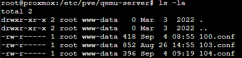
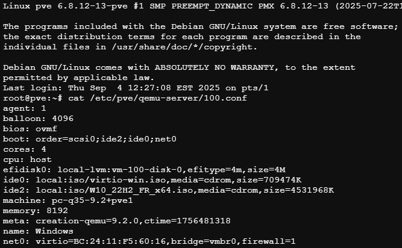
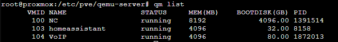
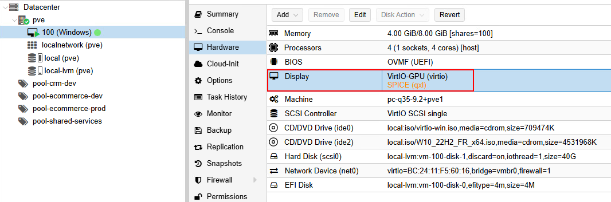
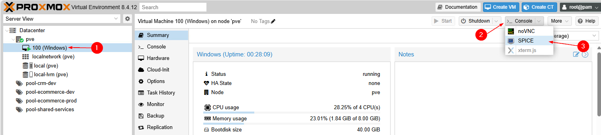
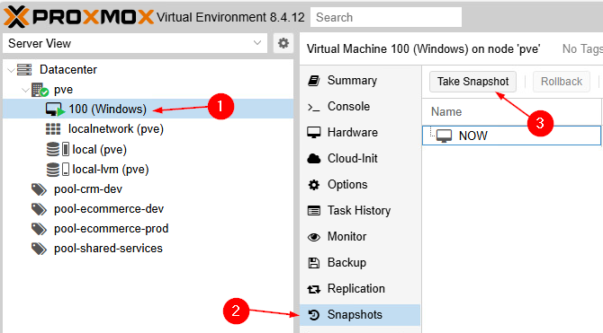
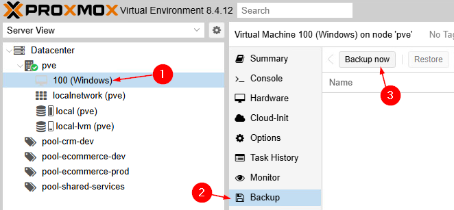

import useBaseUrl from '@docusaurus/useBaseUrl';
import ThemedImage from '@theme/ThemedImage';
import Tabs from '@theme/Tabs';
import TabItem from '@theme/TabItem';

# Cours 5

## Administration avancée des VMs ⚙️

Proxmox stocke toutes les configurations de VMs dans un répertoire centralisé: `/etc/pve/qemu-server/`



- Chaque fichier `.conf` correspond à une *VM* identifiée par son VMID (VM ID)
- Ces fichiers contiennent toute la configuration : CPU, Mémoire, disques, réseau, etc.
- Le répertoire `/etc/pve` est synchronisé automatiquement entre tous les nœuds du cluster.
- Les modifications sont propagées en temps réel à tous les nœuds.

**<span class="green-text fonttaller">Exemple d'une partie d'un fichier de configuration d'une VM:</span>**



Si vous observez attentivement l'image ci-dessus 👆, vous reconnaitrez sans doute quelques éléments:

- `bios: ovmf` : Firmware de type **UEFI**
- `balloon: 4096` : Quantité minimale de mémoire à laisser à la *VM* en cas de *ballooning*
- `cpu: host` : Type de CPU de la *VM*
- etc.

## Commandes `qm`

La commande `qm` (QEMU Manager) est l'outil principal pour gérer les machines virtuelles dans Proxmox. Elle communique directement avec le système de virtualisation QEMU/KVM.

**Syntaxe générale:**

```bash
qm <commande> <VMID> [options]
```

### Listage d'informations

Lister les *VMs* avec `qm list`

```bash
#Commande permettant de lister les machines virtuelles
qm list
```
**Exemple:**



:::tip
Ajoutez le commutateur *--full* à la commande `qm list` pour faire apparaitre les colonnes d'informations suivantes:

- **UPTIME**: Temps de fonctionnement depuis le dernier démarrage
- **CPUS**: Nombre de CPU virtuels
- **DISKREAD/DISKWRITE**: Statistiques d'entrées/sorties sur le disque
- **NETIN/NETOUT**: Statistiques réseau
:::

Vous pouvez également lister la configuration d'une *VM* en particulier à l'aide de la commande `qm`

```bash
# Afficher les configurations de la machine virtuelle 100
qm config 100
```


### Gestion de l'état des VMs

La commande `qm` permet également de poser une action quant à l'état d'une machine.

<span class="green-text">**Exemple #1: Démarrer la machine 101**</span>

```bash
# Démarrer la vm 101
qm start 101
```

<span class="green-text">**Exemple #2: Arrêter la machine 105**</span>

```bash
# Arrêter convenablement la vm 105
qm shutdown 105
```
:::caution[Forcer un arrêt]
La commande `qm` permet aussi de forcer l'arrêt d'une machine virtuelle. Cela dit, forcer l'arrêt d'une machine peut causer:
- Une perte de données non sauvegardées
- Une corruption du système de fichiers

```bash
# Forcer l'arrêt de la machine virtuelle 105
qm stop 105
```
:::

<span class="green-text">**Exemple #3: Redémarrer la machine 111**</span>

```bash
# Redémarrer la vm 111
qm reboot 111
```

### Modification de configuration

La commande `qm` permet aussi de modifier directement la configuration d'un *VM* sans passer par l'interface graphique.

<span class="green-text">**Exemple #1: Modifier la mémoire d'une VM**</span>

```bash
# Passer la mémoire de la VM 101 à 8 GB
qm set 101 --memory 8192
```

<span class="green-text">**Exemple #2: Modifier le nombre de CPUs**</span>

```bash
# Passer la VM 105 à 4 CPUs virtuels
qm set 105 --cores 4
```

<span class="green-text">**Exemple #3: Ajouter un disque**</span>

```bash
# Ajouter un disque de 50GB sur le stockage local-lvm
qm set 110 --scsi1 local-lvm:50
```
:::tip[Tout savoir sur `qm`]
Je ne peux malheureusement pas analyser toutes les possibilités offertes par la commande `qm` avec vous. Par contre, je vous invite à consulter [la documentation](https://pve.proxmox.com/pve-docs/qm.1.html) de celle-ci. Vous verrez, `qm` vous réserve sans doute plusieurs surprises.
:::

## Consoles et accès aux VMs 🖥️

Proxmox offre plusieurs méthodes pour accéder à vos machines virtuelles, chacune ayant ses avantages selon le contexte d'utilisation. 

### Console NoVNC via l'interface web

La console NoVNC intégrée dans l'interface web Proxmox est la méthode la plus courante:

- Accès direct depuis le navigateur
- Aucune configuration réseau requise
- Idéale pour l'administration de base
- Support du copier-coller (selon le navigateur)

Pour accéder à la console NoVNC, sélectionnez votre *VM* dans l'interface Proxmox et cliquez sur Console dans le menu.

### Console SPICE

SPICE (*Simple Protocol for Independent Computing Environments*) offre de meilleures performances que NoVNC:

- Meilleure compression des données
- Support de l'audio bidirectionnel
- Transfert de fichiers par glisser-déposer
- Nécessite un client SPICE installé

#### Utiliser SPICE avec une *VM* Windows

Pour utiliser SPICE avec une *VM* Windows hébergé sous Proxmox, il faut suivre quelques étapes:

1. Installer les [SPICE Guest Tools](https://www.spice-space.org/download/windows/spice-guest-tools/spice-guest-tools-latest.exe) sur votre machine virtuelle Windows hébergée sous Proxmox. Cet installateur contient des pilotes et des services qui optimiseront l'utilisation de SPICE ainsi que son intégration.

2. Dans la section *Hardware* de votre machine virtuelle, changez l'option *Display* pour SPICE:



:::caution
Les changements qui apparaissent en jaune-orange nécessitent un redémarrage de la *VM* concerné. Dans le cas qui nous concerne ici, il nous faudra redémarrer la *VM*. <br/> **PSSST**: On a vu une commande qui pouvait redémarrer les machines virtuelles convenablement...
:::

3. Il nous faut maintenant installer un client SPICE. C'est-à-dire, un logiciel qui utilisera le protocole SPICE et nous permettra de voir notre client à distance. Vous pouvez utiliser [Remote-viewer](https://releases.pagure.org/virt-viewer/virt-viewer-x64-11.0-1.0.msi) pour cela.

4. Une fois le logiciel *remote-viewer* installé, dirigez-vous dans l'interface web de Proxmox, sélectionnez votre *VM*, puis dans le menu console, sélectionnez **SPICE**. Le téléchargement d'un fichier `*.vv` sera lancé automatiquement. Cliquez sur ce fichier pour démarrer la connexion vers votre machine virtuelle.



Le fichier que vous venez d'utiliser pour ouvrir votre session via le protocole **SPICE** n'est utilisable qu'une seule fois, après quoi il s'autodétruira.

> *Oui, mais Gabriel, ce n'est pas pratique cette façon de travailler. Pourquoi ne peut-on tout simplement pas ouvrir le logiciel remote-viewer, entrer l'IP concerné et nous y connecter ?*
>
> *-Les étudiants*

<u>C'est une excellente question.</u> Surtout lorsqu'on provient d'un environnement Windows où il est assez facile de se brancher en **RDP** ou même via **SSH** à d'autres machines et serveurs. Cependant, souvenez-vous que nous nous connectons présentement à une machine virtuelle hébergée par un hyperviseur. Dans les cours précédents, nous avons vu que cet hyperviseur administre des ressources, des utilisateurs, des groupes et des permissions. Pour vous identifier, et ainsi, savoir quelles sont les ressources auxquelles vous avez droit, vous devez ouvrir une session sur l'interface de Proxmox. Une fois que ce sera fait, vous pourrez alors récupérer le fichier `*.vv` qui contiendra votre *token* d'accès et d'autres informations nécessaires à Proxmox. Ceci étant dit, c'est vrai que ce n'est pas très efficace comme méthodologie de travail.

Or, Proxmox possède une API. Il serait possible de créer un script PowerShell générer le fichier de connexion **SPICE**.

### Console série

La console série permet un accès direct à la console d'une machine virtuelle qui ne possède pas d'interface graphique. <u>**Attention**</u>, pour utiliser la console série, le système d'exploitation invité doit être configuré pour rediriger sa sortie vers le port série. Sur la plupart des distributions Linux modernes, cela se fait automatiquement.

```bash
# Accéder à la console série de la VM 100
qm terminal 100
```

:::caution
La console série n'est pas recommandée pour **Windows** tout simplement parce que l'interface graphique de Windows n'est pas accessible via une console série comme c'est le cas dans plusieurs systèmes Linux.
:::

### Console xterm.js

Proxmox utilise xterm.js pour fournir une expérience de terminal moderne directement dans le navigateur web. Cette technologie offre plusieurs avantages par rapport aux consoles traditionnelles.

#### Caractéristiques de xterm.js dans Proxmox

- **Terminal moderne**: Émulation complète d'un terminal VT100/VT220
- **Support UTF-8**: Affichage correct des caractères spéciaux et émojis
- **Copier-coller avancé**: Support natif du copier-coller avec `Ctrl+C`/`Ctrl+V`
- **Redimensionnement dynamique**: La taille du terminal s'adapte à la fenêtre du navigateur
- **Défilement**: Possibilité de remonter dans l'historique des commandes.

:::caution
Pour la même raison que la console série n'est pas utilisable avec une machine virtuelle Windows, il en va de même pour la console xterm.js
:::

## Gestion des snapshots 📸

Les *snapshots* (instantanés en français) permettent de capturer l'état complet d'une *VM* à un moment donné, facilitant les tests et la récupération en cas de problème. Comme c'est le cas de la majorité des hyperviseurs, Proxmox offre également cette fonctionnalité.

### Via l'interface graphique

1. Sélectionnez votre *VM*
2. Allez dans l'onglet **Snapshots**
3. Cliquez sur **Take snapshot**



### Via la ligne de commande

<span class="green-text">**Prendre un nouveau snapshot**</span>

```bash
# Créer un snapshot avec un nom et une description
qm snapshot 101 pre-update --description "Avant mise à jour système"
```

<span class="green-text">**Lister les snapshots**</span>

```bash
# Afficher tous les snapshots de la VM 101
qm listsnapshot 101
```

<span class="green-text">**Restaurer un snapshot**</span>

```bash
# Restaurer le snapshot "pre-update" de la VM 101
qm rollback 101 pre-update
```
:::danger
La restauration d'un snapshot **supprime définitivement** toutes les données créées après la prise du snapshot. Cette opération est **irréversible.**
:::

<span class="green-text">**Supprimer un snapshot**</span>

```bash
# Supprimer le snapshot "pre-update" de la VM 101
qm delsnapshot 101 pre-update
```

## Système de sauvegarde intégré 💾

Proxmox intègre un système de sauvegarde robuste qui permet de protéger vos machines virtuelles. Nous reviendrons plus en profondeur sur les sauvegardes dès le prochain cours. Je vais donc me contenter de vous présenter les grandes lignes ici.

### Types de sauvegarde

<span class="green-text">**Proxmox VE (vzdump)**</span>
Les sauvegardes Proxmox VE sont toujours des sauvegardes complètes contenant la configuration de la VM/CT et toutes les données. Il n'y a **pas** de sauvegarde différentielle ou incrémentielle native dans Proxmox VE.

<span class="green-text">**Proxmox Backup Server (PBS)**</span>
Pour obtenir des fonctionnalités avancées de sauvegarde, Proxmox propose le **Proxmox Backup Server** qui offre :
- Sauvegardes envoyées de manière incrémentielle vers le serveur
- Déduplication automatique des données pour éviter la redondance et minimiser l'espace de stockage utilisé
- Optimisation pour transférer seulement les chunks non présents dans la sauvegarde précédente

### Sauvegarde manuelle via `qm`

```bash
# Sauvegarde complète de la VM 101
vzdump 101 --storage backup-storage --mode snapshot
```

<span class="green-text">**Options importantes**</span>

- `--mode snapshot`: Utilise les snapshots pour une sauvegarde à chaud
- `--mode suspend`: Met en pause la VM pendant la sauvegarde
- `--mode stop`: Arrête la VM avant la sauvegarde

### Sauvegarde manuelle via l'interface graphique

1. Sélectionnez votre *VM*
2. Allez dans l'onglet **Backup**
3. Cliquez sur **Backup now**



## Différencier Snapshots et Backups 🤔

Faire une sauvegarde ou prendre un instantané, telle est la question. Même si les deux technologies ont des similitudes, il ne faut absolument pas les mélanger, car on risque de mauvaises surprises. Voici donc un tableau pour vous aider à les distinguer et à les utiliser aux moments appropriés.

|**Critère**|**Snapshot**|**Backup**|
|-----------|------------|----------|
|**Vitesse de création**|⚡Très rapide| 🐌 Minutes/Heures|
|**Espace requis**|📦 Minimal| 📦 Complet|
|**Dépendance**| ⚠️ Dépend de la *VM* parent - Plus de *VM* = Plus d'instantané| ✅ Autonome|
|**Portabilité**| ❌ Lié au stockage local et ne peut être transféré | ✅ Transférable|
|**Usage recommandé**| 🔧 Tests temporaires | 🛡️ Protection long terme|
|**Restauration**| ⚡ Immédiate | 🐌 Plus long|
|**Impact performance**| ⚠️ Léger impact | ✅ Aucun impact |

:::caution[Snapshot ≠ Backup en mode snapshot]
Faites bien attention de ne pas confondre les *snapshots* et les sauvegardes de type *snapshots*. Même s'ils ont un nom similaire, ce n'est pas du tout la même chose. Le *snapshot* traditionnel est une fonctionnalité de stockage. Un *snapshot* est une image d'un volume à un moment donné. Cette image est condamnée à rester sur le système de stockage.

Le mode de sauvegarde *snapshot* dans Proxmox, quant à lui, crée une archive complète et portable d'une machine virtuelle. La confusion du nom vient du fait que les deux technologies utilisent des techniques similaires, **mais ce n'est PAS un *snapshot* au sens traditionnel du stockage**.
:::

## Clonage et template de *VMs*

Les *templates* (modèles) permettent de déployer rapidement des *VMs* standardisées. Par exemple, si vous utilisez régulièrement des machines virtuelles sous Windows 10 pour effectuer des tests, vous pourriez en faire un modèle pour éviter de toujours installer Windows.

Un clone, quant à lui, n'est ni plus ni moins une copie d'une machine virtuelle existante. Sous Proxmox, il en existe deux types que nous verrons ci-dessous.

### Créer un *template*
1. Préparez votre *VM* de base (installation, configuration)
2. Arrêtez la *VM*
3. Convertissez-la en *template*

```bash
qm template 101
```

Une fois convertie en *template*, la *VM* ne peut plus être démarrée directement. Elle sert uniquement de base pour créer de nouvelles *VMs*.

### Cloner une *VM*

```bash
# Clonage complet de la VM 101 vers une nouvelle VM 201
qm clone 101 201 --name "Clone-WebServer" --full

# Clonage lié (linked clone) - plus rapide mais dépendant de l'original
qm clone 101 202 --name "Clone-TestServer"
```

<span class="green-text">**Différences entre les types de clonage:**</span>

- **Full Clone:** Copie complète indépendante, plus d'espace disque requis
- **Linked clone:** Partage les données communes avec l'original, économe en espace

## Logs et dépannage 🔍

Les journaux demeurent la meilleure façon de repérer différentes problématiques avec Proxmox ou même avec un client virtualisé.

```bash
# Pour consulter les journaux système de Proxmox
journalctl -u pve-cluster

# Pour consulter les journaux spécifiques d'une VM
tail -f /var/log/pve/tasks/active
```