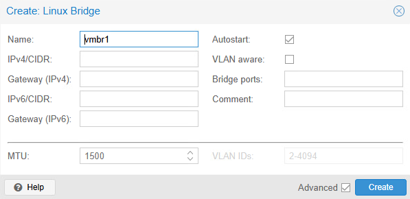
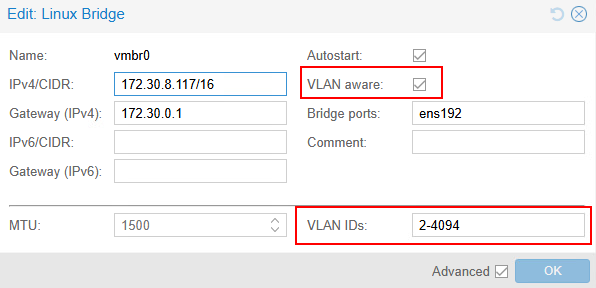
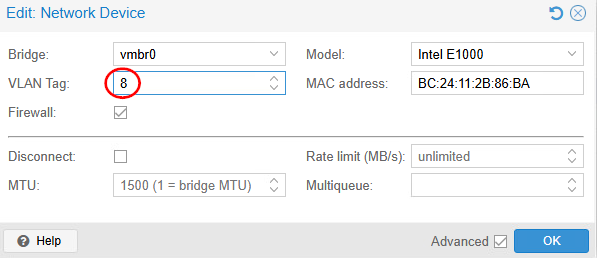

import useBaseUrl from '@docusaurus/useBaseUrl';
import ThemedImage from '@theme/ThemedImage';
import Tabs from '@theme/Tabs';
import TabItem from '@theme/TabItem';

# Cours 8

## Gestion de réseau sous Proxmox 🌐

**<span class="green-text fonttaller">Table des matières:</span>**
    1. [Architecture de réseau Proxmox](./00-cours8.md#architecture-de-réseau-proxmox)
    2. [Les bridges: le coeur du réseau](./00-cours8.md#les-bridges-le-coeur-du-réseau-)
    3. [Agrégation de liens (*bonding*)](./00-cours8.md#bonding)
    4. [VLANs et segmentation](./00-cours8.md#vlans-et-segmentation)
    5. [Software Defined Networks](./00-cours8.md#software-defined-networks-sdn)
    6. [Pare-feu](./00-cours8.md#pare-feux-proxmox-)

## Architecture de réseau Proxmox

Par défaut et dès son installation, Proxmox possède une configuration comme celle-ci:

```
         [Réseau externe]
                ↓
        [Serveur Proxmox]
                ↓
    [Interface physique (Ex: eno1)]
                ↓
          [Bridge vmbr0]
        ↙       ↓       ↘
    [VM1]       [VM2]       [VM3]
```

Cette architecture en couches permet:
- **Flexibilité :** Ajouter/supprimer des VMs sans affecter les autres
- **Isolation :** Chaque VM a son propre segment réseau virtuel
- **Performance :** Le bridge ne transmet que le trafic nécessaire
- **Évolutivité :** Facile d'ajouter des bridges pour différents usages

## Les bridges: le coeur du réseau 🧡

Les *bridges* constituent le coeur du fonctionnement du réseau sous Proxmox. Il est donc essentiel de comprendre leur fonctionnement. Le *bridge* Linux fonctionne un peu de la même façon qu'un commutateur intelligent. Son comportement varie selon les données qu'il possède:

- **Mode apprentissage:** Au début, le bridge ne sait rien. Quand une VM envoie un paquet, il note "VM-A est connectée sur le port 1 avec l'adresse MAC XX:XX:XX:XX:XX:XX".
- **Mode transmission:** Quand un paquet arrive pour cette MAC, il sait exactement où l'envoyer.
- **Mode flood:** Si la destination est inconnue, il envoie le paquet partout (comme si quelqu'un criait sur l'étage de votre immeuble de bureaux 😉).

### Configuration d'un bridge basique

```bash
auto vmbr0
iface vmbr0 inet static
    address 192.168.1.100/24     # IP du serveur Proxmox
    gateway 192.168.1.1          # Passerelle vers Internet
    bridge-ports ens18           # Interface physique attachée
    bridge-stp off               # Spanning Tree désactivé
    bridge-fd 0                  # Pas de délai d'apprentissage
```

**<span class="fonttaller">Explications ligne par ligne:</span>**
- `auto vmbr0`: Le bridge démarre automatiquement au boot
- `iface vmbr0 inet static` : Configuration IP statique
- `address` : L'IP que vous utilisez pour administrer Proxmox
- `gateway` : Par où sortir pour aller sur Internet
- `bridge-ports ens18` : L'interface physique "branchée" sur ce bridge
- `bridge-stp off` : Désactive le protocole anti-boucle (*Spanning-Tree*)
- `bridge-fd 0` : Pas de délai avant d'activer le port

**<span class="fonttaller">Bridges multiples: pourquoi et comment ?</span>**

Les *bridges* permettent de créer des réseaux isolés les uns des autres. Imaginons une entreprise où nous voudrions séparer:

- Le réseau de la production (clients)
- Le réseau d'administration (serveurs internes)
- Le réseau de développement (tests)

**Solution:** <u>Créer 3 bridges différents</u>

```bash
# Bridge de production (avec accès Internet)
auto vmbr0
iface vmbr0 inet static
    address 192.168.1.100/24
    gateway 192.168.1.1
    bridge-ports ens18          # Interface physique relié

# Bridge d'administration (isolé)
auto vmbr1
iface vmbr1 inet static
    address 10.0.1.1/24
    bridge-ports none           # Pas d'interface physique

# Bridge de développement (isolé)
auto vmbr2
iface vmbr2 inet static
    address 10.0.2.1/24
    bridge-ports none           # Pas d'interface physique
```

**Résultat:**
- ***VMs* sur vmbr0:** Accès internet direct
- ***VMs* sur vmbr1:** Communication entre elles seulement
- ***VMs* sur vmbr2:** Communication entre elles seulement

:::note
Les *bridges* peuvent se créer directement dans l'interface graphique de Proxmox. Cependant vous n'aurez pas accès à toutes les options (l'activation ou non du *spanning-tree* par exemple).


:::

**<span class="fonttaller">Le paramètre bridge-stp : quand l'utiliser ?</span>**

**STP (Spanning Tree Protocol)** évite les boucles réseau.
**Exemple de boucle** : Imaginez deux switches connectés par deux câbles. Sans STP, un paquet pourrait tourner en boucle indéfiniment.

**Dans Proxmox :**

`bridge-stp off` : ✅ Recommandé dans la plupart des cas (plus rapide)<br/>
`bridge-stp on` : ⚠️ Uniquement si vous avez plusieurs chemins réseau physiques

## Types de réseaux dans Proxmox

### Réseau Bridge (mode par défaut) 🌉:

Comme nous l'avons vu ci-dessous, ce mode permet d'accéder au même réseau que l'hyperviseur Proxmox tout en isolant les communications de chaque *VM*. C'est l'équivalent de *l'accès par pont (bridged)* dans VMware Workstation.

### Réseau NAT

C'est comme si créait un réseau propre aux machines virtuelles à l'intérieur de Proxmox. Celles-ci ont encore un accès à internet, mais par l'intermédiaire de l'adresse IP de Proxmox.

:::caution
Si vous avez besoin que votre machine virtuelle soit accessible depuis l'extérieur du réseau interne à Proxmox, le NAT n'est pas une bonne idée.
:::

**Exemple de configuration d'un *bridge* avec NAT**

Dans la configuration ci-dessous, `vmbr0` possède une configuration par défaut classique. `vmbr1` possède une configuration en réseau interne classique. La différence se situe au bas des configurations, avec les commandes `post-up` et `post-down`.

`post-up`: Ces commandes sont exécutées une fois que l'interface est qualifiée de *up* (opérationnelle).<br/>
`post-down` : Vous l'avez surement deviné; ces commandes sont exécutées une fois que l'interfaces est qualifiée de *down* (éteinte/désactivé).

**Signification des commandes:**

```
post-up echo 1 > /proc/sys/net/ipv4/ip_forward
```

- `post-up` → à exécuter une fois la carte réseau active
- `echo 1 >` → écrire la valeur 1
- `/proc/sys/net/ipv4/ip_forward` → fichier concerné

On écrit donc la valeur 1 dans le fichier `/proc/sys/net/ipv4/ip_forward`. Ce fichier permet d'activer le *forwading* des paquets dans Proxmox, ce qui est obligatoire pour faire du *NAT*.

- `post-up` → à exécuter une fois la carte réseau active
- `iptables -t nat` → iptables est le pare-feu par défaut sous Debian. Ici on veut agir sur la table de règles *nat*
- `-A POSTROUTING` → La chaine de règles se nomme *POSTROUTING*. Une chaine de règles est un ensemble de règles tout simplement. Ici on vient en ajouter une à l'ensemble. De là la lettre `-A`
- `-s 192.168.100.0/24 -o vmbr0` → Ici on indique le sens dans lequel le `nat` doit fonctionner: `-s` : source des paquets `-o` : leur sortie.
- `-j MASQUERADE` → On intervient directement sur les paquets en changeant l'ip source de ceux-ci.

La dernière commande, celle qui débute par `post-down`, ne sert qu'à éviter le dédoublement de la première règle en cas de problème. On supprime donc la règle lorsque la carte se désactive.

```bash
auto vmbr0
iface vmbr0 inet static
    address 10.0.0.10/24
    gateway 10.0.0.1
    bridge-ports ens18  

auto vmbr1
iface vmbr1 inet static
    address 192.168.100.1/24
    bridge-ports none
    bridge-stp off
    bridge-fd 0
    post-up echo 1 > /proc/sys/net/ipv4/ip_forward
    post-up iptables -t nat -A POSTROUTING -s 192.168.100.0/24 -o vmbr0 -j MASQUERADE
    post-down iptables -t nat -D POSTROUTING -s 192.168.100.0/24 -o vmbr0 -j MASQUERADE
```

### Réseau interne (isolé)

Comme son nom l'indique bien, il s'agit d'un réseau isolé totalement isolé du réseau extérieur. **<span class="red-text">Attention:</span>** Cela ne veut pas dire qu'on ne peut pas fournir un accès à internet à travers un réseau interne.

Voici un exemple:

<div style={{textAlign: 'center'}}>
    <ThemedImage
        alt="Schéma"
        sources={{
            light: useBaseUrl('/img/Virtu/ConfigMultiBridges_W.svg'),
            dark: useBaseUrl('/img/Virtu/ConfigMultiBridges_D.svg'),
        }}
    />
</div>

Dans l'exemple ci-dessus, `vmbr0` possède une configuration par défaut, c'est-à-dire qu'il est direcment branché au même réseau physique que Proxmox. `vmbr1` possède une configuration en réseau interne. Néanmoins, pfsense (virtualisé) qui est branché sur les deux réseaux, peut très bien faire office de solution de *natting* et offrir un accès internet aux clients du réseau branchés sur `vmbr1`.

## *Bonding* 

Le *bonding* permet ni plus ni moins de fusionner plusieurs interfaces physiques dans une seule dans l'objectif d'améliorer les performances ou d'offrir de la redondance.

Proxmox offre les méthodes d'agrégation suivantes:

**<span class="fonttaller">Balance-rr (*round-robin*)</span>**<br/>
Distribue les paquets à travers les interfaces. L'objectif est d'augmenter au maximum la bande-passante.

**<span class="fonttaller">Active-Backup (*failover*)</span>**<br/>
Proxmox se tournera vers la seconde interface seulement si la première est en problème.

**<span class="fonttaller">Balance-tlb (*transmit load balancing*)</span>**<br/>
Distribue intelligemment le trafic sortant en fonction de la charge de chaque interface. Le trafic entrant arrive par l'interface active principale.

**<span class="fonttaller">Balance-alb (*adaptative load balancing*)</span>**<br/>
Combine le balance-tlb avec l'équilibrage de charge en réception. Offre les meilleures performances mais nécessite des pilotes réseau spécialisés.

**<span class="fonttaller">802.3ad LACP</span>**<br/>
Permet l'aggrégation de liens compatible avec plusieurs commutateurs physiques selon la norme IEEE 802.3ad

:::caution
Une machine virtuelle (ou un conteneur) ne peut jamais être relié directement à un *bond*. Il vous faudra créer un *bridge* qui sera attaché à vos cartes réseaux agrégés. Ce *bridge* pourra ensuite être utilisé pour vos machines virtuelles et vos conteneurs.

<div style={{textAlign: 'center'}}>
    <ThemedImage
        alt="Schéma"
        sources={{
            light: useBaseUrl('/img/Virtu/Bonding_W.svg'),
            dark: useBaseUrl('/img/Virtu/Bonding_D.svg'),
        }}
    />
</div>
:::

## VLANs et segmentation 

La segmentation des réseaux possède plusieurs avantages, je ne vous apprends rien. Proxmox possède la capacité de gérer cette segmentation via les *VLANs*. Les *VLANs* possèdent un net avantage sur l'utilisation de *bridge* multiples dans Proxmox. Les *bridges* n'existent que dans le système Proxmox, alors que les *VLANs* peuvent être paramétrés pour une utilisation externe à Proxmox (Switch L3, Routeur, etc).

### Configuration des VLANs dans Proxmox

La première étape consiste à activer l'utilisation de *VLANs* sur le *bridge* concerné. Cette activation permettra aux paquets qui entrent et sortent de Promox d'être identifiés à l'aide d'un *tag*. Si vous omettez de cocher cette case, vous ne serez pas en mesure d'utiliser les *VLANs*.

Par exemple, si nous voulions activer les *VLANS* depuis `vmbr0`, nous devrions procéder commme suit:

```bash
auto vmbr0
iface vmbr0 inet static
    address 192.168.1.100/24
    bridge-ports ens18
    bridge-stp off
    bridge-fd 0
    bridge-vlan-aware yes    # Cette ligne active les VLANs !
    bridge-vids 2-4094       # Précise les VLANs supportés (ici tous)
```

Sinon via l'interface graphique:



La deuxième étape, consiste tout simplement à éditer la carte réseau de votre machine virtuelle ou de votre conteneur pour indiquer le *tag* à utiliser. Tout le trafic sortant de cette machine sera alors *taggé* avec le numéro du *VLAN*.



<u>Nous verrons un peu plus loin qu'il est également possible de configurer l'utilisation de *VLANs* via *SDN*</u>

### Création d'interface virtuelle dans Proxmox.

Il est également possible de créer des interfaces virtuelles correspondant aux VLANs directement sur l'hôte Proxmox. Ceci est utile si vous voulez que Proxmox lui-même communique sur un VLAN spécifique.

**<span class="fonttaller">Configuration d'interfaces *VLAN*</span>**<br/>
```bash
# Interface VLAN 10
auto vmbr0.10
iface vmbr0.10 inet static
    address 192.168.10.1/24

# Interface VLAN 20
auto vmbr0.20
iface vmbr0.20 inet static
    address 192.168.20.1/24
```

### Proxmox en tant que routeur

Nous en parlions un peu plus haut, utiliser des *VLANs* pour segmenter le réseau au sein de Proxmox offre la possibilité d'utiliser ces mêmes *VLANs* à l'extérieur de l'hyperviseur, dans le monde physique. Or, qu'il s'agisse de *VLANs* ou de *bridge*, Proxmox peut très bien faire office de routeur et de pare-feu.

*IPTables*, le pare-feu avancé de *Debian* peut amplement jouer ce rôle. Pour concrétiser cette théorie, analysons un exemple ensemble.

Imaginons le scénario tel que présenté ci-dessous 👇

<div style={{textAlign: 'center'}}>
    <ThemedImage
        alt="Schéma"
        sources={{
            light: useBaseUrl('/img/Virtu/Vlans_W.svg'),
            dark: useBaseUrl('/img/Virtu/Vlans_D.svg'),
        }}
    />
</div>

**Dans la situation actuelle:**
- Le PC A et le PC B peuvent communiquer. Ils n'ont aucun accès externe.
- Le PC C et le PC D peuvent communiquer. Ils n'ont aucun accès externe non plus.
- Le PC E ne peut communiquer pas communiquer avec les PCs A,B,C et D. Cependant il a un accès internet.

Pour offrir un accès internet via un *NAT* sur `vmbr0` et router les paquets entre les *VLANs*, il faudrait configurer Proxmox comme suit:

**<span class="fonttaller">Étape 1: Activer le routage IP</span>**

Modifier le fichier `/etc/sysctl.conf` et décommentez la ligne 28:

```bash
22 # Uncomment the next line to enable TCP/IP SYN cookies
23 # See http://lwn.net/Articles/277146/
24 # Note: This may impact IPv6 TCP sessions too
25 #net.ipv4.tcp_syncookies=1
26
27 # Uncomment the next line to enable packet forwarding for IPv4
28 net.ipv4.ip_forward=1
29
30 # Uncomment the next line to enable packet forwarding for IPv6
31 #  Enabling this option disables Stateless Address Autoconfiguration
32 #  based on Router Advertisements for this host
33 #net.ipv6.conf.all.forwarding=1
```
Appliquez les configurations avec la commande suivante:

```bash
sudo sysctl -p
```

**<span class="fonttaller">Étape 2: Ajouter les règles NAT</span>**

Ajoutez les règles suivantes dans IPTables en prenant pour acquis que `VLAN 10` = 192.168.10.0 et que `VLAN 20` = 192.168.20.0 :

```bash
sudo iptables -t nat -A POSTROUTING -s 192.168.10.0/24 -o vmbr0 -j MASQUERADE
sudo iptables -t nat -A POSTROUTING -s 192.168.20.0/24 -o vmbr0 -j MASQUERADE
```

**<span class="fonttaller">Étape 3: Ajouter les règles de *FORWARDING*</span>**

***Forwarding* inter-vlans**
```bash
sudo iptables -A FORWARD -i vmbr0.10 -o vmbr0.20 -j ACCEPT
sudo iptables -A FORWARD -i vmbr0.20 -o vmbr0.10 -j ACCEPT
```

***Forwarding* vers le web**
```bash
# Vlan10
sudo iptables -A FORWARD -i vmbr0.10 -o vmbr0 -j ACCEPT
sudo iptables -A FORWARD -i vmbr0 -o vmbr0.10 -m state --state RELATED,ESTABLISHED -j ACCEPT

# Vlan20
sudo iptables -A FORWARD -i vmbr0.20 -o vmbr0 -j ACCEPT
sudo iptables -A FORWARD -i vmbr0 -o vmbr0.20 -m state --state RELATED,ESTABLISHED -j ACCEPT
```
:::danger[Aucune sauvegarde auto. des règles]
Les règles dans IPTables ne sont pas sauvegardées automatiquement et c'est volontaire. C'est pour vous permettre de revenir à un état fonctionnel dans le cas où vous feriez de grosses gaffes (ce que les étudiants ne font jamais 😉). **Néanmoins, cela peut aussi vous jouer des tours!** Si vous redémarrez Proxmox et que vous n'avez pas sauvegardé vos règles dans IPTables, tout sera à recommencer.

Pour sauvegarder vos règles, utilisez la commande suivante:
```bash
sudo iptables-save > /etc/iptables/rules.v4
```
:::

Une fois ces configurations mises en place dans IPTables. Les ordinateurs du schéma présenté ci-dessus pourront communiquer entre eux et accéder à internet derrière l'IP de Proxmox.

## Software Defined Networks (SDN)

Dans un réseau dit traditionnel, les équipements sont gérés individuellement et de manière indépendante. À titre d'exemple, si vous vouliez créer un nouveau *VLAN* dans un commutateur, il fallait faire aussi éditer manuellement la configuration des autres appareils pour ajouter ce même *VLAN*. Cette manière de procéder est longue et peut facilement être la source de plusieurs erreurs.

<div style={{textAlign: 'center'}}>
    <ThemedImage
        alt="Schéma"
        sources={{
            light: useBaseUrl('/img/Virtu/TradNet_W.svg'),
            dark: useBaseUrl('/img/Virtu/TradNet_D.svg'),
        }}
    />
</div>

**La solution?** Le *SDN (Software Defined Network)*. Cette technologie permet de centraliser la configuration et la gestion de l'ensemble des équipements réseaux. Plus besoin de se connecter individuellement chaque équipement. On se connecte sur un contrôleur qui nous permettra de distribuer la configuration à l'ensemble des équipements. Certains *SDN* ont été très popularisés par la gestion de réseaux WiFi, notamment celui de l'entreprise Ubiquity et celui de TP-Link.

<div style={{textAlign: 'center'}}>
    <ThemedImage
        alt="Schéma"
        sources={{
            light: useBaseUrl('/img/Virtu/SDN_W.svg'),
            dark: useBaseUrl('/img/Virtu/SDN_D.svg'),
        }}
    />
</div>

### Pourquoi SDN dans Proxmox ?

L'intégration de cette technologie dans Proxmox est assez récente. Elle avait pour objectif de centraliser l'administration de réseaux virtuels entre les différents noeuds d'un cluster.

Imaginez par exemple que administrez 3 noeuds distincts dans un *cluster*. Le *SDN* vous permettra de créer un réseau virtuel dans un noeud et celui-ci sera automatiquement ajouté aux autres noeuds également. Ce qui facilite grandemment la gestion des différentes machines virtuelles et des conteneurs. 

Le *SDN* est donc particulièrement intéressant lorsque nous avons plusieurs noeuds. Dans le cadre du cours, nous n'aborderons pas les *SDN* en profondeur, tout simplement par manque de temps. Cela dit, je vous

### Architecture SDN

**<span class="fonttaller">1. Les zones</span>**<br/>
Vous pouvez imaginer les **zones** commme un contenant où l'on retrouvera votre réseau logiciel et ses opérations. Lorsque vous créez une zone, vous définissez comment votre réseau logiciel devrait agir. Voici les types de zones que vous retrouverez sous Proxmox:
- *Simple* Zone: C'est une zone de base qui n'existera que dans un seul noeud.
- *VLAN* Zone: S'intègre avec votre infrastructure *VLAN*
- *QinQ* Zone: Permet d'ajouter une couche *VLAN* sur un *VLAN* (*nesting*)
- *VXLAN/EVPN* Zone: Permet de créer des zones multi-noeuds.

**<span class="fonttaller">2. Les VNets</span>**<br/>
Les **VNets** vivent au sein d'une zone et agissent comme un commutateur virtuel. On peut donc y relier des machines virtuelles directement. C'est sur les *VNets* que nous configurerons le *VLAN tagging* ou le *DHCP* par exemple.

**<span class="fonttaller">3. IPAM</span>**<br/>
**IPAM** signifie *IP Address Management*. Ce module fera le suivi des adresses IP dans vos réseaux logiciels. Vous y définirez les plages d'adresses IP, la passerelle pour tout vos *Vnets* et Proxmox sera en mesure de savoir quelle machine virtuelle possède quelle *IP*.

:::caution[Paquets supplémentaires requis]
Pour utiliser toutes les options disponibles dans *SDN* sous Proxmox, il vous faudra installer deux paquets supplémentaires **sur chaque noeud**:

1. **dnsmasq**
    ```bash
    apt install dnsmasq # Installation
    systemctl disable --now dnsmasq # Ne pas lancer automatiquement au démarrage
    ```

2. **FRRouting**
    ```bash
    apt install frr-pythontools # Installation
    systemctl enable frr.service # Lancement automatique
    ```
:::

### Exemple d'architecture SDN complète

Voici une configuration en *SDN* valide pour une entreprise avec des environnements développement, test et production qui utilise également des *VLANs* à travers son infrastructure physique:

```
Zone: "enterprise-network" (type VLAN)
├── VNet: "prod-web" (VLAN 10)
│   └── Subnet: 192.168.10.0/24
├── VNet: "prod-app" (VLAN 20)  
│   └── Subnet: 192.168.20.0/24
├── VNet: "prod-db" (VLAN 30)
│   └── Subnet: 192.168.30.0/24
├── VNet: "test-web" (VLAN 40)
│   └── Subnet: 192.168.40.0/24
└── VNet: "dev-all" (VLAN 50)
    └── Subnet: 192.168.50.0/24
```

**Avec cette approche:**
- Création d'une nouvelle VM : sélection du VNet, IP automatique
- Ajout d'un environnement : création rapide de nouveaux VNets
- Migration de VM : transparente entre nœuds
- Audit : vision globale de l'architecture réseau


## Pare-feux Proxmox 🔥

Les pare-feux de Proxmox fonctionnent à l'aide **4 niveaux** bien distincts 😩:

1. **Niveau Datacenter:** Règles globales pour tout le cluster.
2. **Niveau Noeud:** Règles pour un serveur Proxmox en particulier.
3. **Niveau VM/Conteneur:** Règles spécifiques à chaque VM.
4. **Niveau Vnet (SDN):** Règles pour les réseaux virtuels SDN.

> *Oui mais Gabriel, dois-je configurer 4 pare-feux pour ma machine virtuelle ?*
>
> *-Les étudiants*

Je vous rasssure: **Non!**

Peu importe leur destination, les paquets ne franchiront jamais plus de deux pare-feux (du moins dans Proxmox). La gestion des pare-feux sous Promox peut rapidement devenir un véritable casse-tête. Ne vous attendez pas à être à l'aise dès vos premières manipulations, la logique est difficile au départ.

**Éléments clés à retenir:**

1. Le pare-feu Datacenter s'applique à TOUT le trafic entrant (provenant de l'extérieur).
2. Le pare-feu du noeud ne s'applique qu'au trafic entrant, sortant ou transigeant par Proxmox.
3. Les pare-feux *VNet* et *VM* sont mutuellement exclusifs:
    - *VM* sur *VNet* → Utilise les règles VNet ou du noeud.
    - *VM* classique → Utilise les règles *VM*

**Pour vous guider, voici une matrice qui vous aidera à déterminer le, ou les pare-feux en cause:**

| **SOURCE → / DESTINATION ↓** | **Internet/Externe** | **Réseau Local** | **VM VNet A** | **VM VNet B** | **VM Classique** | **Proxmox** |
|------------------------------|---------------------|------------------|---------------|---------------|------------------|-------------|
| **VM sur VNet A** | Datacenter → VNet A | Datacenter → VNet A | VNet A (interne) | VNet B → Nœud → VNet A | VM → Nœud → VNet A | Nœud → VNet A |
| **VM sur VNet B** | Datacenter → VNet B | Datacenter → VNet B | VNet A → Nœud → VNet B | VNet B (interne) | VM → Nœud → VNet B | Nœud → VNet B |
| **VM Classique** | Datacenter → VM | Datacenter → VM | VNet A → Nœud → VM | VNet B → Nœud → VM | VM → VM * | Nœud → VM |
| **Proxmox (8006/22)** | Datacenter → Nœud | Datacenter → Nœud | VNet A → Nœud | VNet B → Nœud | VM → Nœud | Nœud (local) |
| **Internet/Externe** | - | - | VNet A → Datacenter | VNet B → Datacenter | VM → Datacenter | Nœud → Datacenter |

**\* VM → VM** : Direct si même bridge, via **Nœud** si bridges différents