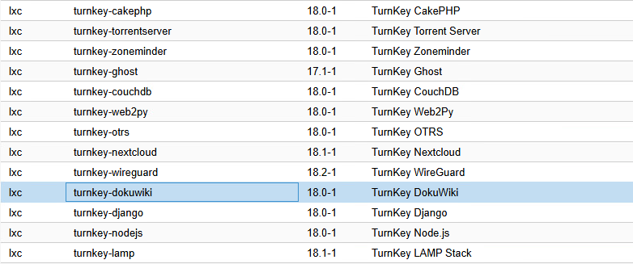

import useBaseUrl from '@docusaurus/useBaseUrl';
import ThemedImage from '@theme/ThemedImage';
import Tabs from '@theme/Tabs';
import TabItem from '@theme/TabItem';

# Cours 10

## Introduction aux conteneurs LXC 📦

**Qu'est-ce que LXC ?** 
LXC (*Linux Containers*) est une technologie de virtualisation au niveau du système d'exploitation qui permet d'exécuter plusieurs systèmes Linux isolés sur un seul hôte. Contrairement à la virtualisation complète, LXC utilise les fonctionnalités du noyau Linux pour créer des environnements isolés qui partagent le même noyau que l'hôte.

**Intégration dans Proxmox** 
Proxmox VE intègre nativement LXC, offrant une interface web intuitive pour gérer ces conteneurs. Cette intégration permet de créer, configurer et administrer facilement des conteneurs Linux légers.

:::tip[Le saviez-vous?]
LXC était l'environnement d'exécution par défaut de Docker avant d'être remplacé par libcontainer.
:::

## Fonctionnement des conteneurs LXC

Les conteneurs LXC reposent sur plusieurs technologies Linux fondamentales qui travaillent de concert pour créer un environnement virtualisé léger mais robuste:

### Namespaces: La base de l'isolation

Les namespaces sont des fonctionnalités du noyau Linux qui permettent d'isoler différents aspects du système entre les conteneurs. Chaque namespace crée une vue indépendante d'une ressource système spécifique :

|PID Namespace|Network Namespace|Mount Namespace|UTS Namespace|IPC Namespace|User Namespace|
|-------------|-----------------|---------------|-------------|--------------|--------------|
|Isolation des processus|Isolation du réseau|Isolation du système de fichiers|Isolation du nom d'hôte|Isolation de la communication inter-processus|Isolation des utilisateurs et des groupes|

### Control Groups: Limitent et contrôlent l'utilisation des ressources

- Limitation CPU, mémoire, I/O disque
- Priorisation des ressources
- Comptabilisation de l'utilisation

### Système de fichiers : Partage du noyau hôte

- Les conteneurs utilisent le même noyau que l'hôte
- Pas de virtualisation matérielle

## Comparaison LXC versus VM ⚖️

**Architecture 🏗️** 

|Aspect|Conteneurs LXC|Machines Virtuelles|
|------|--------------|-------------------|
|Noyau|Partagé avec l'hôte|Noyau indépendant|
|Hyperviseur|Pas nécessaire|Requis (KVM/QEMU)|
|Isolation|Niveau OS|Niveau matériel|
|Démarrage|Quasi-Instantané|Plusieurs secondes/minutes|

**Performances ⚡** 

|Conteneurs LXC|Machines virtuelles|
|--------------|-------------------|
|Performance quasi-native (pas d'émulation)|*Overhead* plus important|
|*Overhead* minimal|Émulation matérielle nécessaire|
|Partage direct des ressources système|Isolation plus forte mais plus coûteuse|
|Accès direct aux périphériques|Virtualisation complète du matériel|

**Sécurité 🚨** 

|Conteneurs LXC|Machines virtuelles|
|--------------|-------------------|
|Isolation basée sur les fonctionnalités du noyau|Isolation matérielle forte|
|Vulnérabilités du noyau partagées|Noyaux indépendants|
|Sécurité dépendante de la configuration|Sécurité par conception|
|⚠️ *Escape* possible vers l'hôte ⚠️| Attaques plus difficiles|

## Avantages des conteneurs LXC 👍

### Performances exceptionnelles

Les conteneurs peuvent démarrer en l'espace de quelques secondes. De plus, ils possèdent un accès direct au matériel, ce qui optimise et accélère grandemment l'accès aux ressources et aux périphériques.

### Efficacité des ressources

Sur un même serveur, vous serez en mesure d'exécuter beaucoup plus de conteneurs que de machines virtuelles. La mémoire vive sera également partagée avec un algorithme de détection de duplicata. En d'autres mots, si vous exécutez des 5 conteneurs LXC par exemple (avec le même OS), les librairies n'existeront qu'en une seule copie, capable de s'exécuter sur n'importe quel conteneur. Le fait qu'un noyau soit partagé évite également le gaspillage d'espace disque.

### Simplicité de gestion

La gestion peut aisément se faire via l'interface web de Proxmox ou même via son invite de commandes. Les déploiement sont rapides et il existe plusieurs modèles de conteneurs pré-configurés. Les *snapshots* sont ultra légers et très efficaces.

## Inconvénients des conteneurs LXC 👎

### Limitations techniques

Il est impossible d'utiliser un noyau différent de l'hôte d'une part. De plus, cette technologie ne prend en charge que les systèmes d'exploitation Linux. Cette solution n'est donc pas pour vous si vous vouliez mettre en place un conteneur de type Windows.

### Sécurité

Nous en avons parlé un peu plus haut, l'isolation est moins étanche qu'avec une vraie machine virtuelle. Les vulnérabilités du noyau hôte seront celles du conteneur LXC également. Les conteneurs privilégiés peut poser un risque encore plus accrue.

### Compatibilité

Certaines applications dites *legacy* (plus anciennes) nécessitent une machine virtuelle complète. L'installation de pilotes personnalisés, tel que nous l'avons fait avec les pilotes *virtio* est impossible dans les conteneurs LXC.

## Modèles disponibles

### Distributions principales

Proxmox fournit plusieurs modèles de conteneur pré-configurés et prêts à l'emploi. Vous y retrouverez des distributions populaires telles que **Ubuntu**, **Debian**, **CentOS**, **Fedora** et bien d'autres. Pour retrouver ces modèles, dirigez-vous dans votre stockage *local*, cliquez sur *CT Templates* puis sur *Templates*.

:::caution
L'utilisation d'un modèle pour la création d'un conteneur LXC est obligatoire. Vous ne pouvez pas créer un conteneur LXC depuis rien. Vous devrez, minimalement, choisir un OS sur lequel vous appuyer.
:::

### Applications pré-configurées

*Turnkey* est une organisation qui offre des modèles de conteneur LXC avec des applications prêtes à l'emploi à l'intérieur. Ainsi, en l'espace de quelques secondes ou de quelques clics, vous pouvez faire tourner un serveur web. Le plus beau ? C'est que *TurnKey* a intégré ces modèles à Proxmox.

