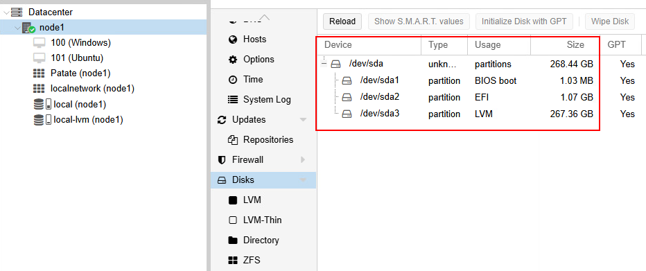
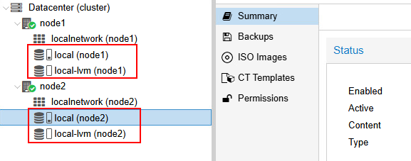
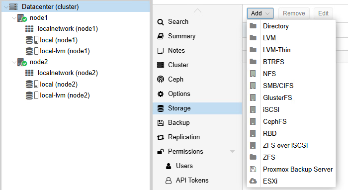
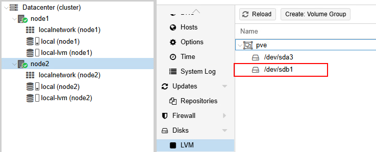

import useBaseUrl from '@docusaurus/useBaseUrl';
import ThemedImage from '@theme/ThemedImage';
import Tabs from '@theme/Tabs';
import TabItem from '@theme/TabItem';

# Cours 11

## Le stockage en virtualisation 💾

Contrairement à un ordinateur physique où vous avez un disque dur, dans Proxmox vous devez :

1. **Décider où** stocker vos VMs (quel disque physique ?)
2. **Choisir comment** les stocker (quel format ?)
3. **Gérer l'espace** entre plusieurs VMs
4. **Prévoir les sauvegardes** et les snapshots
5. **Optimiser les performances** selon vos besoins

À la fin de ce cours, vous saurez :
- **Comprendre** les différentes options de stockage
- **Choisir** la solution adaptée à vos besoins
- **Configurer** le stockage correctement
- **Résoudre** les problèmes courants

## LVM - *Logical Volume Manager*

Par défaut, Proxmox utilise la technologie `LVM` pour l'ensemble de ses stockages. `LVM` est une couche d'abstraction logicielle que l'on applique par-dessus la configuration **régulière** des disques durs. Sans `LVM`, une configuration avec deux disques durs pourrait ressembler à ceci:

<div style={{textAlign: 'center'}}>
    <ThemedImage
        alt="Schéma"
        sources={{
            light: useBaseUrl('/img/Virtu/disques_W.svg'),
            dark: useBaseUrl('/img/Virtu/disques_D.svg'),
        }}
    />
</div>

Avec `LVM`, on pourrait redécouper le tout, sans se soucier des disques ou même des partitions:

<div style={{textAlign: 'center'}}>
    <ThemedImage
        alt="Schéma"
        sources={{
            light: useBaseUrl('/img/Virtu/LVM_W.svg'),
            dark: useBaseUrl('/img/Virtu/LVM_D.svg'),
        }}
    />
</div>

Dans une architecture `LVM`, les disques physiques sont appelés des **PV** (*Physical Volume*). Un regroupement de disques se nomme un **VG** (*Volume Group*). Attention, un **VG** n'est pas obligatoirement l'hôte de plusieurs disques durs. En effet, un **VG** peut contenir un seul disque. Les **LV** (*Logical Volume*), constituent les emplacements disponibles pour utilisation.

Le problème avec la technologie `LVM` standard, c'est qu'elle ne supporte que le *Thick Provisionning*. Autrement dit, si vous désirez octroyer un disque dur virtuel de 500Go à une machine virtuelle, il vous faudra bloquer 500Go d'espace disque physique. Ce n'est pas très pratique et encore moins optimal lorsqu'on parle d'environnement virtuel.

## LVM - *Thin*

Voilà! La technologie *LVM-Thin* vient répondre à ce besoin, tout simplement à l'aide d'un *pool* de stockage partagé. Avec cette méthode, nous sommes capables de faire de l'allocation d'espace à la demande (*Thin-Provisionning*) et même de l'*over-provisionning*.

<div style={{textAlign: 'center'}}>
    <ThemedImage
        alt="Schéma"
        sources={{
            light: useBaseUrl('/img/Virtu/LVM-Thin_W.svg'),
            dark: useBaseUrl('/img/Virtu/LVM-Thin_D.svg'),
        }}
    />
</div>

Dans le schéma ci-dessus, vous remarquerez que le serveur Proxmox est équipé de deux disques durs de 500Go. Or, 700Go ont été alloués au total aux différentes machines virtuelles. <span class="yellow-text">Il sera donc primordial de surveiller l'utilisation de l'espace disque physique pour éviter des problèmes de corruptions et de manque d'espace.</span>

## Configuration par défaut

Voici comment est configuré et découpé le stockage d'une installation Proxmox standard. Pour l'exemple, prenons un simple disque de 250Go:

<div style={{textAlign: 'center'}}>
    <ThemedImage
        alt="Schéma"
        sources={{
            light: useBaseUrl('/img/Virtu/LVM-Thin-Tech_W.svg'),
            dark: useBaseUrl('/img/Virtu/LVM-Thin-Tech_D.svg'),
        }}
    />
</div>

*Cette configuration est visible depuis l'interface graphique:*


### Détails techniques ⚙️

- **SDA**: Le disque dur physique
- **SDA *N*** : Les partitions:
    - **SDA1**: BIOS Boot
    - **SDA2**: UEFI Boot
    - **SDA3**: LVM
- **Groupe de volumes**: Un seul groupe de volume(s) pour tout Proxmox.
- **Volumes logiques (standard)**:
    - *Swap*: Réservoire de débordement (RAM)
    - **/** : Le système d'exploitation de Proxmox
- **Thin pool**:
    - **pve-data_tmeta** : Les métadonnées pour les machines virtuelles. En fait, c'est ici qu'on stipulera combien d'espace une machine virtuelle possède virtuellement. Cet espace ne contient que des métadonnées, c'est-à-dire de l'information uniquement. Il n'est pas besoin d'être très gros.
    - **pve-data_tdata** : C'est le véritable emplacement où les données des machines virtuelles sont stockées.

*Dans l'interface graphique, vous pouvez voir en continu l'utilisation réelle du Thin Pool:*


### Pourquoi LVM 🤔

Proxmox utilise **LVM (Logical Volume Manager)** pour plusieurs raisons importantes, notamment liées à la flexibilité, la gestion des *snapshots* et la performance. Voyons cela en détail:

1. **Gestion des *snapshots* efficaces avec LVM:**<br/>
Lorsque nous créons un snapshot avec LVM, il utilise un mécanisme basé sur les copy-on-write (COW). Cela signifie que LVM n'écrit pas directement sur le volume original lors de la modification des données, mais enregistre uniquement les changements dans un volume de snapshot. Cela permet de conserver une image cohérente de l'état du volume au moment du snapshot, sans avoir à dupliquer l'intégralité des données.

2. **Flexibilité de gestion:**<br/>
LVM permet une gestion dynamique et flexible des volumes de stockage. Par exemple, il peut:
    - **Redimensionner les volumes à chaud. (sans éteindre la vm)**
    - **Fusionner ou fractionner des volumes logiques**

3. **Gestion des volumes dédiés pour chaque VM:**<br/>
Sous Proxmox, chaque machine virtuelle peut être configurée avec un volume logique LVM dédiée. Cela assure une isolation complète des données entre les *VMs*. Nous avons également abordé toute la notion de *thin provisionning* à ce sujet.

4. **Simplification du stockage:**<br/>
Dans un environnement de clustering Proxmox (avec plusieurs hôtes), LVM permet une gestion centralisée des volumes, ce qui facilite la gestion des sauvegardes, des migrations de VM, et du stockage partagé. De plus, Proxmox permet de configurer des volumes LVM sur un stockage réseau via iSCSI. Cela permet de centraliser le stockage et de simplifier l’extension des ressources de stockage à mesure que l’infrastructure se développe.

5. **Évolutivité:**<br/>
Avec LVM, il est beaucoup plus facile d'ajouter des volumes à mesure que la demande en stockage augmente. LVM nous permet d'ajouter de l'espace en ajoutant simplement un autre disque au groupe de volumes, ce qui rend l'ajout de stockage plus transparent et moins risqué.

## Types de contenu 🧐

Dans Proxmox, chaque stockage peut accepter certains types de fichiers. Ces types de fichier sont les suivants:

|Contenu|Description|
|------------------|--------------------|
|VM images|Disques durs virtuels des VMs|
|Container templates|Vos modèles pour créer des LXC|
|Images ISO|DVD d'installation pour OS|
|Backups|Sauvegardes des *VMs* et des conteneurs.|
|Snippets|Scripts de configurations personnalisées|

Pourquoi fait-on cette distinction entre les différents types de contenu ? Plusieurs raisons:

1. **Optimisation:** SSD rapide pour les *VMs*, HDD plus lent pour les sauvegardes.
2. **Sécurité:** Sauvegardes sur un serveur distant.
3. **Organisation:** ISOs regroupés dans un endroit.
4. **Partage:** Plusieurs serveurs Proxmox peuvent partager certains stockages.

## Stockages par défaut 

Tous les nœuds Proxmox possèdent deux endroits de stockage visibles dès l'installation: **Local** et **Local-LVM**.



Ces stockages sont en place pour accueillir différents éléments et nous allons voir ensemble pourquoi:

|Stockage|Type|Contenu|Explications|
|-----|-----|----------|-------------|
|**local**|**Dossier**|Sauvegarde, Fichiers ISOs, Modèles de conteneur|Ces contenus ne requièrent pas d'approvisionnement *Thin*. Un fichier ISO conserve toujours la même taille, de même qu'une sauvegarde ou un modèle de conteneur. Inutile donc de stocker ces éléments dans le *Thin-Pool*. Ce dossier est donc stocké dans le volume logique contenant le système d'exploitation Proxmox. Dans le *shell*, vous le retrouverez dans `/var/lib/vz`|
|**local-lvm**|**LVM-Thin**|Disques de machines virtuelles et de conteneurs|À l'inverse, ces contenus nécessitent un approvisionnement *Thin*. Nous voulons, par exemple, être en mesure de créer une machine virtuelle qui « pense » posséder un disque dur de 80Go, mais qui en réalité n'en a un de 15Go. Ces données sont conservées dans le *Thin-Pool*.|

## Création de stockage 🪄

Vous pouvez évidemment ajouter des emplacements de stockage supplémentaires dans Proxmox. Selon le niveau où vous créerez cet endroit de stockage, Proxmox le traitera différemment:

### Niveau Datacenter 🏬

Les emplacements de stockage créés au niveau du *datacenter* seront créés systématiquement sur tous les nœuds.



Vous reconnaitrez sans doute certains éléments dont nous avons discuté ensemble: **LVM, Directory et LVM-Thin**. D'autres vous sont peut-être moins familiers, comme **ZFS et BTRFS**, nous en reparleront un peu plus loin. Remarquez bien les icônes qui précèdent les termes:

📁 → Un dossier signifie qu'il s'agit d'un stockage local, sur les nœuds directement.

🏢 → Un immeuble signifie qu'il s'agit d'un stockage partagé sur le réseau, ou d'une technologie de stockage avancé.

💾 → La disquette est réservée à PBS (*Proxmox Backup Server*)

☁️ → Le nuage correspond au serveur ESXi, un hyperviseur de l'entreprise VMware que nous aborderons prochainement.

### Niveau Nœud 🪢

Au niveau d'un nœud, il est intéressant de constater la flexibilité qu'apporte une technologie comme `LVM`. À tout moment, vous pouvez simplement ajouter un disque dur, l'intégrer à la structure `LVM`, et vous voilà avec des l'espace supplémentaire pour vos machines virtuelles. Pour ce faire, sélectionnez le nœud concerné, et dirigez-vous dans la section *Disks*.

#### Exemple: Ajout d'un disque à la structure LVM

<span class="fonttaller">**Étape 1: Initialiser le nouveau disque**</span><br/>
Après avoir ajouté le disque dur à la machine, il faut l'initialiser pour pouvoir l'utiliser


<span class="fonttaller">**Étape 2: Créer une partition**</span><br/>
Malheureusement, pour cette étape, nous n'aurons d'autre choix que d'utiliser le terminal. Utilisez donc la commande suivante pour créer une seule partition couvrant la superficie totale (ou presque) du nouveau disque.
```bash
parted /dev/sdb mkpart primary 1024 100% #Le 1024 laisse de l'espace pour la table de partitionnement
```
:::caution
Pour créer la partition, vous aurez besoin d'installer le logiciel de partitionnement `parted`.
:::

<span class="fonttaller">**Étape 3: Ajouter le disque dur au groupe de volume**</span><br/>
Encore ici, nous utiliserons le terminal. Nous allons donc étendre notre groupe de volume pour inclure le nouveau disque dur comme suit:
```bash
vgextend pve /dev/sdb1
```
À cette étape, votre disque devrait apparaitre dans le groupe de volume **PVE**, visible depuis l'interface de Proxmox.


<span class="fonttaller">**Étape 4: Étendre le *ThinPool***</span><br/>
Rappelez-vous; le *thin pool* contient les données et les métadonnées de nos machines virtuelles. Il nous faudra donc réfléchir à l'espace attribuable aux données et aux métadonnées. Si vous voulez vous assurer de ne jamais manquer d'espace, je vous recommande d'attribuer 1% de l'espace de stockage aux métadonnées. Autrement dit, si nous ajoutons un disque de 250Go (ce qui est notre cas ici), il serait plus que raisonnable d'ajouter 25Go d'espace à nos métadonnées.

Commençons donc par augmenter l'espace de stockage réel. En laissant, 25Go d'espace aux métadonnées, il nous reste donc 225Go à attribuer:
```bash
lvresize -L 225G /dev/pve/data
```

Puis, on augmente l'espace attribué aux métadonnées:
```bash
lvresize --poolmetadatasize +25GB /dev/pve/data
```

## ZFS

ZFS est un véritable couteau suisse du stockage. Il combine

- Gestionnaire de disques (comme LVM)
- Système de fichiers
- Gestionnaire RAID
- Système de *snapshots*
- Vérification d'intégrité
- Compression
- Déduplication

ZFS a été mis en place pour répondre aux différentes problématiques que l'on rencontrait avec les espaces de stockage traditionnels:

|Problème|Résolution avec ZFS|
|--------|-------------------|
|Corruption de données|*Checksum* qui détecte automatiquement la corruption de données|
|*RAID hardware* : Panne du contrôleur = perte de tout|*RAID Software* sans contrôleur propriétaire|
|Snapshots lents |Snapshots instantanés (similaires à LVM)|
|Gaspillage d'espace: fichiers similaires stockés plusieurs fois|Compression/Déduplication: économie d'espace|

### Concepts

#### Pool 🏊‍♀️
Un pool ZFS est tout simplement un groupe de disques. C'est un peu l'équivalent du *VG* dans *LVM* (*Volume Group*). On implémentera généralement une technologie de redondance sur ce pool.

* * * 
<span class="green-text">*Stripe - RAID 0*</span>

<div style={{textAlign: 'center'}}>
    <ThemedImage
        alt="Schéma"
        sources={{
            light: useBaseUrl('/img/Serveurs1/Raid0_W.gif'),
            dark: useBaseUrl('/img/Serveurs1/Raid0_D.gif'),
        }}
    />
</div>

* * * 
<span class="green-text">*Mirror - RAID 1*</span>

<div style={{textAlign: 'center'}}>
    <ThemedImage
        alt="Schéma"
        sources={{
            light: useBaseUrl('/img/Serveurs1/Raid1_W.gif'),
            dark: useBaseUrl('/img/Serveurs1/Raid1_D.gif'),
        }}
    />
</div>

* * *
<span class="green-text">*RAID-Z1, RAID-Z2, RAID-Z3*</span>

<div style={{textAlign: 'center'}}>
    <ThemedImage
        alt="Schéma"
        sources={{
            light: useBaseUrl('/img/Serveurs1/Raid5_W.gif'),
            dark: useBaseUrl('/img/Serveurs1/Raid5_D.gif'),
        }}
    />
</div>

:::caution
Le nombre de disques nécessaires pour les différents niveaux de parité peut varier en fonction du RAID-Z utilisé. Pour plus de renseignements quant aux différents niveaux de RAID-Z, vous pouvez consulter [ce lien.](https://www.raidz-calculator.com/raidz-types-reference.aspx)
:::

#### Dataset

Un *dataset* pourrait être comparable à un dossier dans le *pool* ZFS.

Exemple:
```
tank/vmdata → Pour les VMs
tank/backup → Pour les sauvegardes
tank/media  → Pour les médias
```

#### Snapshot 📸

Évidemment, vous pourrez prendre des *snapshots* de vos *VMs*, mais plus impressionnant encore, c'est la capacité de ZFS de prendre un *snapshot* d'un *dataset* complet. Vous pourriez donc prendre un *snapshot* de toutes vos *VMs* le matin, puis un autre l'après-midi, en toute transparence, en une seule action à chaque fois.

### Inconvénients 👎

Malgré ses multiples avantages, ZFS présente certains inconvénients. Pour commencer, ZFS consomme beaucoup de mémoire vive. On recommande normalement 1Go de RAM pour 1To de stockage, c'est quand même beaucoup.

ZFS est également un peu plus complexe à maitriser et nécessite une bonne préparation avant de passer à l'action. La courbe d'apprentissage peut ajouter une charge de travail supplémentaire aux administrateurs.