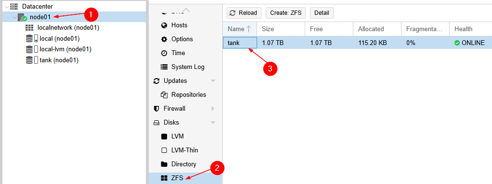
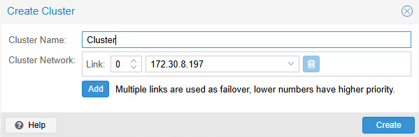
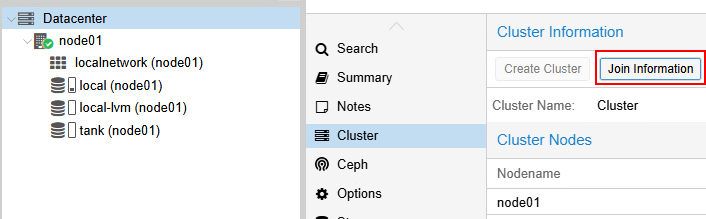
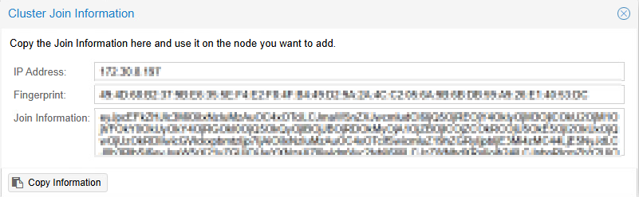
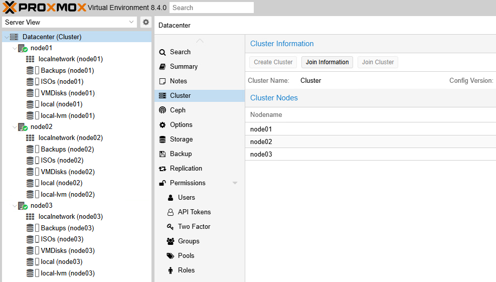

# Laboratoire 10

* * *

## Préparation de serveurs multiples pour *clustering*

## Préalables ✅

- Avoir consulté la théorie en lien avec ce cours.
- Avoir complété les laboratoires précédents.

## Objectifs 🎯

- Préparer 3 machines de types z440 pour créer un premier *Proxmox*
    - Récupérer les bons disques de la bonne taille
    - Planifier l'installation
    - Procéder à l'Installation

## Étapes de réalisation 🔢

### Préparation des systèmes

La première étape consiste à consulter le tableau ci-dessous qui décrit le nombre de stockage que vous devriez avoir dans chacun des noeuds:

:::tip
Pour rappel, la composition des équipes est disponible dans l'équipe Teams du cours
:::

|Équipe|Configuration des disques|
|:------:|-------------------------|
|Alpha|Pour chacune des trois tours du cluster:<br/>-2 Disques de 480Go (ZFS)<br/>-1 carte SD (système)|
|Bravo|Pour chacune des trois tours du cluster:<br/>-2 Disques de 480Go (ZFS)<br/>-1 carte SD (système)|
|Charlie|Pour chacune des trois tours du cluster:<br/>-2 Disques de 480Go (ZFS)<br/>-1 carte SD (système)|
|Delta|Pour chacune des trois tours du cluster:<br/>-2 Disques de 512Go (ZFS)<br/>-1 carte SD (système)|
|Echo|Pour chacune des trois tours du cluster:<br/>-2 Disques de 2To (ZFS)<br/>-1 carte SD (système)|

### Installation

Il vous faut maintenant procéder à l'installation de 3 systèmes Proxmox. Pensez donc à:

- Installer le système sur la carte SD, et rien d'autre (laissez les disques libres).
- Donnez des noms d'hôte et des adresses IP différentes. (utilisez les adresses appropriées)
- Créez les comptes PVE **<u> dans un seul système </u>**.
- Désactivez le compte `Root` au moment approprié.
- Créez vos comptes `PVE` et créez des comptes dans l'OS (installez sudo au besoin).

### Création des pools ZFS

L'interface web de Proxmox permet de créer des *pools* ZFS sans problème. Néanmoins, celle-ci ne permet pas la création du *pool* en *RAID0 (stripe)*. Nous utiliserons donc l'invite de commande pour créer notre *pool* ZFS.

**Création du pool ZFS en RAID0**:
```bash
zpool create tank /dev/sdb /dev/sdc # À ajuster selon vos propres disques
```

Une fois cette commandes complétée, vous devriez retrouver votre *pool* ZFS dans l'interface Web.




**Création des *datasets* (répertoire) dans notre pool ZFS**
```bash
zcreate tank/vmdisks    # Stockage pour nos VMs et conteneurs
zcreate tank/isos       # Stockage pour nos ISOs
zcreate tank/backups    # Stockage pour nos sauvegardes
```
:::caution[Prudence!]
**Attention!** Les *datasets* doivent posséder des noms identiques et respecter la casse.
:::

**Ajout des stockages ZFS dans l'interface Proxmox:**
```bash
pvesh create /storage --storage ISOs --type dir --path /tank/isos --content iso,vztmpl
pvesh create /storage --storage VMDisks --type zfspool --pool tank/vmdisks
pvesh create /storage --storage Backups --type dir --path /tank/backups --content backup
```

### Création du cluster Proxmox

Avant de créer le cluster Proxmox, assurez-vous d'avoir préalablement créé les stockages ZFS **sur tous les serveurs**. Choisissez, parmi vos stations de travail, laquelle sera le serveur maître. Il n'y a pas vraiment d'importance associé à ce titre, il en faut simplement un.

Dans l'interface web du serveur choisit, cliquez sur **Datacenter**, puis **Cluster**. Cliquez sur `Create Cluster` et baptisez votre nouveau groupe de serveurs:



Une fois le *cluster* créé, il vous faudra copier les informations de jonction dans les deux autres serveurs pour rejoindre le groupe:





Dans les deux autres serveurs, également dans le sous-menu *cluster*, vous pourrez y coller vos informations pour joindre le *cluster*.

Une fois que les serveurs seront ajoutés. Vous devriez pouvoir accéder à n'importe quel serveur Proxmox depuis l'une des interfaces web.

