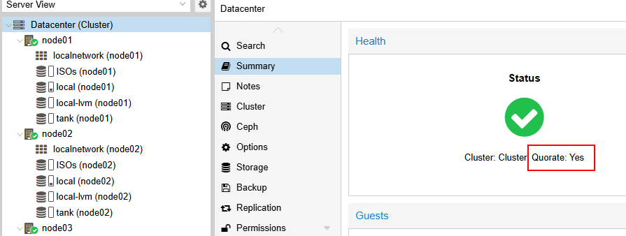

import useBaseUrl from '@docusaurus/useBaseUrl';
import ThemedImage from '@theme/ThemedImage';
import Tabs from '@theme/Tabs';
import TabItem from '@theme/TabItem';

# Cours 12

# Clustering Proxmox

* * *

## Cluster Proxmox, pourquoi ? 🤔

En fait, pour comprendre pourquoi il est essentiel de créer un cluster Proxmox en entreprise, il suffit d'imaginer ce qui pourrait se produire si nous n'en avions pas. Imaginons, par exemple, un serveur Proxmox hébergeant 10 machines virtuelles. Sans cluster on risquerait:

- **Une panne matérielle** : Carte mère grillée → Plusieurs jours d'arrêt
- **Maintenance** : Mise à jour du serveur → Interruption de service
- **Saturation** : Plus de ressources → Impossible d'ajouter des *VMs*

**<span class="fonttaller green-text">La solution : le cluster</span>**<br/>

Le *clustering*, c'est la création d'une équipe de serveurs qui travaillent ensemble en vue d'atteindre des objectifs communs. Cette façon de fonctionner comporte de nombreux avantages:

1. **Haute disponibilité:** Une *VM* redémarre ailleurs si son serveur hôte plante.
2. **Migration à chaud:** Déplacer une *VM* sans l'arrêter
3. **Maintenance sans interruption:** Redémarrer un serveur sans impact
4. **Gestion centralisée:** Un seul point d'administration
5. **Évolutivité:** Ajouter des serveurs facilement

```
Cluster Proxmox
├── Serveur 1 : VM 1, VM 4, VM 7
├── Serveur 2 : VM 2, VM 5, VM 8
└── Serveur 3 : VM 3, VM 6, VM 9

Si Serveur 1 tombe → VMs redémarrent automatiquement sur Serveur 2 ou 3 !
```

### Quand considérer le *clustering* ?

Vous DEVEZ considérer un *cluster* si:

- Vos applications ne peuvent pas s'arrêter (sites web, BDD critiques)
- Vous gérez plus de 5-10 VMs importantes
- Vous avez besoin de faire des maintenances sans interruption
- Votre entreprise dépend de ces VMs

## Qu'est-ce qu'un *cluster* ? 🚒

Règle général: J'aime bien les analogies. Ici, je vais vous comparer le *clustering* à une équipe de pompiers. Imaginez si la caserne de votre ville ne contenait qu'un seul pompier:

- Il peut éteindre qu'un seul feu à la fois.
- Advenant qu'il soit malade, il n'y a personne pour intervenir.
- S'il est déjà en intervention, il ne peut pas répondre pour un autre urgence.
- Sa force physique est limité.

Maintenant, avec trois pompiers, on change la dynamique:

- Si un pompier est indisponible, un autre prend le relais.
- Ils peuvent gérer plus d'un incendie à la fois.
- Ils se coordonnent par radio.
- Ils peuvent se partager de l'équipement.

**Le *clustering* c'est exactement ça, mais dans le domaine des technologies de l'information:**

1. Les serveurs Proxmox communiquent entre eux via ce qu'on appelle un *heartbeat* toutes les secondes 💓. En gros les serveurs veillent les uns sur les autres pour s'assurer que tout le monde va bien.
2. Les serveurs Proxmox partagent leurs informations à l'aide d'une base de données distribuée nommée Corosync ( [corosync comporte plusieurs services](https://fr.wikipedia.org/wiki/Corosync_Cluster_Engine) ). Cette base de donnée contient la liste des *VMs* ainsi que leur emplacement, l'état de santé de chaque noeud, la configuration du cluster, les ressources disponibles, etc.
3. Les serveurs prennent également des décisions collectivement. Par exemple, si le noeud #2 croit que le noeud #1 est en panne, un « vote » aura lieu entre les noeuds restant pour déterminer si oui, ou non, le noeud #1 est en panne. Si c'est le cas, d'autres actions s'initieront.

## Les composants d'un cluster Proxmox

### Les noeuds 🪢
Nous en avons déjà parlé, il s'agit des membres (serveurs) qui composent le groupe (*cluster*). Chaque serveur Proxmox dans un cluster est donc appelé un noeud (*node*).

### Corosync
Il s'agit d'un système de communication *open source* comprenant des fonctionnalités supplémentaires pour la mise en oeuvre de la haute-disponibilité. Il gère les *heartbeats* ainsi que la base de donnée répliquée, entre autre choses.

### Quorum 🗳️
Le quorum correspond à la majorité des serveurs. Lorsque des décisions critiques sont prises, comme redémarrez des *VMs* depuis un autre noeud, le quorum doit s'exprimer favorablement.

### Stockage partagé 
Un stockage accessible par tous les noeuds assure qu'une *VM* peut être démarré sur n'importe quel serveur.

* * *

|Un cluster n'est **PAS** ❌|Un cluster **EST** ✅|
|---------------------------|----------------------|
|Une sauvegarde. Un cluster ne remplace pas les *backups*| Une solution de haute disponibilité.|
|Une protection contre les erreurs humaines. Supprimer une *VM* la supprime partout| Une facilité de gestion centralisée.|
|Gratuit en ressources. Le *clustering* consomme des ressources physiques pour se coordonner.| Une protection contre les pannes matérielles.|
|Simple à maintenir. C'est plus complexe qu'un serveur unique.| Une capacité de migration à chaud.|

## Comment ça fonctionne ⚙️

### Architecture technique

Un cluster Proxmox repose sur 3 technologies clés:

1. **Corosync: La communication**

    ```
    Corosync = Le système nerveux du cluster

    Nœud 1 → "Heartbeat : Je suis vivant" → Nœud 2, Nœud 3
    Nœud 2 → "Heartbeat : Je suis vivant" → Nœud 1, Nœud 3
    Nœud 3 → "Heartbeat : Je suis vivant" → Nœud 1, Nœud 2

    Fréquence : Toutes les secondes
    Si pas de réponse après 10 secondes → Nœud considéré mort
    ```

2. **Corosync Configuration Database (corosync.conf)**
    ```
    Base de données distribuée qui stocke :
    ├── Configuration du cluster
    ├── Liste des nœuds
    ├── VMs et leur emplacement
    ├── Ressources HA
    └── Paramètres réseau

    Synchronisée automatiquement entre tous les nœuds
    ```

3. **Proxmox Cluster File System (pmxcfs)**
    ```
    Système de fichiers spécial monté sur /etc/pve/
    ├── Accessible en lecture/écriture sur tous les nœuds
    ├── Modifications répliquées automatiquement
    └── Contient toute la configuration du cluster

    Exemple : Créer une VM sur nœud 1 → Visible immédiatement sur nœud 2 et 3
    ```

### Flux de communication 📢

#### Exemple 1 : Création d'une VM
```
Vous cliquez sur "Créer VM" dans l'interface web
                        ↓
La requête arrive au nœud où vous êtes connecté
                        ↓
La configuration est écrite dans /etc/pve/qemu-server/100.conf
                        ↓
pmxcfs réplique automatiquement ce fichier vers les autres nœuds
                        ↓
Tous les nœuds voient la nouvelle VM instantanément
                        ↓
La VM démarre sur le nœud que vous avez choisi
```

#### Exemple 2: Quand un noeud tombe en panne
```
Nœud 1 ne répond plus aux heartbeats
                        ↓
Après 10 secondes, Nœud 2 et 3 le déclarent "mort"
                        ↓
Les VMs HA configurées sur Nœud 1 sont identifiées
                        ↓
Vote du quorum : "Doit-on redémarrer ces VMs ?"
                        ↓
Si quorum OK → Redémarrage automatique sur Nœud 2 ou 3
                        ↓
Services restaurés (downtime : ~2-3 minutes)`
```

### Les réseaux 🌐

Un cluster Proxmox utilise typiquement plusieurs réseaux:
- Le réseau du cluster lui-même (Corosync): Communication vitale (Ex: VLAN10 - 10.0.10.0/24)
- Réseau de stockage : Accès aux données partagées (Ex: VLAN20 - 10.0.20.0/24)
- Réseau de gestion : Interface web et SSH (Ex: VLAN 2 - 10.0.2.0/24)
- Réseau des VMs: Trafic des machines (Ex: VLAN30 - 10.0.30.0/24)

:::info
Il s'agit ni plus ni moins de considérer le *cluster* et son environnment intrinsèque dans votre segmentation lorsque vous mettez le tout en réseau.
:::

### Synchronisation (NTP) ⏱️

Tout comme pour *Active Directory*, la synchronisation des horloges est cruciale pour la communication entre les noeuds et la prise de décision. **<span class="yellow-text">On ne peut pas tolérer plus de 10 secondes de décalage!</span>** Autrement, il risque d'y avoir un décalage dans les différentes données sur les serveurs et cela risque de provoquer une corruption de ces mêmes données. On appelle ce phénomène le *split-brain* et nous devons l'éviter à tout prix.


## Le quorum: le coeur du cluster 🧡

Le **quorum**, c'est le nombre **minimum** de noeuds nécessaires pour que le cluster prenne des décisions. Pourquoi est-ce que c'est vital ? Pour éviter le *split-brain*. Imaginons un cluster composé de seulement 2 noeuds (**déjà, 2 noeuds ce n'est pas recommandé**).

Un problème de réseau survient et les deux noeuds deviennent incapables de communiquer:

```
    Noeud 1                       |           Noeud 2
        ↓                         |              ↓
"Je ne vois plus Noeud 2"         |  "Je ne vois plus Noeud 1"
        ↓                         |              ↓
"Noeud 1 est probablement down"   |  "Noeud 2 est probablement down"
        ↓                         |              ↓
"Je redémarre ses VMs"            |  "Je redémarre ses VMs"
        ↓                         |              ↓
---------------------------------------------------------------------
DÉSASTRE : VMs en double sur les noeuds, corruption des données!
```

**<span class="fonttaller green-text">La solution : le quorum (au moins 3 noeuds)</span>**<br/>

Reprenons le même problème de réseau, mais en y ajoutant un noeud:

```
    Noeud 1 isolé                      |      Noeud 2 & 3 communiquent
        ↓                              |              ↓
"Je ne vois plus Noeud 2 & 3"          |     "Je ne vois plus Noeud 1"
        ↓                              |              ↓
"Noeud 2 & 3 sont probablement down"   |     "Noeud 1 est probablement down"
        ↓                              |              ↓
"1 seul vote = pas de quorum"          |     "2 votes = quorum atteint"
        ↓                              |              ↓
"Ne peut agir, attend"                 |     "Redémarrent les VMs de Noeud1 "
```

>*Oui mais Gabriel, est-ce que ça veut dire que je ne peux pas avoir un cluster de deux noeuds en aucune circonstance ?*
>
>*-Les étudiants*

Bonne question! Vous pouvez effectivement avoir un cluster de deux noeuds sans problème. Néanmoins, il vous faudra ajouter ce que l'on nomme un **QDevice**.

### Le QDevice: Le juge de paix ☮️

Un **QDevice** est tout simplement une petite machine (vm, raspberry, conteneur) qui ne servira qu'à voter lorsque le cluster cherchera à obtenir le **quorum**. **<span class="red-text">Évidemment, n'installez PAS un QDevice en tant que VM sur l'un des noeuds du cluster!</span>** Ce n'est pas une bonne pratique puisque si une panne matérielle devait arriver sur ce noeud, deux votes du quorum serait automatiquement perdu.

#### Installation d'un QDevice

Sur la machine Linux qui sera QDevice:

```bash
sudo apt install corosync-qnetd         #Installation du package

sudo systemctl enable corosync-qnetd    #Démarrage automatique du service
sudo systemctl start corosync-qnetd     #Démarrer le service dès maintenant
```

Puis sur un dès noeuds Proxmox:

```bash
pvecm qdevice setup 192.168.1.100       # IP du QDevice
```

### État du quorum

L'état du quorum est visible directement dans l'interface web du *cluster*:



Ou via l'invite de commande:

```bash
pvecm status
```