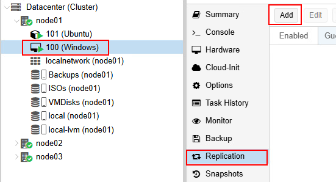
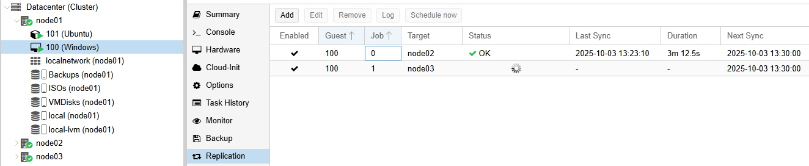
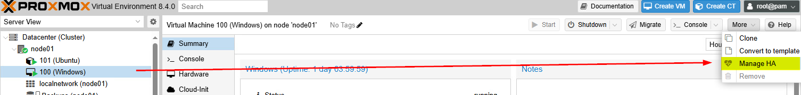
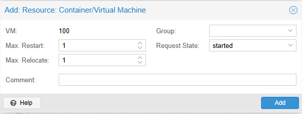

# Laboratoire 11

* * *

## Premiers tests de réplication et HA

## Préalables ✅

- Avoir consulté la théorie en lien avec ce cours.
- Avoir complété le laboratoire précédent et posséder un cluster fonctionnel avec stockage ZFS

## Objectifs 🎯

- Expérimenter la réplication de conteneurs et de conteneurs
- Observer la réaction du cluster en cas de panne d'un noeud

## Étapes de réalisation 🔢

### Installation d'une VM Windows et d'un conteneur Linux

Sur le noeud Proxmox de votre choix, procédez à l'installation d'au moins une **VM** sous Windows et d'un conteneur **LXC**. Je vous laisse le soin de configurer les paramètres convenablement. Au stade où nous en sommes dans le cours, vous devriez être à l'aise et être en mesure de reconnaître les bons paramètres pour vos machines.

:::tip
*pssst: Donnez un id qui correspondra au noeud original de la VM. Exemple: VM**1**00 (Noeud 1)*
:::

Une fois les machines virtuelles et conteneurs installés, effectuez une première sauvegarde et un premier *snapshot*.

### Configuration de la réplication

**Rappelez-vous:** ZFS possède un système intégré de réplication. Comme nous avons mis en place un cluster de serveurs, nous pouvons créer des tâches de réplications sur nos machines virtuelles et/ou conteneurs. Ainsi, en cas de problème, les machines pourront être redémarrées depuis un autre noeud. C'est le point de départ de la **haute-disponibilité** en matière de virtualisation.

Sélectionnez votre machine virtuelle ou votre conteneur et cliquez sur `Replication`, puis `Add`

Créer une réplication vers **tous les noeuds** à chaque 15 minutes.

Attendez que les tâches de réplications aient été éxécutées et observez le contenu des stockages ZFS du stockage **VMdisks**.

- Est-ce que les *snapshots* ont été répliqués ?
- Est-ce que les *sauvegardes* ont été répliqués ?

### Haute-disponibilité de base

Cliquez sur votre machine virtuelle et/ou votre conteneur linux. Dans le menu `more`, cliquez sur `Manage HA`:

Dans la fenêtre qui s'ouvre, vous aurez accès à différents champs de configuration:

**Max. Restart:** Il s'agit du nombre de fois maximum où le noeud tentera de démarrer la *VM* avant de la relocaliser. 
**Max. Relocate:** Il s'agit du nombre de relocalisation maximum avant abandon. 
**Group:** Permet d'associer la *VM* ou le conteneur à un groupe de haute-disponibilité. Nous en reparlerons prochainement.
**Request State:** L'état dans lequel la machine doit être restaurée.

Configurez 3 redémarrages, puis 3 relocalisations pour votre machine virtuelle et votre conteneur. Une fois que ce sera fait, forcez un arrêt sur le noeud contenant les deux appareils virtuels (soit en maintenant le bouton d'alimentation ou littéralement en tirant le câble d'alimentation).

Vos deux appareils virtuels devraient repartir en l'espace de quelques minutes sur l'un des deux autres noeuds. Observez le phénomène et calculez le temps nécessaire à se réajustement.