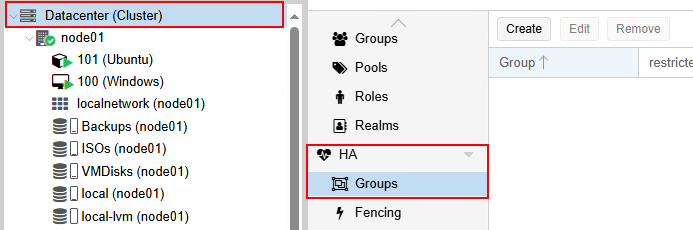
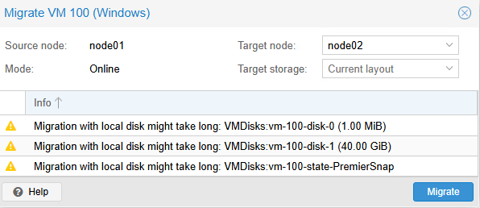
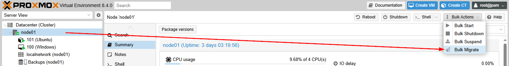

import useBaseUrl from '@docusaurus/useBaseUrl';
import ThemedImage from '@theme/ThemedImage';
import Tabs from '@theme/Tabs';
import TabItem from '@theme/TabItem';

# Cours 13

# Haute-Disponibilité

* * *

## Qu'est-ce que la haute-disponibilité ?

La haute-disponibilité est la capacité d'un système informatique à rester opérationnel et accessible presque 100% du temps, visant à réduire ou éliminer les temps d'arrêt. Dans le contexte de Proxmox, on cherche à éviter l'arrêt des appareils virtuels.

Lors du dernier laboratoire, vous avez déjà expérimenté quelques paramètres en lien avec la haute-disponibilité dans Proxmox. Aujourd'hui, nous nous attarderons à certains éléments que nous n'avons toujours pas abordés.

## Les groupes HA 💓

En production, dans une entreprise, les noeuds Proxmox peuvent se multiplier rapidement. Certains de ces noeuds peuvent être plus puissants, posséder plus ou moins de mémoire vive ou posséder des caractéristiques précises qui les distinguent des autres. Dans un contexte de haute-disponibilité, où les machines virtuelles peuvent être posséder différentes services et être relocalisées rapidement, nous pourrions vouloir faire en sorte que certaines *VMs* demeurent sur des noeuds précis. C'est exactement à ce besoin que viennent répondre les groupes.

Dans le schéma ci-dessous, à titre d'exemple, trois groupes de haute-disponibilité ont été créés:

    <ThemedImage
        alt="Schéma"
        sources={{
            light: useBaseUrl('/img/Virtu/GroupeHA_W.svg'),
            dark: useBaseUrl('/img/Virtu/GroupeHA_D.svg'),
        }}
    />

Les machines virtuelles et conteneurs peuvent être attitrées à ces groupes. Si une machine virtuelle s'exécutant sur le **noeud C** doit être relocalisé, elle le sera sur le noeud A ou B seulement.

### Créer des groupes

Pour créer des groupes de haute-disponibilité dans Proxmox, il vous suffit de cliquer sur `Datacenter`, puis de cliquer sur `Groups` dans la section `HA`.

## Fencing 🚧

L'expression *fencing* réfère au mot clôture en anglais (*fence*). On pourrait donc traduire le terme *fencing* par le verbe clôturer. Ça consiste à quoi le *fencing* exactement ? Lorsqu'un noeud perd le quorum pendant 60 secondes ou plus, un *watchdog* (logiciel de surveillance) force le redémarrage du noeud. Lorsqu'un noeud faisant parti d'un cluster redémarre, la première chose qu'il tente d'effectuer, c'est de vérifier s'il a le quorum. Dans le cas où il ne l'aurait pas, aucune *VM* ou conteneur identifié **HA** ne sera démarré.

### Pourquoi c'est ainsi ?

On cherche à tout prix d'éviter de créer un *split-brain*, c'est-à-dire, des noeuds qui ne communiquent plus entre-eux et qui écrivent tous les deux sur une seule machine virtuelle. Cela pourrait causer une corruption importante au niveau des données. On verra cependant, qu'on peut simplifier la chose, particulièrement avec du stockage partagé.

>*Donc il n'y a pas vraiment de configuration à mettre en place pour le fencing Gabriel ?*
>
>*-Les étudiants*

Non, pas vraiment. Dès que vous créez un cluster Proxmox, le *fencing* logiciel s'enclanche automatiquement. Par contre, c'est ce que l'on nomme du *soft-fencing*.

### Soft 🪶 & Hard 🔨 fencing

Nous pourrions cependant configurer ce que l'on nomme du **Hard-Fencing**. Cette technologie fonctionne avec le matériel des serveurs et nécessite donc certains types de matériel très précis. Le **Hard-Fencing** utilisera l'iLO, l'iDRAC ou l'interface de gestion à distance du serveur spécifique pour littéralement l'arrêter. Ainsi, le serveur ne pourra pas corrompre les données des machines virtuelles ou des conteneurs présents dans son environnement.

## Migration 

Évidemment, il ne faut pas obligatoirement une panne pour migrer une machine virtuelle ou un conteneur vers un autre noeud. On pourrait, pas exemple, vouloir transférer les machines virtuelles et les conteneurs vers un autre noeud en vue d'effectuer une maintenance sur un noeud particulier. Proxmox offre différents types de migration auxquels nous allons nous attarder un peu.

### Hors ligne (*Offline*)

En mode *offline*, la machine virtuelle ou le conteneur est d'abord arrêté. Si la machine virtuelle ou le conteneur possède un stockage local, on devra transférer ensuite le disque virtuel vers un autre noeud, puis on pourra redémarrer la machine. Cette méthode accuse un temps d'arrêt important. Or, si la machine virtuelle est stocké sur un élément de stockage partagé, la dynamique change complètement puisqu'on oubliera alors le transfert de données. Le temps d'arrêt sera raccourci de beaucoup.

### En ligne (*online*)

En mode *online*, on découpe le travail en trois phases:
- **PHASE 1:** Copie du disque dur pendant que la machine virtuelle tourne toujours.
- **PHASE 2:** Pendant la copie initiale, la machine virtuelle a subit des changements par les utilisateurs. On procède donc a une copie incrémentale.
- **PHASE 3:** Bascule finale. Une pause de quelques secondes sera nécessaire pour officialiser les changements et démarrer la machine virtuelle sur son nouveau noeud.

Dans tous les cas, vous pouvez procéder à la pièce, ou migrer plusieurs machines virtuelles d'un seul coup (*bulk migrate*)

### À la pièce 🧩

Pour effectuer la migration d'une seule machine virtuelle, il vous suffit de sélectionner la machine virtuelle en question puis de cliquer sur `Migrate`, en haut à droite.

Comme ma machine virtuelle est en marche, Proxmox me propose une migration *online* d'emblée.  Remarquez les avertissement ⚠️ que Proxmox m'énumère.

- Migration with local disk might take long: VMDisks:vm-100-disk-0 (1.00 MiB)
- Migration with local disk might take long: VMDisks:vm-100-disk-1 (40 GiB)
- Migration with local disk might take long: VMDisks:vm-100-state-PremierSnap

Ces avertissements là sont très vrais. Normalement, avec des stockages locaux, une migration comme celle-ci pourrait être longue. Cependant, dans notre cas (je réfère aux laboratoires ici), on a mis en place une tâche de réplication récurrente grâce à notre utilisation de **ZFS**. Proxmox va donc se comporter légèrement différemment ici. En effet, Proxmox détectera qu'une réplication existe sur le noeud de destination et ne copiera que les changements récents (moins de 15 minutes dans notre cas).

### En vrac 🧺

Pour évacuer tous les appareils virtuels d'un noeud, mieux vaut utiliser la migration en vrac (*bulk migrate*) Pour ce faire, sélectionnez le noeud qui doit être évacué, sélectionnez `Bulk Actions`, puis `Bulk Migrate`.

De là, vous serez amené à choisir le noeud de destination ainsi que d'autres paramètres.

## Le stockage partagé : La clé du cluster 🗝️

Le stockage partagé est le meilleur moyen d'assurer de la haute-disponibilité dans un environnement comme Proxmox. Mais pourquoi ?

    <ThemedImage
        alt="Schéma"
        sources={{
            light: useBaseUrl('/img/Virtu/StockageLocal_W.svg'),
            dark: useBaseUrl('/img/Virtu/StockageLocal_D.svg'),
        }}
    />

Dans le schéma ci-dessus 👆, que se passerait-il dans le cas où le noeud A venait qu'à s'éteindre parce qu'on son bloc d'alimentation est défecteux ? Comme la *VM* 100 est stocké sur ce noeud qui est maintenant inutilisable, il nous serait impossible de récupérer la *VM* 100.

>*Wow, un instant Gabriel, le ZFS n'assurait-il pas la réplication ?*
>
>*-Les étudiants*

Bonne remarque! Mais ZFS demeure facultatif à la mise en *cluster*. Donc quelqu'un pourrait très bien créer un *cluster* sans ZFS. Est-ce que ce serait une bonne chose ? Définitivement pas, je ne le recommanderais pas. Néanmoins, comme pour beaucoup d'autres mauvaises pratiques, on en croise sur le terrain.

Vous l'aurez donc devinez, ZFS peut palier à cette situation, mais ce n'est pas encore parfait et je vous explique pourquoi. Outre le fait que ZFS consomme **É-NOR-MÉ-MENT** de ressources, ses tâches de réplication se font à des périodes déterminées. D'ailleurs ces périodes devront être déterminées en fonction de plusieurs autres paramètres comme la vites du réseau, la grosseur du disque à répliquer, etc.

Cela veut donc dire que même si vous optez pour le système ZFS et sa réplication, vous pourriez vous retrouver avec une certaine perte de données telle que décrit dans la mise en situation ci-dessus. C'est pourquoi, **le stockage partagé reste la meilleure solution.**

    <ThemedImage
        alt="Schéma"
        sources={{
            light: useBaseUrl('/img/Virtu/StockagePartage_W.svg'),
            dark: useBaseUrl('/img/Virtu/StockagePartage_D.svg'),
        }}
    />

Dans le schéma ci-dessus, les noeuds utilisent un stockage partagé. Advenant un incident majeur, comme la perte d'un noeud, il n'y aurait aucun transfert à effectuer, un autre noeud du *cluster* n'aura qu'à démarrer la machine virtuelle depuis le même stockage qu'utilisait le noeud tombé en panne.

### Les principaux types de stockage partagé

#### NFS (Network File System)

**NFS** est généralement utilisé sur des serveurs de type NAS. Le stockage est alors accessible directement via le réseau et facilement configurable dans Proxmxox.

**Avantages:** 
✓ Simple à configurer 
✓ Compatible 
✓ Bon pour des *VMs* peu sollicitées

**Inconvénients:** 
✗ Point unique de défaillance (le NAS) 
✗ Performance limitée par le réseau 
✗ Pas de redondance native

#### CEPH RBD (RADOS Block Device)

CEPH utilise une méthode de distribution de block de stockage entre tous les noeuds. On pourrait comparer cela au *striping* d'un RAID, mais ici, on étalonne sur les serveurs plutôt que sur une grappe de disques.

**Avantages :** 
✓ Haute disponibilité native 
✓ Pas de point unique de défaillance 
✓ Scalable (ajout de disques facile) 
✓ Snapshots et clones

**Inconvénients :** 
✗ Complexe à configurer 
✗ Nécessite au moins 3 nœuds 
✗ Consomme beaucoup de ressources 
✗ Réseau 10Gbps obligatoire

#### iSCSI

iSCSI permet d'utiliser du stockage sur le réseau (SAN) comme s'il était local.

**Avantages :** 
✓ Performance excellente 
✓ Matériel dédié robuste 
✓ Snapshots et réplication

**Inconvénients :** 
✗ Très couteux (matériel) 
✗ Configuration complexe 
✗ Point unique de défaillance (sauf SAN HA) 

#### Résumé

|**Critère**|**NFS**|**Ceph RBD**|**iSCSI**|
|-----------------|--------|---------------|-----------|
|**Complexité**|⭐⭐⭐⭐⭐ Très simple| ⭐ Très complexe|⭐⭐⭐ Moyenne|
|**Performance**|⭐⭐ Moyenne|⭐⭐⭐⭐ Élevée|⭐⭐⭐⭐⭐ Excellente|
|**Haute disponibilité native**| ❌ Non | ✅ Oui | ❌ Non*|
|**Noeuds minimum**|1 (NAS externe)|3|1 (SAN externe)|
|**Réseau requis**|1 Gbps min. 10 Gbps recommandé|10 Gbps recommandé|10 Gbps recommandé|
|**RAM requise**|Minimal|1GB/TB|Minimal|
|**Snapshots**|✅ Oui|✅ Oui|⚠️ Dépend du SAN|
|**Thin Provisionning**| ⚠️ Via qcow2 | ✅ Oui | ⚠️ Dépend du SAN|
|**Déduplication**|❌ Non|⚠️ Optionnelle| ⚠️ Dépend du SAN|
|**Compression**|❌ Non|✅ Oui|⚠️ Dépend du SAN|
|**Coût**|Faible|Faible|Très élevé|
|**Scalabilité**|⭐⭐ Limitée|⭐⭐⭐⭐⭐ Excellente|⭐⭐⭐ Bonne|
|***Use case* idéal**|PME, Home Lab|Production, Cloud|Entreprise|

