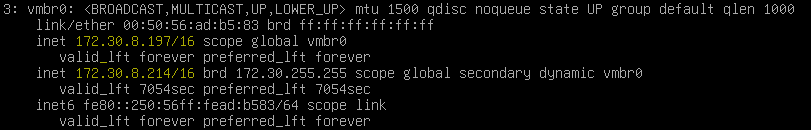

# TP1 - 20%

* * *

# Date de remise : <span class="red-text">19 Octobre 2025 , 23h59</span>

* * *

## Contexte du TP

- **Environnement:** Cluster Proxmox avec **3 noeuds**
- **Scénario:** Vous êtes administrateur système d'une entreprise qui souhaite mettre en place une infrastructure virtualisée robuste avec haute disponibilité

:::caution
Afin que tout le monde puisse faire son propre TP, <u>**vous devez le faire sur LabInfo**</u>. Prenez note qu'il est possible de cloner des serveurs Proxmox dans LabInfo, mais il faut suivre une procédure à la lettre pour que cela fonctionne. Je vous donne cette procédure un peu plus bas.
:::

## Étapes de réalisation 🔢

### Créer vos serveurs Proxmox

Pour compléter le TP, vous aurez besoin respectivement de <span class="red-text">3 noeuds.</span> Chacun de ces noeuds doit posséder les caractéristiques suivantes:

- Processeur de 4 coeurs
- 16 Go de RAM
- 1 disque dur de 40Go (système)
- 2 disques durs de 250Go (stockage ZFS)
- 1 carte réseau branché sur `Accès Internet N`

Installez Proxmox convenablement une première fois. <span class="yellow-text">Prenez soin de donner un nom d'hôte convenable! Ex: Node1</span>.

#### Cloner un serveur Proxmox

Pour cloner un serveur Proxmox, suivez les étapes suivantes:

1. Assurez-vous que le serveur source soit fonctionnel et **neuf!** (pas de *VM*, de conteneur ou de stockage de configuré).
2. Éteignez le serveur source, puis procédez au clonage dans LabInfo.
3. Démarrez la machine nouvèlement cloné.
4. Lorsque le système aura démarré, forcez l'obtention d'une nouvelle IP via dhcp.

    ```bash
    dhclient #Relance le processus DHCP
    ```
5. Vous vous retrouverez temporairement avec deux adresses IP. Soit l'originale provenant du Proxmox originalement cloné ainsi qu'une nouvèlement obtenu. Il nous faut donc relâcher les deux adresses, puis renouveler de nouveau.

    

    ```bash
    dhclient -r #Relâchement des adresses
    ```
    ```bash
    dhclient #Renouvèlement
    ```

    :::tip
    Pour une raison que j'ignore, Proxmox n'accepte pas de relâcher l'adresse qui provient de la machine source avant d'obtenir une nouvelle adresse IP.
    :::

    **<span class="yellow-text">Notez bien l'adresse que vous avez obtenu!</span>**

6. Éditez le fichier `/etc/network/interfaces` et modifiez l'IP associée au bridge

    ```yaml title='/etc/network/interfaces' showLineNumbers
    auto lo
    iface lo inet loopback

    iface ens192 inet manual

    auto vmbr0
    iface vmbr0 inet static
            address 172.30.8.214/16     # Cette adresse!!
            gateway 172.30.0.1          # La passerelle au besoin
            bridge-ports ens192
            bridge-stp off
            bridge-fd 0
            
    source /etc/network/interfaces.d/*
    ```
7. Éditez le fichier `/etc/hosts` et modifiez l'ip et le nom d'hôte

    ```yaml title='/etc/hosts' showLineNumbers
    127.0.0.1 localhost.localdomain localhost
    172.30.8.214 node02.gabriel.local node02  # Modifiez cette ligne

    # The following lines are desirable for IPv6 capable hosts

    ::1     ip6-localhost ip6-loopback
    fe00::0 ip6-localnet
    ff00::0 ip6-mcastprefix
    ff02::1 ip6-allnodes
    ff02::2 ip6-allrouters
    ff02::3 ip6-allhosts
    ```

8. Supprimez le contenu du dossier `/etc/pve/nodes/template`

    ```bash
    rm -rf /etc/pve/nodes/template
    ```

9. Supprimez le fichier `/etc/machine-id`

    ```bash
    rm -f /etc/machine-id
    ```

10. Supprimez le fichier `/var/lib/dbus/machine-id`

    ```bash
    rm -f /var/lib/dbus/machine-id
    ```

11. Générez un nouvel identifiant unique pour le noeud

    ```bash
    dbus-uuidgen --ensure=/etc/machine-id
    ```

12. Définissez le nouveau nom de la machine

    ```bash
    hostnamectl set-hostname Node02
    ```

13. Voilà! Redémarrez le nouveau noeud et il sera prêt à être utilisé.

### Étape 1 : **ZFS** (10 points)

Sur chacun des noeuds:

- Créer un pool **ZFS** (*2 points*)
- Créer les datasets suivants: (*8 points*)

    |Nom|Type|Contenu|
    |---|----|-------|
    |`vm-prod`|ZFS|Disques durs des *VMs* de la production|
    |`vm-dev`|ZFS|Disques durs des *VMs* des développeurs|
    |`backups`|Directory|Fichiers de sauvegarde|
    |`templates`|ZFS|Disques durs des *VMs* modèles(*templates*)|

**<span class="fonttaller green-text">Livrables pour cette étape:</span>**

- Sortie de `zpool list` montrant le pool ZFS créé dans chaque noeud.
- Sortie de `zfs list` montrant les datasets créés dans chaque noeud.
- Captures d'écran de la configuration des storages dans Proxmox.

### Étape 2 : **Utilisateurs et permissions** (15 points)

Créer les groupes suivants: (3 points)

- `admins-infra`: Administrateurs complets
- `ops-backup`: Équipe responsable des sauvegardes
- `devs-junior`: Développeurs avec accès limité

Créer les utilisateurs suivants dans le realm PVE: (4 points)

- `admin1@pve` (membre de `admins-infra`)
- `backup-ops@pve` (membre de `ops-backup`)
- `dev1@pve` (membre de `devs-junior`)

Configurer les permissions suivantes: (8 points)

- Le groupe `admins-infra` doit avoir tous les droits sur `/`
- Le groupe `ops-backup` doit pouvoir:
    - Voir toutes les *VMs*
    - Gérer les sauvegardes (création, restauration, suppression)
    - Accéder au stockage de backup uniquement
- Le groupe `devs-junior` doit pouvoir, sur le pool `dev-pool` uniquement :
    - Démarrer/arrêter les *VMs*
    - Accéder à la console (l'écran des *vms*)
    - **NE PAS** pouvoir supprimer ou créer des *VMs*

**<span class="fonttaller green-text">Livrables pour cette étape:</span>**

- Captures d'écran de la configuration des permissions.
- Captures d'écran des différents tests démontrant un accès ou une interdiction.

### Étape 3: **Gestion des VMs et des Pools** (20 points)

Créer les pools de ressources suivants (3 points):

- `prod-pool`: *VMs* de production
- `dev-pool`: *VMs* de développement
- `backup-pool`: *VMs* de test de restauration

Créer et configurer les *VMs* suivantes (12 points):

|**VM**|**Pool**|**OS**|**vCPU**|**RAM**|**Disque**|**Stockage ZFS**|**Particularités**|
|------|--------|------|--------|-------|----------|----------------|------------------|
|web-prod-01|prod-pool|Ubuntu/Debian|2|2GB|20GB|vm-prod|- Doit être HA<br/>- 2 interfaces réseaux (2 *bridges* distincts)<br />- Démarrage automatique|
|db-prod-01|prod-pool|Ubuntu/Debian|4|4GB|40GB|vm-prod|- Doit être HA<br/>- Démarrage automatique avec délai de 30 secondes|
|dev-test-01|dev-pool|Alpine/Debian|1|1GB|10GB|vm-dev|- Non-HA|

Créer également un *template* à partir d'une *VM* de base (au choix) nommé `template-base-debian` sur le dataset `templates`

**<span class="fonttaller green-text">Livrables pour cette étape:</span>**

- Captures d'écran de chaque *VM* avec sa configuration
- Sortie de la configuration d'une *VM* ( `qm config <vmid>` )
- Liste des pools avec leurs *VMs* assignées
- Vérification du dataset ZFS utilisé pour chaque *VM* ( `zfs list -t all | grep <vmid>` )

### Étape 4: **Sauvegardes et rétention** (25 points)

Créer les tâches de sauvegarde suivantes (15 points):

**<span class="fonttaller">Tâche 1</span>**

- Nom: `backup-prod-daily`
- Cible: Toutes les *VMs* du pool `prod-pool`
- Destination: Stockage `backups` (dataset ZFS)
- Mode: Snapshot
- Compression: ZSTD
- Planification: Tous les jours à 2h00
- Rétention:
    - Conserver les 7 derniers backups quotidiens
    - Conserver les 4 derniers backups hebdomadaires
    - Conserver les 3 derniers backups mensuels

**<span class="fonttaller">Tâche 2</span>**

- Nom: `backup-dev-weekly`
- Cible: Toutes les *VMs* du pool `dev-pool`
- Destination: Stockage `backups` (dataset ZFS)
- Mode: Stop
- Compression: LZO (rapide)
- Planification: Tous les dimanches à 4h00
- Rétention: Conserver uniquement les deux derniers backups

Tests de sauvegarde et de restauration (10 points):

- Lancer manuellement un backup de `web-prod-01`
- Restaurer ce backup en tant que nouvelle *VM* nommée `web-prod-01-restore` dans le pool `backup-pool`
- Vérifiez l'intégrité de la *VM* restaurée (démarrage,configuration réseau)
- Observer l'impact de la compression ZFS sur la taille des backups

**<span class="fonttaller green-text">Livrables pour cette étape:</span>**

- Captures d'écran de la configuration de chaque job de backup
- Liste des backups disponibles pour chaque VM
- Documentation du processus de restauration avec captures d'écran
- Analyse de l'espace disque utilisé par les backups (avant/après compression)

### Étape 5: **Réplication et Migration** (10 points)

Migration de *VMs* (5 points):

- Effectuer une migration à chaud (*online*) de `web-prod-01` vers un autre noeud.
- Effectuer une migration à froid (*offline*) de `dev-test-01` vers un autre noeud.
- Documenter les différences entre les deux méthodes et les conditions requises.

Réplication ZFS (5 points):

- Configurer une tâche de réplication ZFS pour `db-prod-01` vers un autre nœud
- Planification : Toutes les 15 minutes
- Lancer manuellement une réplication et vérifier qu'elle fonctionne
- Vérifier la présence du snapshot de réplication sur le nœud cible avec zfs list -t snapshot
- Expliquer la différence entre la réplication et la sauvegarde

**<span class="fonttaller green-text">Livrables pour cette étape:</span>**

- Sortie de la commande `pvecm status`
- Captures d'écran des migrations en cours
- Configuration de la réplication avec logs de succès
- Sortie de `zfs list -t snapshot` sur les noeuds source et cible
- Documentation comparative: migration vs réplication vs backup

### Étape 6: **Haute-Disponibilité** (20 points)

Configuration HA (8 points):

- Activer la haute disponibilité pour `web-prod-01` et `db-prod-01`
- Configurer les groupes HA avec les priorités suivantes:
    - `web-prod-01`: priorité 100
    - `db-prod-01`: priorité 200 (plus critique)
- Définir la politique de redémarrage: max 3 tentatives
- Vérifier que la réplication ZFS est active pour les *VMs* HA

Test de basculement (8 points):

- **Test1**: Arrêter brutalement une *VM* HA et observez son comportement
- **Test2**: Simuler une panne de noeud
    - Documenter le temps de détection et de redémarrage
    - Vérifiez les logs HA (`/var/log/pve-ha-lrm.log` et `/var/log/pve-ha-crm.log`)
    - Observez comment HA utilise la réplication ZFS pour redémarrer la ou les *VMs*

Analyse et optimisation (4 points):

- Expliquer les prérequis pour que HA fonctionne (quorum, réplication ZFS, etc.)
- Documenter les limitations observées
- Proposer un scénario où HA ne fonctionnerait PAS et expliquer pourquoi
- Analyser l'importance de la réplication ZFS dans le mécanisme de HA

**<span class="fonttaller green-text">Livrables pour cette étape:</span>**

- Configuration HA avec captures d'écran
- Logs des tests de basculement avec timestamps
- Séquence de captures montrant le basculement automatique
- Rapport d'analyse des prérequis et limitations

## Format du livrable final 📖

Un document Word structuré contenant:

1. Page de présentation (nom, date, cours, etc.)
2. Table des matières
3. Pour chaque partie:
    - Captures d'écran annotées
    - Commandes utilisées (notamment les commandes ZFS)
    - Explications
    - Résultats des tests au besoin
4. Conclusion personnelle sur vos apprentissages et les défis rencontrés.

## Grille d'évaluation ✅

|Critère|Points|Détails|
|-------|:------:|--------|
|**<span class="green-text">Partie 1</span>**||<span class="green-text">ZFS</span>|
|Création du pool|2|-Commande `zpool list` (**1 pt**)<br/>-Documentation claire (captures d'écran et explications) (**1 pt**)|
|Création des *datasets*|8|-Structure complète avec les 4 *datasets* requis (**4 pts**)<br/>-Nomenclature cohérente et appropriée (**2 pts**)<br/>-Commandes ZFS utilisées justes (**2 pts**)|
|**<span class="green-text">Partie 2</span>**||<span class="green-text">Utilisateurs et permissions</span>|
|Création des groupes|3|-3 groupes créés avec les bons noms (**3 pts**)|
|Création des utilisateurs|4|-3 utilisateurs dans le realm PVE (**3 pts**)<br/>-Assignation aux bons groupes (**1 pt**)|
|Permissions admins-infra|2|-Groupe a tous les droits sur `/` (**2 pts**)|
|Permissions ops-backup|3|-Droits de lecture sur toutes les *VMs* (**1 pt**)<br/>-Gestion complète des backups (**1 pt**)<br/>-Restriction correcte au storage backup uniquement (**1 pt**)|
|Permissions devs-junior|2|-Droits limités au pool dev-pool uniquement (**1 pt**)<br/>-Restrictions correctes: démarrage/console sans création/suppression (**1 pt**)|
|Tests et validation|1|-Connexion testée et validée avec chaque utilisateur (**1 pt**)|
|**<span class="green-text">Partie 3</span>**||<span class="green-text">VMs et Pools</span>|
|Création des pools|3|-3 pools créés (**2 pts**)<br/>-Organisation logique et pertinente (**1 pt**)|
|VM web-prod-01|3|-Configuration complète selon les spécifications (**2 pts**)<br/>-Sur le bon dataset ZFS (**1 pt**)|
|VM db-prod-01|3|-Configuration complète selon les spécifications (**2 pts**)<br/>-Sur le bon dataset ZFS (**1 pt**)|
|VM dev-test-01|3|-Configuration complète selon les spécifications (**2 pts**)<br/>-Sur le bon dataset ZFS (**1 pt**)|
|Double interface réseau|2|-Web-prod-01 avec 2 interfaces réseau configurées (**2 pts**)|
|Démarrage automatique|2|-Les *VMs* de prod ont un démarrage automatique avec un délai de 30 secondes entre les deux (**2 pts**)|
|Création template|1|-template-base-debian créé sur *dataset* templates (**1 pt**)|
|Documentation|3|-Captures d'écran claires de chaque *VM* (**1 pt**)<br/>-Sortie de qm config fourni (**1 pt**)<br/>-Vérification datasets ZFS (zfs list) (**1 pt**)|
|**<span class="green-text">Partie 4</span>**||<span class="green-text">Sauvegardes et rétention</span>|
|Configuration stockage backup|2|-*Dataset* backup configuré (**1 pt**)<br/>-Espace disponible documenté (**1 pt**)|
|Tâche backup-prod-daily|3|-Configuration complète (pool,mode snapshot,ZSTD) (**1 pt**)<br/>-Rétention correcte (7/4/3) (**1 pt**)<br/>-Planif quotidienne à 2h00 (**1 pt**)|
|Tâche backup-dev-weekly|2|-Configuration complète (pool,mode stop,LZO) (**1 pt**)<br/>-Rétention et planif hebdomadaire correctes (**1 pt**)|
|Test backup manuel|2|-Backup manuel de web-prod-01 réussi (**1 pt**)<br/>-Documentation temps et taille du backup (**1 pt**)|
|Test de restauration|4|-Restauration en tant que web-prod-01-restore (**2 pts**)<br/>-VM fonctionnelle après restauration (**1 pt**)<br/>-Documentation du temps de restauration (**1 pt**)|
|Analyse compression ZFS|2|-Espace avant/après compression (**1 pt**)<br/>-Analyse de l'efficacité (**1 pt**)|
|**<span class="green-text">Partie 5</span>**||<span class="green-text">Réplication et migration</span>|
|Vérification du cluster|1|-Sortie de la commande pvecm status (**1 pt**)|
|Migration Online|2|-Migration à chaud de web-prod-01 réussie (**1 pt**)<br/>-Documentation avec captures et différences (**1 pt**)|
|Migration Offline|2|-Migration à froid de dev-test-01 réussie (**1 pt**)<br/>-Documentation avec captures et différences (**1 pt**)|
|Réplication ZFS|5|-Configuration de réplication pour db-prod-01 (**2 pts**)<br/>-Test manuel réussi avec vérification snapshots (zfs list) (**1 pt**)<br/>-Explication différence entre réplication et sauvegarde (**2 pts**)|
|**<span class="green-text">Partie 6</span>**||<span class="green-text">Haute-Disponibilité</span>|
|Configuration HA|6|-Activation HA sur web-prod-01 et db-prod-01 (**2 pts**)<br/>-Priorités configurées correctement (100 et 200) (**2 pts**)<br/>-Politique redémarrage 3 tentatives (**1 pt**)<br/>-Vérification réplication ZFS active (**1 pt**)|
|Test 1: Arrêt VM|4|-Test d'arrêt brutal effectué (**2 pts**)<br/>-Documentation comportement et redémarrage auto (**2 pts**)|
|Test 2: Panne de noeud|5|-Test panne noeud effectué (**2 pts**)<br/>-Temps de détection documenté (**1 pt**)<br/>-Logs HA analysés (**2 pts**)|
|Analyse HA|5|-Prérequis HA clairement expliqués (quorum, réplication) (**2 pts**)<br/>-Limitations observées identifiées (**1 pt**)<br/>-Scénario d'échec pertinent avec explication (**2 pts**)|
|**<span class="green-text">Partie 7</span>**||<span class="green-text">Présentation du document</span>|
|Structure et organisation|3|-Page de présentation (**1 pt**)<br/>-Table des matières détaillée et complète (**1 pt**)<br/>-Sections bien organisées et logiques (**1 pt**)|
|Qualité des captures d'écran|2|-Captures pertinentes, lisibles et de bonne qualité (**1 pt**)<br/>-Annotations claires (**1 pt**)|
|Clarté des explications|2|-Explications techniques compréhensibles et précises (**2 pts**)|
|Professionnalisme général|2|-Mise en forme soignée et cohérente (**1 pt**)<br/>-Orthographe et grammaire correcte (**1 pt**)|
|Conclusion personnelle|1|-Réflexion pertinente sur les apprentissages réalisés et les défis rencontrés (**1 pt**)|