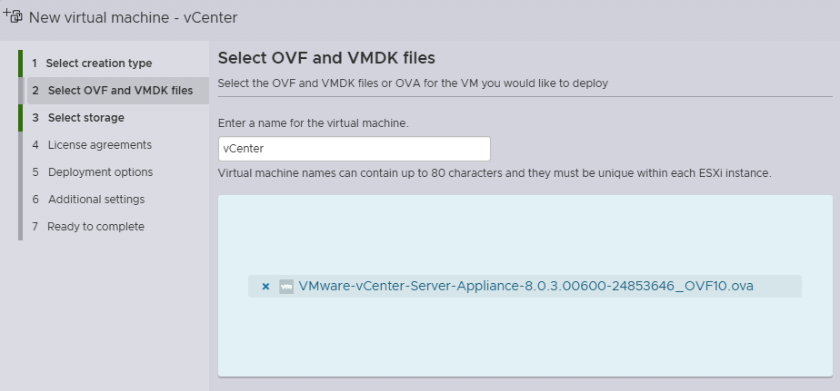
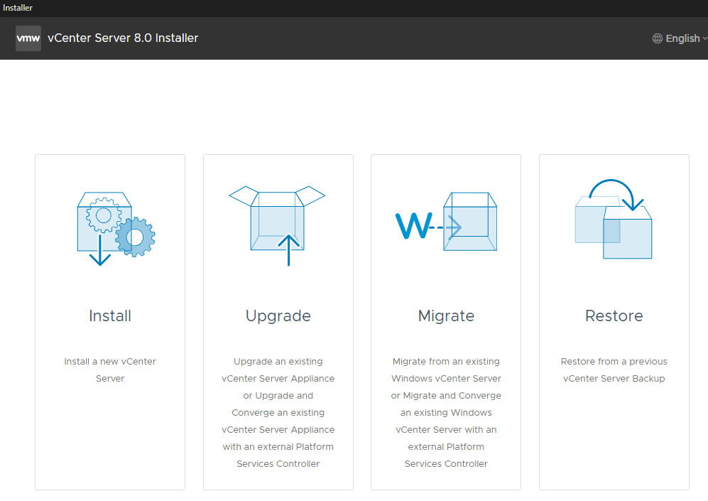
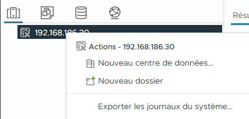
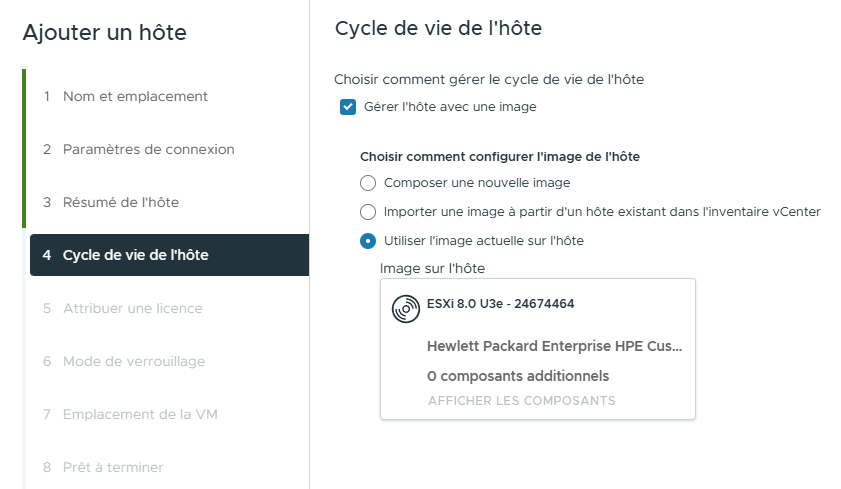
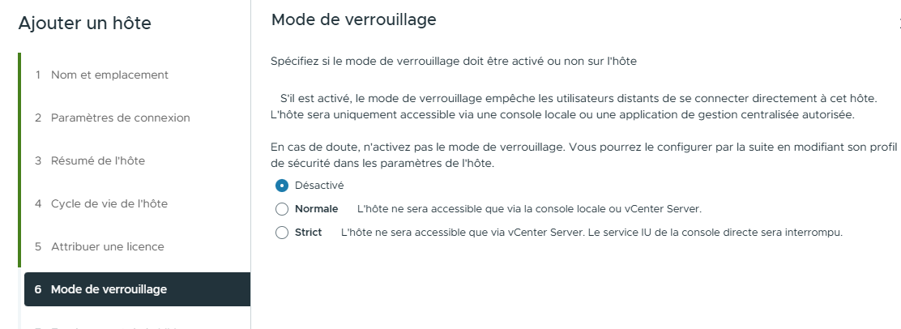
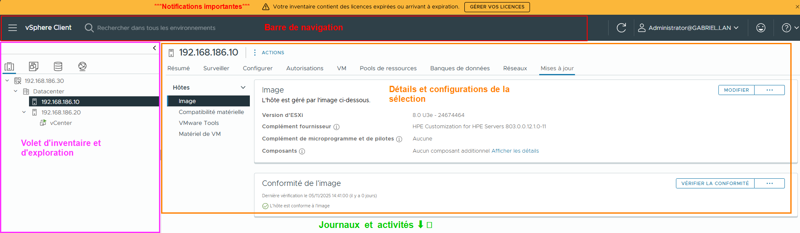

import useBaseUrl from '@docusaurus/useBaseUrl';
import ThemedImage from '@theme/ThemedImage';
import Tabs from '@theme/Tabs';
import TabItem from '@theme/TabItem';

# Cours 19

# Le point sur ESXi et vCenter

Dans les derniers cours, vous avez expérimenté par vous-mêmes l'installation de différents produits VMware. Vous avez procédé à l'installation de ESXi ainsi que de vCenter. Aujourd'hui je clarifie quelques points à ce sujets et nous poursuivons dans notre configuration.

D'abord, sachez que le premier rôle de vCenter est de centralisé la gestion des hyperviseurs ESXi. vCenter est à peu près inutile si vous n'avez pas au moins deux instances de ESXi qui tournent (et idéalement 3).

## vCenter: 2 méthodes d'installation 🔨
vCenter peut s'installer « officiellement » de deux manières distinctes. L'une de ces méthodes reste plus populaire que l'autre, mais les deux méthodes restent tout à fait valide.

:::caution[Ressources nécessaires]
vCenter nécessite **beaucoup** de ressources même pour un déploiement de type *tiny*. Par exemple, la version 8 de vCenter demande au **minimum**:
- 2 vCPUs
- 14 Go de mémoire vive
- 600 Go d'espace disque

Pensez à considérer ces éléments lorsque vous vous préparez à déployer vos hyperviseurs ESXi.
:::

### Importation de la machine virtuelle depuis l'ISO 📀

C'est la méthode la moins populaire, mais elle mérite qu'on s'y attarde tout de même puisqu'il s'agit d'une méthode d'installation dites officielle. Cette méthode consiste à récupérer la machine virtuelle de vCenter qui se trouve dans l'ISO d'installation, puis de l'importer directement dans ESXi.

Pour procéder de la sorte, vous devez:

1. Monter l'ISO de vCenter sur l'ordinateur client avec lequel vous accéderez à l'interface web d'ESXi.
2. Accéder à l'interface de ESXi et cliquez sur *Create VM*.
3. Dans *Creation type*, sélectionnez *Deploy from an OVF or OVA file*.
4. Donnez un nom à votre *VM* puis cliquez sur *Click to select file*.
5. Récupérez le fichier OVA dans le dossier **VCSA** de votre iso.

Poursuivez l'installation en suivant simplement les instructions de l'utilitaire d'importation.

### Utilitaire d'installation Windows 💻

C'est la méthode d'installation que la grande majorité des administrateurs connaissent. Il s'agit de démarrer l'installateur disponible directement dans l'ISO. Vous le retrouverez dans le sous-dossier */vcsa-ui-installer/win32/installer.exe*.

L'installateur doit être lancé depuis un client Windows qui peut accéder à l'interface de l'hyperviseur ESXi ciblé pour l'installation. Lorsque vous lancerez l'installateur, vous devriez voir cette fenêtre:

- **Install**: Permet d'installer une instance de *vCenter*, c'est ce qu'on souhaite faire ici.
- **Upgrade**: Permet de mettre à jour une instance existante vers une version supérieur.
- **Migrate**: Permet de migrer une installation sous Windows Serveur (désuet) vers une instance ESXi moderne.
- **Restore**: Permet de restaurer une instance de vCenter à partir d'une sauvegarde (nou verrons comment sauvegarder plus loin).

:::info
Ce deuxième type d'installation se déroule en deux temps (2 phases):
1. Déploiement de la machine virtuelle sur l'hôte ESXi concerné.
2. Configuration de vCenter.
:::

## Gestion de vCenter

Il existe de multiple façon d'accéder et de gérer vCenter:

- L'interface Web dites publique (ce dont vous accédez lorsque vous travaillez avec LabInfo)
- La console (via ESXi)
- SSH (si activé)
- La console de gestion (VMI) → Port 5480

Une fois que vous aurez terminé l'installation de vCenter, il faudra configurer quelques éléments importants.

### Création d'un Datacenter 🏬

Tout comme sur Proxmox, les hyperviseurs sont regroupés sous la bannière *Datacenter*. Cela dit, c'est à nous de créer le centre de données en ce qui concerne *vCenter*. Pour ce faire, ouvrez l'interface web, faites un clic à l'aide du bouton de droite sur la racine de *vCenter* et cliquez sur `Nouveau centre de données`.

### Ajouter les hôtes ESXi

Une fois votre *datacenter* créé, vous pourrez y ajouter vos serveurs ESXi un peu de la même façon. Faites un clic à l'aide du bouton de droite sur votre *datacenter* puis cliquez sur `Ajouter un hôte`.

Un utilitaire démarrera. Il vous suffit de suivre les instructions. Voici quelques précisions concernant les étapes que vous rencontrerez:

#### Gestion du cycle de vie de l'hôte (vLCM) ♻️

vLCM (VMware Lifecycle Manager) est un gestionnaire qui permet de centraliser la conformité de nos serveurs ESXi tout au long du cycle de leur vie. Pour vous expliquer ce que c'est rapidement, laissez-moi vous donner un exemple:

Imaginez que vous détenez 10 serveurs physiques sur lesquels vous décidez d'installer ESXi. Après quelques temps, des mise à jours des pilotes et du système voient le jour. Que ferez-vous ? Si vous n'avez pas de système comme vLCM, vous devrez mettre à jour manuellement tous les serveurs un après l'autre en prenant soin de les passer en mode maintenance chacun leur tour. C'est répétitif, inefficace et fastidieux.

C'est exactement ce à quoi sert vLCM. On lui donnera en premier lieu une image de conformité. C'est ni plus ni moins un exemple d'un serveur que l'on considère conforme. Cette image servira su service vLCM pour valider tout serveur ESXi qui voudrait se joindre au centre de données. Si une mise à jour venait qu'à sortir, c'est l'image que nous pourrions mettre à jour, ainsi vLCM vérifierait alors quels sont les serveurs qui ne sont plus conformes et prendrait acte.

Pour nos laboratoires, nous utiliserons l'option : *Utiliser l'image actuelle sur l'hôte*

#### Mode verrouillage 🔒

Le mode de verrouillage permet de restreindre l'utilisation de l'interface d'ESXi à différent niveau:

- **Désactivé:** 
    L'interface du serveur ESXi est entièrement utilisable, sans aucune restriction.
- **Normal:** 
    L'hôte est accessible via la console local ou vCenter Server. **Il devient alors <u>impossible</u> d'accéder à l'interface d'ESXi directement**
- **Strict:** 
    Dans ce mode, même la console UI de l'hôte ESXi devient inaccessible dans vCenter.

Pour nos laboratoires, vous pouvez utiliser le mode désactivé:

## Prise en main de vCenter

Dès les prochains cours, nous creuseront davantage dans certaines des fonctionnalités avancées de **vCenter**. En attendant, je vous propose un tour d'horizon de son interface afin que vous puissiez trouver vos repères aisément.

### Page inventaire

Dès que vous ouvrirez votre session en tant qu'administrateur, c'est cette page qui vous sera affiché. C'est la page que l'on nomme inventaire. Voici comment celle-ci est découpé:

#### Barre de navigation ⛵

Peu importe ce que vous ferez ou la tâche que vous exécuterez, cette barre sera toujours à cet endroit. Habituez-vous donc à vous y référer, puisque vous l'aurez toujours à disposition.

À gauche de la barre, vous retrouverez un menu *sandwich* à l'aide duquel vous pourrez atteindre tous les paramètres de vCenter. Au milieu, une barre de recherche qui vous permet de repérer rapidement un élément de votre inventaire. À droite, vous retrouverez votre profil et vos préférences.

#### Volet inventaire et exploration 

Ce volet est séparé en 4 éléments distincts:

1. **Hôtes et clusters:** 
    C'est la vue par défaut. Elle affiche l'organisation hiérarchique de votre infrastructure physique et virtuelle du point de vue des serveurs. Vous y retrouverez vos **datacenters**, vos **clusters**, vos hôtes ESXi individuels et les machines virtuelles exécutées sur chacun de ces hôtes.

2. **Machines virtuelles et modèles:** 
    Cette vue est centrée autour des machines virtuelles ainsi que les modèles de machines virtuelles, quel que soit l'hôte sur lequel elles résident. Elle est utile pour organiser et gérer les *VMs* par dossiers, sans se soucier de l'infrastructure sous-jacente. Vous y retrouverez vos *VMs* en cours d'exécution ainsi que vos modèles de *VMs* qui servent à déployer rapidement de nouvelles *VMs* préconfigurées. On peut y créer des dossiers pour classer les *VMs* par projet, département, environnement, etc.

    :::tip[Parallèle avec LabInfo]
    Dans LabInfo, on a créer un dossier pour chaque étudiant. C'est la méthode qui a été jugée la plus pertinente dans le contexte.
    :::

3. **Stockage:** 
    Cette vue vous permet de gérer et de surveiller tous les stockages de données (datastore) connectés à votre environnement vCenter. Vous y verrez tous vos datastores (VMFS, NFS, vSAN), leur capacité, l'espace utilisé et disponible, et les machines virtuelles qui y résident. C'est le point de départ pour ajouter de nouveaux stockages, gérer les fichiers sur les datastores, et surveiller leur performance.

4. **Réseau:** 
    Cette vue est dédiée à la gestion de la configuration réseau de votre environnement vSphere. Vous y trouverez les commutateurs virtuels (vSwitches ou Distributed Switches), les ports groups, les adaptateurs réseau des hôtes ESXi, et la manière dont les VMs sont connectées au réseau physique et entre elles. Très utile pour configurer les VLANs, isoler les réseaux, ou dépanner des problèmes de connectivité réseau.

#### Détails et configurations

Chaque fois que vous sélectionnerez un élément dans le volet de gauche (inventaire et exploration), vous obtiendrez des détails ainsi que de la paramétrabilité dans cette section centrale. Qu'il s'agisse d'une seule machine virtuelle, d'un hôte ESXi ou même d'un stockage, tout ce qui concerne l'élément y sera.

#### Journaux et activités 📰

Tout comme dans Proxmox, le bas de l'écran est réservé aux activités récentes. C'est une forme de journal des activités. **Attention:** Cela n'a rien à voir avec les journaux système.