import useBaseUrl from '@docusaurus/useBaseUrl';
import ThemedImage from '@theme/ThemedImage';
import Tabs from '@theme/Tabs';
import TabItem from '@theme/TabItem';

# Cours 20

# Administration de réseaux virtuels

## Vue d'ensemble de l'architecture

Dans un environnement virtuel tel que vSphere, les machines virtuelles doivent pouvoir communiquer entre elles et avec le monde extérieur, tout comme des serveurs physiques le feraient sur un réseau standard. La virtualisation du réseau nous permettra de:

- **Isoler le trafic:** Séparer différents types de communication.
- **Optimiser les ressources:** Partager intelligemment les cartes réseaux physiques.
- **Simplifier la gestion:** Configurer le réseau de manière centralisée.
- **Assurer la disponibilité:** Créer de la redondance sans multiplier le matériel.

L'architecture réseau de vSphere peut se visualiser en **trois couches:**

<div style={{textAlign: 'center'}}>
    <ThemedImage
        alt="Schéma"
        sources={{
            light: useBaseUrl('/img/Virtu/3couches_W.svg'),
            dark: useBaseUrl('/img/Virtu/3couches_D.svg'),
        }}
    />
</div>

1. **Couche physique (Infrastructure matérielle)**
    - Le matériel réel et tangible
    - Cartes réseau physiques (*vmnic*), câbles, switches, etc.

2. **Couche de virtualisation**
    - Le « cerveau » qui fait le lien entre la couche physique et la couche virtualisé
    - *vSwitches*,*Port Groups*,*VMkernel Ports*

3. **Couche virtualisé**
    - Les *VMs* et leurs cartes réseau virtuelles (*vNIC*)
    - Ce que voient et utilisent les *VMs*

## Les composants de la couche physique

### Les vmnic (cartes réseau physiques)

Une **vmnic** (*virtual machine network interface card*) est simplement une carte réseau physique installée dans votre serveur ESXi. Elle constitue le point de connexion entre le monde virtuel et le réseau physique.

:::important
- Les *vmnic* sont détectées automatiquement par ESXi au démarrage.
- Elles sont numérotées dans l'ordre de détection et non dans l'ordre physique.
- On ne configure pas directement les *vmnic*, on les assigne à des *vSwitches*.
:::

Dans **vCenter**, vous retrouverez les *vmnic* dans les configurations de chaque noeud, dans le menu `configurer`, puis `mise en réseau`:

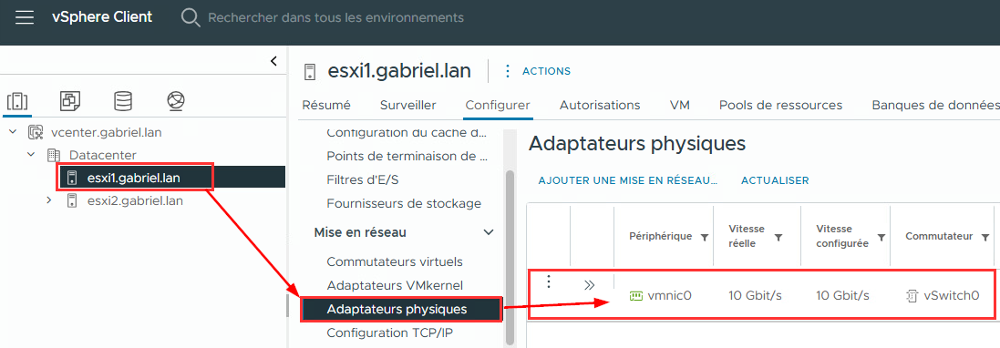


**Exemple:**

Un serveur ESXi avec 4 ports réseau aura *vmnic0, vmnic1, vmnic2 et vmnic3*. Nous pourrions alors faire un attribution similaire à ça:

- *vmnic0 et vmnic1* pour le trafic des *VMs*.
- *vmnic2* pour la gestion de l'hôte ESXi lui-même.
- *vmnic3* pour vMotion et le stockage.

#### Bonnes pratiques pour les vmnic 💡

Tentez toujours de séparer les différents types de trafic tout en assurant une redondance à l'aide d'au moins deux *vmnic* par fonction critique.

Une fonction critique désigne un type de trafic réseau important pour l'infrastructure. On parle de:

- **Gestion de l'ESX** (*management*)
- **Trafic des VMs** (production)
- **vMotion** (migration)
- **Storage** (iSCSI, NFS)
- **Replication**

**Exemple #1 (4 cartes réseau) :**

```
vSwitch0 (Management + VMs de production) :
├─ vmnic0 → Fonction critique = Management + VMs
└─ vmnic1 → Redondance pour cette fonction

vSwitch1 (vMotion + Storage) :
├─ vmnic2 → Fonction critique = vMotion + Storage  
└─ vmnic3 → Redondance pour cette fonction
```

**Exemple #2 (6 cartes réseau) :**

```
vSwitch0 (Management) :
├─ vmnic0 → Fonction = Management ESXi
└─ vmnic1 → Redondance

vSwitch1 (VMs Production) :
├─ vmnic2 → Fonction = Trafic des VMs
└─ vmnic3 → Redondance

vSwitch2 (Storage) :
├─ vmnic4 → Fonction = iSCSI/NFS
└─ vmnic5 → Redondance
```

## Les composants de la couche de virtualisation

### Les VMkernel ports

Un **VMkernel Port** est une interface réseau utilisé par **<mark>l'hôte ESXi lui-même pour ses propres services (pas les *VMs*)</mark>**. C'est une carte réseau pour le serveur ESXi.

:::caution
- **vNIC** → Utilisée par les *VMs*
- **VMKernel Port** → Utilisée par ESXi
:::

Voici une liste des différents services qui passeront via un **VMkernel port**:

|Service|Caractéristiques|
|-------------------------------------|-------------------------------------------------|
|**Management** (Gestion de l'ESXi)|- Accès à l'interface web<br/>- Connexion à vCenter<br/>- SSH<br/>- Port par défaut: `vmk0`|
|**vMotion** (Migration)|- Migration de *VMs* à chaud entre hôtes<br/>- Nécessite beaucoup de bande passante<br/>- Devrait avoir son propre réseau dédié|
|**vSAN** (Stockage distribué)|- Communication pour le stockage distributé vSAN<br/>- Trafic intensif, nécessite un réseau dédié aussi|
|**Stockage réseau** (iSCSI, NFS)|- Connexion aux systèmes de stockage en réseau<br/>- Performance critique pour les *VMs*|
|**Approvisionnement** (Provisionning)|- Utilisé pour le clonage et le déploiement de *VMs*<br/>- Trafic moins fréquent mais volumineux|
|**Réplication**|- Pour vSphere Replication<br/>- Synchronisation des données inter-sites|

Bref, les ports de type *VMkernel* ne concerne que le trafic qui s'adresse aux hyperviseurs. Exemple:

```
vmk0 → Management (10.0.1.10)
vmk1 → vMotion (10.0.2.10)
vmk2 → iSCSI Storage (10.0.3.10)
```

### Les vSwitches Standard (VSS)

Un **vSwitch Standard** (vSS) est un commutateur réseau virtuel qui fonctionne au niveau de l'hyperviseur ESXi. Pensez-y comme un switch réseau physique, mais complètement virtuel.

**Caractéristiques principales:**

- Créé et géré **individuellement sur chaque hôte** ESXi
- Gratuit, inclus avec ESXi (**OMG** 😮)

:::tip[*PSSST*]
Ça ne vous fait pas penser à un concept que nous avons vu avec Proxmox ?
:::

#### Composants d'un vSS

Un vSwitch est composé de plusieurs éléments qui travaillent ensemble:

<div style={{textAlign: 'center'}}>
    <ThemedImage
        alt="Schéma"
        sources={{
            light: useBaseUrl('/img/Virtu/vSwitchStandard_W.svg'),
            dark: useBaseUrl('/img/Virtu/vSwitchStandard_D.svg'),
        }}
    />
</div>

##### Les Ports Groups

Un **Port Group** est un regroupement logique de ports sur un *vSwitch*. C'est le point de connexion pour les *VMs* et les *VMkernel Ports*. Il définit les paramètres réseau qui seront appliqués aux machines qui s'y connectent:

- VLAN ID
- Politiques de sécurité
- Politiques de *load balancing* et de *failover*

C'est l'équivalent d'un groupe de ports configuré de la même façon sur un vrai *Switch*.

##### Les *uplinks* (liaison montante)

Les *uplinks* représentent le lien entre le *vSwitch* et la carte réseau physique (*vmnic*). Quelques point à retenir en ce qui concerne les *uplinks*:

- Un vSwitch peut avoir plusieurs *uplinks* (redondance)
- Chaque *uplink* est associé à une *vmnic* spécifique. Autrement dit: 1 *uplink* = 1 *vmnic*
- L'ordre des *uplinks* détermine les priorités de *failover*

#### Configuration d'un vSwitch Standard (ESXi)

##### Étape 1 - Créer le vSwitch

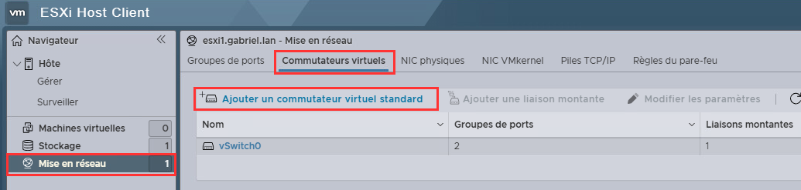
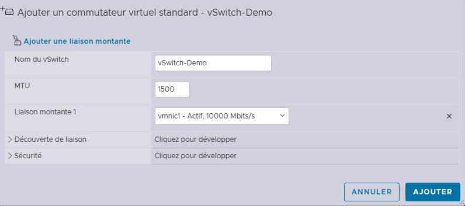


:::note
Ne vous préoccupez pas des petis menus *Découverte de liaison* et *sécurité*. Nous analyserons ces options dans les prochaines étapes.
:::

##### Étape 2 - Créer des groupes de ports

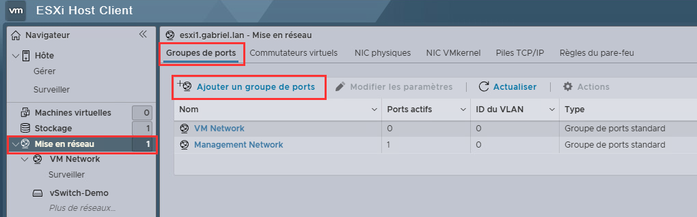
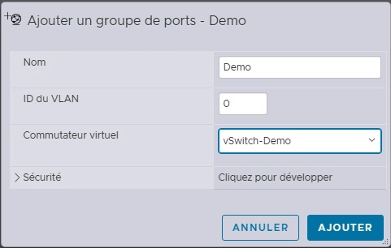

:::caution
**VLAN 0** = Pas de VLAN<br/>
**VLAN 1-4094** = Numéro de VLAN spécifique<br/>
**VLAN 4095** = VLAN *trunking*
:::

##### Étape 3 - Créer un VMKernel Port si nécessaire

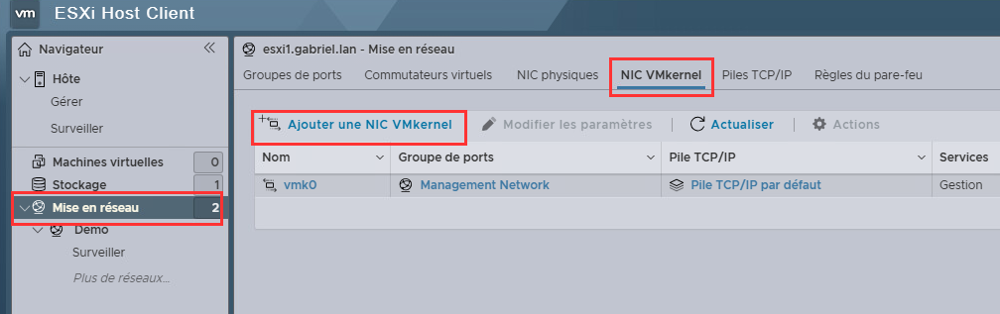
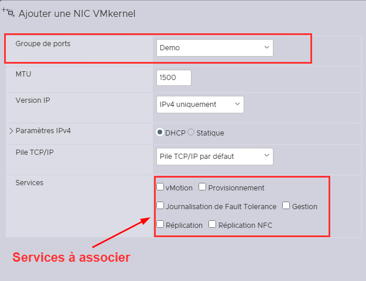

#### Les politiques de sécurité d'un VSS 🔐

Les politiques de sécurité d'un *vSwitch Standard* permettent de contrôler le comportement du trafic. Vous pouvez éditer ces politiques en sélectionnant votre *vSwitch* et en cliquant sur `Modifier les paramètres`.

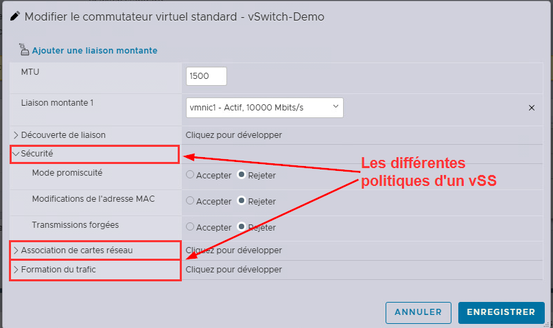

En matière de sécurité, voici les éléments que vous pourriez ajuster en fonction de votre contexte:

##### Mode Promiscuité (Promiscuous Mode) 👂

Ce mode permet d'analyser tout le trafic passant sur un même groupe de ports. Par défaut, ce mode est **désactivé** pour des raisons évidentes de sécurité. Néanmoins, un administrateur pourrait vouloir activer ce mode dans des circonstances précises telle que la mise en place d'un IDS/IPS ou un analyseur de bande passante.

##### Changement d'adresse MAC

Ce mode permet aux différentes *VMs* de changer leur adresse MAC. C'est généralement accepté (c'est d'ailleurs le comportement par défaut), mais on pourrait le refuser dans certains environnements très sécurisé.

##### Transmissions forgées

Cette politique permet aux *VMs* d'envoyer des trames sur le réseau avec une adresse MAC source différente de la leur. Dépendamment du contexte dans lequel vous oeuvrez, vous pourriez vouloir prévenir certaines attaques qui utilisent ce stratagème ou tout simplement éviter ce genre de comportement.

#### Les politiques de *teaming* et de *failover*

Ces politiques définissent comment les *uplinks* sont utilisés et comment la redondance fonctionne.

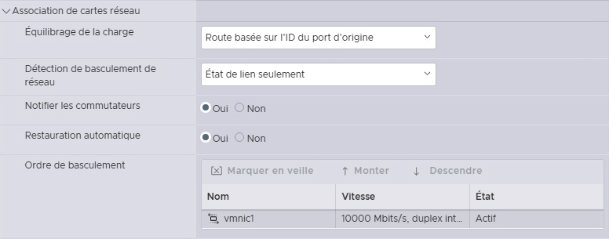

##### Équilibrage de charge (*load balancing*) ⚖️

1. *Route based on originating virtual port* **(Défaut)**
    - Chaque VM est assignée à un *uplink* au démarrage.
    - Simple, rapide et efficace.
    - **Recommandé** pour la plupart des cas.

2. *Route based on IP hash*
    - Distribution basée sur les adresses IP source et destination
    - Nécessite EtherChannel/LACP sur le switch physique
    - Meilleur équilibrage pour les *VMs* avec beaucoup de connexions

3. *Route based on MAC hash*
    - Distribution basée sur l'adresse MAC de la *VM*
    - Similaire à *virtual port*, mais avec un calcul différent.

4. *Use explicit failover order*
    - Utilise toujours l'*uplink* actif prioritaire
    - Les autres *uplinks* sont en standby seulement
    - Pas d'équilibrage de charge

##### Détection de réseau en panne (*Network Failover Detection*)

1. *Link Status Only* **(Défaut)**
    - Détecte seulement si le câble est débranché
    - Rapide mais limité

2. *Beacon probing*
    - Envoie des paquets de test entre *uplinks*
    - Détecte plus de problèmes réseau, plus fiable
    - Crée légèrement plus de trafic

3. *Failover Order*
    - Permet de configurer la priorité des *uplinks*

#### Exemple de configuration réaliste

Dans un scénarion où nous aurions un cluster de 3 noeuds, dont les noeuds possèdent respectivement 4 cartes réseaux, nous pourrions créer quelque chose comme suit:

<div style={{textAlign: 'center'}}>
    <ThemedImage
        alt="Schéma"
        sources={{
            light: useBaseUrl('/img/Virtu/ExempleConfig_W.svg'),
            dark: useBaseUrl('/img/Virtu/ExempleConfig_D.svg'),
        }}
    />
</div>

:::caution
Cette configuration devrait être créé et répété dans chaque noeud ESXi manuellement! Voici ce qui doit être identique dans chaque noeud:

- Noms des *vSwitch*
- Noms des groupes de ports
- Numéros des *VLANs*
- MTU
- Politiques de sécurité et de *teaming*
- Assignation des *vmnic* aux *uplinks*

:::

### Les vSwitches distribuées (VDS)

Un *Virtual Distributed Switch* est un commutateur virtuel géré de manière centralisée par *vCenter* et qui s'étend sur plusieurs hôtes ESXi. Voici les différences fondamentales entre les VSS et les VDS

|Aspect|vSwitch Standard|vSwitch Distributed|
|------|----------------|-------------------|
|**Gestion**|Locale à chaque noeud|Centralisée dans vCenter|
|**Configuration**|Sur chaque ESXi|Une seule fois pour tous les hôtes|
|**Fonctionnalités**|Basiques|Avancées|
|**Licence**|Gratuit|Nécessite licence Enterprise Plus|
|**Compléxité**|Simple|Plus complexe|

#### Architecture du vDS

<div style={{textAlign: 'center'}}>
    <ThemedImage
        alt="Schéma"
        sources={{
            light: useBaseUrl('/img/Virtu/VDS_W.svg'),
            dark: useBaseUrl('/img/Virtu/VDS_D.svg'),
        }}
    />
</div>

##### Composants d'un vDS

1. vDS : Configuration centralisée
    - Définit les paramètres du switch distribué
    - Gère les *distributed port groups*
    - Pousse la configuration vers les noeuds ESXi
    - Point unique de gestion

2. *Host Proxy Switch*
    - Agent local qui reçoit et applique la configuration du vDS
    - Fait le lien entre le vDS et les *vmnic*
    - Invisible dans l'interface, fonctionne en arrière-plan

3. *Distributed Port Groups*
    - Définis une seule fois dans vCenter
    - Automatiquement disponibles sur tous les hôtes membres du vDS
    - Configuration cohérente garantie (sans erreur)

#### Avantages du vDS

|Avantages|Détails|
|---------|-------|
|Cohérence|- Configuration identique sur tous les hôtes<br/>- Pas de risque d'erreur de configuration manuelle<br/>-Changement une fois = appliqué partout|
|Fonctionnalités avancées|- Netflow<br/>- Port mirroring<br/>- Private VLANs<br/>- LACP<br/>- Plusieurs autres|
|Mobilité simplifiée|Les *VMs* conservent leur configuration lorsqu'elles sont migrées.|
|Statistiques|Statistiques, monitoring et dépannage facilité avec vCenter.|

#### Configuration d'un vDS

La création et la configuration d'un vDS doit absolument se faire via vCenter.

##### Création

Au niveau du *Datacenter* :<br/>
Menu `Action` → `Distributed Switch` → `New Distributed Switch`

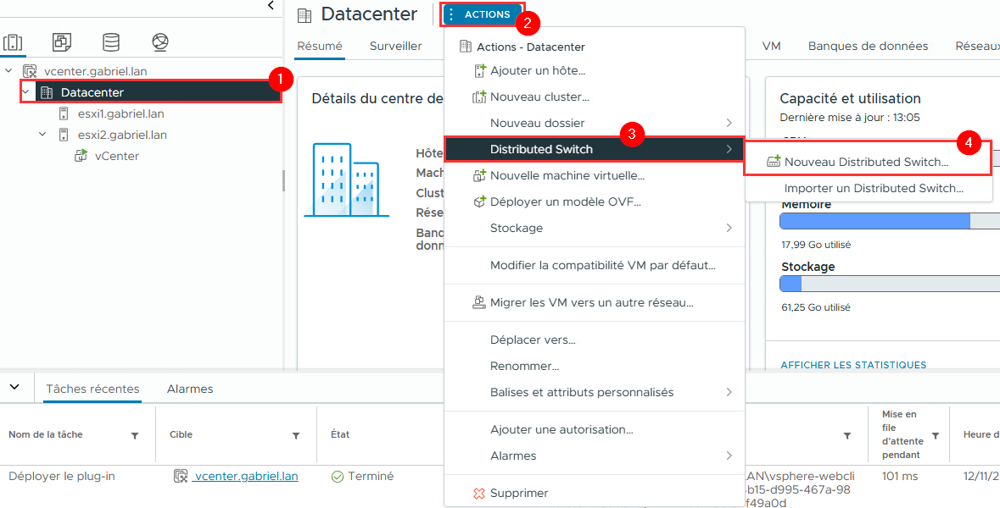

Octroyez un nom à votre nouveau *switch distribué* et sélectionnez la version de celui-ci. À moins de travailler avec des versions plus anciennes d'**ESXi**, je vous recommande d'utiliser la version la plus récente pour bénéficier des dernières fonctionnalités.

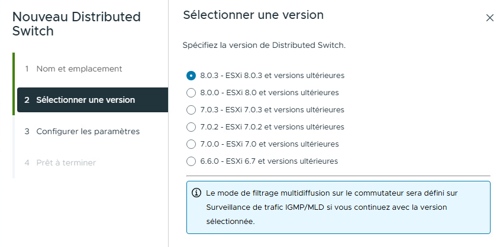

À l'étape suivante, vous devrez paramétrer les options suivantes:

- **Compatibilité des déchargements réseau:**<br/>
Ce paramètre concerne certaines cartes réseaux spécialisés sur lesquelles on retrouve un processeur qui peuvent exécuter des fonctions réseau avancées. **Dans 99% des cas, l'option `aucun` est la bonne.**

- **Nombre de liaisons montantes:**<br/>
Définit combien de *vmnic* chaque hôte pourra connecter au vDS. Ce paramètre peut être modifié plus tard si nécessaire. Généralement on recommande deux *vmnic* ou quatre pour les environnements critiques.

- **Network I/O Control:**<br/>
Cette option permet de prioriser et garantir la bande passante par type de trafic. C'est un élément essentiel à activer dans un environnement de production.

- **Groupe de ports par défaut:**<br/>
Cette option permet tout simplement de créer un groupe de ports par défaut. Ce sera à vous de voir, selon le contexte, si cette option est pertinente pour vous.

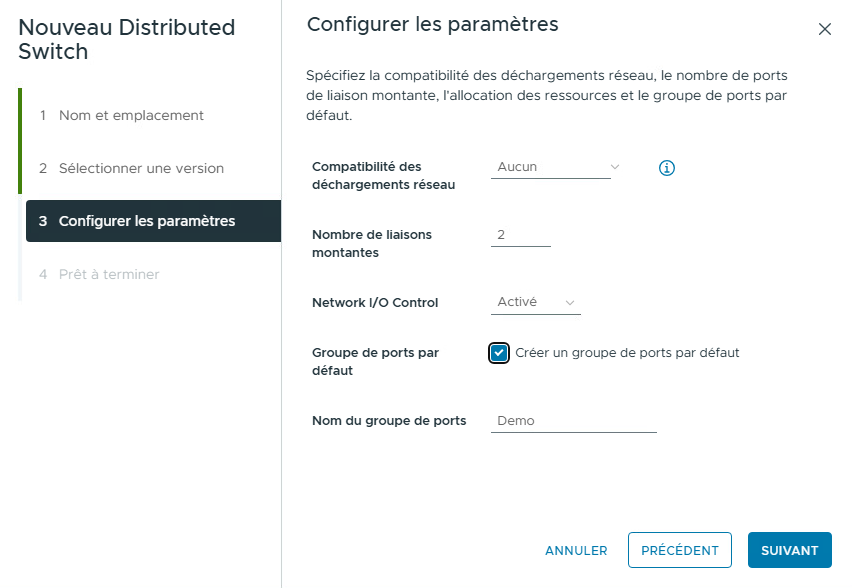

Une fois créé, le **vDS** sera accessible dans le volet de gauche, sous la section réseau:

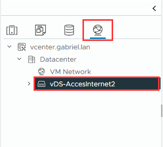

Il nous faudra configurer les noeuds qui auront accès à ce **vDS**. Pour ce faire, cliquez sur le menu `actions` → `Ajouter et gérez des hôtes...`

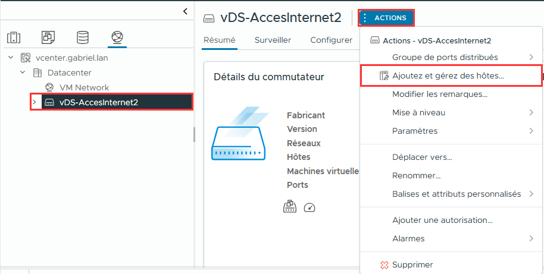

Une fois que vous aurez sélectionné les noeuds qui auront accès au **vDS**, vous serez amené à sélectionner les *vmnic* qui devront être attitrés à ce **vDS**. Cette sélection peut se faire différemment pour chaque hôte ou de manière identique.

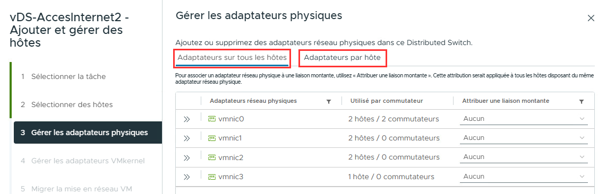

L'Étape suivante consiste à associer les ports **VMKernel** <u>au besoin.</u> Si vous n'avez pas l'intention d'utiliser ce *switch* pour des services réservés à ESXi ou vSphere, il est inutile d'y associer des ports **VMKernel**.

Finalement, vous aurez la possibilité de migrer des éléments vers ce **vDS** au besoin.

Une fois le **vDS** en place, vous pourrez le retrouver dans les commutateurs virtuels de chaque hôte ESXi concerné. Vous pourrez également y brancher des machines virtuelles. N'oubliez pas, si vous désirez utiliser différents groupes de ports, vous devrez créer ceux-ci dans **vCenter.**

## Les composants de la couche virtualisée

### Les vnic (cartes réseau virtuelles)

Une *vNIC* est une carte réseau virtuelle assignée à une machine virtuelle. Du point de vue de la *VM*, c'est une carte réseau normale (comme une Intel E1000 ou une VMXNET3).

**Caractéristiques:**

- Chaque VM peut avoir plusieurs *vNIC* (généralement 1 à 4).
- Chaque *vNIC* a sa propre MAC.
- Différents types disponibles selon les besoins de performance
