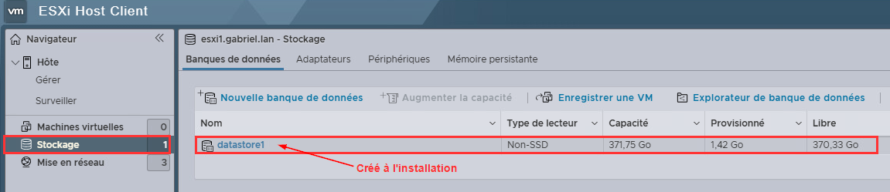
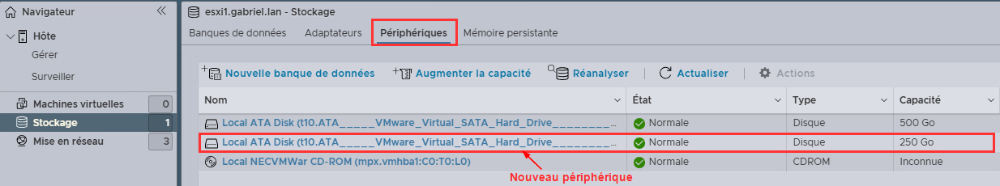
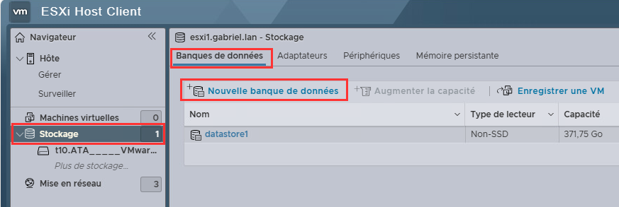
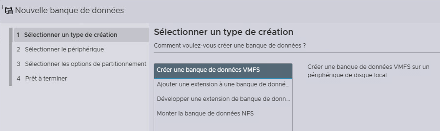
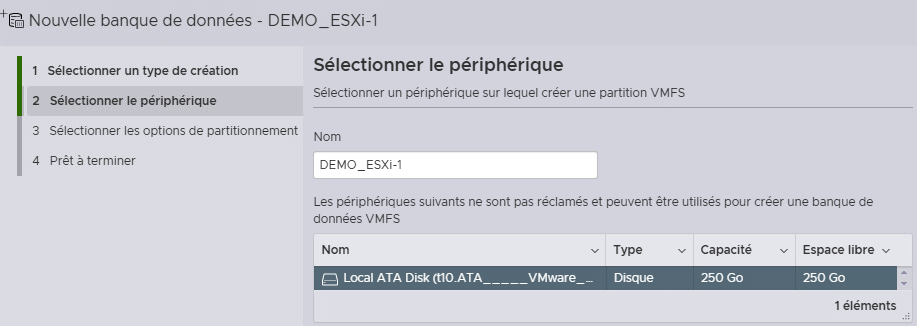
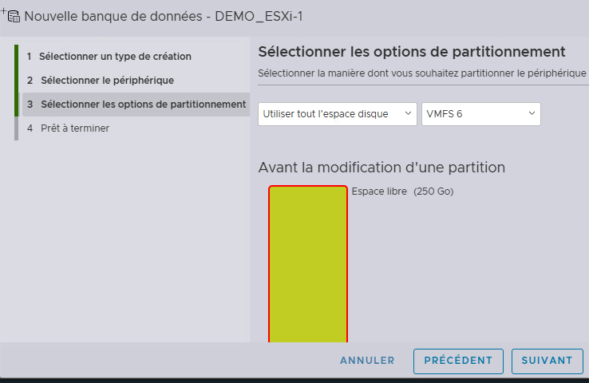
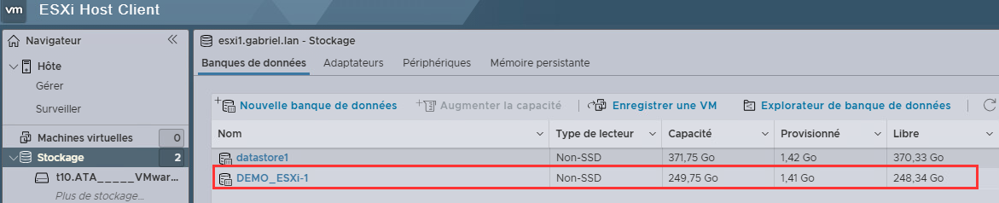
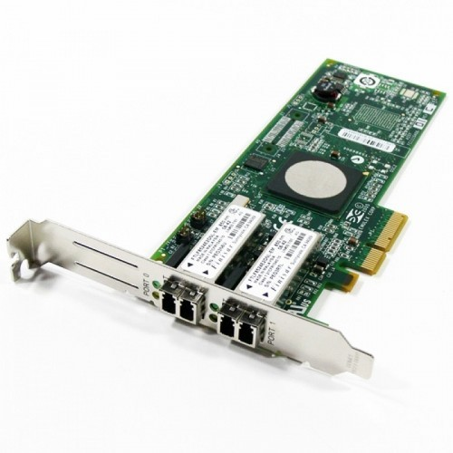
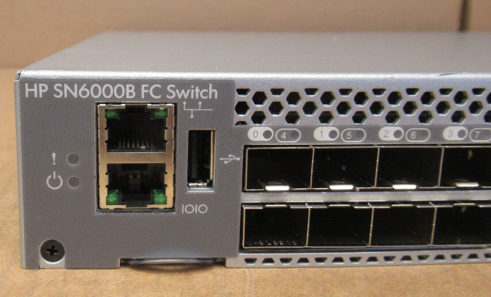

import useBaseUrl from '@docusaurus/useBaseUrl';
import ThemedImage from '@theme/ThemedImage';
import Tabs from '@theme/Tabs';
import TabItem from '@theme/TabItem';

# Cours 22

# Gestion des stockages sous VMware

* * *

Dans ce cours, nous allons explorer les différentes solutions de stockage disponibles dans l'environnement VMware ESXi et vCenter. Comme vous avez déjà travaillé avec Proxmox, vous connaissez les concepts de base de la virtualisation et du stockage. VMware utilise une approche similaire mais avec sa propre terminologie et ses propres technologies.


## Les datastores : concept fondamental 🧱

Dans l'écosystème VMware, un **datastore** est l'équivalent d'un pool de stockage dans Proxmox. C'est un conteneur logique qui abstrait les détails physiques du stockage et fournit un emplacement unifié pour stocker les fichiers des machines virtuelles.

Un **datastore** ne correspond pas nécessairement à un disque ni à une unité de stockage particulière, c'est plutôt un assemblage de stockages.

### Types de fichiers dans un datastore 📁

Lorsque vous créez une VM dans ESXi, plusieurs fichiers sont automatiquement créés dans le datastore. 

Voici les principaux :

    - **Fichiers .vmdk (Virtual Machine Disk)** : <br/>Ce sont vos disques durs virtuels. En réalité, un disque virtuel est composé de deux fichiers :
        - `MaVM.vmdk` : un petit fichier texte descripteur (quelques Ko)
        - `MaVM-flat.vmdk` : le fichier contenant réellement les données (la taille de votre disque)

    - **Fichiers .vmx (Virtual Machine Configuration)** : <br/>C'est le fichier de configuration de votre VM.
    Il contient toutes les informations : combien de RAM, combien de CPU, quels réseaux, etc. C'est un fichier texte que vous pouvez même éditer manuellement si nécessaire (⚠️ mais attention ⚠️).

    - **Fichiers .nvram** : Stocke les paramètres du BIOS/UEFI de la VM, comme l'ordre de démarrage ou les paramètres de sécurité.

    - **Fichiers .vswp (Virtual Swap)** : Fichier de mémoire swap pour la VM. Sa taille est égale à la RAM allouée moins la réservation de mémoire.

    - **Fichiers de snapshot** : Quand vous créez un snapshot, ESXi génère des fichiers `-delta.vmdk` et `.vmsd` pour conserver l'état du disque à un moment précis.

## Les types de stockage supportés 💾

VMware ESXi supporte plusieurs types de stockage, chacun adapté à des besoins et des budgets différents. Explorons-les en détail.

### Stockage local (Local Storage)

Le stockage local, c'est le plus simple : vous utilisez les disques physiques directement installés dans votre serveur ESXi, exactement comme vous le faisiez avec Proxmox.

#### Avantages et inconvénients

**<span class='green-text'>Avantages:</span>**
- **Performance maximale** : pas de latence réseau, accès direct au disque
- **Configuration simple** : aucune infrastructure réseau supplémentaire nécessaire
- **Coût minimal** : vous n'achetez que des disques

**<span class='red-text'>Inconvénients:</span>**
- **Pas de haute disponibilité** : si votre serveur tombe, vos VMs sont inaccessibles
- **Pas de vMotion de stockage** : vous ne pouvez pas déplacer les VMs vers un autre hôte sans arrêt
- **Capacité limitée** : vous êtes limité par les baies de disques de votre serveur

#### Quand utiliser le stockage local ?

Le stockage local est parfait pour :
- Les environnements de laboratoire et de test
- Les serveurs autonomes sans besoin de haute disponibilité
- Les applications nécessitant les meilleures performances possibles
- Les petites infrastructures avec un budget limité

#### Procédure : Créer un datastore VMFS local

Mettons en pratique la création d'un datastore local. Imaginez que vous venez d'installer un nouveau disque SSD de 500 Go dans votre serveur ESXi.

**Étape 1 : Connexion et navigation**

Connectez-vous à votre hôte ESXi via le client web (https://esxi.mondomaine.lan). Une fois connecté :
- Dans le menu de gauche, cliquez sur "Storage" (Stockage)
- Vous verrez les datastores déjà existants (probablement un datastore par défaut créé lors de l'installation)



**Étape 2 : Vérifier que le disque est détecté**

Avant de créer le datastore, vérifions que ESXi voit bien votre nouveau disque :
- Cliquez sur l'onglet "Devices" (Périphériques)
- Cherchez votre nouveau disque dans la liste (identifiez-le par sa capacité et son modèle)



Si votre disque n'apparaît pas, il peut y avoir un problème de détection matérielle. Redémarrez l'hôte ou vérifiez les connexions physiques.

**Étape 3 : Lancer la création du datastore**

- Cliquez sur `Stockage` dans le menu de navigation
- Cliquez sur le bouton `Nouvelle banque de données`
- Une fenêtre de création s'ouvre



**Étape 4 : Choisir le type**

- Sélectionnez `Créer une banque de données VMFS` (VMFS est le système de fichiers propriétaire de VMware, optimisé pour les VMs)
- Cliquez sur `Suivant`



**Étape 5 : Nommer le datastore et sélectionner le disque**

Le nom est important pour l'organisation, surtout si vous avez plusieurs datastores. Adoptez une convention de nommage logique :
- Exemples : `Local-SSD-500GB`, `DS-Local-ESXi01`, `Datastore-Production`
- Évitez les espaces et les caractères spéciaux
- Entrez votre nom et cliquez sur `Suivant`

**Étape 6 : Sélectionner le périphérique**

- Une liste de disques disponibles s'affiche
- Sélectionnez votre disque
- ESXi affiche les détails : capacité, type (SSD/HDD), modèle
- ⚠️ **Attention** ⚠️ : cette opération effacera toutes les données du disque !
- Cliquez sur `Suivant`



**Étape 7 : Choisir le partitionnement**

Vous avez deux options principales :

**Option 1 - Use full disk (recommandé)** : 
- Utilise 100% de l'espace disponible
- C'est généralement ce que vous voulez

**Option 2 - Custom** :
- Permet de ne partitionner qu'une partie du disque
- Utile si vous voulez réserver de l'espace pour un usage futur

Pour notre exemple, choisissez "Use full disk" et laissez VMFS version 6 (la plus récente). Cliquez sur `Suivant`.



**Étape 8 : Révision et création**

- Vérifiez toutes les informations affichées
- Capacité totale, capacité utilisable (légèrement inférieure à cause du formatage)
- Cliquez sur `Terminer`

ESXi va maintenant :
1. Créer une partition GPT sur le disque
2. Formater la partition en VMFS6
3. Monter le datastore

Le processus prend généralement 10 à 30 secondes.


**Étape 9 : Vérification**

Une fois terminé :
- Votre nouveau datastore apparaît dans la liste
- Cliquez dessus pour voir les détails
- Vous verrez l'espace total, l'espace utilisé (presque rien pour l'instant) et l'espace libre
- Vous pouvez maintenant créer des VMs sur ce datastore !



### Stockage en réseau (Network Storage) 🌐

Le stockage en réseau change complètement la donne. Au lieu que chaque serveur ESXi ait son propre stockage isolé, tous les serveurs peuvent accéder à un stockage partagé via le réseau.

#### Pourquoi du stockage en réseau ?

Avec du stockage partagé, vous débloquez des fonctionnalités essentielles :
- **vMotion** : déplacer des VMs allumées d'un serveur à un autre sans interruption
- **Haute disponibilité (HA)** : si un serveur tombe, ses VMs redémarrent automatiquement sur un autre serveur
- **Centralisation** : gérer le stockage depuis un point central
- **Flexibilité** : ajouter de l'espace facilement sans ouvrir les serveurs

#### NFS (Network File System)

NFS est probablement le protocole le plus simple à configurer pour du stockage partagé. Vous avez déjà utilisé NFS avec Proxmox, donc les concepts vous sont familiers.

**Comprendre NFS : l'analogie du partage Windows**

Imaginez NFS comme un partage réseau Windows, mais optimisé pour Linux/Unix. Un serveur partage un répertoire, et les clients (vos hôtes ESXi) montent ce répertoire comme s'il était local. La différence principale avec un partage Windows ? Les performances et la fiabilité sont conçues pour des charges de travail intensives.

**Caractéristiques de NFS**

- **Protocole de niveau fichier** : vous partagez un répertoire, pas un disque brut
- **Versions supportées** : NFS v3 (simple, fiable) et NFS v4.1 (plus sécurisé avec Kerberos)
- **Thin provisioning natif** : les disques virtuels n'occupent que l'espace réellement utilisé
- **Configuration rapide** : souvent opérationnel en moins de 5 minutes

#### iSCSI (Internet Small Computer System Interface)

iSCSI est fondamentalement différent de NFS. Au lieu de partager un répertoire, vous partagez un disque complet (appelé LUN - Logical Unit Number) que ESXi voit comme un disque local. C'est comme brancher un disque dur via le réseau Ethernet au lieu d'un câble SATA.

**Comprendre iSCSI : l'analogie du disque dur externe**

Imaginez un disque dur externe USB, mais au lieu d'être connecté par USB, il est connecté via votre réseau Ethernet. ESXi ne voit pas un partage réseau, il voit un disque brut qu'il peut formater en VMFS, exactement comme un disque local.

**Caractéristiques d'iSCSI**

- **Protocole de niveau bloc** : vous manipulez des blocs de données bruts, pas des fichiers
- **Utilise le réseau Ethernet** : pas besoin d'infrastructure Fibre Channel coûteuse
- **Format VMFS** : vous formatez le LUN en VMFS, comme un disque local
- **Performance élevée** : peut rivaliser avec Fibre Channel sur du 10 Gbps

**Terminologie iSCSI importante**

Avant de continuer, comprenons le vocabulaire iSCSI :

**Target (Cible)** :
- C'est le serveur qui partage le stockage
- Un target a un nom unique appelé IQN (iSCSI Qualified Name)
- Exemple : `iqn.2024-11.com.monentreprise:storage01`

**Initiator (Initiateur)** :
- C'est le client qui se connecte au stockage
- Votre hôte ESXi est un initiateur
- ESXi a aussi un IQN unique

**LUN (Logical Unit Number)** :
- C'est le "disque" partagé par le target
- Un target peut partager plusieurs LUNs
- Chaque LUN a un numéro (LUN 0, LUN 1, etc.)

**Portail** :
- C'est l'adresse IP et le port du target
- Format : `192.168.1.100:3260` (3260 est le port par défaut)

**Software iSCSI vs Hardware iSCSI**

ESXi supporte deux types d'iSCSI :

**Software iSCSI (logiciel)** :
- L'initiateur iSCSI est géré par ESXi en logiciel
- Utilise les cartes réseau standards
- Consomme un peu de CPU
- Gratuit, inclus dans ESXi (Oh la la!)
- Parfait pour commencer et pour la plupart des cas

**Hardware iSCSI (matériel)** :
- Nécessite une carte dédiée
- Décharge le travail du CPU
- Performance légèrement meilleure
- Coût supplémentaire (carte)
- Utile pour des charges très intensives

#### Fibre Channel (FC)

Fibre Channel est la solution de stockage haut de gamme, traditionnellement utilisée dans les grands datacenters et les environnements critiques. Contrairement à iSCSI qui utilise Ethernet, Fibre Channel possède sa propre infrastructure réseau dédiée.

:::note
Évidemment, nous ne pourrons pas mettre en place et tester fibre channel au cégep puisque nous n'avons pas les équipements nécessaires. Cela dit, rien ne nous empêche d'en comprendre le fonctionnement.
:::

**Comprendre Fibre Channel**

Imaginez Fibre Channel comme une autoroute privée, ultra-rapide, construite exclusivement pour le trafic de stockage. Alors qu'iSCSI partage le réseau Ethernet avec d'autres trafics, Fibre Channel a son propre réseau isolé, ce qui garantit des performances constantes et prévisibles.

**Caractéristiques de Fibre Channel**

- **Infrastructure dédiée** : réseau complètement séparé avec ses propres switches (appelés "fabric")
- **Vitesse élevée** : 8, 16, 32 ou 64 Gbps par lien
- **Latence ultra-faible** : généralement inférieure à 1 ms
- **Fiabilité maximale** : protocole conçu pour ne jamais perdre de données
- **Coût élevé** : équipement spécialisé coûteux

**Quand utiliser Fibre Channel ?**

Fibre Channel est approprié pour :
- Les bases de données critiques nécessitant les meilleures performances
- Les environnements où la latence doit être minimale et prévisible
- Les applications nécessitant des milliers d'IOPS
- Les organisations ayant déjà investi dans une infrastructure FC

**Composants nécessaires**

Pour déployer Fibre Channel, vous avez besoin de :

**1. Cartes HBA (Host Bus Adapter) FC** :
- Installées dans chaque hôte ESXi
- Généralement 2 HBA par hôte (redondance)
- Chaque HBA a un WWN (World Wide Name), identifiant unique comme une adresse MAC



**2. Switches Fibre Channel** :
- Switches spécialisés FC (pas des switches Ethernet)
- Généralement 2 switches (fabric A et fabric B) pour la redondance
- Configuration complexe : zoning, LUN masking



**3. Baie de stockage avec ports FC** :
- SAN avec contrôleurs FC

#### Multipathing 🔀

Avec Fibre Channel (et aussi avec iSCSI), vous avez généralement **plusieurs chemins** vers le même stockage.

**Pourquoi ?**

1. **Haute disponibilité** : si un chemin tombe, le trafic bascule automatiquement sur un autre chemin
2. **Équilibrage de charge** : répartir le trafic sur plusieurs chemins pour de meilleures performances
3. **Maintenance sans interruption** : vous pouvez mettre un switch hors service sans impact

**Types de politiques de chemin (Path Selection Policy)**

ESXi supporte plusieurs politiques pour gérer les chemins multiples :

**Fixed** :
- Utilise toujours le même chemin (le "preferred path")
- Bascule sur un autre seulement si le chemin principal tombe
- Simple mais n'utilise pas tous les chemins

**Most Recently Used** :
- Utilise le chemin le plus récemment actif
- Bascule en cas de panne mais ne revient pas automatiquement
- Utilisé pour certains arrays Active/Passive

**Round Robin** :
- **Recommandé** pour la plupart des SAN modernes
- Distribue les I/O sur tous les chemins disponibles
- Meilleure utilisation des ressources
- Meilleures performances

#### vSAN (Virtual SAN)

vSAN est l'approche moderne du stockage chez VMware. Au lieu d'utiliser un SAN externe coûteux, vSAN agrège le stockage local de chaque hôte ESXi pour créer un pool de stockage partagé et distribué. C'est une approche *software-defined storage*.

**Caractéristiques de vSAN**

- **Software-defined** : pas besoin de SAN externe, tout est géré par ESXi
- **Stockage distribué** : les données sont réparties sur tous les hôtes du cluster
- **Haute disponibilité native** : les données sont automatiquement répliquées
- **Performance avec SSD** : utilise des SSD pour le cache, des HDD/SSD pour la capacité (Un peu comme le *[fleecing](../06%20-%206%20-%20Sauvegardes%20et%20restaurations/00-cours6.md#fleecing-%EF%B8%8F)* dans proxmox)
- **Évolutif** : ajoutez des hôtes pour augmenter capacité et performance

**Architecture vSAN typique**

Chaque hôte ESXi dans un cluster vSAN contribue :
- **1 ou plusieurs SSD pour le cache** : accélère les lectures et écritures
- **1 ou plusieurs disques pour la capacité** : HDD ou SSD selon les besoins de performance

Les données d'une VM sont automatiquement distribuées et répliquées sur plusieurs hôtes selon la politique de stockage définie.

**Exemple d'architecture 4 hôtes** :
```
Cluster vSAN
├─ ESXi-01: 1x SSD 400GB cache + 4x HDD 2TB capacité
├─ ESXi-02: 1x SSD 400GB cache + 4x HDD 2TB capacité
├─ ESXi-03: 1x SSD 400GB cache + 4x HDD 2TB capacité
└─ ESXi-04: 1x SSD 400GB cache + 4x HDD 2TB capacité

Capacité totale utilisable: ~16TB (après réplication)
```

**Politiques de stockage vSAN (Storage Policies)**

C'est ici que vSAN devient vraiment intéressant. Pour chaque VM ou disque virtuel, vous définissez une politique qui détermine :

**Failures to Tolerate (FTT)** :
- Combien de pannes d'hôtes la VM peut survivre
- FTT=1 : survit à 1 panne d'hôte (données sur 2 hôtes minimum)
- FTT=2 : survit à 2 pannes d'hôtes (données sur 3 hôtes minimum)

**Stripe Width** :
- Sur combien d'hôtes distribuer les données pour la performance
- Plus c'est élevé, plus la performance est distribuée

**Type de redondance** :
- **RAID 1 (Mirroring)** : copie complète sur plusieurs hôtes, rapide mais gourmand en espace
- **RAID 5 (Erasure Coding)** : nécessite 4 hôtes minimum, plus économe en espace
- **RAID 6 (Erasure Coding)** : nécessite 6 hôtes minimum, tolère 2 pannes, très économe

**Exemple de politique** :
- VM de production critique : FTT=2, RAID 6
- VM de développement : FTT=1, RAID 1
- VM de test : FTT=0 (aucune réplication)

## VMFS : Le système de fichiers VMware

VMFS (Virtual Machine File System) mérite qu'on s'y attarde car c'est le cœur du stockage VMware. Comprendre VMFS vous aide à mieux comprendre comment fonctionnent les datastores.

### Qu'est-ce que VMFS exactement ?

VMFS est un système de fichiers en cluster, ce qui signifie que **plusieurs hôtes ESXi peuvent lire et écrire simultanément sur le même datastore** sans risque de corruption. C'est une capacité unique qui distingue VMware.

**Comparaison avec d'autres systèmes de fichiers** :

- **NTFS/ext4/XFS** : un seul système à la fois peut écrire, sinon corruption garantie
- **VMFS** : plusieurs ESXi peuvent écrire en même temps grâce à un système de verrous sophistiqué
- C'est cette capacité qui permet vMotion, HA, et toutes les fonctionnalités avancées

### Comment VMFS évite les conflits ?

VMFS utilise un système de verrouillage au niveau fichier. Quand un hôte ESXi veut modifier un fichier (par exemple, écrire dans un disque virtuel), il :

1. Demande un verrou sur ce fichier
2. Effectue ses modifications
3. Libère le verrou

Les autres hôtes attendent leur tour. Tout cela se passe en millisecondes, de façon transparente.

**Exemple concret** :
Vous avez une VM sur ESXi-01 qui écrit dans son disque. Vous décidez de faire un vMotion vers ESXi-02. Pendant la migration :
- ESXi-01 garde le verrou sur les fichiers de la VM
- La VM continue de fonctionner normalement
- Une fois la mémoire transférée, ESXi-02 récupère les verrous
- La VM fonctionne maintenant sur ESXi-02
- Tout ça en quelques secondes, sans interruption

### Versions de VMFS

**VMFS 5** (vSphere 5.0 à 6.0) :
- Taille de bloc : 1 MB
- Fichier maximum : 2 TB (limitation importante)
- Datastore maximum : 64 TB

**VMFS 6** (vSphere 6.5 et supérieur) :
- Taille de bloc : toujours 1 MB mais gestion améliorée
- Fichier maximum : 62 TB (énorme amélioration !)
- Datastore maximum : 64 TB
- Meilleure gestion de l'espace

**Conseil** : utilisez toujours VMFS 6 pour vos nouveaux datastores.

### Structure d'un datastore VMFS

Quand vous créez un datastore VMFS, ESXi crée une structure de répertoires standardisée. Explorons-la.

**À la racine du datastore** :
```
[Datastore1]
├── .fbb.sf          (fichier de métadonnées VMFS)
├── .fdc.sf          (cache des descripteurs de fichiers)
├── .pb              (métadonnées du datastore)
├── .sdd.sf          (sub-directory block)
├── .vh.sf           (en-tête de volume)
├── VM-Serveur-Web/  (dossier d'une VM)
├── VM-Database/     (dossier d'une autre VM)
└── ISO/             (dossier optionnel pour des ISOs)
```

:::danger
Les fichiers `.sf` et cachés sont utilisés par VMFS pour sa gestion interne. Ne les supprimez jamais !
:::

**À l'intérieur du dossier d'une VM** :
```
[Datastore1] VM-Serveur-Web/
├── VM-Serveur-Web.vmx              (config de la VM - 5 KB)
├── VM-Serveur-Web.vmsd             (métadonnées snapshots - 2 KB)
├── VM-Serveur-Web.vmdk             (descripteur disque - 1 KB)
├── VM-Serveur-Web-flat.vmdk        (disque réel - 40 GB)
├── VM-Serveur-Web.nvram            (BIOS/UEFI - 8 KB)
├── vmware.log                      (log de la VM - variable)
└── VM-Serveur-Web-12345.vswp       (swap - égal à la RAM)
```

### Gestion avancée : Thin vs Thick provisioning

Quand vous créez un disque virtuel, vous devez choisir le format de provisioning. C'est un concept important qui impacte l'utilisation de l'espace.

**Thin Provisioning** :
- Le disque n'occupe que l'espace réellement utilisé
- Vous créez un disque de 100 GB, mais s'il n'y a que 10 GB de données, il occupe 10 GB
- **Avantage** : économie d'espace significative
- **Risque** : le datastore peut se remplir si toutes les VMs utilisent leur espace alloué
- **Cas d'usage** : environnements de dev/test, VMs avec beaucoup d'espace "au cas où"

**Thick Provision - Zéro paresseux (Lazy Zeroed)** :
- L'espace est réservé immédiatement, mais les blocs ne sont pas effacés
- Création rapide du disque
- L'espace est garanti disponible
- **Cas d'usage** : environnements de production standards

**Thick Provision - Zéro avard (Eager Zeroed)** :
- L'espace est réservé ET tous les blocs sont effacés à zéro
- Création lente (peut prendre des heures pour un gros disque)
- **Avantage** : meilleures performances, requis pour certaines fonctionnalités (FT)
- **Cas d'usage** : VMs critiques nécessitant performances maximales

**Exemple pratique** :

Vous créez 5 VMs avec des disques de 100 GB chacune :
- **Thin** : pourrait n'occuper que 200 GB si les VMs sont peu remplies
- **Thick** : occupe immédiatement 500 GB

**Surveillance importante** : avec du Thin, surveillez l'espace du datastore ! Si toutes les VMs remplissent leurs disques simultanément, le datastore peut saturer, causant l'arrêt de toutes les VMs.

## Comparaison des types de stockage 🤹‍♂️

Maintenant que nous avons exploré chaque type de stockage en détail, comparons-les pour vous aider à choisir la bonne solution selon vos besoins.

| Critère | Local | NFS | iSCSI | Fibre Channel | vSAN |
|---------|-------|-----|-------|---------------|------|
| **Complexité installation** | Très faible | Faible | Moyenne | Élevée | Moyenne |
| **Coût initial** | Faible | Faible-Moyen | Moyen | Élevé | Moyen |
| **Performance** | Excellente | Bonne | Très bonne | Excellente | Excellente |
| **Latence** | moins de 1ms | 1-3ms | 1-2ms | moins de 1ms | moins de 1ms |
| **Support vMotion** | Non | Oui | Oui | Oui | Oui |
| **Support HA** | Non | Oui | Oui | Oui | Oui |
| **Infrastructure réseau** | Aucune | Ethernet | Ethernet | Dédiée (Fibre Channel) | Ethernet 10G+ |
| **Évolutivité** | Limitée | Bonne | Bonne | Excellente | Excellente |
| **Thin provisioning** | Oui (VMFS) | Natif | Oui (VMFS) | Oui (VMFS) | Natif |
| **Cas d'usage idéal** | Lab, serveur isolé | PME, simplicité | Entreprise, bon compromis | Grands datacenters | Infrastructures modernes |

## Storage DRS (Distributed Resource Scheduler)

Storage DRS est l'équivalent de DRS mais pour le stockage. Il équilibre automatiquement l'utilisation du stockage dans un cluster de datastores.

**Qu'est-ce qu'un datastore cluster ?**

Un datastore cluster est un groupe de datastores gérés comme une seule entité. Au lieu de choisir manuellement sur quel datastore placer chaque VM, vous choisissez le datastore cluster, et Storage DRS décide pour vous.

**Fonctionnalités de Storage DRS** :

**1. Équilibrage de l'espace** :
- Storage DRS surveille l'utilisation de l'espace de chaque datastore
- Si un datastore atteint un seuil (ex: 80% plein), Storage DRS migre automatiquement des VMs vers des datastores moins remplis
- Vous ne manquez jamais d'espace par surprise

**2. Équilibrage des I/O** :
- Storage DRS surveille les performances (latence, IOPS)
- Si un datastore devient lent, Storage DRS migre des VMs vers des datastores moins chargés
- Les performances restent équilibrées automatiquement

**3. Placement initial intelligent** :
- Quand vous créez une VM, Storage DRS choisit automatiquement le meilleur datastore
- Il considère l'espace disponible et la charge actuelle

**4. Règles d'affinité** :
- Vous pouvez créer des règles pour garder certaines VMs ensemble ou séparées
- Exemple : garder les VMs d'une application sur le même datastore pour les performances