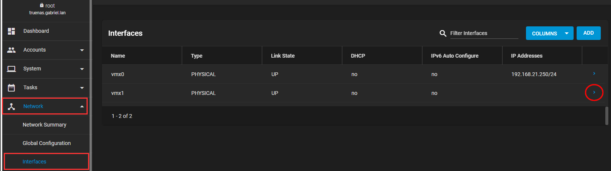
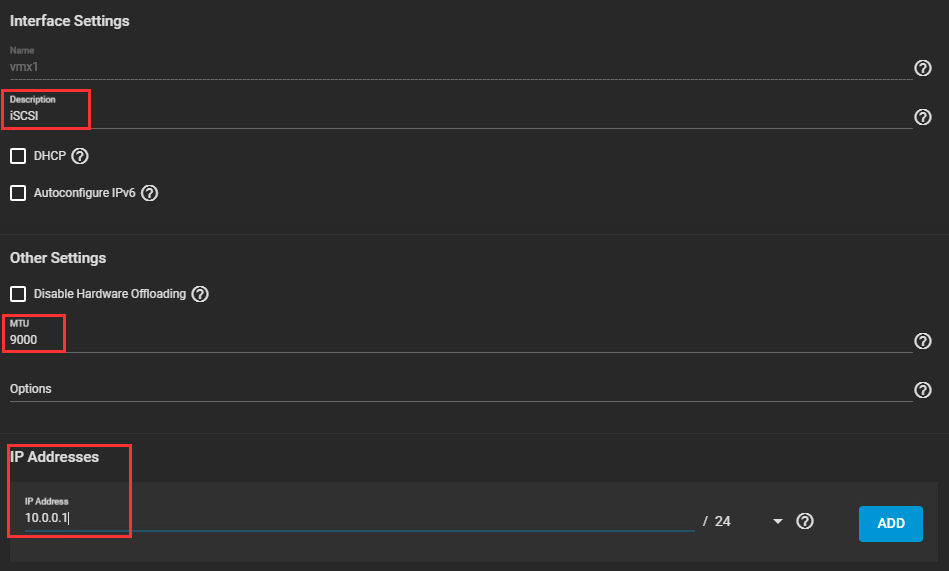
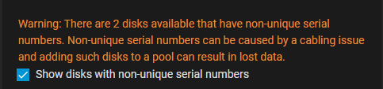
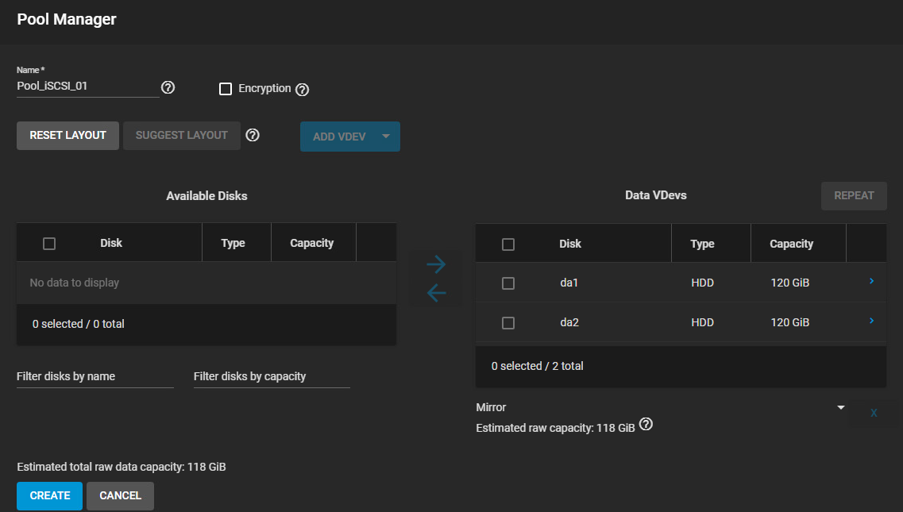
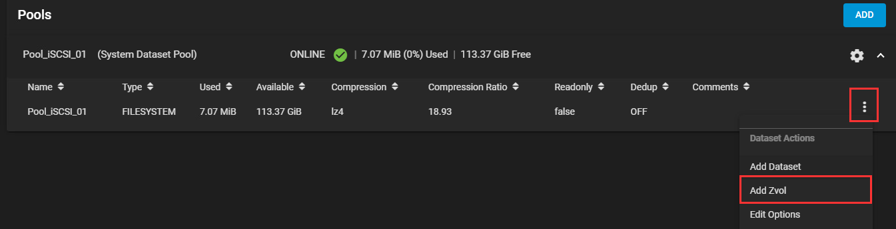
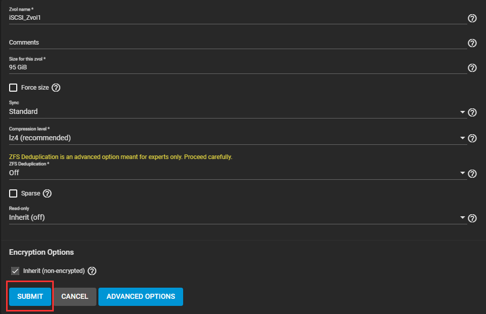
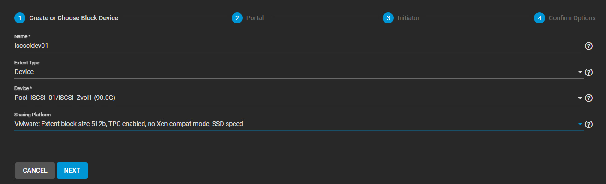
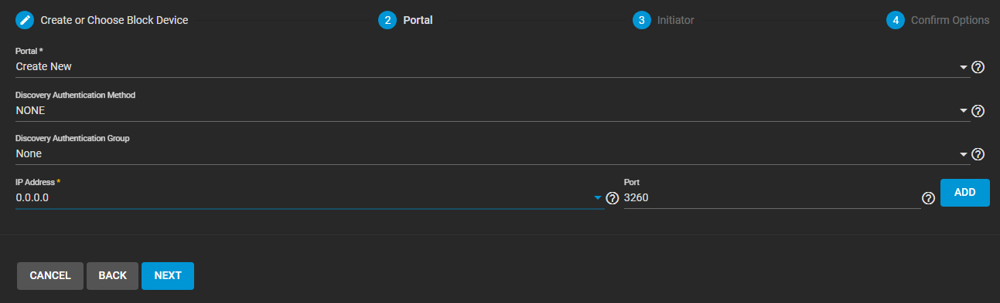
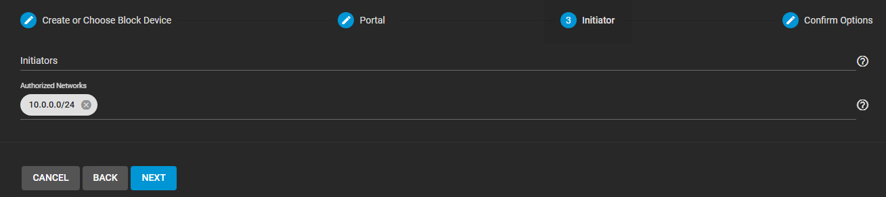

import useBaseUrl from '@docusaurus/useBaseUrl';
import ThemedImage from '@theme/ThemedImage';
import Tabs from '@theme/Tabs';
import TabItem from '@theme/TabItem';

# Laboratoire 15

# Mise en place d'un serveur de stockage partagé iSCSI

* * *

## Préalables ✅
  - 3 hyperviseurs ESXi qui contiennent:
    - 4 cartes réseaux:
        - 1 carte réseau branché sur votre passerelle personnelle
        - 2 cartes réseaux branchés sur Acces-Internet2 (vSwitch Distribué)
        - 1 carte réseau inutilisée (pour le moment)
    - 1 instance de vCenter fonctionnelle

## Objectifs 🎯
  - Mettre en place un stockage réseau de type iSCSI
  - Découvrir trueNAS
  - Effectuer une première migration de *vm*

## Schéma de travail

    <ThemedImage
        alt="Schéma"
        sources={{
            light: useBaseUrl('/img/Virtu/Labo15_W.svg'),
            dark: useBaseUrl('/img/Virtu/Labo15_D.svg'),
        }}
    />

## Étapes de réalisation 🔢

### 1. Installation de TrueNAS-Core

Sur LabInfo, créez une machine virtuelle avec les caractéristiques suivantes:

- 2 coeurs
- 8192Mo de mémoire vive
- 1 disque dur de 40Go pour l'installation du système
- 1 carte réseau branché à votre passerelle personnelle (E1000)
- 1 lecteur optique dans lequel vous mettrez l'iso de TrueNas-13.0-U6.8.iso

:::important
Vous devrez apporter des modifications au matériel un peu plus loin dans le laboratoire. Pour l'instant, je vous recommande de procéder à l'installation avec les spécifications ci-dessus.
:::

Procédez à l'installation par vous-même. Prenez votre temps et appliquez-vous. Configurez le réseau convenablement, incluant le nom de domaine etc.

### 2. Configurations supplémentaires de TrueNAS-Core

Une fois que vous aurez terminé l'installation de TrueNAS-Core, que vous aurez configuré correctement les interfaces réseaux pour joindre son interface web, vous pourrez apporter quelques ajustements supplémentaires:

- Ajouter deux disques dur de 120Go qui nous serviront de stockage réseau (iSCSI).
- Ajouter une carte réseau supplémentaire qui sera dédiée au stockage.

### 3. Configuration de l'interface supplémentaire dans TrueNas

Dans l'interface Web de TrueNas, sélectionnez `Network` → `Interfaces`, puis cliquez sur la petite flèche bleu aux côtés de la nouvelle interface ( `>` ). Vous verrez la configuration actuelle s'afficher (aucune), puis vous pourrez sélectionner `Edit`.

Dans les différents réglages de l'interface:
- Une description si vous le désirez
- Un MTU de 9000 (Jumbo frames permettant de meilleures performances)
- Une adresse IP dans le sous-réseau que vous aurez déterminé pour iSCSI

Cliquez sur `Apply` pour confirmez vos modifications.

### 4. Configuration d'une cibles iSCSI sur TrueNAS

Dans l'interface de TrueNAS, dirigez-vous dans `Storage` → `Pools` et cliquez sur `Create Pool`.

- Nommez votre pool (Ex: Pool_iSCSI_01)
- Sélectionnez vos deux disques durs. (Redondance)
- Sélectionnez le *layout* mirroir.

:::caution
Il se peut que vous ayez un message comme celui-ci: 
 
C'est vraisemblablement causé par le fait que nous utilisons des disques virtuels. Vous pouvez ignorer le message sans danger.
:::

Voici à quoi vos configurations devraient ressembler:

Cliquez finalement sur `create`.

Voilà! Vous venez de créer votre pool ZFS...

>*ZFS ? Ce n'était pas supposé être en iSCSI notre configuration Gabriel ?*
>
>*-Les étudiants*

Oui! Vous avez raison. Nous travaillerons en iSCSI, mais TrueNAS utilise **ZFS** par défaut. Nous allons donc utiliser une fonctionnalité de **ZFS** qui nous permet de simuler un bloc de stockage brut (*raw*).

Cliquez sur `...` à droite de votre *pool* et sélectionnez `Add Zvol`

Les paramètres à configurer sont les suivants:

- Zvol Name: iSCSI_Zvol1
- Taille: 90Go (On ne doit pas dépasser 80% de l'espace disponible car nous devons laisser de l'espace aux métadonnées).
- Sync: Standard
- Compression: lz4
- Déduplication: Désactivé

Une fois le volume créé, voici ce que vous devriez retrouver comme configuration:

- Un pool ZFS de 120Go en mirroir
    - Contenant un volume de 90Go utilisable

Dans l'interface web de TrueNAS, dirigez-vous maintenant vers `Sharing` → `Block Shares (iSCSI)` puis cliquez sur `Wizard` pour démarrer l'assistant de création d'un nouveau partage iSCSI.

Cet assistant nous aidera à créer notre *block device*. Les paramètres à utiliser sont les suivants:

- Name : iscsidev01
- Extent: Device
- Device: Sélectionnez votre volume Zvol
- Sharing platform: VMware...speed

À l'étape suivante, nous devons créer un *portal*. Il s'agit ni plus ni moins de l'adresse et du port de destination pour les paquets. Dans un réseau de production, nous devrions protéger ce *portal* avec différentes méthodes d'authentification. Comme nous sommes dans le cadre d'un laboratoire entièrement temporaire et dans l'objectif d'effectuer des tests, vous pouvez laisser les paramètres d'authentification à *None*.

À l'étape suivante, c'est la configuration des initiateurs (les clients iSCSI, soit les hyperviseurs ESXi dans notre cas). Nous pourrions entrer les **iqdn** de nos hyperviseurs pour un maximum de sécurité. Dans un laboratoire comme celui-ci, nous pouvons simplement nous contenter d'entrer les réseaux autorisés. 

Voilà! Vous pourrez cliquer sur `submit` à la fenêtre suivante.

Bien que notre configuration iSCSI soit terminé, il nous faut maintenant démarrer le service iSCSI dans TrueNAS. Dans le volet de gauche, sélectionnez `Services` puis activez iSCSI (Activez le démarrage automatique également.)

### 5. Configuration des hyperviseurs

Dans le prochain cours, nous verrons comment mettre en place un vSwitch Distribué pour utiliser notre nouveau stockage iSCSI.