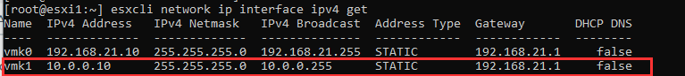
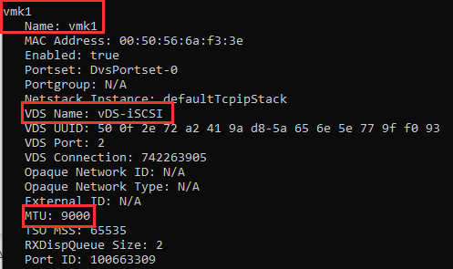
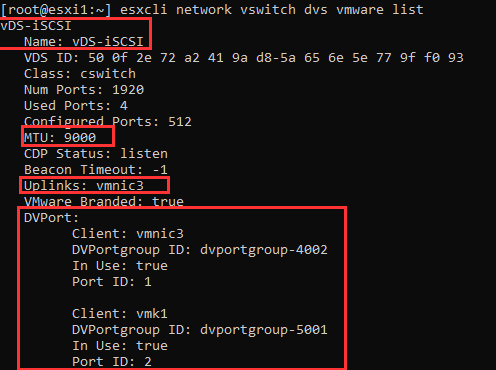
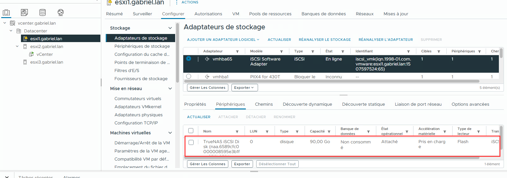
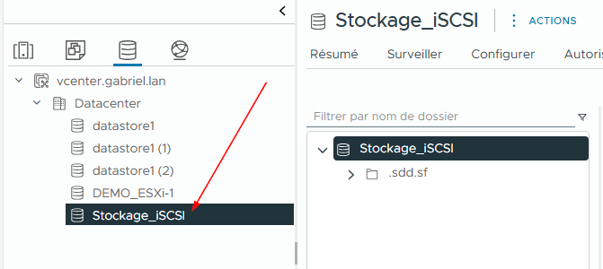

import useBaseUrl from '@docusaurus/useBaseUrl';
import ThemedImage from '@theme/ThemedImage';
import Tabs from '@theme/Tabs';
import TabItem from '@theme/TabItem';

# Laboratoire 16

# Connexion des hyperviseurs au stockage iSCSI

* * *

## Préalables ✅
  - Avoir complété le laboratoire 15


## Objectifs 🎯
  - Exploiter un stockage iSCSI avec VMware
  - Effectuer des tests de migrations

## Étapes de réalisation 🔢

### 1. Créer un vDS dédié pour iSCSI

:::tip[Rappelez-vous!]
**Pourquoi un réseau dédié au stockage ?**
- Isole le trafic de stockage du trafic de gestion ou web
- Évite la congestion et améliore les performances
- Permet une meilleure surveillance
:::

Dans les laboratoires précédents, nous avons vu comment créer des *vSS* et des *vDS*. Comme nous avons besoin de créer un réseau indépendant pour notre stockage iSCSI, nous allons créer un *vDS* qui sera par la suite utiliser par nos hyperviseurs à des fins de stockage.

Dans **vCenter**, créez un nouveau *vDS* avec les paramètres suivants:

- **Nom:** `vDS-iSCSI`
- **Liaisons montantes:** `1` (normalement il faudrait prévoir une redondance)
- **Groupe de ports par défaut:** ⚠️Décochez!⚠️ (Nous créerons le groupe de port plus loin)

Une fois le *vDS* créé, ajustez le **MTU** à 9000. Pour ce faire, vous n'avez qu'à sélectionner le *vSwitch* distribué et cliquer sur `Modifier les paramètres` dans le menu `Action`.

#### 1.1 Ajouter les hôtes ayant accès au vDS

Il nous faut maintenant ajouter les hôtes à la configuration du *vSwitch* distribué:
- Faites un clic à l'aide du bouton de droite sur votre *vSwitch* distribué et sélectionnez `Ajouter et gérer des hôtes`.
- Sélectionnez tous vos serveurs ESXi et sélectionnez la *vmnic* adéquate pour votre réseau de stockage (l'adapteur physique toujours disponible).
- Ne créez pas de *vmkernel port* pour l'instant, nous le ferons un peu plus loin.
- Aucune migration de *VM* n'est à faire
- Cliquez sur `Terminer`

#### 1.2 Créer le groupe de ports distribué

Nous allons maintenant créer le groupe de ports distribué. Toujours dans *vCenter*, sélectionnez le *vSwitch* et cliquez sur `Nouveau groupe de ports distribué` à partir du menu `Action`.

- **Nom:** `iSCSI-VMK`
- **Tous les autres paramètres:** Par défaut

#### 1.3 Créer les ports vmkernel

Il nous reste plus qu'à créer les *vmkernel port* pour nos hôtes ESXi. Cette tâche peut très bien se faire via *vCenter*.

:::tip[Rappel]
Les *vmkernel ports* représentent les ports d'un commutateur virtuel (standard ou distribué) destinés à être utilisé pas les noeuds ESXi pour différents services, comme iSCSI dans notre cas.
:::

**Pour chaque noeud dans vCenter:**

- Menu `Action`
- Cliquez sur `Ajouter une mise en réseau...`
- Sélectionnez `Adapteur réseau vmkernel`
- Sélectionnez votre groupe de port (iSCSI-VMK)
- Au niveau des propriétés du port, vous ne devriez avoir rien à changer. Cependant assurez-vous que le **MTU** est bien à 9000. Ne sélectionnez aucun service.
- Configurez une IP pour ce port. N'oubliez pas, il s'agit d'un réseau complètement indépendant que vous partagerez avec TrueNAS et les autres noeuds.
- Cliquez sur `Terminer`

#### 1.4 Vérifications

Cette étape est facultative, mais elle vous permet de valider que tout est en place pour que ça fonctionne. Répétez chacune de ces étapes pour chaque noeud. D'abord, connectez-vous à l'aide d'un terminal SSH.

Vérifier que votre interface *vmkernel* apparait bien en lancant cette commande:
```bash
esxcli network ip interface ipv4 get
```



Ensuite vérifiez que le **MTU** est bien à 9000:
```bash
esxcli network ip interface list
```



Poursuivez en vérifiant la configuration du vDS avec cette commande:
```bash
esxcli network vswitch dvs vmware list
```


### 2. Configurer les initiateurs iSCSI sur ESXi

*A priori*, il nous faudra activer l'adapteur logiciel iSCSI dans chaque noeud. **Pour chacun des noeuds ESXi dans vCenter**, faites les étapes suivantes:

- Sélectionnez le noeud dans l'inventaire
- Dirigez-vous dans le menu `Configurer` puis `Stockage`
- Dans la section `Adapteurs de stockage`, cliquez sur `Ajouter un adapteur logiciel` et sélectionnez iSCSI.

#### 2.1 Lier le port vmkernel à l'adapteur iSCSI logiciel

Il nous faut à présent associer le port *vmkernel* que nous avons créé un peu plus tôt à notre adapteur iSCSI logiciel. **Pour chacun des noeuds ESXi dans vCenter**, faites les étapes suivantes:

- Sélectionnez votre adapteur iSCSI et cliquez sur `Liaison de port réseau`
- Cliquez sur `Ajouter` et sélectionnez votre port *vmkernel*

#### 2.2 Ajouter une cible iSCSI dynamique

Une cible dynamique permet à ESXi d'interroger la cible et de découvrir automatiquement tous les **LUN** disponibles. *A contrario*, une cible statique doit être entré manuellement.

**Pour chacun des noeuds ESXi dans vCenter**, faites les étapes suivantes:

- Sélectionnez votre adapteur iSCSI et cliquez sur `Découverte dynamique`
- Cliquez sur `Ajouter` et entrez les informations de TrueNAS puis `Ok`
- Une fois les informations entrées, cliquez consécutivement sur `Réanalyser l'adapteur` et `Réanalyser le stockage`.

Si tout fonctionne, vous devriez voir votre stockage TrueNAS apparaitre dans l'onglet `périphériques` dans la même page.



### 3. Configurer la nouvelle banque de données

Il ne nous reste plus qu'à configurer une nouvelle banque de données, comme nous le ferions avec un disque dur local. Pour ce faire, sélectionnez votre *Datacenter* dans *vCenter*, menu `Actions` → `Stockage` → `Nouvelle banque de données`:

- **Type:** VMFS
- **Hôte:** N'importe lequel (choisissez)
- **Nom:** Stockage_iSCSI
- **Version:** VMFS6
- **Configuration de la partition:** Par défaut

Validez que votre stockage a bien été créé:



### 4. Test de migration 

Comme nous l'avons vu en classe. Le stockage en réseau se démarque par sa capacité d'être un support de migration. Nous allons donc tester cette capacité avec notre nouveau stcokage.

Installez une machine virtuelle (Windows ou Linux) sur l'un de vos noeuds en prenant soins de sélectionner votre stockage iSCSI.

:::caution
Je vous déconseille d'installer cette machine virtuelle sur le même noeud que *vCenter*. Ce-dernier étant très exigeant en ressources, privélégiez un autre hyperviseur.
:::

#### 4.1 Migrer la VM

Dans l'interface de *vCenter*, faites un clic à l'aide du bouton de droite de la souris sur votre *vm* et sélectionnez `migrer...`

:::tip
Votre *VM* doit être à l'arrêt puisque nous n'avons pas encore mis *vMotion* en place.
:::

- **Type de migration:** Modifier uniquement la ressource de calcul
- **Ressources de calcul:** Sélectionnez le noeud de destination
- **Réseau:** Sélectionnez le réseau de destination

La migration devrait être quasiment instantanné. Démarrez de nouveau votre machine virtuelle pour confirmer que tout fonctionne normalement.

