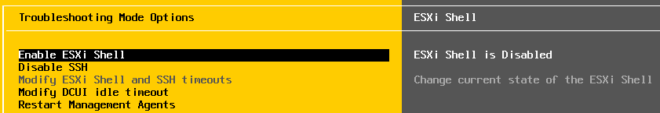
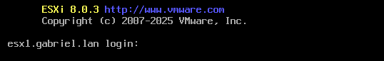
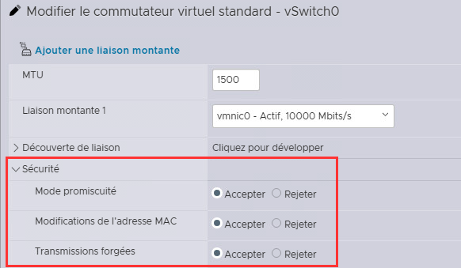

import useBaseUrl from '@docusaurus/useBaseUrl';
import ThemedImage from '@theme/ThemedImage';
import Tabs from '@theme/Tabs';
import TabItem from '@theme/TabItem';

# Projet final - Phase 1

# Mise en place d'une infrastructure VMware complète

:::danger[Travail individuel]
Le projet doit être réalisé individuellement. L'entraide est permise, cependant:
  - Vos captures d'écran doivent être uniques et prises par vous.
  - Votre documentation et vos explications doivent être votre composition (pas celle de l'IA 🥲 ni celle d'un collègue)
  - Le plagiat (IA, collègue ou autre) entrainera systématiquement une note de zéro.
:::

* * *

Il ne nous reste plus que quelques éléments à voir avec les produits VMware dans le cadre de ce cours. Tout ce qui nous reste à voir concerne et/ou tourne autour du *clustering*. Comme vous connaissez, en bonne partie, les avantages, les inconvénients et les raisons pour lesquelles nous mettons en place ces *clusters* (grâce à la portion Proxmox du cours), ces dernières notions vous seront transmises sous la forme d'un projet synthèse.

Un cluster vSphere, comme un cluster Proxmox, est un regroupement logique de plusieurs hôtes. Dans vSphere, les noeuds ESXi ainsi rassemblés gérés sous la forme d'une seule ressource par vCenter. Trois piliers caractérisent le clustering VMware:

1. **vMotion (Migration à chaud)**
    - Déplace une VM d'un hôte à un autre sans interruption de service.
    - La VM reste allumée et accessible pendant le déplacement.
    - Parfait pour la maintenance et/ou l'équilibrage de charge.

2. **vSphere HA (*High Availability*)**
    - Redémarre automatiquement les VMs si un hôte tombe en panne.
    - Protection contre les défaillances matérielles.
    - Temps d'arrêt réduit au minimum.

3. **vSphere DRS (*Distributed Ressource Scheduler*)**
    - Équilibre automatiquement la charge de travail
    - Utilise *vMotion* pour déplacer les *VMs* selon les besoins
    - Optimise l'utilisation des ressources du *cluster*.

## Phase 1

La première étape du projet consiste à mettre en place l'infrastructure virtuelle avec laquelle nous mettrons en place les différents services en lien avec le clustering. ⚠️**Vous devez faire une nouvelle infrastruscture.**⚠️

- La nouvelle infrastructure n'est pas installée de la même façon.
- Nous utiliserons des vSwitchs standards et distribués.
- Cela vous permettra également de réviser certaines notions.


## Schéma de la phase 1

<div style={{textAlign: 'center'}}>
    <ThemedImage
        alt="Schéma"
        sources={{
            light: useBaseUrl('/img/Virtu/Projet-Phase1_W.svg'),
            dark: useBaseUrl('/img/Virtu/Projet-Phase1_D.svg'),
        }}
    />
</div>

### 1. Passerelle et Serveur DNS

Nous allons devoir se créer une passerelle et un serveur DNS pour répondre à nos besoins. Pour la passerelle, vous pouvez utiliser le modèle `MODELE_pfSense (Sans DHCP)` disponible à la racine du dossier Modèles dans LabInfo. Configurez une première carte sur `Accès Internet` et l'autre sur l'un de vos réseaux privés. Prenez note qu'en ce qui me concerne, j'utiliserai le réseau privé 192.168.21.0/24 pour mes démonstrations. Vous pouvez suivre mon plan d'adressage ou utiliser le vôtre.

:::danger[Choix du nom de domaine]
Choisissez-vous un nom de domaine personnalisé. Je vous recommande *prenom.lan*.

**NE PRENEZ PAS CEMTI.CA**<br/>
**NE PRENEZ PAS LABINFO.CEMTI.CA**<br/>
**NE PRENEZ PAS QUELQUECHOSE.CEMTI.CA**<br/>
**NE PRENEZ PAS LABINFO.QUELQUECHOSE**<br/>

Vous aurez des conflits avec les noms de domaine du Cégep.
:::

Pour le serveur DNS, je vous laisse le soin de choisir le système d'exploitation de votre choix. Néanmoins, assurez-vous de créer une zone de recherche direct et une autre inversée dans lesquelles vous mettrez en place les enregistrements suivants:

**Zone de recherche direct:**
|Nom|Type|Destination|Description|
|---|----|-----------|-----------|
|@|NS|ns1.domaine.lan.|Enregistrement NS pour le serveur de noms|
|@|A|192.168.21.5|Enregistrement A au nom de la zone pointant vers l'IP de mon serveur DNS|
|ns1|A|192.168.21.5|Traduction du nom pour ns1|
|esx1|A|192.168.21.11|Enregistrement A pour ESXi-1|
|esx2|A|192.168.21.12|Enregistrement A pour ESXi-2|
|esx3|A|192.168.21.13|Enregistrement A pour ESXi-3|
|vcenter|A|192.168.21.21|Enregistrement A pour vCenter|

**Zone de recherche inverse:**
|Nom|Type|Destination|Description|
|---|----|-----------|-----------|
|@|NS|ns1.domaine.lan.|Enregistrement NS pour le serveur de noms|
|5|PTR|ns1.domaine.lan.|Enregistrement PTR pour ns1|
|11|PTR|esx1.domaine.lan|Enregistrement PTR pour ESXi-1|
|12|PTR|esx2.domaine.lan|Enregistrement PTR pour ESXi-2|
|13|PTR|esx3.domaine.lan|Enregistrement PTR pour ESXi-3|
|21|PTR|vcenter.domaine.lan|Enregistrement PTR pour vCenter|

### 2. Déploiement des ESXi

J'ai créé un modèle d'hyperviseur ESXi pour vous permettre de gagner du temps. Vous pouvez évidemment l'utiliser, mais vous devrez **<span class="red-text">obligatoirement l'adapter. Sans quoi, vous aurez différentes problmatiques.</span>** Si vous préférez, vous pouvez aussi installer individuellement les trois hyperviseurs, c'est également une possibilité viable. **<span class="red-text">Si vous clonez mon modèle, ne faites qu'un hyperviseur à la fois!</span>**

#### 2.1 Clone et importation

    - Dirigez-vous dans le dossier `Modèles` → `420-5V6` et cloner le modèle **MODELE_ESXi_8.0.3_Golden** vers une machine virtuelle.
    - Personnaliser le matériel de la machine virtuelle:
        - Ajustez la première carte réseau pour brancher celle-ci sur le réseau privé que déssert votre passerelle.
        - Ajoutez une deuxième interface réseau que vous relierez sur un autre de vos réseaux privés. ( iSCSI )
        - Ajoutez une troisième interface réseau que vous relierez sur un autre de vos réseaux privés (Différent des interfaces précédentes). Cette troisième carte n'est pas représentée dans le schéma pour l'instant. Nous nous en occuperons lors de la prochaine phase du projet.
        - Ajoutez un second disque dur de 40Go en vous assurant de le <u>relier au contrôleur SATA.</u>
        - Ajoutez un troisième disque dur de 250Go en vous assurant de le <u>relier au contrôleur SATA.</u>
        - Supprimez le contrôleur SCSI qui aura été ajouté automatiquement.
        - <mark>**Sur le noeud hébergeant vCenter seulement:**</mark>
            - Augmentez la mémoire vive à 24Go
        - Terminez.
    - Démarrez la machine virtuelle que vous venez de déployer.

#### 2.2 Configuration de l'hyperviseur cloné

    - Dans la console (écran jaune et gris), ajustez les paramètres IP et DNS conformément à ce que vous avez inscrit dans votre serveur DNS.
    - Un peu comme avec Active Directory et Windows, il faut nous assurer de l'unicité de chacun des hyperviseurs. Comme nous clonons une machine, il faut donc faire quelques modifications sur l'hyperviseur pour s'assurer qu'il possède un identifiant unique:
        - Toujours dans la console, dirigez-vous dans `Troubleshooting options` et activez `ESXI Shell`
          
        - Retournez dans le menu principal de la console et appuyez sur les touches <kbd>alt</kbd> + <kbd>f1</kbd>. Un shell devrait s'ouvrir vous permettant de vous identifier à l'aide de votre compte root.
          
        - Évidemment, identifiez-vous.
        - Une fois identifié dans le shell, nous devrons effectuer quelques modifications importantes:
            - Éditez le fichier `/etc/vmware/esx.conf` et supprimez la ligne de texte commençant par `/system/uuid`. Cela forcera ESXi a créer un nouvel identifiant système. Ne cherchez pas Nano, il n'existe pas sous vmware. Vous devez utiliser **vi**, le papa de **vim** 😈. Assurez-vous de bien enregistrer vos modifications.
            - Supprimez les certificats liés à l'identification de la machine. Il y a deux fichiers à supprimer : `/etc/vmware/ssl/rui.crt` et `/etc/vmware/ssl/rui.key`.
            - Finalement, il nous faut recréer le VMkernel Port 0. Cette interface virtuelle possède, elle aussi, une adresse MAC. Comme ESX a été cloné, l'adresse MAC doit être regénéré, sans quoi vous aurez beaucoup d'instabilité sur votre réseau:
            ```bash
            #Suppression du VMkernel Port 0
            esxcfg-vmknic -d Management\ Network

            #Création d'un nouveau VMKernel Port 0
            esxcfg-vmknic -a -i w.x.y.z -n 255.255.255.0 Management\ Network
            ```
        - **Redémarrez ESXI**

#### 2.3 Ajustement du réseau de gestion

    - Votre hyperviseur est presque prêt, il ne reste qu'à désactiver certains éléments de sécurité sur le vSwitch0:

        - Dirigez-vous dans l'interface web de votre nouvel hyperviseur et éditez les paramètres de sécurité du vSwitch0 comme suit:

          
          
**<mark>Répétez les étapes 2.1, 2.2, et 2.3 pour chaque hyperviseur cloné!</mark>**

### 3. Déploiement du client

J'ai créé un modèle de client que vous devez utiliser <span class="red-text">**obligatoirement**</span>. La raison est bien simple, vous devrez utiliser un script qui se trouve à l'intérieur du modèle à utiliser.

Dirigez-vous donc dans le dossier `Modèles` → `420-5V6` et cloner le modèle **Client5V6_ScriptvCenter**. Ajustez sa carte réseau pour que celle-ci soit reliée au réseau interne que déssert votre passerelle.

Suite au démarrage de votre client, configurez lui une adresse IP statique. Ensuite, démarrez un navigateur web au sein de votre client. Pour chaque noeud ESXi, réalisez les étapes suivantes:

- Ouvrez un navigateur web et tentez d'accéder à l'hôte ESXi **<u>à partir du nom de domaine.</u>**
- Ouvrez une session et confirmez que l'hyperviseur fonctionne bien.

### 4. Configuration d'un vSwitch Standard pour iSCSI

Nous devons à présent configurer un réseau pour notre stockage iSCSI. Dans le laboratoire précédent, nous avions utilisé un *vSwitch* distribué. Or, pour utiliser un tel *vSwitch*, nous devons avoir accès à *vCenter*, que nous n'avons pas encore installé. Pour faire changement, nous utiliserons des *vSwitch* standards cette fois.

<mark>Pour chaque serveur ESXi, suivez les étapes suivantes:</mark><br/><br/>

**Création du *vSwitch Standard:***
- Menu `Mise en réseau` → `Commutateurs virtuels`
- Cliquez sur `Ajouter un commutateur virtuel standard`
    - Nom: vSwitch1
    - MTU: 9000
    - Liaison montante 1: vmnic1
    - Sécurité:
        - **Mode Promiscuité:** Accepter
        - **Modifications de l'adresse MAC:** Accepter
        - **Transmissions forgées:** Accepter
- Ajouter

**Création d'un groupe de ports:**
- Menu `Mise en réseau` → `Groupe de ports`
- Cliquez sur `Ajouter un groupe de ports`
    - Nom: iSCSI
    - VLAN: 0
    - Commutateur virtuel: vSwitch1
- Ajouter

**Création d'un VMkernel port:**
- Menu `Mise en réseau` → `Ajouter une NIC VMKernel`
    - Groupe de ports: iSCSI
    - MTU: 9000
    - Version IP: IPv4
    - Paramètres IPV4: Statique
      - IP: *Votre IP iSCSI*
      - Masque: 255.255.255.0
    - Pile TCP/IP: Par défaut
    - Services: Aucun

### 5. Activation de l'adapteur logiciel iSCSI

**<mark>Pour chaque serveur ESXi</mark>**, dirigez-vous dans le menu `stockage` → `adapteurs` et cliquez sur `iSCSI Logiciel`. Activez iSCSI et attendez quelques secondes que tous les champs disponibles s'affichent dans la fenêtre.

Lorsque vous le pourrez, faites une liaison avec votre port `vmk1` que vous avez préalablement créé et ajoutez immédiatement votre cible dynamique (l'ip de TrueNAS).

### 6. Mise en place d'un stockage réseau iSCSI

J'ai créé un modèle de VM **TrueNAS** pour que vous puissiez vous concentrer sur la mise en place du stockage iSCSI plutôt que sur l'installation. Lorsque vous aurez importé le modèle, n'oubliez pas de configurer un adapteur réseau sur votre réseau de gestion et l'autre sur votre réseau iSCSI. De plus, vous devrez ajouter deux disques durs pour configurer votre pool ZFS. Comme *vCenter* sera installé directement sur notre stockage iSCSI, je vous recommande de mettre 2 x 500Go en mode *striping* pour totaliser 1To d'espace disque sur votre iSCSI.

Référez-vous aux laboratoires précédents pour mettre en place votre stockage iSCSI sur le réseau. Lorsque ce sera fait, <mark>**créez une nouvelle banque de données sur l'un des hyperviseurs**</mark>. Celle-ci nous sera utile pour y installer vCenter.

:::tip
Une fois que votre banque de données VMware aura été créée à partir de l'un des hyperviseurs, elle devrait également apparaitre dans les autres hyperviseurs. Relancer une analyse des stockages au besoin.
:::

### 7. Déploiement de vCenter

Dans le client Windows que vous utilisez. Dirigez-vous dans `C:\VCSA\` et éditez le fichier *parameters.json* pour faire correspondre vos informations:

```json title='C:\VCSA\parameters.json' showLineNumbers
{
  "__version": "2.13.0",
  "new_vcsa": {
    "esxi": {
      "hostname": "esx3.gabriel.lan",       #Hôte ESXi qui accueillera vCenter
      "username": "root",                   #Username ESXi
      "password": "P@ssw0rd",               #Mot de passe ESXi
      "deployment_network": "VM Network",   #Le réseau utilisé par la VM vCenter
      "datastore": "iSCSI_DATA"             #La banque de données à utiliser pour l'installation
    },
    "appliance": {
      "name": "vCenter",
      "deployment_option": "tiny",
      "thin_disk_mode": true
    },
    "network": {
      "ip_family": "ipv4",                  #Configurations IP pour vCenter
      "mode": "static",
      "ip": "192.168.21.21",
      "dns_servers": ["192.168.21.5"],
      "prefix": "24",
      "gateway": "192.168.21.1"
    },
    "os": {
      "ntp_servers": "0.ca.pool.ntp.org",   #Activation du protocole SSH pour Root
      "password": "P@ssw0rd",
      "ssh_enable": true
    },
    "sso": {
      "password": "P@ssw0rd",               #Votre domaine SSO ainsi que le mot de passe de l'administrateur
      "domain_name": "gabriel.lan"
    }
  },  
    "ceip": {                               #Réponse négative au programme d'amélioration du produit
    "settings": {
      "ceip_enabled": false
    }
  }
}
```

:::caution
Les commentaires ne sont pas acceptés dans le format JSON! Ne copiez donc pas mes commentaires bêtement, ça ne fonctionnera pas.
:::

Une fois que votre fichier JSON est bien modifié. Lancez PowerShell 7 dans Windows et entrez la commande suivante: `C:\VCSA_Deploy.ps1`. Si les configurations fournies dans votre fichier JSON sont bonnes, le déploiement devrait prendre de 20 à 30 minutes. Autrement, un message d'erreur vous sera fourni, vous explicant ce qui a causé l'échec du déploiement. Corrigez l'erreur, supprimez le dossier `C:\deploy-log` et tentez le coup à nouveau.

### 8. Configuration initiale de vCenter

Accédez à l'interface de votre instance vCenter et ouvrez une session:

- Créez votre *Datacenter*
- Ajoutez vos noeuds ESXi au *datacenter*

**<span class="red-text">Fin de la phase 1</span>**

:::tip
À ce stade, si tout fonctionne bien, je vous recommande de prendre des *snapshots* dans LabInfo. Identifiez-les pertinemment. En cas de retour en arrière, vous ne pourrez pas revenir en arrière sur un seul hyperviseur, vous devrez revenir en arrière pour les trois ainsi que TrueNAS

Vous pouvez utiliser la date et une brève description. Ex: 20251201-Phase1
:::