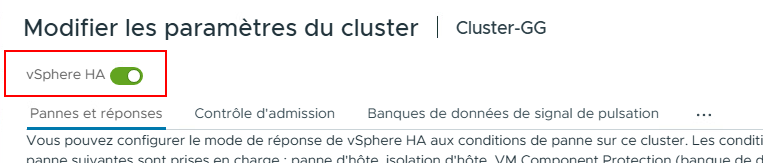
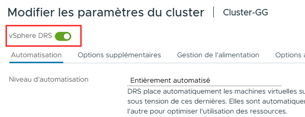

import useBaseUrl from '@docusaurus/useBaseUrl';
import ThemedImage from '@theme/ThemedImage';
import Tabs from '@theme/Tabs';
import TabItem from '@theme/TabItem';

# Projet final - Phase 2

:::danger[Travail individuel]
Le projet doit être réalisé individuellement. L'entraide est permise, cependant:
  - Vos captures d'écran doivent être uniques et prises par vous.
  - Votre documentation et vos explications doivent être votre composition (pas celle de l'IA 🥲 ni celle d'un collègue)
  - Le plagiat (IA, collègue ou autre) entrainera systématiquement une note de zéro.
:::

* * *

Il est essentiel que vous ayez dûment complété la Phase 1 du projet avant de vous lancer dans cette portion du projet. Prendre le risque de sauter certaines étapes pourrait vous obliger à tout recommencer.

* * *

## Phase 2

Dans la phase 2, nous optimiseront l'infrastructure virtuelle et déploieront certaines technologies en lien avec le *clustering*.

### 9. Migration vers vSwitch Distribué

Comme vous l'avez peut-être déjà remarqué dans la phase 1 de ce projet, nous n'utilisons que des *vSwitch Standards* pour le moment. En classe, nous avons vu que l'utilisation de *vSwitch Standards* n'est pas idéal puisque celles-ci nécessitent:

- Une configuration séparée.
- Des répétitions dans le travail de gestion et d'administration. 😮‍💨
- Une attention particulière pour éviter les erreurs (tout comme ce projet). 👀

Nous allons donc migrer notre configuration actuelle pour utiliser des *vSwitch Distribués* qui nous permettent une meilleure efficacité et un risque d'erreur amoindri. Voici comment nous allons procéder. Voici l'architecture cible après les manipulations:


#### 9.10 Création d'un premier vDS

Dans **vCenter**, sélectionnez votre *datacenter* puis cliquez sur `Nouveau Distributed Switch`:

- **Nom:** vDS Production
- **Version:** 8.0.3
- **Nombre de liaison montante:** 2
- **Network I/O Control:** Activé
- **Default PortGroup:** Aucun pour l'instant

#### 9.11 Création d'un second VDS pour vMotion et vSAN

Dans **vCenter**, sélectionnez votre *datacenter* puis cliquez sur `Nouveau Distributed Switch`:

- **Nom:** vDS Services
- **Version:** 8.0.3
- **Nombre de liaison montante:** 2
- **Network I/O Control:** Activé
- **Default PortGroup:** Aucun pour l'instant
- **MTU:** 9000 (Changeable dans les paramètres par la suite)

#### 9.20 Création des groupes de ports pour vDS Production

Nous aurons besoin de deux groupes de ports distincts sur notre **vDS Production**: Un premier groupe pour l'administration et un second pour les *VMs*. Faites un clic à l'aide du bouton de droite de la souris sur votre nouveau vDS et sélectionnez `Nouveau groupe de ports distribués`:

- **Nom:** DPG-Management
- **Liaison de port:** Statique
- **Nombre de ports:** 8
- **Pool de ressources:** Aucun
- **VLAN:** Aucun
- **Sécurité:**
    - **Mode promiscuité:** Accepter
    - **Modifications de l'adresse MAC:** Accepter
    - **Transmissions forgées:** Accepter
- **Formation du traffic:** Par défaut
- **Association et basculement:** Par défaut
- **Surveillance:** Par défaut
- **Divers:** Par défaut

**<span class="red-text"><u>Répétez les mêmes étapes pour vous créer un groupe de ports nommé DPG-VM-Network sur le même vDS</u></span>**

#### 9.21 Création des groupes de ports pour vDS Services

Pour les groupes de ports du **vDS Services**, procédez de la même façon en prenant soin de créer un groupe de ports distribué pour vMotion et un autre pour vSAN. <mark>**Ne mettez surtout pas de VLANs en place**</mark>, vos commutateurs privés sur LabInfo ne les supportent pas.

Assurez-vous de créer les groupes de ports sur les bons commutateurs virtuels.

#### 9.3 Ajouter les hôtes aux vDS

Nous devons maintenant permettre aux hyperviseurs ESXi d'utiliser les vDS que nous venons de créer. Pour cela, il faut ajouter des hôtes aux commutateurs virtuels. **Pour chacun des vDS, faites les étapes suivantes:**

- Clic à l'aide du bouton de droite de la souris sur le vDS, puis `Ajoutez et gérez des hôtes`
- **Sélectionner la tâche:** Ajouter des hôtes
- **Sélectionner des hôtes:** Cocher tous les hyperviseurs
- **Gérer les adapteurs physiques:** <span class="red-text">Ne rien cocher</span>
- **Gérer les adapteurs VMKernel:** <span class="red-text">Ne rien cocher</span>
- **Migrer la mise en réseau des VMs:** <span class="red-text">Ne rien cocher</span>

#### 9.4 Migration de vmnic0 vers vDS ⚠️

:::danger[Risque de perdre la connexion!]
Cette étape est à la fois délicate et cruciale. Assurez-vous d'avoir du temps et de la concentration avant de procéder. Nous nous apprêtons à faire passer le réseau de gestion des hyperviseurs d'un **vSwitch Standard** à un **vSwitch Distribué.** Vous perdrez donc la connexion avec vos hyperviseurs pendant un court instant. Une erreur de configuration à cette étape vous obligera à revenir en arrière. Respirez par le nez, dites *namaste* et allez-y calmement 😊.
:::

**<span class="fonttaller">Pour les noeuds ne contenant <span class="red-text">PAS</span> vCenter:</span>**

Faites un clic à l'aide du bouton de droite de la souris sur `vDS Production` et sélectionnez `Ajouter ou gérer des hôtes`:

- **Sélectionnez la tâche:** Gérez la mise en réseau de l'hôte
- **Sélectionnez des hôtes:** Choisissez un seul noeud pour l'instant
- **Gérer les adapteurs physiques:** Attribuez le vmnic0 à l'uplink 1
- **Gérer les adapteurs VMKernel:** Attribuez vmk0 à votre groupe de ports `DPG-Management`
- **Migrer la mise en réseau VM:** Pas de modification ici
- **Cliquez sur `terminer`.**

<u>Refaites les mêmes étapes pour l'autre noeud ne contenant PAS vCenter</u>

<br/><br/>
**<span class="fonttaller">Pour le noeud contenant vCenter:</span>**

Observez le schéma ci-dessous. Remarquez comment, actuellement, notre machine **vCenter** dépend complètement de notre *vSwitch0*. La problématique que nous rencontreront est directement lié à cette dépendance. L'objectif est de remplacer notre *vSwitch0* (un vSS) par notre vDS-Prodction (un VDS). Or, **vCenter** possède des protections contre les coupures de connexion. Si nous tentons de nous y prendre comme nous l'avons fait avec les deux autres noeuds, **vCenter** nous bloquera.

<div style={{textAlign: 'center'}}>
    <ThemedImage
        alt="Schéma"
        sources={{
            light: useBaseUrl('/img/Virtu/ReplacevSwitch0_W.svg'),
            dark: useBaseUrl('/img/Virtu/ReplacevSwitch0_D.svg'),
        }}
    />
</div>
<br/>
**<span class="fonttaller">Plan de match</span>**

1. Relier la vmnic2 au réseau de votre passerelle (lien rose)
2. Relier la vmnic2 au vDS
3. Assigner vmk0 au vDS
4. Migrer le réseau de **vCenter**
5. Relier la vmnic0 au vDS
6. Retirer la vmnic2 du vDS

<div style={{textAlign: 'center'}}>
    <ThemedImage
        alt="Schéma"
        sources={{
            light: useBaseUrl('/img/Virtu/ReplacevSwitch0_W.gif'),
            dark: useBaseUrl('/img/Virtu/ReplacevSwitch0_D.gif'),
        }}
    />
</div>

:::caution[Gabriel où est l'étape 6 dans le schéma ?]
Elle n'apparait pas. Elle consiste simplement à retirer les liens 1 & 2.
:::

**Étape par étape:**

1. Sur l'ESXi hôte, relié l'adapteur vmnic2 (ou celui disponible) au commutateur désservi par PfSense dans LabInfo.
2. Reliez votre vDS Production à cette vmnic. Pour ce faire suivez les sous-étapes:
    - Dans **vCenter**, clic droit sur vDS Production → Ajoutez et gérez des hôtes.
    - Gérez la mise en réseau de l'hôte
        - Sélectionnez l'hôte avec **vCenter** seulement.
    - Gérez les adapteurs physiques:
        - Uplink 1: vmnic2 (ou celle qui vous concerne)
    - Gérez les adapteurs VMKernel:
        - Assignez `DPG-Management` à vmk0
    - Migrer la mise en réseau des VMs:
        - Assignez l'adapteur réseau de vCenter dans `DPG-Management`
    - Terminer
3. Vérifiez que **vCenter** est toujours accessible et que vos changements ont bien été pris en compte.
4. Ajoutez vmnic0 au vDS (retirer de vSwitch0)
    - Dans **vCenter**, clic droit sur vDS Production → Ajoutez et gérez des hôtes.
    - Gérez la mise en réseau de l'hôte
        - Sélectionnez l'hôte avec **vCenter** seulement.
    - Gérez les adapteurs physiques:
        - Uplink 2: vmnic0
    - Gérez les adapteurs VMKernel: rien à faire
    - Migrer la mise en réseau des VMs: rien à faire
    - Terminer
5. Retirez vmnic2 du vDS (utilisé temporairement)
    - Dans **vCenter**, clic droit sur vDS Production → Ajoutez et gérez des hôtes.
    - Gérez la mise en réseau de l'hôte
        - Sélectionnez l'hôte avec **vCenter** seulement.
    - Gérez les adapteurs physiques:
        - Uplink 1: vide
        - Uplink 2: vmnic0
    - Gérez les adapteurs VMKernel: rien à faire
    - Migrer la mise en réseau des VMs: rien à faire
    - Terminer

#### 9.5 Suppression des VSS0

À ce stade, tous vos noeuds sont désormais reliés au vSwitch Distrivué vDS Production que nous avons créé plus tôt. Nous n'avons plus besoin des vSwitch Standards 0 qui sont au sein des différents hyperviseurs.

Passez donc dans chacun des hyperviseurs et supprimez ces commutateurs virtuels qui sont devenus inutiles.

### 10. Création du Cluster

Dans **vCenter**, créez le *vSphere Cluster* en effectuant un clic droit sur votre *datacenter* et en sélectionnant `Nouveau Cluster`:

|Paramètre|Valeur|Notes|
|:---------:|:------:|:-----:|
|**Nom**|Cluster-*vosinitiales* EX: Cluster-GG|Nom du cluster|
|**vSphere DRS**| ❌ Désactivé | On activera manuellement plus tard|
|**vSphere HA**| ❌ Désactivé | On activera manuellement plus tard|
|**vSAN**| ❌ Désactivé | On activera manuellement plus tard|
|**Image**| Importer une image à partir d'un hôte existant | Tous les noeuds devront correspondre à cette image système.|

#### 10.1 Ajouter les noeuds au sein du cluster

Une fois le *cluster* créé, vous le verrez apparaître dans votre inventaire. Clic droit → `Ajouter des hôtes` et sélectionnez tous vos noeuds ESXi. **Inutile d'importer à nouveau une image pour vLCM (*Life Cycle Manager*), nous l'avons déjà fait lors de la création du *cluster***.

:::danger[Gabriel! Mes hyperviseurs tombent en maintenance 😱]
C'est normal! C'est le *Cluster Quickstart* qui démarre automatiquement. En gros, c'est une aide à l'administrateur...que nous n'utiliseront pas 🥲
:::

Pour désactiver le *Cluster Quickstart*, sélectionnez votre *cluster* dans l'inventaire puis dans la section `Configurer` → `Démarrage Rapide`, cliquez sur `Ignorer le démarrage rapide`.

Au besoin, faites un clic droit sur vos hyperviseurs et sortez les du mode maintenance. 🚧

### 11. Configurer vMotion

Dans les étapes précédentes, nous avons préparé un vDS pour nos services vMotion & vSAN. Cependant, nous avons pas encore configuré les interfaces **Vmkernel Ports** pour ces services. Il faut donc s'affairer à les créer maintenant. D'abord, sélectionnez un sous-réseau pour **vMotion**. Si vous désirez suivre mon propre plan d'adressage, vous pouvez également: 

|Hôte|IP vMotion|Subnet|VLAN|
|:----:|:----------:|:------:|:----:|
|ESXi-01|10.20.0.11|255.255.255.0|20|
|ESXi-02|10.20.0.12|255.255.255.0|20|
|ESXi-03|10.20.0.13|255.255.255.0|20|

#### 11.1 Configurer les VMKernel pour chaque noeud

Pour chaque noeud ESXi dans l'inventaire:

- Menu `Configurer` → `Adapteurs VMKernel`
- Ajouter une mise en réseau:
    - **Sélectionner un type de connexion:** Adapteur réseau VMKernel
    - **Sélectionner un périphérique cible:** Sélectionner un réseau existant → `DPG-Vmotion`
    - **Propriétés du port:** Par défaut → Services: vMotion
    - **Paramètres IPv4:** Statique
        - Adresse: *La vôtre*
        - Masque: /24
        - Passerelle et DNS: Ne rien changer, pas utile pour nous

**Répéter les mêmes étapes pour les tous les noeuds**

#### 11.2 Raccorder le vDS Services

Notre vDS n'a aucune liaison montante pour le moment. Autrement dit, aucune interface physique ne déssert ce commutateur virtuel. Nous allons donc associer notre vmnic2, dont nous nous sommes servi temporairement un peu plus tôt. 

Dans **vCenter**, clic droit sur `vDS Services` → `Ajouter et gérer des hôtes`:

- **Sélectionner la tâche:** Gérer la mise en réseau de l'hôte
- **Sélectionner des hôtes:** Sélectionner tout
- **Gérer les adapteurs physiques:** vmnic2 : uplink1
- **Gérer les adapteurs VMkernel:** vmk2 : `DPG-vMotion`
- **Migrer la mise en réseau VM:** Rien à faire
- **Terminer**

#### 11.3 Tests avec vMotion

Bon, ça y est. **vMotion** est en place. Il ne nous reste qu'à effectuer quelques tests pour s'assurer que ça fonctionne bien. Créez-vous une machine virtuelle toute simple sur votre *cluster*. Idéalement, évitez de créer cette machine virtuelle sur le même noeud que **vCenter**.

:::tip[DRS]
Si le **DRS** était déjà activé sur notre *cluster*, nous n'aurions pas besoin de sélectionner le noeud. Le module ferait une analyse de charge de travail sur tous les noeuds et déterminerait, pour nous, le meilleur emplacement pour notre *vm*. On y reviendra.
:::

Si vous désirez suivre mon propre test, sachez que j'utiliserai une *VM Ubuntu Server* sur ESX1.

:::caution[Aucun DHCP]
Il n'y a aucun serveur DHCP sur notre réseau... Ne l'oubliez pas lors de la création de votre *vm*
:::

Le vrai test à effectuer avec **vMotion**, ce n'est pas seulement de constater que la machine peut être transférée sans être arrêtée, mais c'est de constater qu'il n'y a aucune interruption.

Pour visualiser ce concept, je vais démarrer une commande `ping` vers Google dans ma *vm*. Sous Linux, le `ping` est perpétuel, je devrai donc l'arrêter moi-même. À cela, je vais ajouter un intervalle de 2 secondes pour ralentir légèrement l'envoie. Puis, du côté de **vCenter**, je vais déclencher le transfert avec **vMotion** et je pourrai observer qu'il n'y aucun impact sur l'envoie des pings vers Google, malgré ce transfert.

La commande à utiliser:
```bash
ping -i 2 google.com
```

:::tip[Duplicata de Ping]
Il se peut que vous receviez des réponses en duplicata lors de vos tests d'envoie ICMP. Votre *vm* se trouve derrière un environnement réseau anormalement lourd. Vous pouvez tout simplement ignorer ces messages `(DUP!)`.
:::

### 12. Configurer la haute-disponibilité l'équilibrage de charge

La haute-disponibilité permet de redémarrer automatiquement les machines virtuelles sur un autre noeud lorsqu'un incident se produit. Cela dit, **attention:** ce n'est pas du vMotion. Quant à l'équilibrage de charge (DRS), son travail est de surveiller continuellement l'utilisation de CPU/RAM de chaque noeud et de déplacer automatiquement les *VMs* via **vMotion** au besoin. Le tout dans l'objectif d'optimiser l'utilisation des ressources.

**DRS** possède différents modes de fonctionnement ainsi que des seuils de migrations:

<span class="green-text">**Modes**:</span>

- **Manuel:** DRS recommande des actions, vous décidez
- **Partiellement automatique:** DRS planifie des actions, mais vous demande une confirmation
- **Automatique:** DRS prend les décisions et migre automatiquement

<span class="green-text">**Seuils de migration**:</span>

- **Conservateur:** Migre les *VMs* seulement lorsqu'il y a un déséquilibre important
- **Modéré:** Migre les *VMs* lorsqu'il y a un déséquilibre standard
- **Agressif:** Migre les machines dès le moindre déséquilibre

#### 12.1 Activation et configuration de vSphere HA

Dans l'interface web de **vCenter**, sélectionnez votre *cluster* puis dirigez-vous dans le menu `Configurer` → `Disponibilité vSphere`. Cliquez sur `Modifier...`

Commencez par activer **vSphere HA**



<span class="green-text fonttaller">**Onglet Pannes et réponses:**</span><br/><br/>

|Paramètre|Valeur|Explication|
|---------|------|-----------|
|Réponse en cas de panne de l'hôte|Redémarrer les machines virtuelles|vSphere HA surveille les noeuds via des *heartbeats* toutes les secondes. Si un noeud ne répond plus pendant 15 secondes, **vSphere HA** considère le noeud planté et prend les mesures nécessaires. Dans notre cas, les mesures correspondent au redémarrage des *VMs* sur d'autres noeuds encore opérationnels.|
|Réponse à l'isolation d'hôte|Mettre hors tension et redémarrer les machines virtuelles|Que fait **vSphere HA** si un noeud perd sa connexion réseau mais fonctionne encore ? <br/><br/>Dans notre cas, les *VMs* seront éteintes proprement puis elles seront démarrées sur d'autres noeuds.|
|Banque de données avec PDL (*Permanent Device Lost*)|Mettre hors tension et redémarrer les machines virtuelles|Que fait **vSphere HA** si une banque de données disparaît définitivement ?<br/><br/>Avec notre configuration, **vSphere HA** tentera de démarrer les *VMs* depuis une autre banque de données si possible. Évidemment, s'il n'existe pas de copie de la *VM* en question sur une autre banque de donnée, le redémarrage sera impossible (logique: pas de données = pas de vm)|
|Banque de données avec APD (*All Path Down*)|Mettre hors tension et redémarrer les machines virtuelles|Que fait **vSphere HA** si tous les chemins vers une banque de données sont coupés ?<br/><br/>Le stockage ne répond plus, mais n'a pas signalé sa défaillance. **vSphere HA** attendra 140 secondes (par défaut) pour voir si le stockage revient. Après ce délai, si le stockage est toujours absent, le système entreprend les mesures prescrites.|
|Surveillance de *VM*|Désactivé|**vSphere HA** peut s'assurer que les *VMs* elles-mêmes répondent bien en leur envoyant des *heartbeats* régulièrement. Lorsqu'une *VM* ne répond plus pendant un certain temps, elle est redémarrée.|

<span class="green-text fonttaller">**Onglet Contrôle d'admission:**</span><br/><br/>

Le contrôle d'admission permet de définir les politiques de réservation de ressources pour redémarrer les *VMs* en cas de panne. En gros, on s'assure que tous les noeuds aient une réserver de ressource au cas où un noeud flancherait. Ainsi, les *VMs* qui doivent être déplacées peuvent effectivement l'être.

|Paramètre|Valeur|Explication|
|---------|------|-----------|
|Panne d'hôte tolérées par le cluster|1|Combien de pannes simultanées voulez-vous que le *cluster* soit en mesure de survivre ?<br/><br/>Vous ne pouvez pas définir n'importe quoi comme politique ici. Avec 3 noeuds (notre situation), on ne peut généralement pas aller plus haut que FTT=1 (*Failed To Tolerate*). C'est purement mathématiques: supposons qu'un noeud tombe en panne, les deux autres noeuds doivent posséder suffisamment de ressources disponibles pour accueillir les *VMs* qui seront transférées.|
|Capacité de basculement|Stratégie d'emplacement (vm sous tension)|Il existe plusieurs façons de configurer le basculement en cas de panne:<br/><br/>**1. Stratégie d'emplacement (vm sous tension):**<br/> Avec cette stratégie **vSphere HA** calcul automatiquement les ressources nécessaires au basculement et s'assure que les noeuds aient les ressources disponibles en cas de panne de l'un des noeuds. Stratégie simple et directe.<br/><br/>**2. Pourcentage de ressources du cluster:**<br/> Cette stratégie vous permet de spécifiez vous-même le poucentage de ressources à réserver sur les noeuds. Cette stratégie est flexible mais nécessite des calculs manuels.<br/><br/>**3. Hôtes de basculement dédiés**<br/> Cette stratégie vous permet de spécifiez un noeud qui est en *stand-by*. Ce noeud reste vide et sert uniquement au *failover*. C'est évidemment une stratégie très couteuse à mettre en place.|
|Dégradation des performances tolérée par les *VMs*|100%|Est-ce que **vSphere HA** autorise une surcharge temporaire après une panne ?<br/><br/>Évidemment, lorsque des *VMs* sont déplacées suite à une panne, il n'est pas rare que les performances soient dégradées. Les noeuds qui prennent le relais sont souvent surchargés. Souvent, mieux vaut une *VM* moins performante qu'une *VM* éteinte. La valeur 100% désactive cette surveillance de la dégradation.|

<span class="green-text fonttaller">**Onglet Banque de données de signal de pulsation:**</span><br/><br/>

**vSphere HA** ne se contente pas seulement de faire des *heartbeats* sur le réseau pour vérifier si un noeud est en panne, il utilise également un système de *heartbeats* avec les banque de données. <u>Tous les noeuds doivent écrire sur une banque de donnée partagé à chaque *x* secondes pour confirmer qu'ils sont bien en vie.</u>

**Scénario:**
Imaginons qu'un noeud ESXi a un problème au niveau de son réseau de gestion (câble débranché ou *switch* éteinte). Cependant le noeud fonctionne toujours bien. Les autres noeuds se demanderont alors:

>*ESXi-1 ne répond plus! Est-il vraiment en panne ou simplement isolé ?*
>

Les autres noeuds vérifieront alors si ESXi-1 peut encore écrire sur le stockage partagé, grâce aux *heartbeats* sur la banque de donnée. Si c'est le cas: le noeud est vivant! Sinon: panne réel.

|Paramètre|Valeur|Explication|
|---------|------|-----------|
|Banque de données pour *heartbeats*|Sélectionner automatiquement les banques de données accessibles depuis les hôtes|Quelles banques de données **vSphere HA** doit utiliser pour son système de *heartbeats*<br/><br/>**Sélectionner automatiquement (recommandé):** **vSphere HA** détermine automatiquement les banques de données à utiliser. Nous n'avons qu'un seul stockage partagé; celui fait avec TrueNAS.<br/><br/>Les autres options vous permettent de spécifier vous-mêmes une partie ou la totalité des banques de données à utiliser.|

La mise en place de **vSphere HA** peut prendre quelques minutes. Durant cette période, il se peut que vous soyez témoin de certains messages d'erreur. Prenez votre mal en patience. Tant que les configurations ne sont pas terminées, <span class="red-text">**ne touchez à rien!**</span>

Au final, vous devriez terminé avec des avertissements. Il s'agit d'éléments mineurs. Voici les avertissements acceptables:

1. **Cet hôte n'a pas de redondance de réseau de gestion:** C'est normal et vrai. Normalement, il nous faudrait une redondance pour le réseau de gestion, mais il ne s'agit que d'un laboratoire. Nous pouvons la jouer risqué 😜

2. **Le nombre de banque de données de signal de pulsation de vSphere HA pour cet hôte est 1, ce qui est moins que le minimum exigé : 2** C'est normal et aussi vrai. Nous n'avons que notre stockage iSCSI via TrueNAS en place. Normalement, il nous faudrait une redondance ici aussi.

#### 12.2 Activation et configuration de DRS

Dans l'interface web de **vCenter**, sélectionnez votre *cluster* puis dirigez-vous dans le menu `Configurer` → `vSphere DRS`. Cliquez sur `Modifier...`

Commencez par activer **vSphere HA**



<span class="green-text fonttaller">**Onglet Automatisation:**</span><br/><br/>

|Paramètre|Valeur|Explication|
|---------|------|-----------|
|Niveau d'automatisation|Entièrement automatisé|Il s'agit du mode de fonctionnement de DRS:<br/><br/>**Entièrement automatisé:**<br/>DRS prend les décisions et migre automatiquement.<br/><br/>**Partiellement automatisé:**<br/> DRS planifie des actions, mais vous demande une confirmation.<br/><br/>**Manuel:** <br/>DRS recommande des actions, vous décidez|
|Seuil de migration|Medium|Fréquence d'intervention de DRS:<br/><br/>**Conservateur (gauche):**<br/> Migre les *VMs* seulement lorsqu'il y a un déséquilibre important.<br/><br/> **Modéré (millieu):**<br/> Migre les *VMs* lorsqu'il y a un déséquilibre standard.<br/><br/>**Agressif (droite):**<br/> Migre les machines dès le moindre déséquilibre.|
|Predictive DRS|❌ Désactivé|Utilise l'intelligence prédictive pour anticiper certains besoins en ressources. Cette option nécessite **vRealize Operations Manager**|
|Automatisation de machine virtuelle|✅ Activé|Cette option permet de définir des règles d'automatisation spécifiques par *VM*. Cela peut être utile si certaines *VMs* nécessitent un traitement différent du reste du cluster.|
|Limite de temps de latence des périphériques de VM|❌ Désactivé|Il s'agit du temps d'attente acceptable qu'une *VM* peut attendre avant de pouvoir accéder à un périphérique comme un stockage par exemple. Un temps de latence long est souvent un indicateur qu'une *VM* éprouve des difficultés. DRS peut donc se servir de cette valeur pour prendre des décisions de rééquilibrage.|
|Automatisation DRS de la VM de relais|❌ Désactivé|Il s'agit de la configuration des options pour les *VMs* ayant des périphériques *pass-through*. Ces *VMs* sont normalement plus difficiles à configurer.|

<span class="green-text fonttaller">**Onglet options supplémentaires:**</span><br/><br/>

|Paramètre|Valeur|Explication|
|---------|------|-----------|
|Distribution des *VMs*|❌ Désactivé|Cette option force DRS à répartir les VMs de manière plus uniforme entre tous les hôtes du cluster, plutôt que de se concentrer uniquement sur l'équilibrage des ressources (CPU/RAM). Le message concernant la dégradation du DRS signifie que si vous cochez cette option l'équilibrage des ressources pourrait être moins optimal.|
|Surcharge du CPU|4v:1p|Permet de sur-allouer les ressources CPU des hôtes ESXi. C'est-à-dire allouer plus de vCPUs aux VMs que de cœurs physiques disponibles.<br/><br/>Réalité des VMs :<br/>-La plupart des VMs n'utilisent pas 100% de leurs vCPUs en permanence<br/>-Un serveur web avec 4 vCPUs peut utiliser en moyenne 20-30% seulement<br/>-La surallocation permet de consolider plus de *VMs*|
|Partages évolutifs|❌ Désactivé| Lorsqu'il y a des pools de ressources, l'accès aux ressources est priorisé en fonction du nombre de *shares* que détiennent les *VMs*. Nous n'utilisons pas de pools ressources, laissez donc cette option désactivé.|

<span class="green-text fonttaller">**Onglet gestion de l'alimentation:**</span><br/>

DRS peut éteindre les noeuds qui sont très peu utilisés. Cela permet à une entreprise de faire des économies d'énergie importante. Dans notre contexte (LabInfo), ce n'est pas vraiment pertinent à mettre en place, mais sachez que c'est une configuration possible.

<span class="green-text fonttaller">**Onglet options avancées:**</span><br/>

Options supplémentaires que vous pouvez ajouter manuellement.

Une fois les options remplies, cliquez sur `Terminer`

**<span class="red-text">Fin de la phase 2</span>**

:::tip
À ce stade, si tout fonctionne bien, je vous recommande de prendre des *snapshots* dans LabInfo. Identifiez-les pertinemment. En cas de retour en arrière, vous ne pourrez pas revenir en arrière sur un seul hyperviseur, vous devrez revenir en arrière pour les trois ainsi que TrueNAS.

Vous pouvez utiliser la date et une brève description. Ex: 20251203-Phase2
:::