import useBaseUrl from '@docusaurus/useBaseUrl';
import ThemedImage from '@theme/ThemedImage';
import Tabs from '@theme/Tabs';
import TabItem from '@theme/TabItem';

# Projet final - Phase 3

:::danger[Travail individuel]
Le projet doit être réalisé individuellement. L'entraide est permise, cependant:
  - Vos captures d'écran doivent être uniques et prises par vous.
  - Votre documentation et vos explications doivent être votre composition (pas celle de l'IA 🥲 ni celle d'un collègue)
  - Le plagiat (IA, collègue ou autre) entrainera systématiquement une note de zéro.
:::

* * *

Il est essentiel que vous ayez dûment complété la Phase 1 & 2 du projet avant de vous lancer dans cette portion du projet. Prendre le risque de sauter certaines étapes pourrait vous obliger à tout recommencer.

* * *

## Phase 3

Dans la phase 3, nous mettons en place un bloc de stockage distribué à la manière de CEPH dans Proxmox.

### 13. vSAN

**Rappelez-vous:** dans les phases précédentes du projet, vous avez mis plusieurs disques durs dans chacun de vos noeuds ESXi. Voici un schéma de l'infrastructure à mettre en place:

    <ThemedImage
        alt="Schéma"
        sources={{
            light: useBaseUrl('/img/Virtu/ArchitecturevSAN_W.svg'),
            dark: useBaseUrl('/img/Virtu/ArchitecturevSAN_D.svg'),
        }}
    />

#### 13.1 Modifications au niveau des disques durs

Pour cette section, nous devront apporter des modifications au « matériel » de vos hyperviseurs ESXi. En effet, vous vous souvenez peut-être que je vous ai fait ajouter un disque supplémentaire de 40Go et un disque supplémentaire 250Go dans la phase 1. Je vous ai fait branché ces deux disques durs sur un contrôleur SATA. Or, nous allons devoir changer ce contrôleur pour mette en place **vSAN**.

Cette situation simule parfaitement la mise à jour d'un serveur physique dans un *cluster*. Je vous donne les étapes à suivre pour faite cette modification sur chacun de vos noeuds.

:::danger[Risque important!]
**ATTENTION:** Si vous faites une mauvaise manipulation ici, vous risquez de supprimer le disque dur système de l'un de vos hyperviseurs. Soyez vigilants! Au besoin, faites des *snapshots*.
:::

**Pour chacun des noeuds:**

1. Passez le noeud en mode maintenance 🚧 dans **vCenter** (clic droit sur le noeud). Cela déclenchera la migration des machines virtuelles vers d'autres noeuds disponibles. Avant que vous me le demandiez: oui, **vCenter** survivra à ce transfert temporaire. Inutile d'entrez dans des modifications de RAM etc.

2. Une fois le noeud passé en mode maintenance (tâche terminée), éteignez le noeud directement depuis l'interface de **vCenter**.

3. Dans LabInfo, supprimez les disques de 40Go et de 250Go supplémentaires. ⚠️ **ATTENTION** ⚠️ de ne pas supprimez le disque système! (Le disque système est généralement le premier de la liste, en haut).

4. Toujours dans LabInfo, ajoutez un contrôleur NVMe.

5. Ajoutez de nouveau vos disques durs de 40Go et 250Go respectivement, en vous assurant que ceux-ci sont reliés au contrôleur NVMe que vous avez ajouté.

6. Par défaut, LabInfo ajoute un nouveau contrôleur de stockage SCSI lorque vous ajoutez un disque dur. Supprimez ce-dernier. Nous n'en avons pas besoin.

7. Redémarrez votre noeud.

8. Une fois le noeud démarré et bien visible dans **vCenter**, quittez le mode maintenance.

#### 13.2 Création des VMkernel vSAN

Pour chaque noeud, créez une nouvelle interface de type *VMKernel port* que vous brancherez dans le groupe de port `DPG-vSan` de votre vDS. **N'oubliez pas de lui configurer une IP dans un subnet seul ainsi que de cocher le service vSAN**.

*pssst:* N'oubliez pas que nous utilisons un MTU de 9000.

#### 13.3 Lancer l'assistant vSAN

Même si cela peut paraître contre-productif, il nous faudra désactiver <u>temporairement</u> **vSphere HA** pour activer **vSAN**. Dans un contexte de production, nous aurions probablement activé tout ces services en même temps à la création du *cluster*. Or, l'objectif de ce laboratoire est de vous faire expérimenter chaque élément séparément. Dirigez-vous donc dans votre inventaire et sélectionnez votre *cluster*. Allez dans le menu `configurer` → `Disponibilité vSphere`. Cliquez sur `Modifier...` et arrêtez le service.

Une fois cette première étape complétée, restez dans le menu `configurer` du *cluster* et repérez le menu `vSan` → `Services`.

Laissez les options par défaut cochés:
- vSAN HCI
- Cluster vSAN à un seul site

Cliquez sur `Configurer`

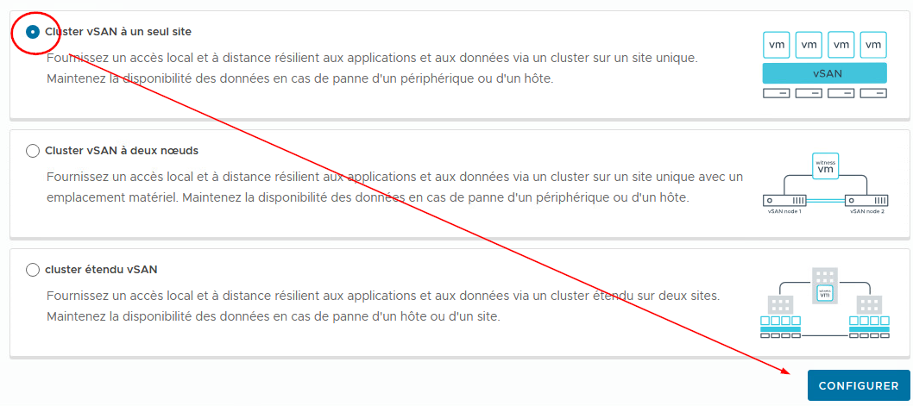

:::tip[psst!🤫]
Vous vous demandez quels sont les autres types de déploiement ? Vous voulez en savoir davantage sur la technologie vSAN ? [Consultez cette page](https://techdocs.broadcom.com/fr/fr/vmware-cis/vsan/vsan/8-0/planning-and-deployment/building-a-virtual-san-cluster/vsan-deployment-options.html)
:::

Dans la première fenêtre, plusieurs éléments apparaitront et il est important de bien les distinguer:

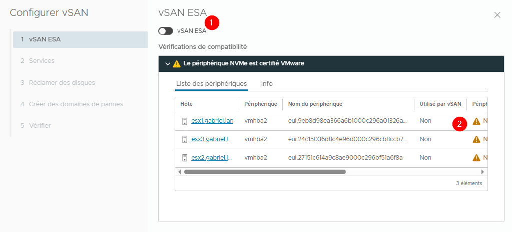

1. **vSAN ESA:** 
vSAN ESA (*Express Strorage Architecture*) est une version que je qualifierais d'abrégée de **vSAN**. Cette version fonctionne différemment de la version originale et possède moins de paramétrabilité. C'est pourquoi nous ne l'utiliseront pas. Laissez cette option désactivée.

2. **Avertissement périphérique certifié:** 
Vous verrez apparaitre un avertissement concernant votre périphérique NVMe. Vous pouvez l'ignorer. *Grosso modo*, **VMware** nous avise que le périphérique en question n'a pas été certifié par l'entreprise pour ce genre d'utilisation. C'est un peu normal; c'est un périphérique virtuel... Le contrôleur NVMe en question n'existe pas.

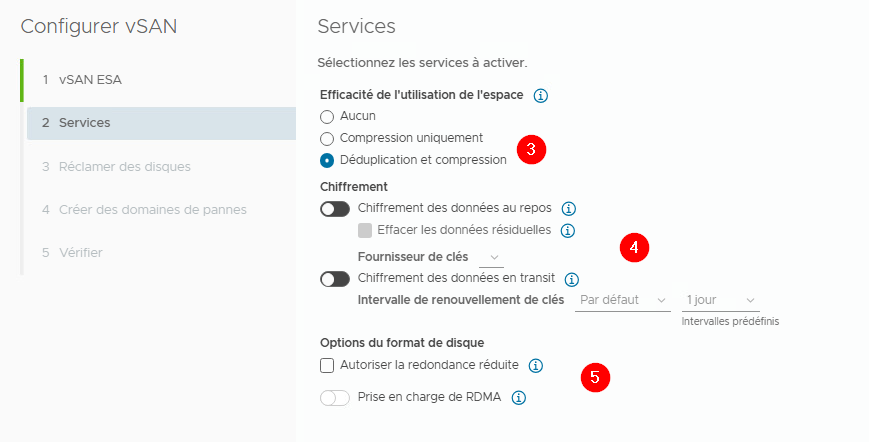

3. **Efficacité de l'utilisation de l'espace:** 
**vSAN** peut mettre en place des stratégies de compression et de déduplication pour économiser de l'espace. La compression permet de réduire l'espace que prend certaines données en les passant dans un algorithme de compression, alors que la déduplication détecte les données qui sont stockés en double pour n'en conserver qu'une seule copie. Dans les deux cas, ce sont des stratégies très intéressantes à mettre en place dans un contexte de production. D'ailleurs ces stratégies sont activées sur LabInfo.

4. **Chiffrement:** 
Vous pouvez chiffrer les données pour des raisons de sécurité. Cela dit, vous devez considérer que le chiffrement nécessite de la puissance de calcul supplémentaire. C'est à considérer lors de la mise en place de vos serveurs.

5. **Redondance réduite et RDMA:** 
La redondance réduite dont l'utilitaire nous parle ici concerne les cas où un noeud pourrait être en panne. L'utilisation de **vSAN** prévient la perte de données lorsque tous les noeuds sont opérationnels. Or, si un noeud tombe en panne et que vous modifiez l'état d'une *VM* stockée sur **vSAN**, ses données ne seront plus protégées. N'autorisez donc pas cette situation. Quant à RDMA, il s'agit d'une technologie réseau avancée permettant un transfert plus rapide des données. Pour bénéficier de cette technologie, il faut des cartes réseaux spécifiques, que nous n'avons pas.

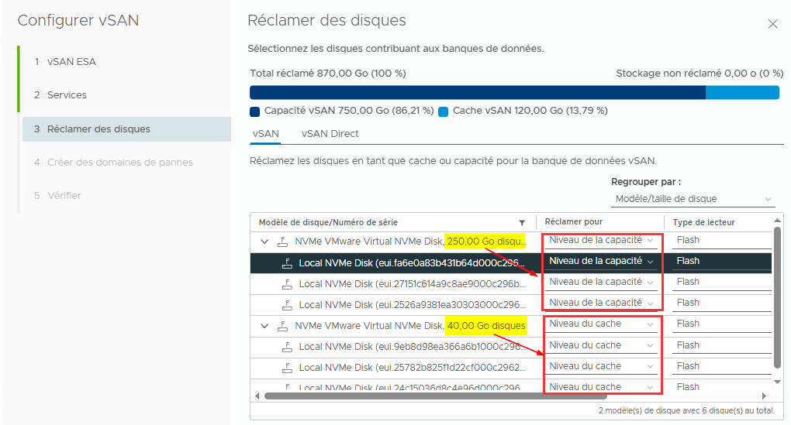

6. **Réclamation des disques:** 
Cette étape est cruciale. C'est ici que **vSAN** créera les groupes de disques. Généralement, **vSAN** arrive à réclamer les disques de manière intelligente. Dans l'image que je vous ai partagé, **vSAN** a automatiquement associé mes disques dur de 40Go au cache et mes disques durs de 250Go au stockage.

    Même si **vSAN** semble attribuer stockages intelligemment chaque fois, assurez-vous de valider avant de continuer.

:::info[cache versus capacité]
Cette façon de procéder de **vSAN** est tout à fait ingénieuse. En production, on utilisera les disques durs très rapides (stockage flash) pour la cache ainsi que les disques durs plus lents mais plus gros pour le réel stockage à long terme. Cette façon de procéder accélère **grandemment** le transfert de données entre les noeuds **et** le stockage lui-même.
:::

7. **Créer les domaines de pannes:** 
Normalement, tous vos noeuds devraient apparaitre ici. Vous n'avez rien à faire.

8. **Terminer**

Félélicitations, vous avez maintenant un ensemble de stockage distribué à la manière de CEPH sous Proxmox. Une fois les tâches liées à **vSAN** terminées, réactivez **vSphere HA**.

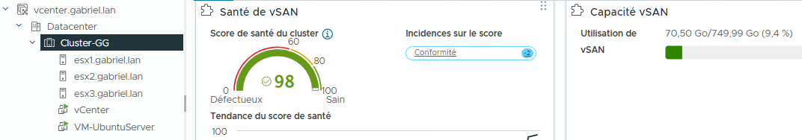

### 14. Politiques et stratégies de stockage

Notre **vSAN** est fonctionnel et prêt à être exploité. Nous pourrions dès maintenant créer des machines virtuelles et les stocker dans notre système de stockage distribué. Or, VMware ne s'est pas arrêté ici. L'entreprise a voulu distinguer les machines virtuelles entre elles. Toutes les *VMs* ne sont pas égales, nous le savons tous. On ne traitera pas une *VM* qui ne sert qu'à effectuer des tests de la même façon qu'une *VM* hébergant un contrôleur de domaine.

C'est ici qu'entre en jeu les stratégies de stockage pour **vSAN**. En gros, **vSAN** peut accentuer ou, au contraire, amoindrir le niveau de sécurité sur le stockage d'une *VM*.

Dans **vCenter**, cliquez sur cet icône: <FAIcon icon="fa-icons fa-bars"/> (au haut à gauche de l'interface web) et sélectionnez `Stratégies et profils`.

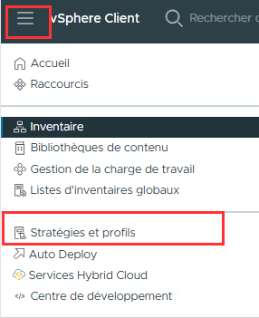

#### 14.1 Stratégie VM Production

Cliquez sur `Créer` puis entrez les informations suivantes:

- **Nom:** VM Production
- **Structure de la stratégie:** ✅ Activez les règles du stockage **vSAN**
- **vSAN:**
    - **Tolérance aux pannes du site:** Aucun - Cluster Standard
    - **Pannes tolérées:** 1 panne : Raid 1 (mise en mirroir)
    - **Services de chiffrement:** Aucune préférence
    - **Efficacité de l'utilisation de l'espace:** Déduplication et compression
    - **Niveau de stockage:** Intégralement flash
    - **Règles de stratégie avancées:** Tous par défaut
- **Compatibilité de stockage:** Vous devriez voir votre **vSAN**
- **Terminer**

Cette première stratégie vise à utiliser notre **vSAN** pour protéger et optimiser nos machines de production.

#### 14.2 Stratégie VM Développement

Cliquez sur `Créer` puis entrez les informations suivantes:

- **Nom:** VM Développement
- **Structure de la stratégie:** ✅ Activez les règles du stockage **vSAN**
- **vSAN:**
    - **Tolérance aux pannes du site:** Aucun - Cluster Standard
    - **Pannes tolérées:** Aucune - Aucune redondance
    - **Services de chiffrement:** Aucune préférence
    - **Efficacité de l'utilisation de l'espace:** Aucune préférence
    - **Niveau de stockage:** Aucune préférence
    - **Règles de stratégie avancées:** Tous par défaut
- **Compatibilité de stockage:** Vous devriez voir votre **vSAN**
- **Terminer**

Cette deuxième stratégie vise à utiliser notre **vSAN** pour nos machines de tests et n'assure aucune protection.

### 15. Migration de nos VMs sur vSAN

Enfin! Nous y voilà, la dernière étape du projet 😊. Nous avons mis en place stockage distribué **vSAN**, mais nos machines virtuelles, elles, sont toujours stockées sur **TrueNAS**. Ce serait bien de migrer **vCenter** et notre *VM* de test sur **vSAN**.

Heureusement, c'est assez simple. 

#### 15.1 Migration de la VM de test

Commencons par notre machine de test. Dans mon cas, j'avais installé une machine Ubuntu Server. Pour la migrer, clic-droit → `migrer`. Cependant, je vais choisir `Modifier uniquement le stockage`:

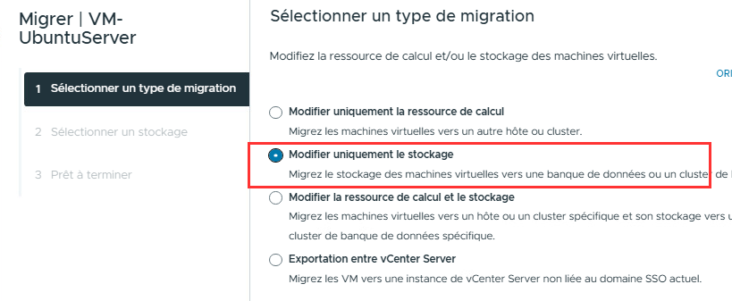

À l'étape suivante, je sélectionnerai évidemment mon stockage **vSAN** et la politique de stockage **VM Développement**:

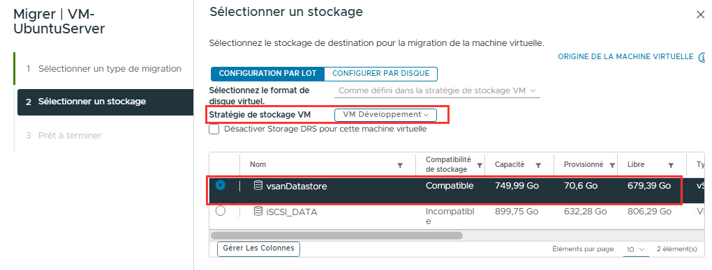

Il faudra calculer quelques minutes pour que le transfert soit complet. (~5 min)

#### 15.2 Migration de la VM vCenter

Vous l'aurez compris, c'est exactement la même procédure à l'exception de la politique de stockage. Dans le cas de **vCenter**, utilisez la politique `VM Production`.

<u>Une fois le transfert complété</u>, vous pourrez éteindre **TrueNAS**, il ne servira plus à rien. ADIEU TRUENAS! ON SE REVOIT DE L'AUTRE BORD! 🪦😭

### 16. Grille de correction et remise

**DATE DE REMISE: 19 DÉCEMBRE 2025 - 23h59**  

Pour ce travail, vous devrez me remettre :

- 5 captures d'écran très spécifiques
- 1 vidéo de type « Preuve de vie »

#### 16.1 Captures d'écran

:::danger[Critères stricts pour les captures d'écran]
Toutes les captures d'écran que vous remettrez devront répondre aux critères suivants:
- La capture d'écran doit afficher l'heure système de votre poste Windows **physique** (barre des tâches visible).
- Le nom du fichier doit être indiqué comme suit: Nomdefamille_Prenom_Capture. Ex: Gaudreault_Gabriel_Capture01.png

Les captures d'écran ne répondant pas à ces critères ne seront pas analysées.
:::

##### 16.11 Capture d'écran 1

Prenez une capture d'écran de la commande `esxcli system uuid get` exécuté depuis une invite de commande SSH sur l'un de vos hyperviseurs.  **Exemple:**

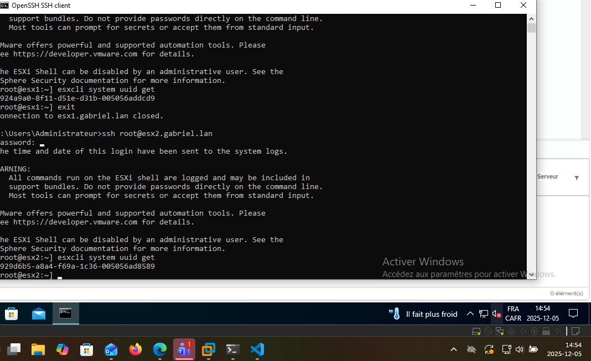

##### 16.12 Capture d'écran 2

Prenez une capture d'écran de votre serveur DNS montrant votre zone de recherche directe. On doit y voir votre domaine personnalisée et les enregistrements A pour vCenter et les 3 ESXi. **Exemple:**

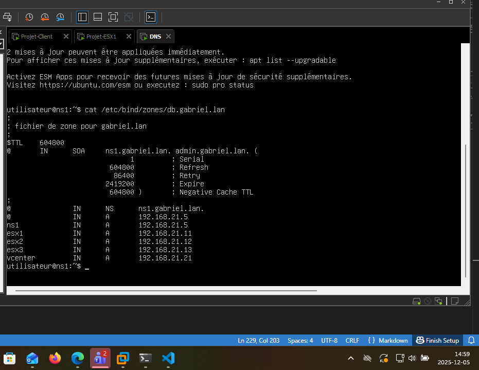

##### 16.13 Capture d'écran 3

Prenez une capture d'écran de la topologie de votre vDS Production dans **vCenter**. On doit y voir les machines virutelles connectées. **Exemple:**

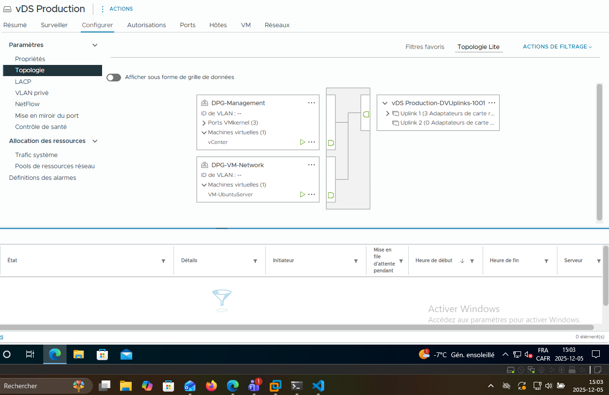

##### 16.14 Capture d'écran 4

Prenez une capture d'écran de l'état de **vSphere HA** dans **vCenter**. On doit y voir le nom de votre *cluster*, l'état et les conditions de réponse en cas de panne. **Exemple:**

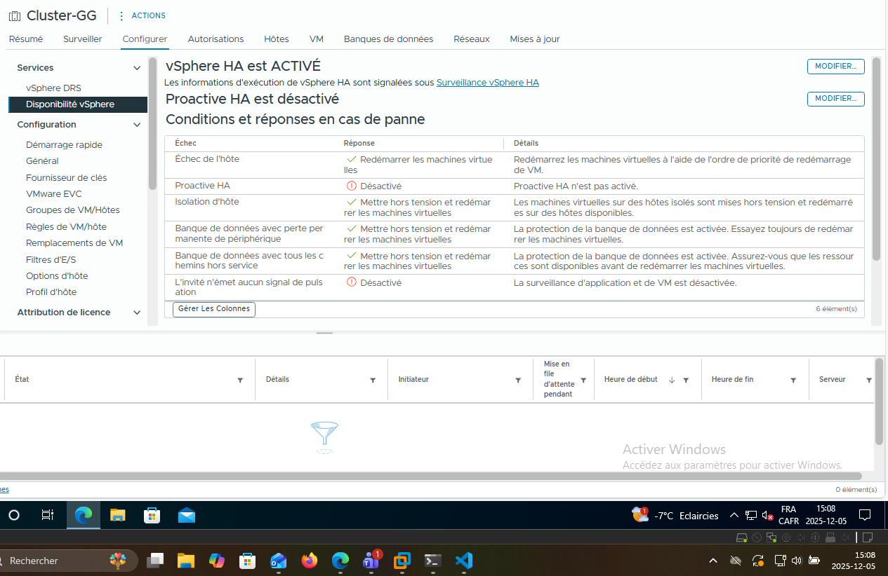

##### 16.15 Capture d'écran 5

Prenez une capture d'écran de votre cluster **vSAN**. On doit y voir le nom de votre *cluster*, l'état de santé de chaque noeud ainsi que le nombre de disque utilisés sur chacun de ceux-ci. 
**Exemple:**

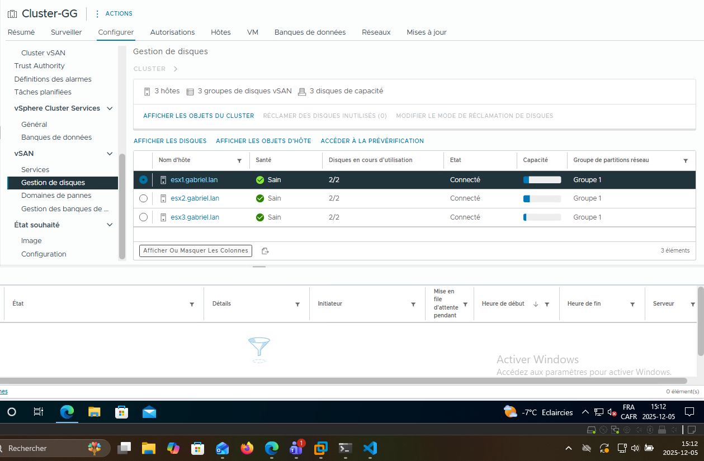

#### 16.2 Vidéo « preuve de vie » 

Vous devez enregistrer votre écran et votre voix. Vous pouvez utiliser OBS, Teams ou même votre téléphone s'il est stable pour vous enregistrer.

Scénario à suivre **obligatoirement** en une seule prise (pas de montage/coupage):

1. **Identité:** 
Identifiez-vous clairement dès les premières secondes du vidéo. Dites clairement votre nom et le nom du cours.

2. **Contexte:** 
Montrez l'interface de **vCenter**. On doit voir clairement le nom de votre *cluster* et vos hôtes.

3. **DNS:** 
Montrez votre zone de recherche direct au sein de votre serveur DNS. On doit y voir vos enregistrements A pour vos hyperviseurs et **vCenter**.

4. **Test:** 
Ouvrez la console de votre machine virtuelle de test dans **vCenter**. Lancez la commande: `ping -i 1 google.com` et laissez-la rouler.

5. **Migration:** 
Retournez sur **vCenter**, faites un clic-droit sur la vm → **Migrer** → **Changer de ressource de calcul uniquement.** Sélectionnez un autre noeud et validez.

6. **Preuve de fonctionnement** 
Pendant que la machine virtuelle se fait migré, retournez sur la console de celle-ci et démontrez que la commande `ping` n'a jamais cessé de fonctionner. Une fois la migration terminée, montrez le nouvel emplacement de la machine et stoppez la commande `ping`. Prenez soin de bien montrer le résultat de la commande `ping` une fois celle-ci arrêtée. Il ne devrait pas y avoir de paquet perdu.

#### 16.3 Dépôt

Lorsque vous aurez réuni tous les éléments nécessaires (vidéo et captures d'écran), déposez-les dans un dossier que vous nommerez *NomDeFamille_Prenom_Projet* et compressez ce-dernier en `.zip`.  [Déposez votre dossier compressé ici.](https://cloud.tonprof.ca/index.php/s/KiEbH5LzMMYeGC5)

#### 16.4 Grille de correction

:::important
La correction est basée sur des preuves visuelles. Si une preuve est floue, illisible, incomplète ou ne respecte pas les critères qui sont explicitement demandés, la note attribuée au critère sera de 0.
:::

:::danger[Plagiat = 0]
Tout indice suggérant que les captures d'écran ou la vidéo proviennent d'un autre étudiant entraînera automatiquement la note de 0% au projet.
:::

|Critère|Détail des exigences pour obtenir les points|Points|
|-------|--------------------------------------------|:------:|
|**1. Conformité administrative**|-Les 5 captures d'écran demandées sont fournies. -Le vidéo est clair, stable et précis. -L'heure système de l'ordinateur hôte est visible sur **TOUTES** les captures d'écran.|2|
|**2. Capture UUID**|-La commande `esxcli system uuid get` est visible -Le UUID retourné est unique|2|
|**3. Capture DNS**|-Le nom de domaine est bien `prenom.lan` -Les enregistrements A pour les 3 ESXi et vCenter sont présents -Le domaine cemti.ca n'a pas été utilisé|2|
|**4. Topologie vDS**|-On voit clairement les machines connectées -On voit bien les groupes de ports|2|
|**5. vSphere HA**|-vSphere HA est bien activé -Les conditions de réponse sont les bonnes.|2|
|**6. vSAN**|-L'état de santé global est vert -Le nombre de disques utilisés est bon.|2|
|**7. Vidéo: Identité**|L'étudiant énonce son nom et le cours vocalement et clairement. -Le nom du *cluster* vCenter contient les initiales de l'étudiant. -Le vidéo est fait en une seule prise.|2|
|**8. Vidéo: Migration**|La migration est initiée convenablement (ping, etc.) -La tâche se complète avec succès et c'est bien démontré.|3|
|**9. Vidéo: Continuité**|Le `ping` roule durant tout le processus de migration. -Aucun paquet (1 acceptable) perdu lors du basculement.|3|