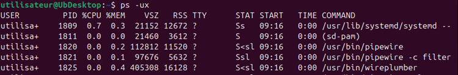
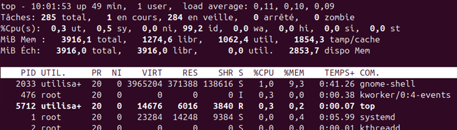
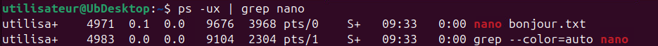

# Processus 🕵️

## Qu'est-ce qu'un processus ?

Dans la section précédente, nous avons abordé l'installation de paquets et d'applications sous Linux. Néanmoins, qu'en est-il de leur fonctionnement ? Que se produit-il dans le système lorsqu'on lance un logiciel ? C'est là que les processus interviennent.

Peut-être avez-vous déjà entendu le terme, peut-être pas. Cela dit, les processus existent depuis bien longtemps et ils ont toujours été juste sous vos yeux. En fait, tout ce qui s'exécute sur un ordinateur, le fait au sein d'un processus. Donc, le processus, c'est d'abord un contenant, une espèce de boîte virtuelle si vous voulez.

Pourquoi a-t-on besoin des processus ? Pour plusieurs raisons:

1. **Multitâche:** Pouvez-vous seulement imaginer ce que serait d'utiliser un ordinateur en exécutant qu'un seul logiciel à la fois ? Ce serait incroyable fastidieux et pas du tout pratique. Les processus permettent à plusieurs programmes de s'exécuter simultanément. En d'autres mots, si tu es capable d'écouter de la musique tout en faisant quelques recherches sur le web, c'est grâce aux processus.

2. **Isolation:** Chaque processus est isolé des autres, c'est pourquoi je les compare à des contenants. Cela signifie qu'un programme ne peut pas en affecter un autre directement. Si un processus plante, il ne met pas à risque les autres processus, ce qui améliore de beaucoup la stabilité du système.

3. **Gestion des ressources:** Les processus aident à répartir efficacement les ressources (Puissance de calcul, mémoire, etc.) entre les différents programmes. Le système d'exploitation peut surveiller l'utilisation des ressources et en ajuster l'allocation en fonction des besoins des processus en cours d'exécution.

4. **Sécurité:** Les processus peuvent être exécutés avec différents niveaux de privilège. Cela permet de protéger le système en limitant les actions que certains programmes peuvent effectuer, réduisant ainsi les risques de *malwares* ou de comportements indésirables.

### Comment ça fonctionne ?
<mark>Tout ce qui s'exécute sur le système, est systématiquement exécuté dans un processus.</mark> Même ce que pourrait lancer Linux, en arrière-plan, sera lancé dans un processus. Il n'y a donc rien à faire, pour créer un processus, outre que de lancer un exécutable. Peu importe de quoi il s'agit, un processus sera créé. Nous verrons un peu plus loin comment lister, administrer et gérer les différents processus dans votre système Linux. Nous verrons également que chaque processus existant est identifié par le système d'exploitation.

## Lister les processus
Dans le terminal d'Ubuntu, vous pouvez utiliser la commande `ps` pour obtenir la liste des processus. En lien avec cette commande, certains commutateurs peuvent être très pratiques:

| Commutateur | Action |
|:-----------:|:------:|
| -a | Affiche les processus de tous les utilisateurs |
| -u | Affiche le propriétaire de chaque processus |
| -x | Affiche les processus en arrière-plan (lancé par le système) |

Exemple:<br/>


La définition de chacune des colonnes du tableau est décrite ci-dessous:
| Colonne  | Signification                                                                                          |
|----------|-------------------------------------------------------------------------------------------------------|
| USER     | L'utilisateur ayant lancé le processus.                                                               |
| PID      | Identifiant unique du processus (Process ID).                                                         |
| %CPU     | Pourcentage d'utilisation du CPU par le processus.                                                    |
| %MEM     | Pourcentage de mémoire vive (RAM) utilisée par le processus.                                          |
| VSZ      | Taille virtuelle du processus en kilo-octets (inclut la mémoire des bibliothèques partagées).         |
| RSS      | Taille de la mémoire vive réellement utilisée (non paginée), en kilo-octets.                         |
| TTY      | Terminal associé au processus (`?` si le processus n'est pas lié à un terminal).                      |
| STAT     | État du processus (ex. `S` pour Sleeping, `R` pour Running) et attributs supplémentaires (ex. `s`).   |
| START    | Heure ou date de lancement du processus.                                                              |
| TIME     | Temps CPU total consommé par le processus (minutes:secondes).                                         |
| COMMAND  | Commande ou chemin complet utilisé pour lancer le processus.                                          |

### Inconvénient de PS
La commande `ps` ne permet pas de consulter les processus en temps réel. Elle se contente plutôt de prendre une photo des processus actifs sur le système à un instant *t*. Pour visualiser les processus en temps réel, vous pouvez utiliser la commande `top`. Cette dernière vous affichera la liste des processus qu'elle rafraichira régulièrement. Néanmoins, nous sommes encore loin de ce qu'offre le gestionnaire des tâches sous Windows. La commande `top` ne vous permettra pas de redémarrer ou d'arrêter un service.

Exemple de la commande *top*:


### Filtrer avec grep
La commande `ps` avec, ou sans, commutateur pourrait vous donner une liste de résultat assez impressionnante. Après tout, si tout est exécuté dans un processus, il est normal d'en retrouver plusieurs dizaines. Je vous invite donc à jumeler le tout à la commande `grep` pour filtrer vos résultats. Par exemple, si je recherche un processus en lien avec l'éditeur de texte nano, je pourrais utiliser la commande suivante:

```bash
ps -ux | grep nano
```
Résultat:<br/>


:::caution
Avez-vous remarqué quelque chose dans l'image ci-dessus ? Même si je n'ai démarré qu'une seule instance de *Nano*, j'obtiens deux résultats lorsque j'applique mon filtre avec `grep`. Pourquoi ?

<u>**Souvenez-vous: tout est exécuté au sein d'un processus!**</u>
<br/><br/>
La commande `grep` que j'ai utilisé pour filtrer la sortie de ma commande `ps` est, elle aussi, exécuté dans un processus. Donc lorsque je filtre les processus à la recherche d'un mot, je vois apparaitre le processus qui a été lancé pour `grep` également.
:::

## Administration
Vous savez, désormais, que pour démarrer un processus, il suffit de lancer n'importe quel exécutable. Celui-ci sera lancé automatiquement dans un processus. Cela dit, comment est-il possible de suspendre, d'arrêter ou de redémarrer un processus ? À l'aide de la commande `kill`.

La commande `kill` fonctionne en envoyant des signaux aux différents processus. Le signal envoyé détermine l'action à entreprendre sur le processus:

| Signal   | Numéro | Nom      | Description                                                                   |
|----------|--------|----------|-------------------------------------------------------------------------------|
| SIGHUP   | 1      | Hangup   | Recharger la configuration ou terminer le processus. Souvent utilisé pour redémarrer un service. |
| SIGINT   | 2      | Interrupt| Interruption (Ctrl+C). Demande au processus de se terminer.                   |
| SIGQUIT  | 3      | Quit     | Terminer un processus avec un core dump (utile pour le débogage).             |
| SIGKILL  | 9      | Kill     | Force la terminaison immédiate du processus (ne peut pas être ignoré).        |
| SIGTERM  | 15     | Terminate| Demande au processus de se terminer proprement (signal par défaut avec `kill`).|
| SIGSTOP  | 19     | Stop     | Met le processus en pause (ne peut pas être ignoré).                          |
| SIGCONT  | 18     | Continue | Reprend un processus en pause.                                                |

### Arrêter un processus
Vous avez peut-être remarqué qu'il y a plus d'un signal pour arrêter un processus avec `kill`. Chacune de ces méthodes est de plus en plus radicale:

#### kill -2
La commande `kill -2` est l'équivalent d'appuyer simultanément sur les touches <kbd>Ctrl</kbd>+<kbd>c</kbd> sur votre clavier. Cette commande interrompera un processus en cours. Cela dit, certains processus pourrait ne pas répondre à cette demande d'interruption. Il faudra alors passer à un signal plus fort.

```bash
kill -2 6323 #6323 est le numéro du processus ciblé
```

#### kill -15
Il s'agit du signal par défaut de la commande `kill`. Cette commande demande au processus de se terminer le plus « proprement » possible. C'est-à-dire en prenant soin de sauvegarder les données avant de quitter si ce processus utilisait des fichiers par exemple. La vaste majorité des processus répondront à ce signal à moins d'être « plantés ».

```bash
kill 1234 #Inutile d'inscrire le « -15 » car c'est le signal par défaut
```

#### kill -9
Il s'agit du « boss final » des commandes `kill`. Cette commande ne « demande » pas au processus de s'arrêter, mais il l'ordonne. Les processus ne peuvent pas ignorer cette commande. Si vous n'arrivez pas à mettre fin à un processus malgré cette commande, il y a fort à parier que vous devrez redémarrer l'ordinateur pour y arriver.

```bash
kill -9 4321
```

### Redémarrer un processus
Il est assez rare que nous ayons besoin de redémarrer un processus. Néanmoins, il existe bien un contexte ou cela peut être pratique: le redémarrage d'un service. Nous aborderons les services dans la prochaine section, néanmoins sachez que la commande `kill` peut, en quelques sortes, redémarrer un service. <u>**En fait, le service est plutôt recharger et non pas redémarrer.**</u>C'est tout de même pratique puisque plusieurs services fonctionnent avec des fichiers de configuration sur Linux. Lorsque nous apporterons des modifications dans ses fichiers de configuration, nous pourrons recharger le service avec la commande `kill -1`

```bash
sudo kill -1 7421 #Utilisation de SUDO avec des services
```

### Mettre un processus en pause
Il est possible de mettre un processus en pause, dans le cas où vous le suspectez de causer des problèmes, puis de le reprendre ensuite.

Pour mettre le processus en pause:
```bash
sudo kill -19 8269
```

Puis pour reprendre:
```bash
sudo kill -18 8269
```