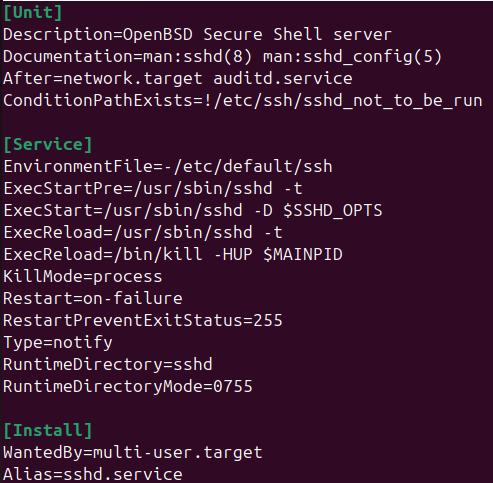
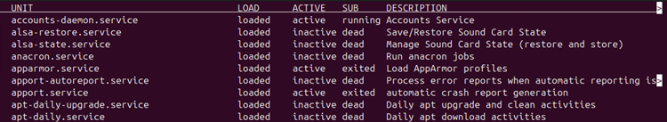
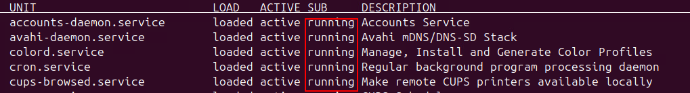

# Services 👻

Un service est un type de programme qui fonctionne en arrière-plan sans que l'utilisateur n'ait à interagir avec lui. Le service est conçu pour être invisible et pour exécuter des tâches automatiquement, souvent dès le démarrage du système, et parfois même avant que l'utilisateur se connecte.

Un service continue à fonctionner même si aucune fenêtre n'est ouverte. Par exemple, les services réseau, le spouleur d'impression ou le service des tâches planifiées (cron) pour n'en nommer que quelques-uns. Ces programmes sont généralement essentiels au bon fonctionnement de l'ordinateur, mais ne nécessitent aucune interaction.

J'aime bien faire l'analogie entre les services et certains réflexes humains. Vous n'avez pas besoin de réfléchir pour respirer, votre corps s'assure que ce « service » fonctionne constamment. Il en va de même pour votre battement cardiaque. C'est ainsi que fonctionnent également les services sous Linux. Vous n'avez rien à faire, rien à réfléchir, il s'exécuteront automatiquement.

## Le lien entre les services et les processus

Dans la section précédente, nous avons abordé les processus et leur fonctionnement. En outre, nous avons mentionné que <mark>tout ce qui s'exécutait sur le pc est systématiquement exécuté dans un processus.</mark>Les services n'échappent à cette règle non plus, après tout, ce sont des programmes également. Un service peut donc, lui aussi, être arrêté via une « fin de tâche ». Cela est peu recommandable, mais peut être fait dans certaines circonstances.

## Sous Linux plus précisémment

Sous Linux, les services sont représentés par des fichiers appelés **unités** (*unit files*). Ces fichiers définissent comment un service doit se comporter, comment il doit être démarré, arrêté ou redémarré, ainsi que ses dépendances. Selon leur priorité et leurs fonctions, les fichiers de service peuvent se retrouver à l'un ou l'autre de ces emplacements:

1. `/etc/systemd/system/`

2. `/lib/systemd/system/`

Exemple de fichier de service:



## Obtenir la liste des services

En matière de service sous Ubuntu, nous utiliserons régulièrement la commande `systemctl` ( Prononcé « système contrôle » ) pour effectuer diverses actions. La première de ces actions à connaître est évidemment d'obtenir la liste des services sur l'ordinateur.

Pour obtenir la liste entière des services disponibles sur votre machine ubuntu, vous pouvez utiliser la commande suivante:

```bash
sudo systemctl --type=service --all
```
Résultat:<br/>


Descriptif des colonnes que retourne la commande:

- **UNIT:** C'est le nom du service, tout simplement.
- **LOAD:** Indique si le service est chargé en mémoire ou non (*loaded* ou *not-found*)
- **ACTIVE:** Indique si le service est en fonction ou non (*active* ou *inactive*)
- **SUB:** Donne des détails quant à l'état actif (*running*, *Exited* ou *Dead*)
- **DESCRIPTION:** Il s'agit d'un bref descriptif du service concerné.

### Filtrer la liste des services

#### Filtrer la liste des services en fonction d'un état

Recherche les services qui sont en cours d'exécution:
```bash
sudo systemctl --type=service --state=running
```
Résultat:


#### Filtre supplémentaire avec grep
Vous pouvez évidemment utiliser la commande `grep` pour filtrer en fonction de n'importe quel élément. Par exemple, si vous désirez retrouver le service SSH parmi la liste, vous pourriez utiliser la commande suivante:

```bash
sudo systemctl --type=service --all | grep ssh.service
```

## Administrer les services

Il est assez fréquent de devoir démarrer, redémarrer ou arrêter des services. Il est également possible que nous ayons besoin de modifier le comportement d'un service au démarrage de l'ordinateur. C'est ce que nous allons aborder dans les sections ci-dessous.

### Démarrer un service
Pour démarrer un service qui a été arrêté ou qui n'a pas démarré, on utilisera l'argument *start* avec la commande `systemctl`.

Par exemple:
```bash
sudo systemctl start exemple.service
```

### Arrêter un service
De la même manière qu'avec le démarrage d'un service, on utilisera l'argument *stop* pour arrêter un service avec la commande `systemctl`.

Par exemple:
```bash
sudo systemctl stop exemple.service
```

### Redémarrer un service
Pour qu'un service en cours d'exécution s'arrête et démarre à nouveau, nous utiliserons l'argument *restart* avec la commande `systemctl`.

Par exemple:
```bash
sudo systemctl restart exemple.service
```

### Obtenir le status d'un service
Comme les services sont généralement des exécutables qui n'offrent pas d'interaction avec l'utilisateur, il est difficile d'en connaître l'état. Est-ce que le service a bien démarré tel que prévu ? Comment savoir ? Il est possible de connaître le status d'un service en entrant la commande suivante:

```bash
sudo systemctl status exemple.service
```

### Activer ou désactiver le démarrage automatique
Les services peuvent démarrer automatiquement lors du démarrage de l'ordinateur. Au contraire, on peut aussi vouloir qu'un service cesse de démarrer automatiquement. Pour réaliser ces deux actions on utilisera l'argument *enable* ou *disable* en fonction de l'option désirée.

Par exemple, pour autoriser un service à démarrer automatiquement:
```bash
sudo systemctl enable exemple.service
```

Pour empêcher un service de démarrer automatiquement:
```bash
sudo systemctl disable exemple.service
```