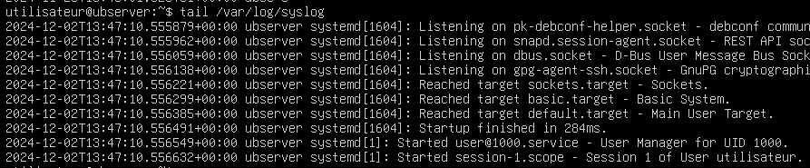

# Journalisation 📰

Lorsqu'un problème survient dans un processus en arrière-plan ou dans un service, il peut-être difficile de savoir ce qui se passe étant donné l'absence d'interface graphique. Les systèmes d'exploitation et plusieurs applications gardent une trace des étapes importantes de ce qu'ils font (démarrage, erreurs, etc.) dans un journal ou dans un fichier *log*.

Les *logs* contiennent des informations sur le fonctionnement du système d'exploitation. Ils permettent, en outre, de :

- Auditer le système.
- Détecter les accès non autorisés.
- Diagnostiquer certains problèmes ou certaines erreurs.

Cependant, lorsqu'elle n'est pas gérée, ou mal gérée, la journalisation peut avoir des impacts négatifs. Les effets possibles sont:

- Réduction des performances du système.
- Surutilisation de l'espace de stockage.
- Augmenter le temps d'analyse et de traitement des journaux.

Il est donc essentiel de bien gérer la journalisation du système et de déterminer ce qui doit ou ne doit pas être journalisé.

La forme la plus rudimentaire d'un journal prend la forme d'un fichier texte, lisible avec des outils de lecture de texte standard. Chaque événement est horodaté et occupe généralement une ligne de texte. Les nouveaux événements sont toujours ajoutés à la fin du fichier.

**Exemple:**



## Systemd

Traditionnellement, les journaux (*logs*) sous Linux sont sauvegardés dans différents fichiers individuels. L'un des inconvénient les plus évidents de cette façon de procéder est la dispersion des différents journaux dans le système. **Systemd** tente de résoudre cette problématique en offrant une solution centralisée pour la journalisation des différents processus.

Un service nommé **journald** s'occupera donc de stocker tous les journaux au format binaire pour une manipulation plus facile. Pour consulter les journaux du service **journald**, nous utiliserons la commande `journalctl`.

## La commande journalctl

Déjà, si vous entrez la commande `journactl` sans aucun argument dans un terminal Linux, vous vous retrouverez avec des pages et des pages de journaux. Ce n'est donc pas très convivial et il faudra évidemment apprendre à bien filtrer ces-derniers.

### Depuis le dernier démarrage <FAIcon icon="fa-solid fa-power-off" size="1x"/>

Un premier filtre pratique à appliquer, c'est celui qui nous offrira les journaux depuis le dernier démarrage. La plupart du temps, l'information que l'on recherche ne va pas au-delà du dernier démarrage. Pour ce faire, utilisez le commutateur `-b` avec la commande.

**Exemple:**
```bash
sudo journactl -b
```

Malgré ce premier filtre appliqué, vous risquez d'obtenir beaucoup d'informations.

### Filtrer avec la date & l'heure <FAIcon icon="fa-solid fa-clock" size="1x"/>

Si vous êtes sur un serveur ou même un poste de travail qui n'est pas souvent redémarré, filtrer les informations depuis le dernier démarrage peut s'avérer insuffisant. Les filtres `--since` et `--until` pourront sans doute plus vous aider. Les valeurs de temps doivent être entrées au format suivant: `YYYY-MM-DD HH:MM:SS`

Voici quelques exemples:

**Récupérer les journaux depuis le 1er décembre 2024:**

```bash
sudo journalctl --since "2024-12-01 00:00:01"
```

**Récupérer les journaux entre le 9 septembre 2024 et le 10 septembre 2024:**

```bash
sudo journalctl --since "2024-09-09 00:00:01" --until "2024-09-10 00:00:01"
```

**Récupérer les journaux du 13 novembre 2024 entre 9h00 et 10h00:**

```bash
sudo journalctl --since "2024-11-13 09:00:00" --until "2024-11-13 10:00:00"
```

:::tip
Les commutateurs `--since` et `--until` sont capables de comprendre certaines chaînes de caractères telles que:
- « yesterday »
- « today »
- « tomorrow »
- « *N* + *Units* ago ».

**Exemple:**

```bash
sudo journalctl --since "2 days ago"
```
:::


### Filtrer en fonction du service

C'est sans doute l'un des filtres que vous utiliserez le plus souvent. Il est assez rare que nous ayons à fouiller dans les journaux sans avoir une petite idée du service qui nous intéresse. Par exemple, si vous désirez obtenir de l'information sur le service SSH uniquement, c'est ce filtre que vous devrez utiliser. On utilisera le commutateur `-u` pour indiquer le service qui nous intéresse.

**Exemple:**

```bash
sudo journalctl -u ssh.service
```

### Filtrer en fonction d'un PID
Lorsque nous avons abordé les processus ensemble, nous avons vu que ces-derniers possédaient un numéro d'identification (*PID*). Il est tout à fait possible de consulter les journaux concernant un processus précis. On utilisera alors l'argument `_PID=1234` où *1234* correspond au numéro d'un processus.

**Exemple:**

```bash
sudo journalctl _PID=1234
```

### Suivre les journaux en temps réel
Dans différents contextes, il peut être très intéressant de suivre l'évolution des journaux d'un service. Dans le cas où vous tentez de comprendre pourquoi un service plante sans cesse par exemple. Le commutateur `-f` vous permettra de suivre l'avancement des journaux en temps réel.

**Exemple: Suivre l'évolution du service SSH**

```bash
sudo journalctl -u ssh.service -f
```

### Combinaison de filtres
Évidemment, vous pouvez vous amuser à combiner ces filtres les uns avec les autres pour obtenir un résultat encore plus précis. Dans la commande ci-dessous par exemple, je veux voir les journaux du service apache depuis aujourd'hui seulement:

```bash
sudo journalctl -u apache2.service --since today
```

## Grep, encore et toujours
Encore grep ? Eh oui. Encore. Grep revient souvent car c'est un outil à la fois puissant et polyvalent. Il peut tout à fait vous aider à filtrer certaines informations avec la commande `journalctl`. Vous pouvez même combiner les deux outils de filtrage pour arriver à vos fins. Autrement dit, vous appliquer les filtres de la commande `journalctl` au meilleur de votre connaissance. Puis, au besoin de vous appliquer un filtre supllémentaire à l'aide de la commande `grep`.

Par exemple, si je veux obtenir les journaux en lien avec l'identification d'un utilisateur qui date d'aujourd'hui, je pourrais filtrer les journaux avec `--since today` en premier lieu. Puis, avec `grep` filtrer les lignes de texte qui contiennent le terme « session ».

```bash
sudo journalctl --since today | grep "session"
```