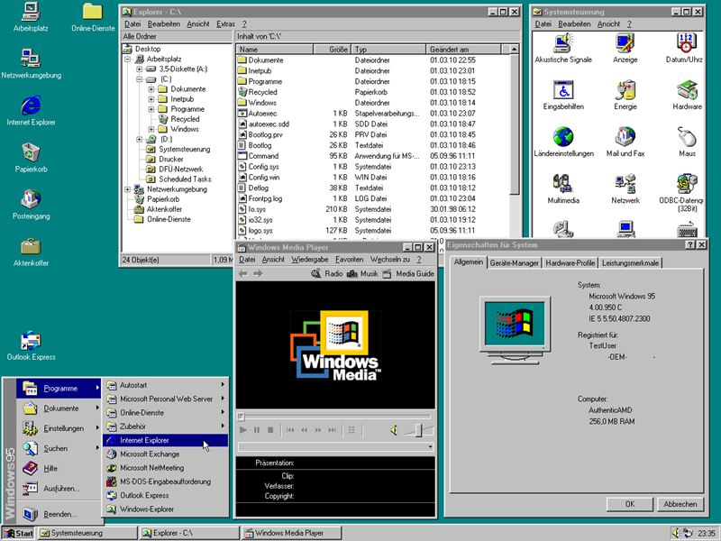
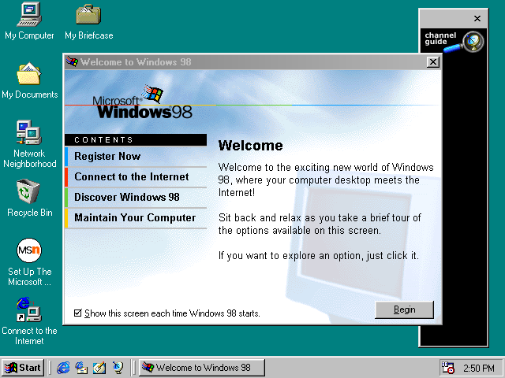
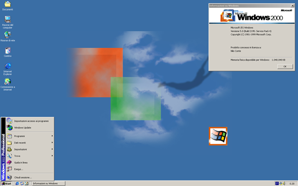
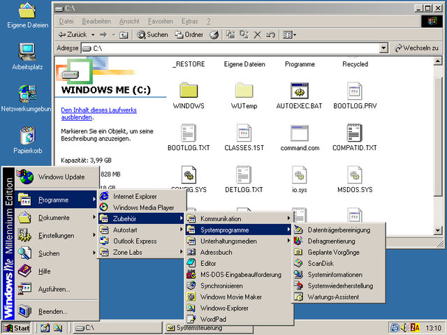
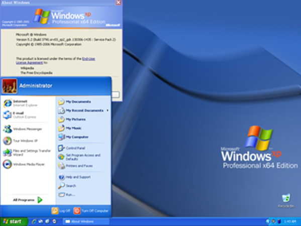
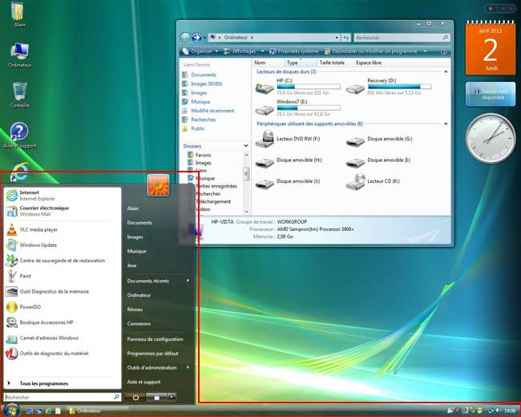
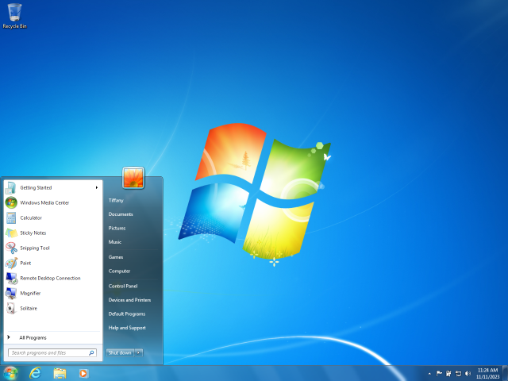
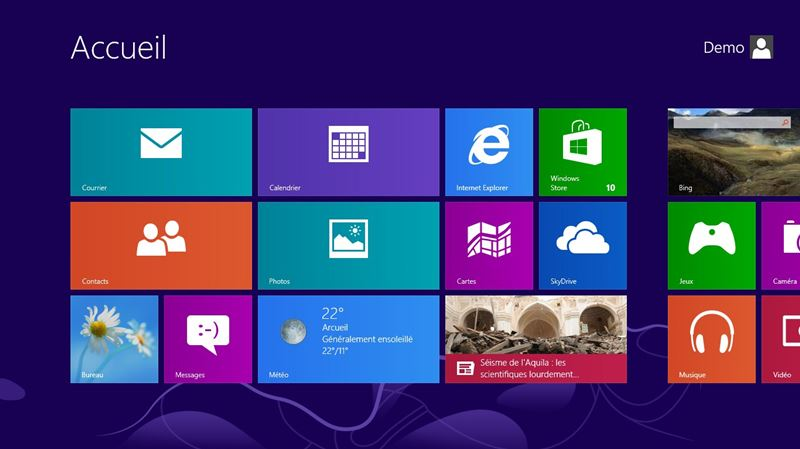

# Historique 📖

## Windows 1.0

La première version de Windows a vu le jour le 20 novembre 1985. Windows 1.0 était né. À l'époque, c'est le début des interfaces graphiques et l'arrivée de la souris. Windows 1.0 n'était qu'une interface graphique que l'on avait installée devant [MS-DOS](https://fr.wikipedia.org/wiki/MS-DOS), le système d'exploitation de Microsoft à l'époque. Windows 1.0 était donc très incomplet et peu convaincant.

:::tip[Le saviez-vous ?]

Windows devait s'appeler *Interface Manager* à l'origine. C'est le directeur du Marketing de la boîte qui a convaincu les différents acteurs de l'entreprise d'opter pour le nom *Windows*. Un nom que ce dernier considérait plus commercial.

:::

**Écran de démarrage de Windows 1.0:**

## Windows 3.0

Windows 2.0 est sorti le 9 décembre 1987. Bien que Windows 2.0 ait été légèrement plus populaire que son prédécesseur, ce n'est pas encore la version qui propulsera l'entreprise vers les succès fulgurants qu'elle connaitra dans les années à venir. Microsoft frappera cependant un premier coup de circuit avec la sortie de Windows 3.0. Cette version de Windows est considérée comme la première véritable concurrente de Macintosh, qui à l'époque, avait pris une avance considérable dans les environnements graphiques. Il se vendra 10 millions de copies de Windows 3.0 avant l'arrivée de Windows 3.1.

**Espace de travail de Windows 3.0:**

## Windows 3.1x et Windows NT 3.x

Microsoft et IBM ont toujours travaillé main dans la main depuis leur entente avec MS-DOS. IBM a également collaboré avec Microsoft pour le développement d'un système d'exploitation succédant à MS-DOS : [OS/2](https://fr.wikipedia.org/wiki/OS/2). Ce pan d'histoire jouera un rôle essentiel dans le développement de Windows NT 3.x puisqu'après de nombreux désaccords, IBM et Microsoft mettront fin à leur collaboration. Microsoft conservera alors le code du système d'exploitation OS/2 et en fera la base de Windows NT.

En 1992, Windows mettra à jour Windows et offrira la version 3.1x, un an à peine avant la sortie de Windows NT 3.1. La version NT recevra un accueil plutôt mitigé. La complexité du système et de sa programmation effraie même les développeurs de pilotes qui refusent de s'avancer sur ce système.

:::tip[Le saviez-vous ?]

L'acronyme NT dans le nom Windows NT signifie *New Technology*

:::

## Windows 95 - *Chicago*

Windows 95 est sorti le 24 août 1995 (nom de code: Chicago). Avec sa sortie, Microsoft prend une avance considérable sur IBM et son système OS/2. Windows 95 arrive avec des fonctionnalités et des ajouts très importants en ce qui concerne l'informatique d'aujourd'hui. C'est avec cette version de Windows que le fameux (ou l'infameux...) navigateur [Internet Explorer](https://fr.wikipedia.org/wiki/Internet_Explorer) a fait son entrée. Windows 95 offrira également un premier support pour l'[USB](https://fr.wikipedia.org/wiki/Universal_Serial_Bus), une technologie peu connue à l'époque, mais qui est toujours grandement utilisée aujourd'hui.

**Bureau de Windows 95:**

## Windows 98 - *Memphis*

Windows 98 est sorti le 25 juin 1998 (nom de code: Memphis) et s'est vendu à plus de 15 millions d'unités dès sa première année. À l'aube du changement de millénaire, Microsoft est en plein essor et domine le marché du grand public. L'entreprise charme de plus en plus les entreprises qui passent lentement, mais surement, à l'ère des communications. Windows 98 arrive en force sur le marché avec un un système pleinement 32 bits (x86), un support natif pour les périphériques USB et la prise en charge de la version 2 du protocole TCP/IP.

:::tip[Le saviez-vous ?]

En avril 1998, [Bill Gates](https://fr.wikipedia.org/wiki/Bill_Gates), le président de Microsoft de l'époque, convoque la presse pour présenter Windows 98. Lors de la démonstration d'une fonctionnalité appelée le "plug-n-play", le système d'exploitation a planté, affichant un [BSoD](https://fr.wikipedia.org/wiki/%C3%89cran_bleu_de_la_mort). [La vidéo](https://www.youtube.com/watch?v=yeUyxjLhAxU) de cet événement est devenue virale sur le web. 

:::

**Bureau de Windows 98:**

## Windows 2000 - *Milan*

Windows 2000 est arrivé sur le marché le 17 février 2000 (nom de code: Milan). C'est le premier système d'exploitation offert par la firme Microsoft qui demandait des configurations minimales. En effet, pour pouvoir bénéficier du nouveau-né de l'entreprise, il fallait un système possédant les caractéristiques suivantes:

- Un processeur cadencé à 133 MHz
- 32 Mo de mémoire vive
- Une carte graphique supportant 16 couleurs et la résolution 640 x 480
- 1Go d'espace disque (disque dur)

Windows 2000 était également décliné en 5 versions distinctes: Professionnel, Serveur, Serveur avancé, Serveur de centre de données et Serveur de petite entreprise.

Ce système d'exploitation marquera l'histoire grâce à l'arrivée d'[Active Directory](https://fr.wikipedia.org/wiki/Active_Directory) permettant la mise en place de services de domaine et une meilleure gestion des infrastructures informatiques en entreprise.

**Bureau de Windows 2000:**

## Windows Me - *Millenium*

Windows Me est la dernière version du système d'exploitation basée sur DOS. Windows Me a été conçu très rapidement dans l'objectif d'avoir un remplaçant à Windows 98 qui vieillissait. Windows XP était bel et bien sur la table à dessin, mais encore loin d'être prêt. La version du millénaire de Windows a été lourdement critiquée pour ses nombreux problèmes de stabilité. Devant un nombre ahurissant de plaintes des utilisateurs et de rétrogradations (downgrade) vers Windows 2000, Microsoft n'a eu d'autre choix que d'accélérer le développement de Microsoft XP et précipiter son lancement. L'aventure *Millenium* ne sera qu'un mauvais souvenir pour Microsoft.

**Bureau de Windows Me:**

## Windows XP - *Whistler*

Windows XP a vu le jour le 25 août 2001. La version originelle de fût largement critiquée pour ses problèmes de compatibilité et ses nombreuses failles de sécurité. Cela amènera Microsot à créer trois *Services Pack* au fil des années. Windows XP possédait un nombre assez important de versions:

 - Windows XP Home Edition (pour les particuliers)
 - Windows XP Home Edition N (Home Edition sans Windows Media Player)
 - Windows XP Professionnel
 - Windows XP Professionnel N (Pro Edition sans Windows Media Player)
 - Windows XP Media Center
 - Windows XP Tablet PC Edition
 - Windows XP Embedded
 - Windows XP Starter Edition
 - Windows XP Professionnel x64

 :::tip[Le saviez-vous ?]

Les lettres *xp* de cette version de Windows proviennent du mot: E**xp**erience

:::

Windows XP introduit un bon nombre de nouvelles fonctionnalités. Parmi celles-ci, on peut penser au bureau à distance, au mode veille ainsi que la possibilité de rejoindre un réseau sans-fil.

Au niveau des caractéristiques matérielles recommandées par Microsoft, voici ce que l'on retrouve:

|Matériel|Caractéristiques|
|--------|:----------------:|
|Processeur|300Mhz|
|Mémoire vive|128Mo|
|Carte graphique|Résolution de 800 x 600|
|Espace disque|6Go|

**Bureau de Windows XP:**

### Longévité exceptionnelle

Windows XP a marqué son époque de par sa longévité. Ce dernier aura bénéficié d'une vie de plus de 12 ans. Jusqu'en septembre 2011, soit dix ans après sa sortie, ce système d'exploitation était encore le plus utilisé. Le 11 avril 2012, près de 11 ans après l'arrivée de XP sur le marché, Microsoft lance le compte à rebours de l'extinction du système d'exploitation. Il faudrait attendre jusqu'au 8 avril 2014 pour que l'entreprise cesse de supporter sa propre création. Ceci étant dit, certains développeurs de logiciels ont poursuivi le support de leur propre logiciel sous Windows XP. À titre d'exemple, l'entreprise Mozilla a poursuivi le support pour son navigateur Firefox jusqu'en 2018. Quant à l'entreprise [VideoLAN](https://www.videolan.org/index.fr.html), distribuant le célèbre lecteur multimédia VLC, supporte encore aujourd'hui son logiciel pour Windows XP.

## Windows Vista - *Longhorn*

Suite aux succès phénoménaux de Windows XP, les attentes des utilisateurs étaient très élevées face à l'arrivée de Windows Vista. Il faut dire que Microsoft a contribué à faire monter l'excitation des utilisateurs en mentionnant que Vista comprenait pas moins d'une centaine de nouvelles fonctionnalités. Parmi les nouveautés annoncées, on mentionnera le *User Account Control* qui ajoutera une couche de sécurité en empêchant un logiciel ou un utilisateur non autorisé à posséder des droits administratifs. L'interface *Aero*, une interface graphique entièrement redessinée promettant d'être plus fluide et plus agréable à l'utilisation. [Bitlocker](https://fr.wikipedia.org/wiki/BitLocker_Drive_Encryption), Internet Explorer 7, le [framework dotnet](https://fr.wikipedia.org/wiki/Microsoft_.NET), Windows Mail et une [foule d'autres nouveautés](https://fr.wikipedia.org/wiki/Windows_Vista#Principales_nouveaut%C3%A9s) sont annoncées. Avec le recul, nous pouvons nous demander si Microsoft n'a pas eu les yeux plus grands que le ventre.

### Critiques

À son arrivée sur le marché, Windows Vista consommait une quantité déraisonnable de mémoire vive et utilisait le disque dur de manière excessive. En plus, le système était relativement instable. Même si la stabilité fût de nouveau au rendez-vous une fois le *Service Pack 1* installé, les critiques ont fuselées de toute part quant au système d'exploitation. Windows Vista apparait même dans des articles peu élogieux titrés comme suit:

- *The world biggest tech disappointment of 2007* de PC World
- *Tech's all time 25 flops* d'Infoworld

 :::tip[Le saviez-vous ?]

En avril 2009, le sénat du Texas a littéralement interdit l'utilisation de Windows Vista dans son administration.

:::

### Vista Capable & Vista Premium ready

En vue de préparer les utilisateurs à passer à Windows Vista, Microsoft sortira deux appellations. À mon avis, ces appellations doivent encore hanter l'entreprise aujourd'hui. La première appellation est *Vista Capable*. Cette appellation est apposée, à l'aide d'un collant, sur les ordinateurs possédant un processeur d'au moins 800 MHz, 512Mo de mémoire vive et une carte graphique surpportant [DirectX9](https://fr.wikipedia.org/wiki/DirectX).

Quant à la deuxième appelation: *Vista premium ready*, elle est apposée sur les ordinateurs possédant un processeur d'au moins 1Ghz, 1Go de mémoire vive et une carte graphique supportant DirectX9 sur laquelle il y a 128Mo de mémoire vidéo dédiée.

**Pourquoi est-ce important ?**

En 2007, un recours collectif a été lancé contre Microsoft concernant l'appellation *Vista Capable*. Les utilisateurs stipulent que les ordinateurs avec cette appellation n'étaient pas en mesure d'exécuter le système d'exploitation dans des conditions acceptables. D'ailleurs, l'un des courriels de Microsoft produit en justice, un responsable indique clairement que l'éditeur a sous-estimé volontairement les besoins de Vista pour aider l'entreprise Intel à atteindre ses résultats trimestriels. En d'autres mots: Microsoft savait pertinemment que Vista consommait plus de ressources que l'entreprise ne voulait bien le laisser croire.

**Bureau de Vista:**

## Windows 7 - *Vienna*

Windows 7 sera donc lancé dans un contexte très particulier et sensible. Windows Vista ayant échoué sa mission de succéder à Windows XP. Le système d'exploitation sera lancé officiellement le 22 octobre 2009. Par rapport à son prédecesseur, Vista, Windows 7 démarre plus vite, possède un nouveau Shell ([Windows Powershell](https://fr.wikipedia.org/wiki/Windows_PowerShell)) et une *UAC* grandemment améliorée.

Les utilisateurs ont bien reçu le système d'exploitation. Le 28 avril 2010, 6 mois après sa sortie, plus de 100 millions de licences de Windows 7 ont été vendu. C'était un record en termes de nombre de licence en si peu de temps. Peu de temps après, en octobre 2011, Windows 7 devient le système d'exploitation le plus utilisé au monde, devant Windows XP, alors que Windows Vista n'avait jamais réussi à surpasser son prédécesseur. Le 20 janvier 2012, Microsoft annonce avoir vendu 525 millions de licences, ce qui correspond à une moyenne de 7,8 licences vendues par seconde depuis son lancement, 2 ans auparavant 😱

Voici les ressources qui sont requises pour exécuter Windows 7 (x64):

|Matériel|Caractéristiques|
|--------|:----------------:|
|Processeur|1Ghz|
|Mémoire vive|2Go|
|Carte graphique|Compatible DirectX9|
|Espace disque|20Go|

 :::tip[Le saviez-vous ?]

Le 7 janvier 2009, Microsoft a mis à disposition du grand public sa version bêta de Windows 7. Ce jour-là, les serveurs de l'entreprise ont été submergés par des millions de personnes qui ont tenté de télécharger le système. Pour rendre la chose plus mémorable, Microsoft a choisi une date en lien avec son produit (07/01). Cette initiative a généré beaucoup d'engoument et d'excitation autour du produit.

:::

**Bureau de Windows 7:**

## Windows 8

Windows 8 est une version multi-plateforme de Windows. Celle-ci a été commercialisé à partir du 26 octobre 2012. Windows 8 utilise une nouvelle interface appelée *Metro*. Cette interface s'articule autour d'un nouvel écran de démarrage, composé de tuiles dynamiques, similaires aux tuiles que l'on retrouvent sur le système [Windows Phone](https://fr.wikipedia.org/wiki/Windows_Phone). Chacune des tuiles représente une application. Le traditionnel environnement de bureau, quant à lui, est accessible depuis une tuile. Le bouton de démarrage de la barre des tâches a été dans déplacé dans la *charm bar*, accessible en placant son curseur ou son doigt en bas, à gauche de son écran.

### Flop monumental

La première version de Windows 8 est une véritable catastrophe au niveau des ventes. Microsoft en est réduit à cesser le support du système le 12 janvier 2016, à peine 3 ans après sa sortie.

Dans la semaine suivant le lancement de Windows 8, Microsoft annonce un maigre 4 millions d'utilisateurs. En juin 2013, Windows 8 représente seulement 5% des ordinateurs présents sur le web, alors que Windows 7 et XP représentent toujours 70% de ceux-ci. En juin 2015, soit peu de temps avant le lancement de Windows 10, les ordinateurs sous Windows 8 ne représentent que 16% des ordinateurs connectés, et ce, malgré la sortie de Windows 8.1.

### Windows 8.1

Les critiques sur Windows 8 sont plus que nombreuses, mais l'une d'entre elle fait beaucoup de bruit: "La quasi disparition du menu démarrer". Les habitués de Windows expriment tant d'insatisfaction, que l'on voit apparaître des programmes externes sur le web qui permettent de rétablir le menu démarrer original. En effet, les logiciels *Classic Shell* et *8StartButton* permettront de calmer la colère des utilisateurs finaux en atttendant l'arrivée d'une mise à jour importante: Windows 8.1.

Windows 8.1 représente pratiquement le désaveu de Microsoft face à Windows 8. La mise à jour vers Windows 8.1 aura permis de calmer le ressentiment envers l'entreprise qui semble alimenter la réputation de commercialiser 1 système d'exploitation valable sur 2.

 :::tip[Le saviez-vous ?]

Le 16 mai 2014, le gouvernement de la République populaire de Chine a interdit à toutes ses agences d'utiliser Windows 8 pour des raisons de sécurité. En effet, suite aux révélation d'Edward Snowden sur les agissements de la NSA, la le gouvernement chinois a décidé de délaisser Windows (un produit américain) pour adopter les système GNU/Linux.

:::

**Bureau de Windows 8:**

