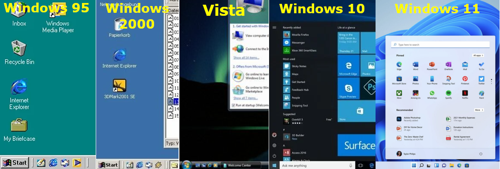
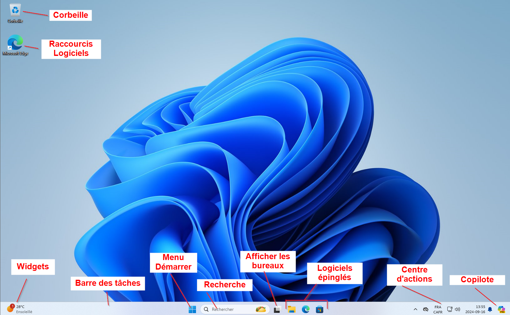
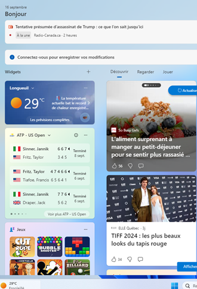
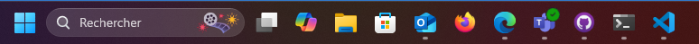
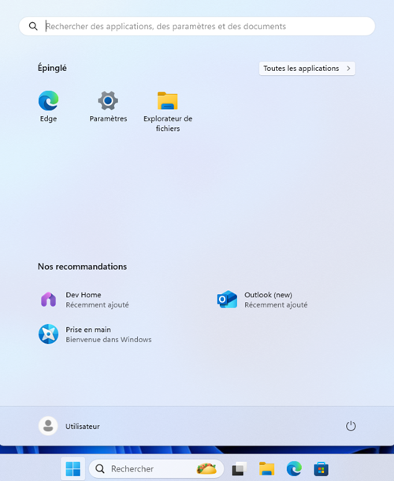
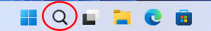
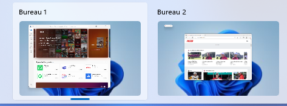
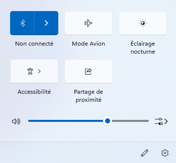
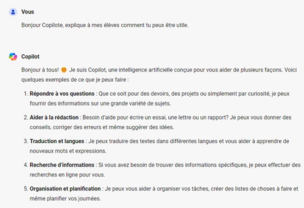
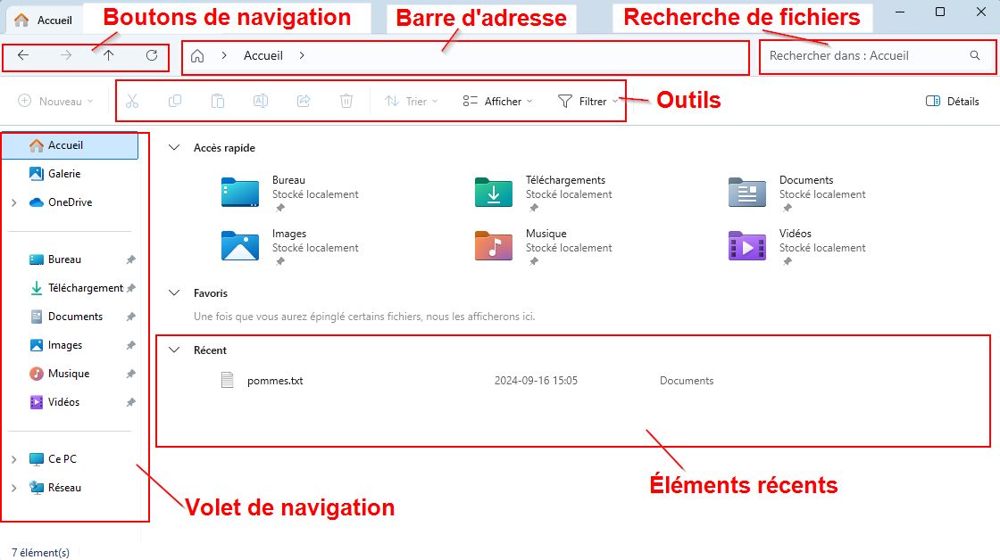

# Interfaces graphiques (GUI) 📺

*A contrario* de Linux, Microsoft n'a pas développé plusieurs interfaces graphiques. L'entreprise n'en a développé qu'une seule, qu'elle a su améliorer et optimiser au fil des années. Cela a eu pour effet de rassurer et de réconforter la majorité des utilisateurs finaux. C'est vrai que pour quelqu'un qui n'est pas un expert de l'informatique, retrouver ses menus toujours aux mêmes endroits peut être rassurant.

:::info[Rappel]
L'acronyme GUI signifie *Graphical User Interface* (Interface graphique utilisateur)
:::

## Éléments de l'interface graphique

Même si de nombreux changements ont été apportés à l'interface graphique de Windows à travers les années, certains éléments demeurent toujours présents d'une version à l'autre. Nous nous attarderons, ici, aux nouveaux éléments et aux récurrents. D'abord, voyons de quoi est composé le nouveau bureau de Windows 11:

### Les icônes du bureau

Même s'il peut paraître un peu insignifiante aux premiers abords, la corbeille existe depuis bien longtemps chez Windows. Elle est apparue dans les année 80. Elle donne une deuxième chance aux éléments que vous supprimez avant de les supprimer définitivement. Elle fait partie d'un groupe d'icône que l'on appelle les icône du bureau. Parmi eux, on retrouve les icônes suivantes:

:::tip[Le saviez-vous ?]
Si vous supprimez un fichier en appuyant simultanémment sur les touches `shift` et `del`, celui-ci sera supprimé définitivement sans passer par la corbeille.
:::

- Ordinateur (Ce PC)
- Fichiers de l'utilisateur
- Panneau de configuration
- Réseau
- Corbeille

Vous pouvez faire afficher toutes ces icônes, seulement une partie ou aucune en accédant à la section *Thèmes* des paramètres.

### Raccourcis logiciels

Au fur et à mesure que vous utiliserez votre PC sous Windows 11, il se peut que vous installiez de nouveaux logiciels. Lors de l'installation de ceux-ci, on vous proposera souvent d'ajouter un icône sur le bureau. Les icônes sont en fait des raccourcis vers un fichier situé dans l'arborescence de l'ordinateur. Dans la portion Architecture, nous verrons ensemble où sont véritablement situés les fichiers de programme. Cela dit, vous pouvez dès maintenant ingérer le concept selon lequel un icône sur le bureau n'est qu'une façon de lancer un logiciel plus rapidement.

### Les widgets

Les widgets sont apparus pour la première fois dans Windows Vista. Ce sont de petites applications proposant des services qui peuvent être pratiques d'avoir sous la main. Par défaut, vous y retrouverez la météo, un calendrier, les dernières actualités, etc.

### La barre des tâches

La barre des tâches est l'un des seuls éléments constamment visible (ou presque) lorsque vous utilisez Windows. Elle contient les éléments sur lesquels vous travaillez présentemment (dossier, fichier, logiciels), mais elle peut également contenir des éléments épinglés. On épingle généralement les éléments que l'on utilise souvent. Par exemple, si vous ouvrez votre client de courrier électronique à chaque ouverture de session, il pourrait être intéressant de l'épingler et ainsi, y accéder plus efficacement. La barre des tâches est à votre disposition pour améliorer votre ergonomie de travail et rendre votre expérience plus fluide.

Voici la barre des tâches sous Windows 11:

Les éléments sous lesquels ont retrouve un ovale grisé sont présentemment ouverts et en cours d'exécution. Les autres, peuvent être lancés directement depuis la barre des tâches, mais ne le sont pas présentement.

### Le menu démarrer

Si Microsoft n'avait qu'un élément à choisir pour représenter son système d'exploitation, ce serait sans doute le menu démarrer. Pourquoi ? Le menu démarrer a fait son apparition en même temps que l'interface graphique. Autrement dit, ce menu existe dans Windows depuis qu'il est possible d'utiliser une souris...C'est pour vous dire!

Malgré son évolution, le menu démarrer comporte sensiblement toujours les mêmes éléments:
- Une liste des logiciels installés dans l'ordinateur, ainsi qu'un icône pour les démarrer.
- Un accès [à l'explorateur Windows](#lexplorateur-windows) ainsi qu'aux différents paramètres du système.
- Une liste des fichiers et des dossiers récemment consultés.

Sous Windows 11, on y retrouvera en plus:

- Une barre de recherche intégrée
- Des applications épinglées

**Exemple de menu démarrer:**

### Barre ou icône de recherche

La barre de recherche porte très bien son nom. Elle permet de faire des recherches globales. Par exemple, si vous recherchez le mot « *pomme* » sur votre ordinateur, la recherche s'effectuerait dans les fichiers présents sur votre ordinateur, dans vos paramètres et sur le web.

Dans les paramètres de la barre des tâches, vous pouvez spécifier si vous préférez avoir une barre de recherche ou simplement une icône.

Voici à quoi ressemble l'icône de recherche:

### Afficher les bureaux

Le bouton « Afficher les bureaux » permet d'utiliser une fonctionnalité très intéressante de Windows: Les bureaux virtuels. Les bureaux virtuels permettent de créer plusieurs espaces de travail distincts. Ainsi, vous bénéficiez de plusieurs « écrans virtuels » entre lesquels vous alternez. Dans l'exemple ci-dessous, le magasin des applications est affiché sur un premier bureau et une fenêtre de navigation internet est affichée sur l'autre:

### Les logiciels épinglés

Certains logiciels sont épinglés sur la barre des tâches dès l'installation de Windows. Cela dit, rien ne vous oblige à les conserver. Vous pouvez les retirer en cliquant à l'aide du bouton de droite de la souris sur ceux-ci et en sélectionnant « Désépingler de la barre des tâches ». *A contrario*, vous pouvez également ajouter des logiciels épinglés. Pour ce faire, vous n'avez qu'à démarrer le logiciel en question. Une fois que l'icône de celui-ci apparaitra sur la barre des tâches, utilisez le même menu pour épingler le logiciel.

Il n'y aucune valeur ajoutée à un logiciel épinglé outre la possibilité de le lancer plus vite. 🚀

### Le centre d'actions

Le centre d'actions est un outil centralisé permettant de réaliser des actions rapidement sur différents paramètres du système. Le centre d'actions émettra des notifications concernant les mises-à-jour du système, des applications ou tout événement nécessitant votre attention. Il vous permet de passer rapidement votre appareil en mode avion, de rejoindre un réseau sans-fil en deux temps, trois mouvements. Vous pourrez également régler le volume ou la luminosité en quelques clics via le centre d'actions.

### Copilote

Copilote est l'intégration de l'intelligence artificielle fait par Microsoft sur son système d'exploitation Windows. Copilote peut vous offrir de l'aide de différentes façons:

1. Assistance contextuelle: Copilote peut offrir des suggestions basées sur les tâches que vous êtes en train d'accomplir. Par exemple, il pourrait vous recommander des actions ou des paramètres à ajuster pour améliorer votre efficacité.

2. Optimisation des Performances : Il aide à optimiser les performances de votre système en suggérant des modifications ou des nettoyages, comme la gestion des applications au démarrage ou la libération d'espace de stockage.

3. Aide à la Productivité : Copilote peut suggérer des outils ou des fonctionnalités de Windows 11 qui pourraient améliorer votre productivité, comme des raccourcis clavier, des astuces pour mieux utiliser les bureaux virtuels ou des conseils pour organiser vos fenêtres.

4. Support Technique : Il offre des recommandations pour résoudre les problèmes courants ou vous guide vers les ressources de support appropriées si vous rencontrez des difficultés avec le système.

## L'explorateur Windows

L'explorateur Windows, c'est le gestionnaire de fenêtre du système d'exploitation. Même s'il n'apparait pas directement à l'ouverture d'une session, il vous sera utile dès le moment où vous voudrez naviguer dans le PC. Il est donc très important d'en comprendre son fonctionnement et ses moindres recoins. Voici une image décrivant les différentes sections de l'explorateur Windows.

### Boutons de navigation

Les boutons de navigation de l'explorateur vous permettent d'accéder à certains dossiers plus rapidement. Le bouton « Back » ⬅️ vous permet de retourner au dossier où vous étiez précédemment. Le bouton suivant ➡️ vous permet de retourner au dossier où vous étiez avant de cliquez sur « Back ». Ça peut devenir mélangeant, mais il suffit de les essayer pour bien comprendre. La flèche pointant vers le haut ⬆️, quant à elle, vous remène directement au bureau, c'est un raccourci. Finalement, le bouton représenté par un symbole semblable à celui-ci: 🔄️ signifie « rafraîchir ». Il vous permet d'actualiser le contenu d'un dossier.