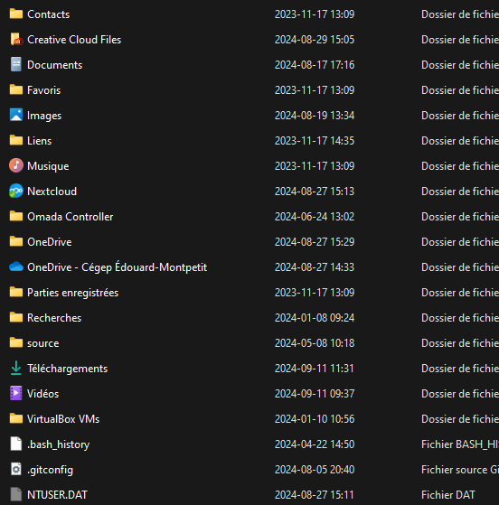

# Architecture 🌳

## La racine du système - Le disque C:

L'arborescence entière de l'écosystème Windows est hébergé sur un disque dur. On a attribué la lettre «­C:» à ce stockage. Peu importe le fichier ou le dossier que vous désirez récupérer, s'il a été créé ou enregistré sous Windows, il est quelque part dans le disque dur «C:» (À quelques exceptions près).

 :::tip[Le saviez-vous ?]

Pourquoi ne pas avoir utilisé la lettre «A:» comme lettre pour le disque dur principal ? Pour comprendre, il faut reculer jusqu'à l'époque de [MS-DOS](https://fr.wikipedia.org/wiki/MS-DOS). Les lettres «A:» et «B:» étaient réservés aux lecteurs de [disquettes](https://fr.wikipedia.org/wiki/Disquette). On a donc attribué la lettre «C:» au disque dur du système. Même si les lecteurs de disquettes appartiennent désormais au passé, l'attribution de la lettre «C:» au disque dur principal est resté. C'est donc un héritage d'un passé lointain qui explique son utilisation.

:::

## Certains dossiers dignes de mention

Que retrouve-t-on donc sur ce disque principal ? Plusieurs dossiers importants, évidemment, dont certains cachés. Cela dit, attardons-nous à certains dossiers plus importants et qui nécessiteront tôt ou tard, des interventions.

### C:\Users ou C:\Utilisateurs

C'est dans ce répertoire que sont stockés toutes les données des utilisateurs. Généralement, vous retrouverez un sous-dossier par utilisateur, correspondant au profil de ce dernier. Un profil utilisateur contient:

- Les données de l'utilisateur (images, musique, téléchargements, etc.)
- La configuration et les paramètres de l'utilisateur stockés dans le fichier **NTUser.dat**
- La configuration des paramètres et des préférences des applications dans le dossier **AppData**.

:::caution

Le fichier **NTUser.dat** contient une portion du registre de Windows. Le registre Windows est une base de données dans laquelle sont centralisé l'ensemble des paramètres du système, nous aurons l'occasion d'en parler un peu plus loin.

:::

**Exemple du contenu d'un profil:**

### C:\Windows

Le dossier Windows stocke toutes les données relatives à Windows. On y retrouve une foule d'exécutables et de [fichiers DLL](https://fr.wikipedia.org/wiki/Dynamic_Link_Library) (parfois dans des sous-dossiers).