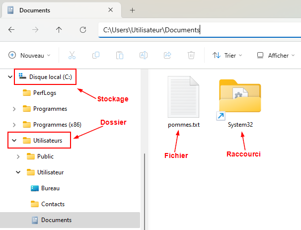
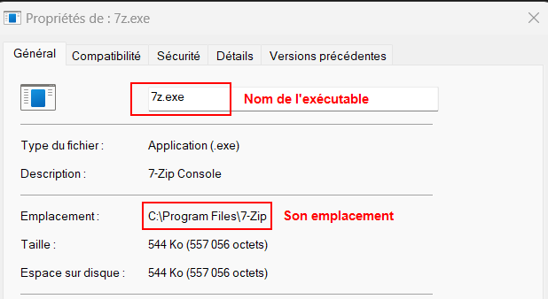

# Architecture 🌳

## De quoi est constitué Windows ?

De quoi parle-t-on lorsqu'on parle du système ? En fait, Windows est essentiellement constitué d'une arborescence de dossiers, de fichiers, de raccourcis et de stockage. Évidemment, c'est un peu plus complexe que cela lorsqu'on se met à creuser un peu. Néanmoins, c'est ce que vous vous devez de comprendre pour l'instant. Je vais tenter de vous expliquer brièvement ce que sont chacun de ces éléments:

- **Le dossier:** Le dossier contient des fichiers et d'autres dossiers (sous-dossiers), organisés de manière hiérarchique. Il sert à regrouper des éléments liés par un thème, un type de contenu ou objectif commun, facilitant ainsi leur gestion et leur accès.

- **Le fichier:** Un fichier contient un ensemble de données ou d'informations organisées et de manière structurée. Il peut s'agir de texte, d'images, de sons, de code ou même d'instructions (fichier exécutable). En général, un fichier est identifiable par son nom et son [extension](#les-extensions-de-fichiers).

- **Le raccourci:** Un raccourci est un lien permettant d'accéder rapidement à un fichier, un dossier ou un programme, sans avoir à naviguer dans l'arborescence complète du système. Un raccourci <u>ne contient aucune données,</u> mais pointe vers les emplacement d'origine, faciliant un accès rapide et efficace.

:::caution
Le raccourci est difficilement reconnaissable au premier coup d'oeil, il est cependant reconnaissable grâce à une petite flèche qu'il est possible de repérer au bas, à gauche de l'image. Voici à quoi ressemble celle-ci:

:::

**Voici une portion de l'arborescence du système Windows:**

### Les extensions de fichiers

L'extension d'un fichier est un suffixe ajouté à son nom, généralement constitué de trois à quatre caractères, qui indique le type de fichier et son format. Par exemple, dans le nom de fichier « document.txt », l'extension est « .txt », ce qui signifie qu'il s'agit d'un fichier texte. Les extensions aident le système d'exploitation à déterminer quel programme doit être utilisé pour ouvrir le fichier. Elles aident également les utilisateurs à reconnaître certains fichiers. Elles jouent donc un rôle crucial dans l'organisation et la gestion des fichiers.

## La racine du système - Le disque C:

L'arborescence entière de l'écosystème Windows est hébergé sur un disque dur. On a attribué la lettre «­C:» à ce stockage. Peu importe le fichier ou le dossier que vous désirez récupérer, s'il a été créé ou enregistré sous Windows, il est quelque part dans le disque dur «C:» (À quelques exceptions près).

 :::tip[Le saviez-vous ?]

Pourquoi ne pas avoir utilisé la lettre «A:» comme lettre pour le disque dur principal ? Pour comprendre, il faut reculer jusqu'à l'époque de [MS-DOS](https://fr.wikipedia.org/wiki/MS-DOS). Les lettres «A:» et «B:» étaient réservés aux lecteurs de [disquettes](https://fr.wikipedia.org/wiki/Disquette). On a donc attribué la lettre «C:» au disque dur du système. Même si les lecteurs de disquettes appartiennent désormais au passé, l'attribution de la lettre «C:» au disque dur principal est resté. C'est donc un héritage d'un passé lointain qui explique son utilisation.

:::

### Le système de fichiers

L'arborescence de Windows n'est pas stockée n'importe comment sur le disque dur. On utilisera ce que l'on nomme: un système de fichiers. Essentiellement, un système de fichiers est une méthode de disposition des éléments du systèmes sous la forme d'une structure donnée. Plus concrètement, le système de fichier occupe les fonctions et possède les caractéristiques suivantes:

- **Organisation des données:** Il définit comment les fichiers et les dossiers sont structurés et organisés sur le support

- **Nommage des fichiers:** Il permet de donner des noms aux fichiers et de gérer les extensions, ce qui aide à identifier le type de fichier.

- **Gestion de l'espace:** Il suit l'utilisation de l'espace de stockage, détermine où les fichiers sont stockés et libère de l'espace lorsque des fichiers sont supprimés.

- **Accès aux fichiers:** Il gère la lecture et l'écriture des données, permettant aux applications et aux utilisateurs d'accéder aux fichiers.

- **Permissions et sécurité:** Il contrôle qui peut accéder, modifier ou exécuter un fichier, garantissant la sécurité des données.

## Certains dossiers dignes de mention

Que retrouve-t-on donc sur ce disque principal ? Plusieurs dossiers importants, évidemment, dont certains cachés. Cela dit, attardons-nous à certains dossiers plus importants et qui nécessiteront tôt ou tard, des interventions.

:::caution

Certains des dossiers listés dans cette section peuvent avoir été traduit en français dans le cas où vous utiliseriez Windows dans cette langue. Ceci étant dit, il ne s'agit que **d'alias**. Le véritable nom des dossiers est bel et bien en anglais. C'est le cas du dossier **« C:\Users »** et du dossier **« C:\Program files »** à titre d'exemple.

:::

### C:\Users

C'est dans ce répertoire que sont stockés toutes les données des utilisateurs. Généralement, vous retrouverez un sous-dossier par utilisateur, correspondant au profil de ce dernier. Un profil utilisateur contient:

- Les données de l'utilisateur (images, musique, téléchargements, etc.)
- La configuration et les paramètres de l'utilisateur stockés dans le fichier **NTUser.dat**
- La configuration des paramètres et des préférences des applications dans le dossier **AppData**.

:::danger

Le fichier **NTUser.dat** contient une portion du registre de Windows. Le registre Windows est une base de données dans laquelle sont centralisé l'ensemble des paramètres du système, nous aurons l'occasion d'en parler un peu plus loin. En aucun cas il ne faut supprimer ou renommer ce fichier.

:::

**Exemple du contenu d'un profil:**

### C:\Program files

C'est le répertoire par défaut où s'installeront les logiciels et applications que vous installerez sur votre PC. Lors de l'installation, si vous ne précisez pas de dossier d'installation particulier, un dossier au nom du logiciel y sera créé et les données de ce dernier stocké. D'ailleurs, lorsque vous cliquez sur l'icone d'un programme situé sur votre bureau, il s'agit, plus souvent qu'autrement, que d'un raccourci vers le fichier exécutable situé dans le dossier «C:\Program files». Dans l'image ci-dessous, on constate que le fichier exécutable de 7-zip, un utilitaire de compression, se retrouve dans un dossier à son nom sous « C:\Program files »:

### C:\Program files (x86)

C'est un répertoire pour les applications également. Cependant, ce répertoire est réservé aux applications moins modernes, s'exécutant en 32 bits. C'est logiciels sont distingués des autres puisqu'ils nécessitent un environnement un peu particulier que Windows mettra en place pour les exécuter.

:::info[32 ou 64 bits, quelle incidence ?]
Il se peut que vous entendiez parler de deux architecture distinctes en informatique: 32 bits ou 64 bits. **De quoi parle-t-on ?** Grossièrement, on parle de la largeur des unités de données qu'un processeur peut traiter. À titre de comparaison, imaginons un écrivain capable de composer des phrases d'au maximum 32 mots, puis un second capable de composer des phrases allant jusqu'à 64 mots. L'écrivain limité à 32 mots devra parfois travaillé plus fort que son collègue pour exprimer une idée. De son côté, l'écrivain capable de composer des phrases de 64 mots aura plus d'espace pour nuancer ses propos et exprimer des idées plus complexes. C'est pourquoi aujourd'hui, la grande majorité des processeurs fonctionnent sous une architecture 64 bits. Peut-être vous demandez vous quel est le lien entre le terme x86 utilisé pour désigner les programmes sous l'architecture 32 bits. C'est tout simplement parce que l'architecture 32 bits a fait son entrée sur le marché avec la gamme 8086 des processeurs intel. On a donc associé les deux termes et cela est resté avec le temps.
:::

### C:\ProgramData

Ce répertoire est utilisé pour stocker des données d'application partagées, c'est-à-dire des fichiers et des paramètres qui doivent être accessibles à tous les utilisateurs de l'ordinateur. Cela permet l'utilisation d'un logiciel et de ses données par plusieurs utilisateurs sans avoir a en dupliquer les données dans plusieurs profiles.

### C:\Windows

Le dossier Windows est l'un des dossiers les plus critiques du système Windows et il joue un rôle essentiel dans le fonctionnement du système d'exploitation. Ce répertoire contient une panoplie d'éléments. Je ne pourrais pas tous les énumérer ici, mais nous pouvons certainemment en analyser quelques-uns:

1. **Noyau Windows:** Les fichiers principaux du noyau (le coeur de Windows) sont répertoriés dans ce dossier. Ces fichiers assurent la gestion des ressources matérielles et la communication entre le matériel et les logiciels.

2. **Fichiers de démarrage:** Des fichiers nécessaires au bon démarrage du système sont également présents dans ce répertoire. Le fichier *bootmgr* et le sous-dossier *System32\Boot* en sont deux exemples.

3. **Sous-dossier: System32**: Le sous-dossier *System32* contient de nombreux fichiers cruciaux tels que certains exécutables essentiels comme *cmd.exe* ou *explorer.exe* ([l'explorateur Windows](Interfaces%20graphiques#lexplorateur-windows)). Ce dossier contient également des pilotes et des [bibliothèques dynamiques (DLL)](https://fr.wikipedia.org/wiki/Dynamic_Link_Library) au bon fonctionnement de Windows.

4. **Sous-dossier: SysWOW64**: Le sous-dossier *SysWOW64* contient les bibliothèques dynamiques nécessaires à l'exécution de logiciels 32 bits sur un système 64 bits. Il contient également le fichier *WOW64*, l'émulateur de l'environnement 32 bits. En gros, sans ce dossier, aucun logiciel 32 bits ne pourrait être exécuté sous Windows.

5. **Sous-dossier: WinSxS**: Le sous dossier *WinSxS* signifie « Windows Side-by-Side ». Le nom du dossier est un espère de jeu de mot comme « 4x4 » pour les véhicules tout terrain. Ce dossier plusieurs versions des fichiers système, permettant à différentes applications d'utiliser la version avec laquelle elles sont compatibles. Cela permet d'éviter les conflits entre différentes versions et d'assurer un fonctionnement.

6. **Sous-dossier: SoftwareDistribution**: Ce dossier contient les fichiers téléchargés par Windows Update pour mettre à jour le système. Il n'est pas rare que ce dossier devienne imposant avec le temps (plusieurs giga-octets de données). Néanmoins, il demeure sécuritaire d'en supprimer le contenu. Au besoin Windows Update le retééchargera.

7. **Sous-dossier: Logs**: Ce sous-dossier contient des journaux créées par le système et les applications qui peuvent être utiles pour le diagnostic et la résolution de problèmes. Pour rappel, un fichier *log* ou un fichier journal, contient de l'information pertinente concernant sur l'exécution d'un logiciel x ou y.