# Lignes de commande 🤖

Sous Windows, plusieurs Shell (interface machine-personne) cohabitent côte à côte.

## L'invite de commande

L'invite de commande traditionnelle existe depuis la première version de Windows et s'inspire des commandes que l'on retrouvait sous MS-DOS. Évidemment, l'invite de commande à évoluer entre les différentes versions de Windows. Or, son évolution n'a pas toujours été de tout repos pour les utilisateurs. En effet, dans une version de Windows, on pouvait retrouver une commande, puis dans la version de Windows suivante, la commande avait disparu. Pire encore, dans la version de Windows qui suivait encore, la commande réapparaissait. Bref, cela pouvait être relativement dur à suivre. Pour lancer l'invite de commande, utilisez le raccourci clavier `win` + `r` et tapez l'expression `cmd` suivie de la touche « entrée ».

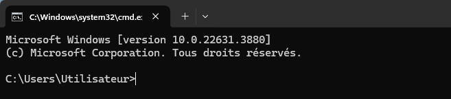

## Windows Subsystem for Linux (WSL)

Ce shell a fait sa première apparition avec la version 1607 de Windows 10. Il permet d'utiliser les commandes et certaines applications Linux sans avoir à passer par le biais d'un ordinateur virtuel. En mai 2020, WSL 2 fait son entrée et améliore grandement ses performances et sa compatibilité avec plusieurs applications Linux. Cela dit, ce shell n'est pas orienté pour la gestion de Windows, mais plutôt pour utiliser des applications ou des logiciels Linux sous Windows.

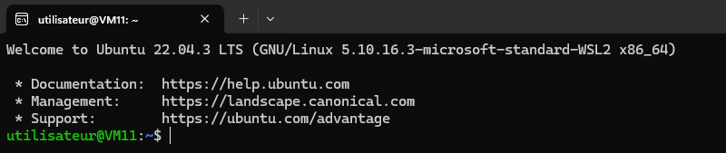

## Powershell

Powershell a fait son apparition en 2006. L'objectif était de fournir un environnement de gestion plus puissant, flexible et moderne. Powershell est un langage de script orienté objet, permettant l'automatisation des tâches et la gestion de systèmes informatiques plus complexes. La dernière version de Powershell est la version 7 et c'est également le terminal par défaut sous Windows 11. Nous nous attarderons donc à ce shell pour interagir avec notre système Windows. Pour lancer Powershell sous Windows 11, vous n'avez qu'à cliquer sur le bouton de droite de votre souris et sélectionner « Ouvrir dans le terminal ».

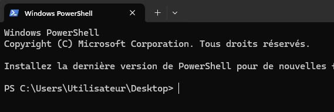

### Ligne active

La ligne active contient des informations pertinentes à connaître:

1. `PS` : Indique simplement que le « shell » en cours est Powershell.

2. `C:\Users\Utilisateur\Desktop>` : Il s'agit de l'endroit où vous vous trouvez dans l'arborescence du système.

### Cmdlet ( prononcé « command-lets » )

C'est ainsi que l'on nomme les commandes sous Powershell. Ces commandes sont toujours composées d'un verbe et d'un nom. Par exemple: 
- `set-location`
- `get-childitem`
- `copy-item`

etc.

## Anatomie d'une commande

Sous Powershell, tout comme au sein d'autres Shell, la commande est toujours la première chose à inscrire. Certaines commandes utiliseront des paramètres pour préciser ou altérer légèrement le comportement de la commande, sans jamais en modifier la nature.


:::caution
Il n'est pas toujours nécessaire de préciser le nom du paramètre. Dans l'exemple ci-dessus, le nom du paramètre (Path) est précisé. Néanmoins, lorsque l'on consulte l'aide en ligne sur le site de Microsoft, on constate que la position du paramètre est 0. Autrement dit, c'est le premier paramètre qu'attend la commande. Automatiquement, les données qui seront entrées immédiatement après la commande seront donc considérées comme le paramètre `path`.

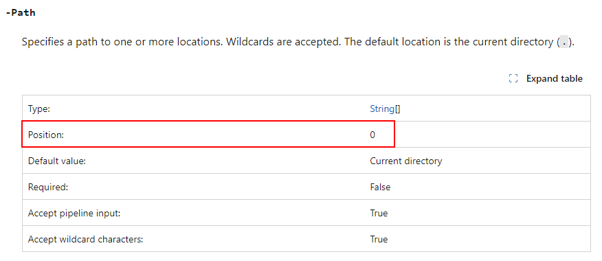

:::

## Aide en ligne

Avant de commencer à vous présenter certaines commandes de base en Powershell, je dois vous parler des ressources d'aide à votre disposition. Il est impensable d'apprendre toutes les cmdlets de Powershell par cœur. À un moment ou un autre, vous voudrez peut-être utiliser une commande sans en connaître tous les paramètres. Évidemment, il y a la bonne vieille recherche Google, mais sinon, je vous invite à consulter le [site de Microsoft](https://learn.microsoft.com/en-us/powershell/scripting/how-to-use-docs?view=powershell-7.4). Vous y trouverez toutes les références nécessaires à l'utilisation des cmdlets.

:::info[Le point sur les intelligences artificielles]

Certaines intelligences artificielles, comme chatgpt ou copilot, peuvent parfois vous aider à accomplir une tâche en Powershell. Ce sont des outils à votre disposition. Cela dit, tout comme vous ne prendriez pas tout comme une vérité absolue sur le web, il faut prendre du recul avec les réponses que fournit une intelligence artificielle. L'intelligence artificielle peut vous aider, mais elle ne peut pas réfléchir à votre place. Observez les commandes qu'elle vous offre, réfléchissez et ajustez les réponses au besoin. Prenez le temps de comprendre ce que l'intelligence artificielle fait. Si vous ne faites que du copier-coller, votre compréhension ne s'améliorera pas et vous vous ferez avoir en examen.

:::

## Commandes de base

Nous allons aborder certaines cmdlets ensemble afin que vous puissiez vous débrouiller avec Powershell. Évidemment, il ne s'agit que d'une petite introduction à toutes les possibilités offertes par ce dernier. Rien ne vous empêche d'aller plus loin par vous-mêmes, cependant, en ce qui nous concerne, nous nous en tiendrons à l'essentiel. J'ai pris soin d'insérer un lien vers l'aide en ligne de Microsoft pour chacune des commandes présentées. Vous n'avez qu'à cliquer sur le nom de la commande pour vous y rendre.

### [Set-Location](https://learn.microsoft.com/en-us/powershell/module/microsoft.powershell.management/set-location?view=powershell-7.4)

Cette cmdlet permet de se déplacer dans l'arborescence Windows. C'est l'équivalent de la commande `cd` sous Linux ou même dans l'invite de commande Windows standard.

**Exemple 1: Se déplacer à la racine du système (C:\\)**

```powershell
Set-Location C:\
```

**Exemple 2: Se déplacer dans le dossier C:\Program files**

```powershell
Set-Location 'C:\Program files'
```

### [Get-ChildItem](https://learn.microsoft.com/en-us/powershell/module/microsoft.powershell.management/get-childitem?view=powershell-7.4)

Cette commande permet d'afficher le contenu d'un répertoire. Autrement dit, elle est l'équivalente de la commande `ls` sous Linux ou `dir` sous Windows.

**Exemple 1: Afficher le contenu du dossier C:\Windows**

```powershell
Get-ChildItem C:\Windows
```

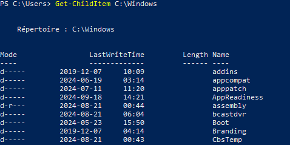

**Exemple 2: Afficher le contenu du répertoire actuel**

```powershell
Get-ChildItem .\
```

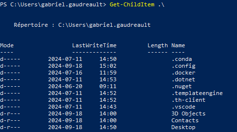

:::info[Rappel]
Les répertoires représentés par un point `.\` et par deux points `..\` ont des significations particulières. En effet, le répertoire `.\` représente le dossier actuel, c'est-à-dire celui dans lequel vous vous trouvez présentemment. Quant au dossier `..\`, il représente le répertoire parent. Autrement dit, en entrant la commande `set-location ..\`, vous atteindrez le répertoire parent relativement à votre emplacement.
:::

### [New-Item](https://learn.microsoft.com/en-us/powershell/module/microsoft.powershell.management/new-item?view=powershell-7.4)

Cette cmdlet permet de créer un nouvel item. Le terme item est assez large et c'est volontaire de la part de Microsoft, car cette commande peut créer des fichiers, des répertoires, des raccourcis et bien d'autres éléments. Comme il ne s'agit pas d'un cours de Powershell à strictement parler, nous nous contenterons de voir comment créer des dossiers et des fichiers.

**Exemple 1: Créer un dossier sur mon bureau**

```Powershell
New-Item -Path C:\Users\gabriel.gaudreault\Desktop -Name MonDossier -ItemType Directory
```

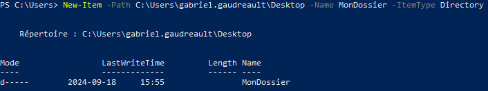

**Exemple 2: Créer un fichier sur mon bureau**

```powershell
New-Item -Path C:\Users\gabriel.gaudreault\Desktop -Name HelloWorld.txt -ItemType File
```

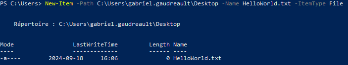

### [Write-Host](https://learn.microsoft.com/en-us/powershell/module/microsoft.powershell.utility/write-host?view=powershell-7.4)

La commande `Write-Host` permet d'afficher du texte à l'écran, tout simplement.

**Exemple 1: Afficher un message standard à l'écran**

```powershell
Write-Host "Powershell c'est génial!"
```

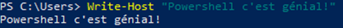

**Exemple 2: Afficher un message de couleur jaune avec fond noir à l'écran**

```powershell
Write-Host "Powershell c'est génial!" -BackgroundColor Black -ForegroundColor Yellow
```

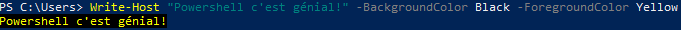

### [Get-Content](https://learn.microsoft.com/en-us/powershell/module/microsoft.powershell.management/get-content?view=powershell-7.4)

Cette cmdlet permet d'afficher le contenu d'un fichier. Elle est comparable à la commande `cat` sous linux ou même `type` en invite de commandes Windows.

**Exemple 1: Afficher le contenu d'un fichier sur mon bureau**

```powershell
Get-Content -Path C:\Users\gabriel.gaudreault\Desktop\HelloWorld.txt
```
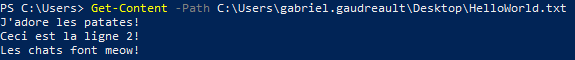

**Exemple 2: Afficher une ligne spécifique d'un fichier**

```powershell
(Get-Content -Path C:\Users\gabriel.gaudreault\Desktop\HelloWorld.txt)[1]
```

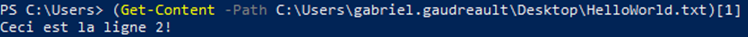

### [Move-Item](https://learn.microsoft.com/en-us/powershell/module/microsoft.powershell.management/move-item?view=powershell-7.4)

La commande `move-item` permet de déplacer un élément (dossier,fichier,etc.). Elle peut également renommer l'item tout en le déplacant.

**Exemple 1: Déplacer un item depuis mon bureau vers la racine du système**

```powershell
Move-Item -Path "C:\Users\gabriel.gaudreault\Desktop\HelloWorld.txt" -Destination "C:\"
```
:::caution
Les droits d'administrateur sont requis pour écrire à la racine du système. Si vous désirez exécuter la dernière commande, assurez-vous de lancer Powershell en tant qu'Administrateur.
:::

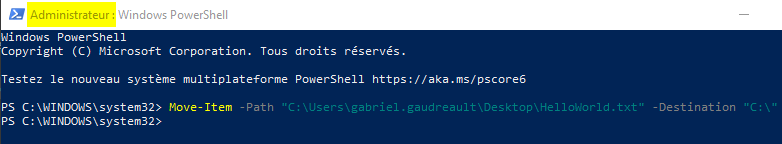

**Exemple 2: Déplacer un item tout en le renommant**

```powershell
Move-Item -Path "C:\Users\gabriel.gaudreault\Desktop\HelloWorld.txt" -Destination "C:\Patates.txt"
```

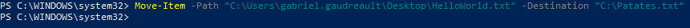

### [Copy-Item](https://learn.microsoft.com/en-us/powershell/module/microsoft.powershell.management/copy-item?view=powershell-7.4)

La cmdlet `copy-item` permet de copier un élément (dossier,fichier,etc.). Tout comme `move-item`, elle est capable de renommer un élément tout en le copiant.

**Exemple 1: Copier un item de mon bureau vers mon dossier documents**

```powershell
Copy-Item -Path "C:\Users\gabriel.gaudreault\Desktop\HelloWorld.txt" -Destination "C:\Users\gabriel.gaudreault\Documents\"
```

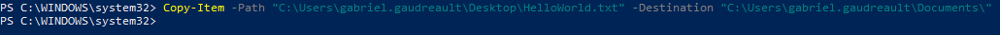

**Exemple 2: Copier un item tout en le renommant**

```powershell
Copy-Item -Path "C:\Users\gabriel.gaudreault\Desktop\HelloWorld.txt" -Destination "C:\Users\gabriel.gaudreault\Desktop\Sauvegarde.txt"
```

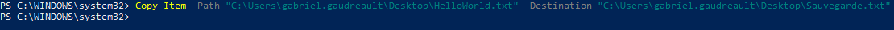

### [Remove-Item](https://learn.microsoft.com/en-us/powershell/module/microsoft.powershell.management/remove-item?view=powershell-7.4)

Vous l'aurez sans doute déjà compris, cette cmdlet permet de supprimer des éléments du système.

**Exemple 1: Supprimer un fichier sur mon bureau**

```powershell
Remove-Item -Path "C:\Users\gabriel.gaudreault\Desktop\HelloWorld.txt"
```

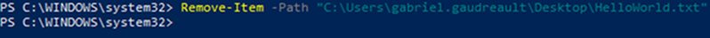

**Exemple 2: Supprimer un dossier et son contenu**

```powershell
Remove-Item -Path "C:\Users\gabriel.gaudreault\Desktop\Dossier\" -Recurse
```

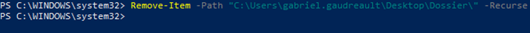

### [Clear-Host](https://learn.microsoft.com/en-us/powershell/module/microsoft.powershell.core/clear-host?view=powershell-7.4)

La commande `clear-host` permet de nettoyer l'affichage dans la fenêtre de Powershell.

**Avant :**

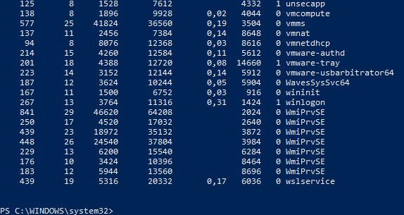

**Après :**

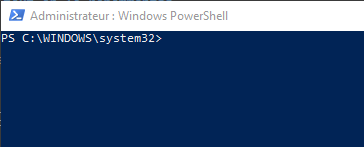

### [Add-Content](https://learn.microsoft.com/en-us/powershell/module/microsoft.powershell.management/add-content?view=powershell-7.4)

`Add-Content` permet d'ajouter du contenu à un fichier et même d'en créer de nouveaux.

**Exemple 1: Ajout d'une ligne de texte dans un fichier existant**

```powershell
Add-Content -Path "C:\HelloWorld.txt" -Value "Nouvelle ligne"
```

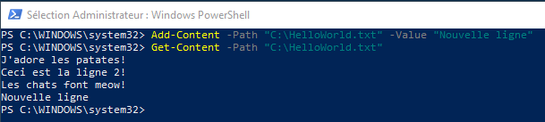

**Exemple 2: Création d'un nouveau fichier en y ajoutant du contenu**

```powershell
Add-Content -Path "C:\NouveauFichier.txt" -Value "Mon enseignant est fantastique!"
```

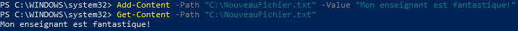

### [Set-Content](https://learn.microsoft.com/en-us/powershell/module/microsoft.powershell.management/set-content?view=powershell-7.4)

La cmdlet `set-content` permet de modifier ou de remplacer le contenu d'un fichier.

**Exemple 1: Remplacer le contenu d'un fichier**

```powershell
Set-Content -Path "C:\NouveauFichier.txt" -Value "En fait, mon enseignant est correct."
```

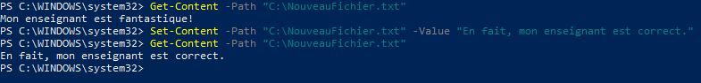

**Exemple 2: Remplacer seulement un mot dans un fichier**

```powershell
(Get-Content -Path "C:\NouveauFichier.txt") -replace "enseignant", "ami" | Set-Content "C:\NouveauFichier.txt"
```

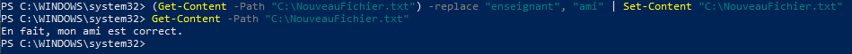

:::caution

Cette dernière manipulation (remplacement de mot) est un peu plus avancée. Nous aurons l'occasion d'en reparler un peu plus loin dans la théorie.

:::

## Chemins absolus et relatifs

Le concept de chemins absolus et de chemins relatifs est important à discerner, surtout lorsque nous travaillons en ligne de commande.

### Chemins absolus

Peu importe le système d'exploitation sur lequel vous travaillez, un chemin absolu désigne le chemin vers un dossier ou un fichier depuis la racine du système. Voici quelques exemples pour mieux comprendre ce que c'est:

**Exemple 1: Déplacement vers un emplacement en utilisant un chemin absolu:**

```powershell
Set-Location "C:\Users\gabriel.gaudreault\Downloads\"
```

**Exemple 2: Copie d'un fichier en utilisant des chemins absolus :**

```powershell
Copy-Item -Path "C:\Users\gabriel.gaudreault\Desktop\HelloWorld.txt" -Destination "C:\"
```


### Chemins relatifs

Un chemin relatif, quant à lui, désigne un chemin vers un dossier ou un fichier depuis l'emplacement où je me trouve dans le système.

**Exemple 1: Déplacement à l'aide d'un chemin relatif**

Considérant que je suis présentemment dans le dossier `C:\Users\gabriel.gaudreault\` et que je désir atteinre le dossier `C:\Windows\`

```powershell
Set-Location ..\..\Windows
```

**Exemple 2: Copie d'un fichier à l'aide d'un chemin relatif**

Considérant que je suis présentemment dans le dossier `C:\Users\gabriel.gaudreault\Desktop` et que je désir copier le fichier `C:\HelloWorld.txt` à l'endroit où je me trouve présentemment

```powershell
Copy-Item -Path "C:\HelloWorld.txt" -Destination ".\"
```