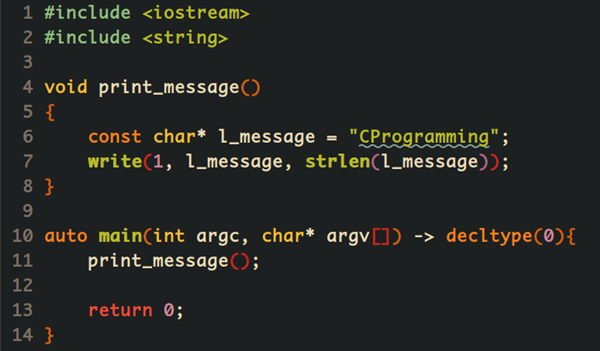
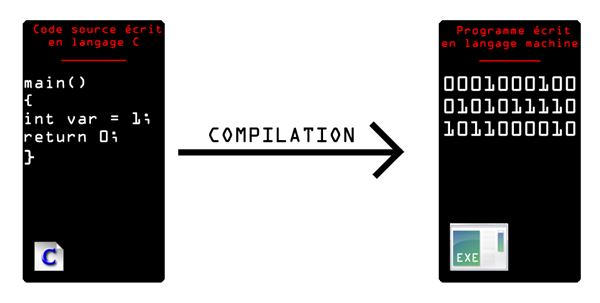

# Applications et logiciels 📦

## Qu'est-ce qu'un logiciel ?
Un logiciel ou une application, c'est d'abord un fichier ou un ensemble de fichier qu'un programmeur ou qu'une équipe de programmeurs auront conçu. Ces programmeurs utiliseront ce que l'on nomme un langage de programmation pour écrire et composer un ensemble d'instructions que l'ordinateur pourra traiter. Voici un exemple de fichier écrit par un programmeur:

Dans certains cas, dépendamment des langages de programmation et de leur contexte respectif, une deuxième étape sera nécessaire avant que le programme puisse fonctionner. Il s'agit de l'étape de la compilation. Lorsqu'il y a compilation, le code utilisé par le programmeur sera alors transformé en instructions pour le processeur de l'ordinateur. Un code compilé est très peu lisible et compréhensible.

