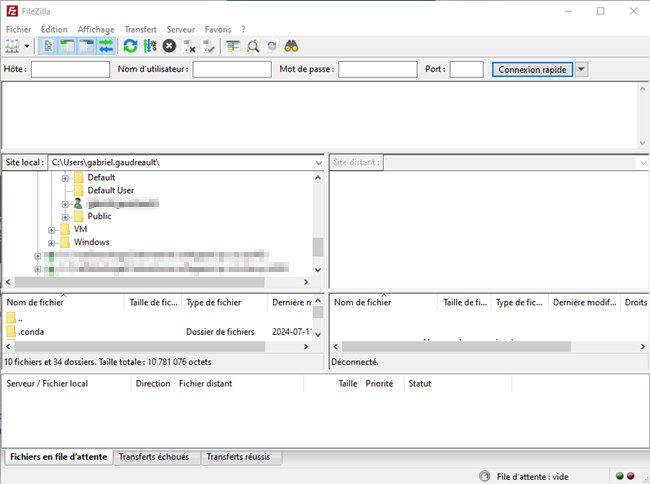
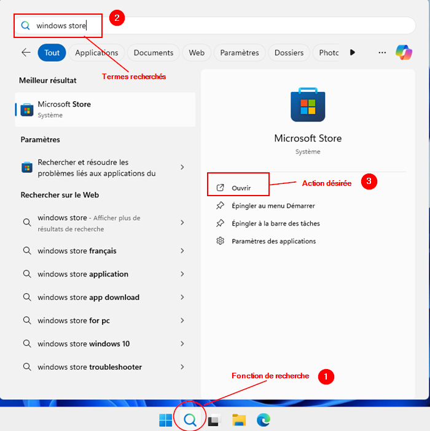
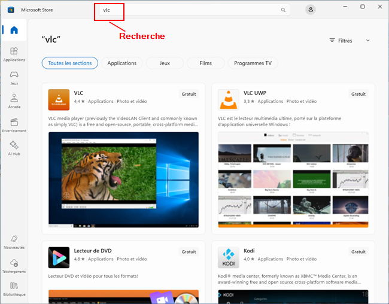
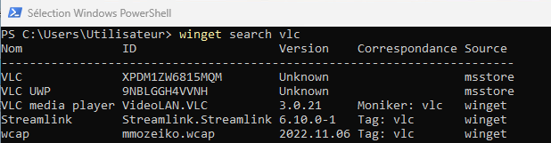
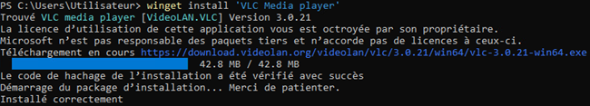
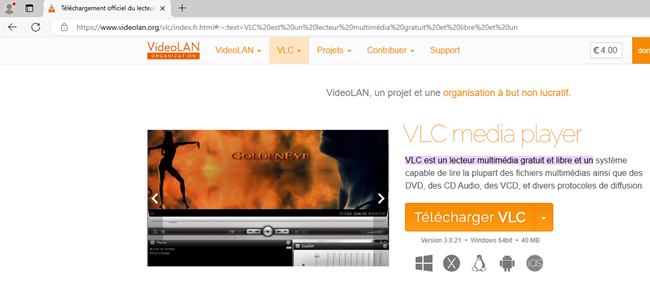
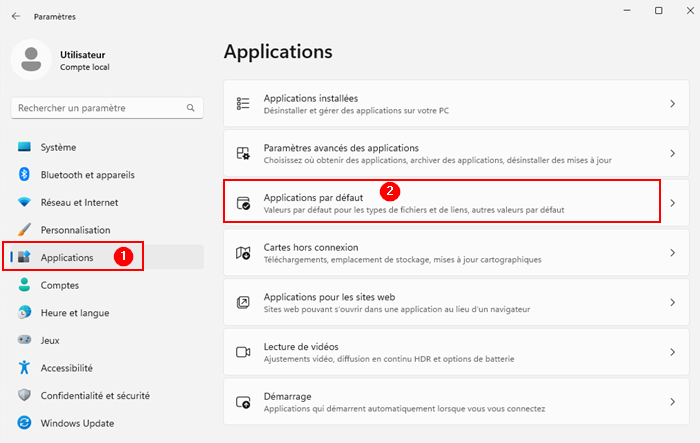
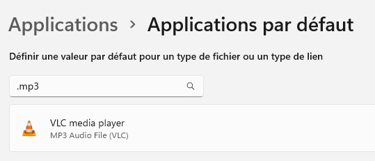
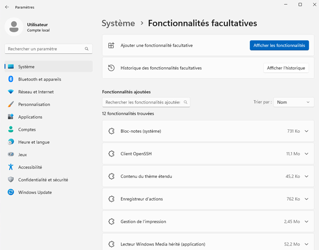

# Applications et logiciels 📦

## Qu'est-ce qu'un logiciel ?
Un logiciel ou une application, c'est d'abord un fichier ou un ensemble de fichier qu'un programmeur ou qu'une équipe de programmeurs auront conçu. Ces programmeurs utiliseront ce que l'on nomme un langage de programmation pour écrire et composer un ensemble d'instructions que l'ordinateur pourra traiter. Voici un exemple de fichier écrit par un programmeur:


Dans certains cas, dépendamment des langages de programmation et de leur contexte respectif, une deuxième étape sera nécessaire avant que le programme puisse fonctionner. Il s'agit de l'étape de la compilation. Lorsqu'il y a compilation, le code utilisé par le programmeur sera alors transformé en instructions pour le processeur de l'ordinateur. Un code compilé est très peu lisible et compréhensible.


Une fois les instructions comprises et exécutées par le processeur, le logiciel s'exécutera. Lors de l'exécution, le système créera automatiquement un processus dans sa mémoire et chargera le logiciel à l'intérieur de celui-ci. Nous aborderons les processus très bientôt. Dans l'image ci-dessous, nous pouvons voir le logiciel FileZilla en exécution.



## Installer un logiciel

Sous Windows 11, il y a plusieurs façons de procéder à l'installation d'un logiciel. Nous allons les examiner et les comparer ensemble. Cela dit, certains logiciels nécessiteront l'utilisation d'une méthode particulière. Tout dépend de l'éditeur du logiciel en question.

### Windows Store

L'utilisation du *Windows Store* est sans doute la méthode la plus facile pour installer une application ou un logiciel. Il suffit d'ouvrir l'application *Windows Store*, de lancer une recherche avec le nom de votre logiciel et de l'installer. 

Pour lancer *Windows Store*, utilisez votre barre de recherche juste à côté du menu démarrer et tapez *Windows Sotre*:



Une fois dans *Windows Store*, utilisez la recherche pour repérer l'application ou le logiciel que vous désirez installer. Dans l'exemple ci-dessous, je recherche le logiciel *vlc*, un célèbre lecteur multimédia. Une fois votre logiciel repéré, vous pouvez cliquer sur celui-ci afin d'afficher les détails de celui-ci et d'obtenir la possibilité de l'installer.



### WinGET

*WinGET* est le nouveau gestionnaire de paquets de Windows. Il permet de télécharger et d'installer des logiciels directement depuis le terminal PowerShell. Cette façon de procéder peut sembler plus complexe aux premiers abords, mais elle possède l'avantage d'être très pratique. Pas d'interface graphique à manœuvrer, pas de fenêtre ou de site web à consulter. On entre la bonne commande et le logiciel s'installe. Pour lancer le terminal *PowerShell*, faites un clic à l'aide du bouton de droite de votre souris sur le bureau, puis sélectionnez « Ouvrir dans le terminal ».

#### Chercher un logiciel avec *Winget*

Avant de tenter une installation de logiciel, il est bien de vérifier que ce dernier est bel et bien disponible via l'installation *Winget*. Pour ce faire, on utilisera le paramètre *search* comme dans l'exemple ci-dessous:

**Commande:**
```powershell
winget search vlc
```
**Résultat:**



#### Installer un logiciel avec *Winget*

Une fois que vous avez repéré le logiciel que vous voulez installer, il faut tout simplement utiliser le paramètre *install* suivi du nom du logiciel à installer. 

:::info
J'attire votre attention vers la colonne « Source », qui permet d'identifier d'où vous téléchargerez le logiciel. Vous remarquerez le terme « msstore » qui réfère au magasin Windows. Autrement dit, télécharger le logiciel depuis *WinGET* ou depuis le magasin revient exactement au même dans ces cas précisément. 
:::

**Commande:**
```powershell
winget install 'VLC Media Player'
```

**Résultat:**



### Manuellement

Pour procéder à l'installation d'un logiciel manuellement, il faut d'abord télécharger un installateur. Généralement, ces installateurs possèdent une extension *.msi* ou *.exe* et sont téléchargeables depuis le site internet du développeur. Par exemple, voici le site officiel du lecteur multimédia VLC:



:::danger
Assurez-vous de télécharger vos fichiers d'installation depuis un site de confiance. Le lancement d'un fichier exécutable téléchargé depuis un site suspect représente un réel risque pour votre ordinateur et les données qu'il contient.
:::

Une fois le logiciel téléchargé, celui-ci devrait se retrouver dans votre dossier de téléchargements:

(C:\\Users\\*Nom d'utilisateur*\\downloads\\*fichier.exe*)

Lancez le fichier, en double-cliquant sur celui-ci, et suivez les étapes de l'installation.

## Applications par défaut

Windows 11 vous offre la possibilité de créer une association entre certaines extensions de fichier et une application particulière. Par exemple, si vous désirez ouvrir vos fichiers *.mp3* (musique) toujours avec le même lecteur multimédia, il est possible de le faire. Dans les paramètres Windows (clic-droit sur le menu démarrer, puis paramètres), sélectionnez la section « Applications », puis cliquez sur « Applications par défaut »:



À cet endroit, vous aurez l'occasion d'entrer un type de fichier (extension) ainsi que le logiciel auquel vous désirez associer cette extension:



En aucun cas cela ne vous oblige à ouvrir les fichiers *mp3* avec VLC en permanence. Il ne s'agit que du comportement par défaut. Cela dit, à tout moment, vous pouvez effectuer un clic à l'aide du bouton de droite de la souris sur un fichier et sélectionner « Ouvrir avec... ». Cela vous permettra de sélectionner le logiciel de votre choix.

## Fonctionnalités facultatives

Microsoft rend certaines fonctionnalités de Windows disponibles mais désactivées par défaut. C'est le cas du serveur SSH à titre d'exemple. 

:::info
Un serveur SSH est un service permettant à des utilisateurs de se brancher sur le terminal du poste à distance.
:::

À tout moment vous pouvez activer l'une de ces fonctionnalités ou consulter la liste de celles-ci en vous dirigeant dans les paramètres, puis dans la section « Système » et « Fonctionnalités facultatives »:



Cliquez simplement sur « Afficher les fonctionnalités » pour consulter la liste des fonctionnalités disponibles à l'installation. Vous pourrez également procéder à l'installation de l'une d'entre elles au besoin.
