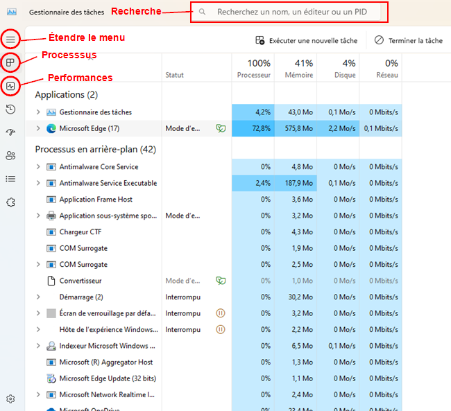
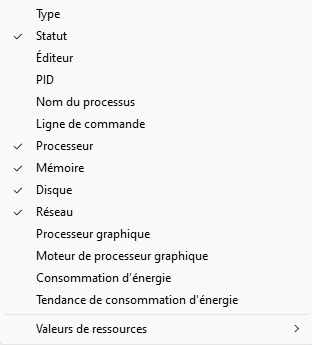

# Processus 🕵️

## Qu'est-ce qu'un processus ?

Dans la section précédente, nous avons abordé ensemble les logiciels et les applications. Plus précisémment, nous avons vu comment procéder à leur installation et leur désinstallation. Néanmoins, qu'en est-il de leur fonctionnement ? Que se produit-il dans le système lorsqu'on lance un logiciel ? C'est là que les processus interviennent.

Peut-être avez-vous déjà entendu le terme, peut-être pas. Cela dit, les processus existent depuis bien longtemps et ils ont toujours été juste sous vos yeux. En fait, tout ce qui s'exécute sur un ordinateur, le fait au sein d'un processus. Donc, le processus, c'est d'abord un contenant, une espèce de boîte virtuelle si vous voulez.

Pourquoi a-t-on besoin des processus ? Pour plusieurs raisons:

1. **Multitâche:** Pouvez-vous seulement imaginer ce que serait d'utiliser un ordinateur en exécutant qu'un seul logiciel à la fois ? Ce serait incroyable fastidieux et pas du tout pratique. Les processus permettent à plusieurs programmes de s'exécuter simultanément. En d'autres mots, si tu es capable d'écouter de la musique tout en faisant quelques recherches sur le web pour compléter tes travaux sur *Microsoft Word*, c'est grâce aux processus.

2. **Isolation:** Chaque processus est isolé des autres, c'est pourquoi je les compare à des contenants. Cela signifie qu'un programme ne peut pas en affecter un autre directement. Si un processus plante, il ne met pas à risque les autres processus, ce qui améliore de beaucoup la stabilité du système.

3. **Gestion des ressources:** Les processus aident à répartir efficacement les ressources (Puissance de calcul, mémoire, etc.) entre les différents programmes. Le système d'exploitation peut surveiller l'utilisation des ressources et en ajuster l'allocation en fonction des besoins des processus en cours d'exécution.

4. **Sécurité:** Les processus peuvent être exécutés avec différents niveaux de privilège. Cela permet de protéger le système en limitant les actions que certains programmes peuvent effectuer, réduisant ainsi les risques de *malwares* ou de comportements indésirables.

### Comment ça fonctionne ?

Tout ce qui s'exécute sur le système, est systématiquement exécuté dans un processus. Même ce que pourrait lancer Windows, en arrière-plan, sera lancé dans un processus. Il n'y a donc rien à faire, pour créer un processus, outre que de lancer un exécutable. Peu importe de quoi il s'agit, un processus sera créé. Nous verrons un peu plus loin comment lister, administrer et gérer les différents processus dans votre système Windows. Nous verrons également que chaque processus existant est identifié par le système d'exploitation.

## Le gestionnaire des tâches

Le gestionnaire des tâches, est à mon humble avis, un outil très pratique et indispensable pour tout bon technicien. Peut-être l'avez-vous déjà consulté ou utiliser sans même le savoir. Le gestionnaire des tâches est accessible de plusieurs façons:

- En utilisant le raccourci clavier <kbd>&#8862; win</kbd>+<kbd>r</kbd>, puis en tapant `taskmgr`

- En effectuant un clic à l'aide du bouton de droite de la souris sur la barre des tâches, puis en cliquant sur Gestionnaire des tâches.

- En utilisant le raccourci clavier <kbd>&#8862; win</kbd>+<kbd>⇧ Shift</kbd>+<kbd>⎋ Escape</kbd>

- En utilisant le raccourci clavier <kbd>Ctrl</kbd>+<kbd>Alt</kbd>+<kbd>Del</kbd>, puis en cliquant sur Gestionnaire des tâches.

Voici à quoi ressemble le gestionnaire des tâches une fois lancée:

### Section: Processus
Ce que vous voyez actuellement, ce sont la liste des processus présentemment en cours. Windows les sépare en deux grands types:

- **Les applications:** Ce sont les programmes ou les logiciels que vous avez vous-mêmes lancés. En s'exécutant, Windows leur a créé un processus et il se retrouve donc dans cette liste. Dans l'exemple ci-dessus, on voit que même le gestionnaire des tâches, que j'ai moi-même lancé possède son processus. Les processus qui se retrouvent sous cette section possèdent généralement une interface graphique avec laquelle vous interagissez.

- **Les processus en arrière-plan:** Ces processus n'interragissent habituellement pas avec vous. Il peut s'agir de services Windows, de mises à jour automatiques, d'applications se lançant au démarrage ou de tout autre tâche assurant le bon fonctionnement du système. Dans l'image ci-dessus, on peut remarquer que les deux premiers processus de cette section commence par le terme *antimalware*. Il s'agit en fait de *Windows Defender*, un service antiviral de Windows s'exécutant.

Pour chacun des processus listés, nous avons accès à différentes données concernant sa consommation de ressources (mémoire, puissance de calcul, stockage, etc.). Ces informations sont précieuses et nous permettent de garder un oeil sur ce qui tourne normalement ou anormalement sur votre pc. J'attire votre attention sur la ligne du navigateur *Microsoft Edge*. En un tour de main, je peux constater que ce processus utilise plus de 72% des ressources de calcul disponible, ainsi que plus d'un demi giga-octet de mémoire. C'est considérable.

Remarquez le nombre 17 (encerclé en rouge) à côté du processus *Microsoft Edge*. Il s'agit en fait, du nombre de processus regroupé sous un seul logiciel. Certains logiciels peuvent utiliser plus d'un processus pour fonctionner. Cela permet d'isoler certains aspects d'un même logiciel (des onglets, des modules complémentaires, etc.). Certains logiciels, dans la façon dont ils ont été développés et programmés, peuvent parfois utiliser plus d'un processus.

#### Affichage

Il est possible de modifier les colonnes de données affichées dans le gestionnaire des tâches pour afficher les informations que l'on désir analyser. Voici l'ensemble des colonnes qu'il est possible d'afficher dans le gestionnaire des tâches:

|Colonne|Données|
|:------------------:|---------------------|
| Type | Ce sont les deux grand types de processus, soit « Applications » ou « Processus en arrière-plan » |
| Statut | Cette colonne ne sera utilisée que lorsqu'un processus aura un statut autre que son statut normal (en cours d'exécution). Par exemple, lorsqu'un processus *gèle*, la mention « **Ne répond pas** » apparaitra.   Certains processus afficheront un statut « **Mode efficacité** » accompagné d'une petite feuille verte 🍃 lorsque le système d'exploitation aura suspendu celui-ci ou une partie de celui-ci pour économiser de l'énergie.   Dans un même ordre d'idée, un processus pourrait afficher un statut « **interrompu** » afin que le système puisse économiser des ressources et de l'énergie. |
| Éditeur | L'entreprise propriétaire de l'exécutable lancé au sein du processus |
| PID | Il s'agit du « Process ID » l'identifiant unique du processus concerné. Chaque processus s'en voit attribuer un dès sa création. |
| Nom du processus | Il s'agit en fait du nom de l'exécutable qui a provoqué la création du processus concerné. |