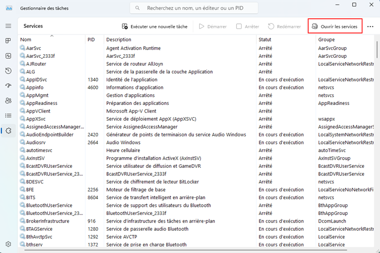
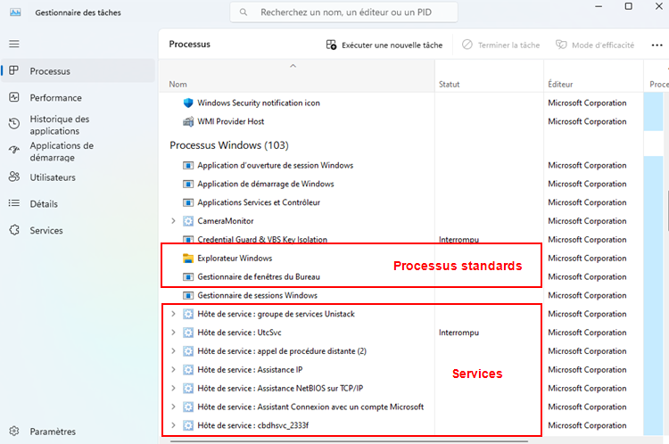
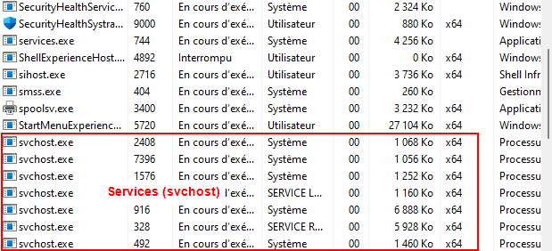
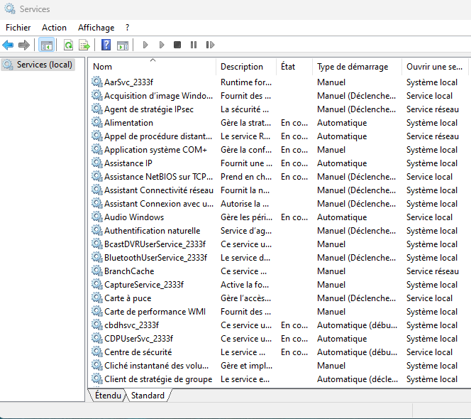
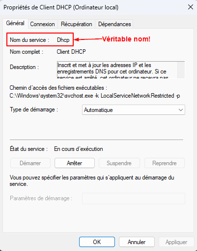

# Services 👻

Un service est un type de programme qui fonctionne en arrière-plan sans que l'utilisateur n'ait à interagir avec lui. Le service est conçu pour être invisible et pour exécuter des tâches automatiquement, souvent dès le démarrage du système, et parfois même avant que l'utilisateur se connecte.

Un service continue à fonctionner même si aucune fenêtre n'est ouverte. Par exemple, l'antivirus, le service de mise à jour Windows, ou encore les services réseaux pour n'en nommer que quelques-uns. Ces programmes sont généralement essentiels au bon fonctionnement de l'ordinateur mais ne nécessite aucune interaction.

J'aime bien faire l'analogie entre les services et certains réflexes humains. Vous n'avez pas besoin de réfléchir pour respirer, votre corps s'assure que ce « service » fonctionne constamment. Il en va de même pour votre battement cardiaque. C'est ainsi que fonctionnent également les services sous Windows. Vous n'avez rien à faire, rien à réfléchir, il s'exécuteront automatiquement.

## Le lien entre les services et les processus

Dans la section précédente, nous avons abordé les processus et leur fonctionnement. En outre, nous avons mentionné que <mark>tout ce qui s'exécutait sur le pc, est systématiquement exécuté dans un processus.</mark>Les services n'échappent à cette règle non plus, après tout, ce sont des programmes également. Un service peut donc, lui aussi, être arrêter via une « fin de tâche ». Cela est peu recommandable, mais peut être fait dans certaines circonstances.

## Retour sur le gestionnaire des tâches

Les services de Windows sont repérables à plusieurs endroits dans le gestionnaire des tâches. D'ailleurs, une section entière du gestionnaire est réservé aux services. Malgré cela, le gestionnaire des tâches demeure limité dans les options qu'il offre pour gérer les services. Nous verrons, un peu plus loins, qu'une console Windows est réservée strictement à l'administration des services et offre beaucoup plus de possibilités.

### Section: Services 🧩

La section « Services » du gestionnaire des tâches vous permet de lister l'ensemble des services disponible dans le système. Vous y retrouverez une foule d'informations, comme une brève description du service, son numéro de processus dans le cas où le service serait en cours d'exécution ainsi que son statut. Remarquez l'encadré rouge où se trouve un bouton vous permettant d'accéder directement à la console des services de Windows.

Les actions que vous pouvez effectuer directement depuis le gestionnaire des tâches sont relativement limitées: démarrer, arrêter ou redémarrer les services.

### Section: Processus

Les services sont également repérables dans la section « Processus » du gestionnaire des tâches. Dans cette section, le nom des processus qui contiennent des services commencera toujours par l'expression : « Hôte de service: ». Cela permet tout simplement de différencier les processus « normaux » des processus de type « services ».

### Section: Détails

Les services sont aussi visibles dans la section « Détails » du gestionnaire des tâches. Ironiquement, c'est l'une des sections affichant le moins de détails sur ces-derniers. Dans cette section, tous les services portent le même nom (pas très pratique). Ce nom, c'est `svchost`. C'est pourquoi cette section n'est pas à privilégier pour la gestion des services.

## La console des services

Vous pouvez accéder à la console des services de différentes façons sous Windows. D'abord, si vous êtes dans le gestionnaire des tâches, vous pouvez ouvrir la console directement depuis la [section « Services »](07-Services.md#section-services-).

Autrement vous pouvez également taper la commande `services.msc` dans la fenêtre « Exécuter » de Windows ( <kbd>&#8862; win</kbd>+<kbd>r</kbd> ).

Voici à quoi ressemble cette console:

Je n'expliquerai pas chacun des champs affichés à l'écran puisque je les reprendrai un peu plus loin, dans la section [propriétés d'un service](07-Services.md#propriétés-dun-service).

:::caution[Nom des services]
Dépendemment de la langue de votre système d'exploitation, vous ne verrez peut-être pas le véritable nom du service. En effet, si vous désirez entreprendre une action en ligne de commande sur un service, sachez que ceux-ci ont toujours un nom anglais. Donc si vous tentez d'interagir avec un service avec PowerShell par exemple, vous aurez besoin du nom anglais. Nous verrons comment récupérer celui-ci.
:::

### Propriétés d'un service

Les propriétés d'un service permettent d'accéder à ses moindres détails et d'interagir avec celui-ci. Pour accéder aux propriétés d'un service, vous n'avez qu'à double-cliquer sur celui-ci directement dans la console des services. Le premier onglet des propriétés vous permettra d'obtenir le véritable nom du service ( `Nom du service` ), une brève description de ce que fait le service, de déterminer un type de démarrage et d'entreprendre des actions instantanamment sur celui-ci.

#### Gestion du démarrage automatique

La plupart des services démarrent automatiquement avec le système d'exploitation. Cela dit, il peut être nécessaire d'utiliser d'autres modes de démarrage dans différents contextes. Voici donc les différents modes de démarrage que l'on peut configurer pour chaque service:

| Type de démarrage    | Description                                                                                   |
|----------------------|-----------------------------------------------------------------------------------------------|
| **Automatique**   | Le service démarre automatiquement au démarrage de Windows. C'est le mode par défaut pour la plupart des services essentiels.  |
| **Manuel**       | Le service ne démarre pas automatiquement. Il doit être démarré manuellement par un utilisateur ou par un autre service.          |
| **Désactivé**    | Le service est désactivé et ne peut pas être démarré, même manuellement. Cela peut être utilisé pour des services non nécessaires. |
| **Automatique (Différé)** | Le service démarre automatiquement après un délai de quelques minutes après le démarrage de Windows. Cela permet d'alléger le démarrage initial. |

