# Services 👻

Un service est un type de programme qui fonctionne en arrière-plan sans que l'utilisateur n'ait à interagir avec lui. Le service est conçu pour être invisible et pour exécuter des tâches automatiquement, souvent dès le démarrage du système, et parfois même avant que l'utilisateur se connecte.

Un service continue à fonctionner même si aucune fenêtre n'est ouverte. Par exemple, l'antivirus, le service de mise à jour Windows, ou encore les services réseau pour n'en nommer que quelques-uns. Ces programmes sont généralement essentiels au bon fonctionnement de l'ordinateur, mais ne nécessitent aucune interaction.

J'aime bien faire l'analogie entre les services et certains réflexes humains. Vous n'avez pas besoin de réfléchir pour respirer, votre corps s'assure que ce « service » fonctionne constamment. Il en va de même pour votre battement cardiaque. C'est ainsi que fonctionnent également les services sous Windows. Vous n'avez rien à faire, rien à réfléchir, il s'exécuteront automatiquement.

## Le lien entre les services et les processus

Dans la section précédente, nous avons abordé les processus et leur fonctionnement. En outre, nous avons mentionné que <mark>tout ce qui s'exécutait sur le pc est systématiquement exécuté dans un processus.</mark>Les services n'échappent à cette règle non plus, après tout, ce sont des programmes également. Un service peut donc, lui aussi, être arrêté via une « fin de tâche ». Cela est peu recommandable, mais peut être fait dans certaines circonstances.

## Retour sur le gestionnaire des tâches

Les services de Windows sont repérables à plusieurs endroits dans le gestionnaire des tâches. D'ailleurs, une section entière du gestionnaire est réservée aux services. Malgré cela, le gestionnaire des tâches demeure limité dans les options qu'il offre pour gérer les services. Nous verrons, un peu plus loin, qu'une console Windows est réservée strictement à l'administration des services et offre beaucoup plus de possibilités.

### Section: Services 🧩

La section « Services » du gestionnaire des tâches vous permet de lister l'ensemble des services disponibles dans le système. Vous y retrouverez une foule d'informations, comme une brève description du service, son numéro de processus dans le cas où le service serait en cours d'exécution ainsi que son statut. Remarquez l'encadré rouge où se trouve un bouton vous permettant d'accéder directement à la console des services de Windows.

Les actions que vous pouvez effectuer directement depuis le gestionnaire des tâches sont relativement limitées: démarrer, arrêter ou redémarrer les services.

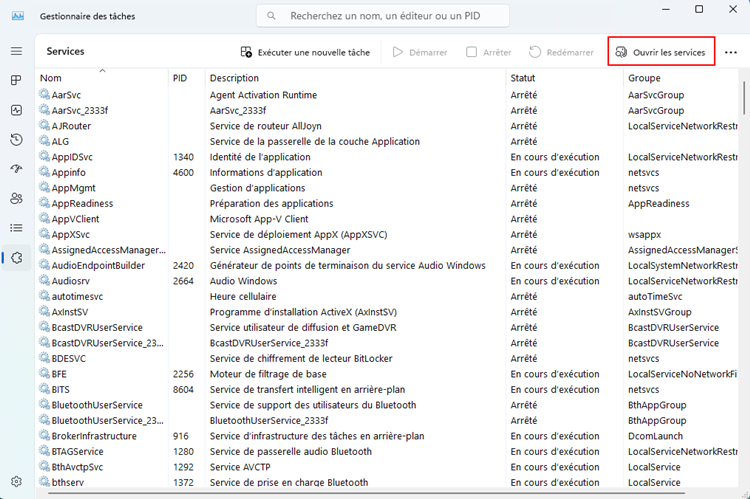

### Section: Processus

Les services sont également repérables dans la section « Processus » du gestionnaire des tâches. Dans cette section, le nom des processus qui contiennent des services commencera toujours par l'expression : « Hôte de service: ». Cela permet tout simplement de différencier les processus « normaux » des processus de type « services ».

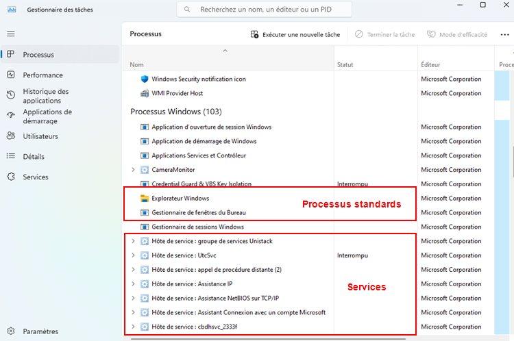


### Section: Détails

Les services sont aussi visibles dans la section « Détails » du gestionnaire des tâches. Ironiquement, c'est l'une des sections affichant le moins de détails sur ces derniers. Dans cette section, tous les services portent le même nom (pas très pratique). Ce nom, c'est `svchost`. C'est pourquoi cette section n'est pas à privilégier pour la gestion des services.

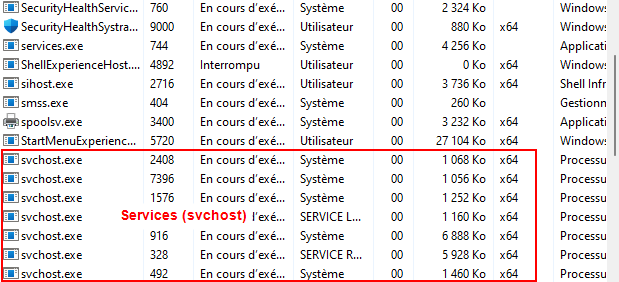

## La console des services

Vous pouvez accéder à la console des services de différentes façons sous Windows. D'abord, si vous êtes dans le gestionnaire des tâches, vous pouvez ouvrir la console directement depuis la [section « Services »](07-Services.md#section-services-).

Autrement vous pouvez également taper la commande `services.msc` dans la fenêtre « Exécuter » de Windows ( <kbd>&#8862; win</kbd>+<kbd>r</kbd> ).

Voici à quoi ressemble cette console:

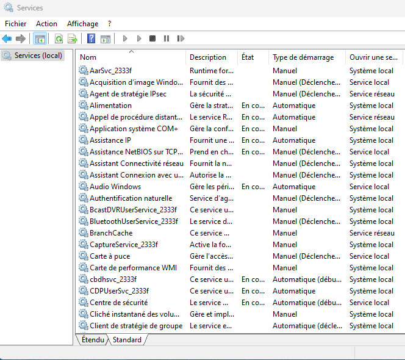
<a id="VraiNom" />
Je n'expliquerai pas chacun des champs affichés à l'écran puisque je les reprendrai un peu plus loin, dans la section [propriétés d'un service](07-Services.md#propriétés-dun-service).

:::caution[Nom des services]
Dépendemment de la langue de votre système d'exploitation, vous ne verrez peut-être pas le véritable nom du service. En effet, si vous désirez entreprendre une action en ligne de commande sur un service, sachez que ceux-ci ont toujours un nom anglais. Donc si vous tentez d'interagir avec un service avec PowerShell par exemple, vous aurez besoin du nom anglais. Nous verrons comment récupérer celui-ci.
:::

### Propriétés d'un service

#### Onglet Général

Les propriétés d'un service permettent d'accéder à ses moindres détails et d'interagir avec celui-ci. Pour accéder aux propriétés d'un service, vous n'avez qu'à double-cliquer sur celui-ci directement dans la console des services. Le premier onglet des propriétés vous permettra d'obtenir le véritable nom du service ( `Nom du service` ), une brève description de ce que fait le service, de déterminer un type de démarrage et d'entreprendre des actions instantanément sur celui-ci.

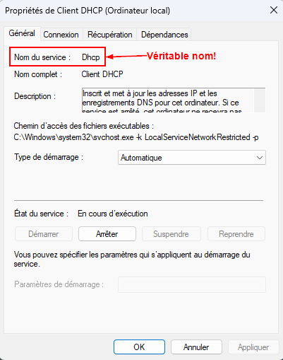

##### Gestion du démarrage automatique

La plupart des services démarrent automatiquement avec le système d'exploitation. Cela dit, il peut être nécessaire d'utiliser d'autres modes de démarrage dans différents contextes. Voici donc les différents modes de démarrage que l'on peut configurer pour chaque service:

| Type de démarrage    | Description                                                                                   |
|----------------------|-----------------------------------------------------------------------------------------------|
| **Automatique**   | Le service démarre automatiquement au démarrage de Windows. C'est le mode par défaut pour la plupart des services essentiels.  |
| **Manuel**       | Le service ne démarre pas automatiquement. Il doit être démarré manuellement par un utilisateur ou par un autre service.          |
| **Désactivé**    | Le service est désactivé et ne peut pas être démarré, même manuellement. Cela peut être utilisé pour des services non nécessaires. |
| **Automatique (Différé)** | Le service démarre automatiquement après un délai de quelques minutes après le démarrage de Windows. Cela permet d'alléger le démarrage initial. |

##### Actions entreprises manuellement

Évidemment, les services en mode « Manuel » doivent être démarrés manuellement, soit par un autre administrateur, soit pas un autre service. Cette option implique donc qu'il faut être en mesure de démarrer et d'arrêter un service manuellement. Différentes actions peuvent être accessibles selon les services. Ces actions auront une incidence directe sur l'état du service.

| Action       | Description                                                                                          | État du service          |
|--------------|------------------------------------------------------------------------------------------------------|---------------------------|
| **Démarrer**     | Lance le service, permettant son fonctionnement.                                                   | En cours d'exécution      |
| **Arrêter**      | Termine le service, mettant fin à son fonctionnement.                                              | Arrêté                    |
| **Suspendre**    | Met le service en pause, le laissant en mémoire sans l'arrêter complètement.                       | Suspendu                  |
| **Reprendre**     | Restaure un service suspendu pour qu'il reprenne son fonctionnement normal.                        | En cours d'exécution      |

Vous remarquerez peut-être que pour certains services, vous ne bénéficiez pas de certaines possibilités, comme le suspendre. Ou encore, dans le cas d'autres services, vous ne pouvez rien faire. C'est le cas par exemple du service de Pare-Feu Windows:

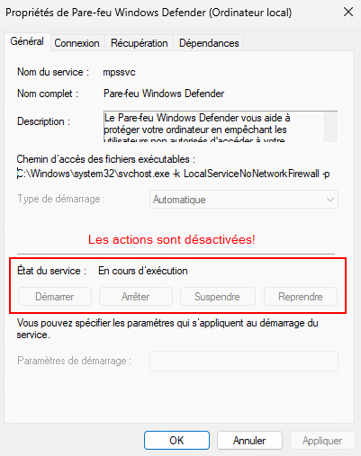

Plusieurs facteurs peuvent expliquer l'impossibilité d'entreprendre une ou plusieurs actions sur un service:

1. **Services critiques:** Certains services sont essentiels au fonctionnement du système d'exploitation, comme les services liés à la gestion des disques ou à la sécurité. Les arrêter pourrait rendre le système instable ou engendrer des risques importants.

2. **Dépendances:** Si un service est nécessaire au bon fonctionnement d'autres services, il ne peut pas être arrêté tant que ces autres services sont actifs. Cela garantit que le système fonctionne de manière cohérente.

3. **Implémentation technique:** Certains services ne sont pas conçus pour gérer des états d'arrêt ou de suspension. Leur code peut ne pas prévoir ces fonctionnalités, ce qui rend impossible leur interruption sans provoquer des erreurs.

#### Onglet Connexion

L'onglet connexion permet (mais pas toujours) de définir l'utilisateur qui exécutera le service en question. La grande majorité du temps, les comptes utilisés pour démarrer les services sont des comptes avec lesquels il est impossible d'ouvrir une session. Ce sont des comptes utilisés par Windows pour manœuvrer le système. Parmi ces comptes on retrouve: Le compte SYSTEM, le compte Service Local et le compte Service Réseau. Nous discuterons des utilisateurs et des groupes dans une autre section.

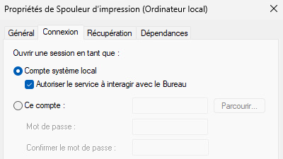

#### Onglet Récupération

L'onglet « Récupération » permet de définir les actions à entreprendre en cas de défaillance du service. Un service est considéré en défaillance lorsqu'il ne fonctionne plus comme prévu. Cela peut se produire pour différentes raisons:

1. **Arrêt inopiné:** Si le service se termine de manière inattendue, il est considéré en défaillance.

2. **Échecs répétés:** Si un service échoue à démarrer plusieurs fois consécutivement, il peut être marqué comme défaillant.

3. **Erreurs critiques:** Les erreurs critiques dans le code du service ou des exceptions non gérées peuvent entraîner son arrêt, le considérant en défaillance.

4. **Timeout:** Si le service prend trop de temps à démarrer (au-delà du délai défini), il peut être considéré comme étant en défaillance également.

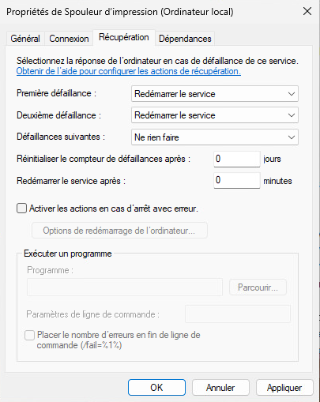

Windows vous offre la possibilité de définir différentes actions pour une première défaillance, une seconde puis pour toutes les défaillances suivantes.

##### Actions possibles suite à une défaillance

| Action                     | Description                                                                                     |
|---------------------------|-------------------------------------------------------------------------------------------------|
| **Aucune action**         | Ne fait rien en cas de défaillance. Le service reste arrêté et aucun traitement n'est effectué.|
| **Redémarrer le service** | Relance le service qui a échoué, tentant de le remettre en fonctionnement immédiatement.       |
| **Redémarrer le système** | Redémarre l'ordinateur si le service échoue, ce qui peut résoudre les problèmes de dépendances.|
| **Exécuter un programme** | Lance un programme ou un script spécifique en cas de défaillance, permettant une action personnalisée.|

Selon ce que vous configurerez comme actions, vous aurez la possibilité de spécifier des options supplémentaires au bas de la fenêtre.

#### Dépendances

Certains services dépendent d'autres services ou de pilotes système pour fonctionner. Si un composant du système est arrêté ou ne fonctionne pas correctement, les services dépendants peuvent en être affectés. L'onglet « Dépendances » permet d'obtenir la liste des composantes dont le service en question dépend, mais aussi la liste des autres services qui dépendent de celui-ci.

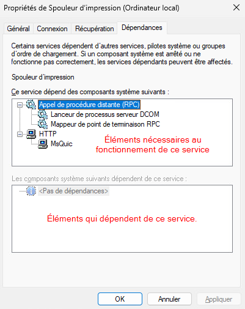

## Administration des services avec PowerShell

PowerShell offre une gamme de commandes pour gérer les différents services sous Windows.

### Obtenir la liste des services

Pour obtenir la liste des services et leur état avec PowerShell, on utilisera la commande `Get-Service`

```Powershell
Get-Service
```

**Résultat:**

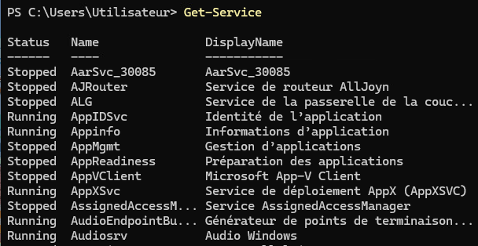

Il est possible d'obtenir l'état d'un seul service en précisant son nom ( [le vrai nom!](#VraiNom) ) avec le paramètre `-name`

```Powershell
Get-Service -Name Spooler
```

**Résultat:**

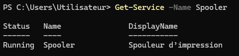

### Arrêter un service

Pour arrêter l'exécution d'un service, nous pouvons utiliser la commande `Stop-Service`, suivi du nom en paramètre.

```Powershell
Stop-Service -Name Spooler
```

**Résultat:**

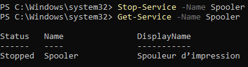

### Démarrer un service

Pour démarrer un service, nous utiliserons la commande `Start-Service`, suivi du nom en paramètre.

```Powershell
Start-Service -Name Spooler
```

**Résultat:**

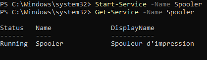

### Redémarrer un service

Pour redémarrer un service, nous utiliserons la commande `Restart-Service`, suivi du nom en paramètre.

```Powershell
Restart-Service -Name Spooler
```

**Résultat:**

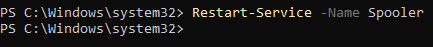