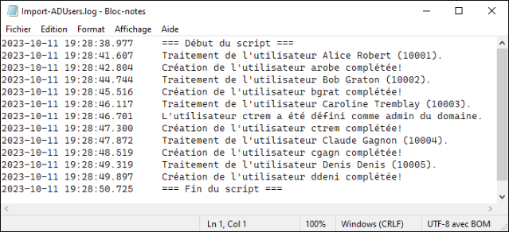
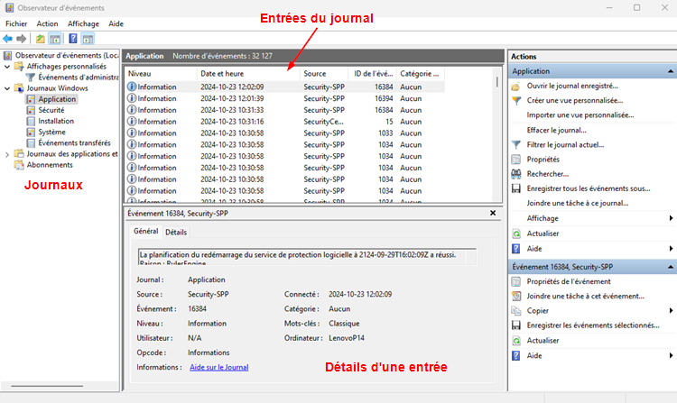

# Journalisation 📰

Lorsqu'un problème survient dans un processus en arrière-plan ou dans un service, il peut-être difficile de savoir ce qui se passe étant donné l'absence d'interface graphique. Les systèmes d'exploitation et plusieurs applications gardent une trace des étapes importantes de ce qu'ils font (démarrage, erreurs, etc.) dans un journal ou dans un fichier *log*.

Les *logs* contiennent des informations sur le fonctionnement du système d'exploitation. Il permettent, en outre, de :

- Auditer le système.
- Détecter les accès non autorisés.
- Diagnostiquer certains problèmes ou certaines erreurs.

Cependant, lorsqu'elle n'est pas géré, ou mal géré, la journalisation peut avoir des impacts négatifs. Les effets possibles sont:

- Réduction des performances du système.
- Surutilisation de l'espace de stockage.
- Augmenter le temps d'analyse et de traitement des journaux.

Il est donc essentiel de bien gérer la journalisation du système et de déterminer ce qui doit ou ne doit pas être journalisé.

La forme la plus rudimentaire d'un journal prend la forme d'un fichier texte, lisible avec des outils de lecture de texte standard. Chaque événement est horodaté et occupe généralement une ligne de texte. Les nouveaux événements sont toujours ajoutés à la fin du fichier.

**Exemple:**

## L'observateur d'événements

Sous Windows, la grande majorité des journaux sont rapportés dans l'observateur d'événements. Ce-dernier est accessible via le menu contextuel du menu démarrer ou en entrant la commande `eventvwr` depuis la fenêtre exécuter ( <kbd>&#8862; win</kbd> + <kbd>r</kbd> )

### Les différents journaux disponibles

#### Journaux Windows

- **Application:** Ce journal enregistre les événements liés aux applications installées. Idéal pour le dépannage d'applications spécifiques.
**Exemple:** *Erreur de l'application XYZ* - L'application a rencontré une erreur et s'est arrêtée. Code d'erreur : 0x1234.

- **Sécurité:** Ce journal contient les événements de sécurité, tels que les tentatives de connexion et les modifications des autorisations. Utilisé pour le suivi de la sécurité du système.
**Exemple:** *Tentative de connexion échouée* - Un utilisateur a tenté de se connecter avec un mot de passe incorrect (ID d'événement : 4625).

- **Installation:** Ce journal répertorie les événements liés à l'installation de logiciels, souvent utile pour le diagnostic des problèmes d'installation. **Exemple:** *Installation réussie de l'application ABC* - L'application a été installée avec succès sur le système.

- **Système:** Ce journal enregistre les événements liés au système d'exploitation, comme les messages du système et les erreurs matérielles. **Exemple:** *Échec du service de l'imprimante* - Le service d'impression n'a pas pu démarrer en raison d'une erreur matérielle (ID d'événement : 7000).

#### Journaux des applications et des services

- **Microsoft:** Comprend des journaux spécifiques à des produits Microsoft, tels que Windows Defender et d'autres services. **Exemple:**  *Alerte de Windows Defender* - Une menace a été détectée et mise en quarantaine.

- **Applications tierces:** Certains logiciels peuvent créer leurs propres journaux ici, fournissant des informations détaillées sur leur fonctionnement. **Exemple:**  *Erreur dans l'application de traitement d'images* - L'application a rencontré un problème lors de l'ouverture d'un fichier.

### Classement des événements

Les journaux contiennent ce que l'on nomme des événements. Windows classe les événements selon leur importance et leur criticité:

:::note[Événement de type information]
Fournit des détails sur des événements normaux, comme des opérations réussies ou des démarrages de services. 

**Exemple:** *Démarrage réussi de l'application* : Une application s'est lancée avec succès sans aucune erreur signalée.
:::

:::info[Événement de type avertissement]
Indique un problème potentiel qui pourrait ne pas nécessiter d'action immédiate, mais qui pourrait conduire à des complications futures. 

**Exemple:** *Démarrage du service en mode dégradé* : Un service a démarré, mais certaines fonctionnalités sont désactivées en raison de problèmes de configuration.
:::

:::caution[Événement de type erreur]
Signale un problème qui a entraîné un dysfonctionnement, souvent nécessitant une intervention pour corriger l'erreur.

**Exemple:** *Erreur d'application* : Une application a rencontré une erreur et s'est arrêtée de manière inattendue
:::

:::danger[Événement de type critique]
Indique qu'un problème grave s'est produit, entraînant l'arrêt immédiat d'une application ou d'un composant système. Ces événements nécessitent une attention urgente, car ils peuvent affecter la stabilité du système.

**Exemple:** Un événement indiquant que le système n'a pas pu s'arrêter correctement, entraînant un risque de perte de données.
:::

### Classement des audits

:::security[Événement en succès]
:::

:::cadenas[Événement en échec]
:::