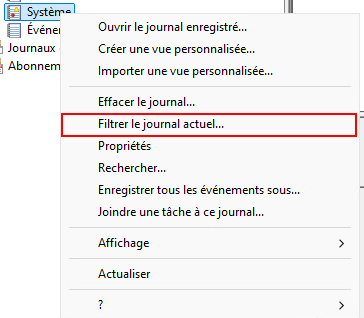
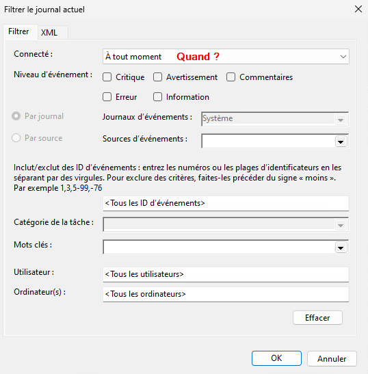

# Journalisation 📰

Lorsqu'un problème survient dans un processus en arrière-plan ou dans un service, il peut-être difficile de savoir ce qui se passe étant donné l'absence d'interface graphique. Les systèmes d'exploitation et plusieurs applications gardent une trace des étapes importantes de ce qu'ils font (démarrage, erreurs, etc.) dans un journal ou dans un fichier *log*.

Les *logs* contiennent des informations sur le fonctionnement du système d'exploitation. Il permettent, en outre, de :

- Auditer le système.
- Détecter les accès non autorisés.
- Diagnostiquer certains problèmes ou certaines erreurs.

Cependant, lorsqu'elle n'est pas géré, ou mal géré, la journalisation peut avoir des impacts négatifs. Les effets possibles sont:

- Réduction des performances du système.
- Surutilisation de l'espace de stockage.
- Augmenter le temps d'analyse et de traitement des journaux.

Il est donc essentiel de bien gérer la journalisation du système et de déterminer ce qui doit ou ne doit pas être journalisé.

La forme la plus rudimentaire d'un journal prend la forme d'un fichier texte, lisible avec des outils de lecture de texte standard. Chaque événement est horodaté et occupe généralement une ligne de texte. Les nouveaux événements sont toujours ajoutés à la fin du fichier.

**Exemple:**

## L'observateur d'événements

Sous Windows, la grande majorité des journaux sont rapportés dans l'observateur d'événements. Ce-dernier est accessible via le menu contextuel du menu démarrer ou en entrant la commande `eventvwr` depuis la fenêtre exécuter ( <kbd>&#8862; win</kbd> + <kbd>r</kbd> )

### Les différents journaux disponibles

#### Journaux Windows

- **Application:** Ce journal enregistre les événements liés aux applications installées. Idéal pour le dépannage d'applications spécifiques.
**Exemple:** *Erreur de l'application XYZ* - L'application a rencontré une erreur et s'est arrêtée. Code d'erreur : 0x1234.

- **Sécurité:** Ce journal contient les événements de sécurité, tels que les tentatives de connexion et les modifications des autorisations. Utilisé pour le suivi de la sécurité du système.
**Exemple:** *Tentative de connexion échouée* - Un utilisateur a tenté de se connecter avec un mot de passe incorrect (ID d'événement : 4625).

- **Installation:** Ce journal répertorie les événements liés à l'installation de logiciels, souvent utile pour le diagnostic des problèmes d'installation. **Exemple:** *Installation réussie de l'application ABC* - L'application a été installée avec succès sur le système.

- **Système:** Ce journal enregistre les événements liés au système d'exploitation, comme les messages du système et les erreurs matérielles. **Exemple:** *Échec du service de l'imprimante* - Le service d'impression n'a pas pu démarrer en raison d'une erreur matérielle (ID d'événement : 7000).

#### Journaux des applications et des services

- **Microsoft:** Comprend des journaux spécifiques à des produits Microsoft, tels que Windows Defender et d'autres services. **Exemple:**  *Alerte de Windows Defender* - Une menace a été détectée et mise en quarantaine.

- **Applications tierces:** Certains logiciels peuvent créer leurs propres journaux ici, fournissant des informations détaillées sur leur fonctionnement. **Exemple:**  *Erreur dans l'application de traitement d'images* - L'application a rencontré un problème lors de l'ouverture d'un fichier.

### Classement des événements

Les journaux contiennent ce que l'on nomme des événements. Windows classe les événements selon leur importance et leur criticité:

:::note[Événement de type information]
Fournit des détails sur des événements normaux, comme des opérations réussies ou des démarrages de services. 

**Exemple:** *Démarrage réussi de l'application* : Une application s'est lancée avec succès sans aucune erreur signalée.
:::

:::info[Événement de type avertissement]
Indique un problème potentiel qui pourrait ne pas nécessiter d'action immédiate, mais qui pourrait conduire à des complications futures. 

**Exemple:** *Démarrage du service en mode dégradé* : Un service a démarré, mais certaines fonctionnalités sont désactivées en raison de problèmes de configuration.
:::

:::caution[Événement de type erreur]
Signale un problème qui a entraîné un dysfonctionnement, souvent nécessitant une intervention pour corriger l'erreur.

**Exemple:** *Erreur d'application* : Une application a rencontré une erreur et s'est arrêtée de manière inattendue
:::

:::danger[Événement de type critique]
Indique qu'un problème grave s'est produit, entraînant l'arrêt immédiat d'une application ou d'un composant système. Ces événements nécessitent une attention urgente, car ils peuvent affecter la stabilité du système.

**Exemple:** Un événement indiquant que le système n'a pas pu s'arrêter correctement, entraînant un risque de perte de données.
:::

### Classement des audits

:::security[Événement en succès]
Ces événements indiquent qu'une action sécuritaire a été exécutée avec succès. Par exemple, un utilisateur a réussi à se connecter ou à accéder à une ressource protégée.

**Exemple:** 4624 (connexion réussie).
:::

:::cadenas[Événement en échec]
Ces événements signalent qu'une action sécuritaire n'a pas pu être réalisée, comme un échec de connexion. Cela peut être dû à des identifiants incorrects ou à des permissions insuffisantes.

**Exemple:** 4625 (échec de connexion).
:::

### Filtrer les journaux

Comme vous l'avez sans doute déjà remarqué, les journaux contiennent énormément d'informations. C'est pourquoi il peut être très utile de les filtrer. Pour ce faire, sélectionner l'un des journaux, puis faites un clic à l'aide du bouton de droite sur celui-ci. Dans le menu contextuel, sélectionnez « Filtrer le journal actuel ».

Dans la fenêtre de création de filtre, vous aurez l'opportunité d'indiquer les critères de recherche qui vous intéressent:

- **Connecté:** C'est une mauvaise traduction du mot anglais « Logged ». Dans ce champ, on cherche à déterminer une période de temps où l'enregistrement a été créé. Ce champ permet donc de sélectionner la période pour laquelle on souhaite afficher les événements (par exemple, "À tout moment" ou une plage de dates spécifique).

- **Niveau d'événement:** Cochez un ou plusieurs types d'événements que vous voulez afficher.

- **Par journal:** Permet de sélectionner un journal spécifique pour le filtrage.

- **Sources d'événements:** Permet de préciser une source spécifique d'événements (comme un processus ou un service particulier).

- **Inclut/exclut des ID d'événements:** On peut entrer les ID spécifiques ou des plages d'ID pour inclure ou exclure certains événements. Les ID peuvent être séparés par des virgules, et un signe "moins" peut être ajouté devant pour exclure certains ID.

- **Catégorie de la tâche:** Permet de filtrer en fonction de la catégorie de la tâche (utile pour certains types d’événements spécifiques).

- **Mots clés:** Permet d'entrer des mots-clés pour affiner la recherche.

- **Utilisateur:** Sélectionne les événements relatifs à un utilisateur particulier.

- **Ordinateur(s):** Permet de spécifier un ou plusieurs ordinateurs pour le filtrage, pratique dans les environnements multi-ordinateurs.

### Powershell

Il est évidemment possible de récupérer des événements enregistrés dans les différents journaux de Windows à l'aide de Powershell. Pour ce faire, on utilisera la commande `Get-EventLog`. Cette commande permet également de filtrer ce que vous rechercher en spécifiant le journal concerné, le type d'entrée, le numéro d'identification du Log, etc. Vous pouvez consulter la [liste des paramètres de la commande ici.](https://learn.microsoft.com/en-us/powershell/module/microsoft.powershell.management/get-eventlog?view=powershell-5.1&viewFallbackFrom=powershell-7.4) Néanmoins, je me permet de vous recommander l'utilisation de deux paramètres plus particuliers:

1. **LogName:** Vous permettra d'indiquer dans quel journal précisémment vous désirez chercher. Ce paramètre est obligatoire.

2. **InstanceID:** Chaque événement possède un numéro d'identification dans les différents journaux Windows. Ces numéros vous permettent de filtrer un type d'événement particulier. Par exemple, l'événement 4625 représente un échec d'ouverture de session alors que l'événement 4732 indique la création d'un nouvel utilisateur. [Il existe plusieurs sites sur le web](https://www.ultimatewindowssecurity.com/securitylog/encyclopedia/) vous permettant de connaître les différents numéro de certains événements.