import useBaseUrl from '@docusaurus/useBaseUrl';
import ThemedImage from '@theme/ThemedImage';
import Tabs from '@theme/Tabs';
import TabItem from '@theme/TabItem';

# Utilisateurs et groupes 👨‍👩‍👧‍👦

## Système multi-utilisateur

Windows est un système d'exploitation de type multi-utilisateur. Cela implique différentes notions:

1. Un ou plusieurs utilisateurs pourraient être définis comme des administrateurs. Le rôle d'administrateur permet d'entreprendre des opérations qui peuvent engendrer des conséquences positives ou négatives sur le système. Nous nous attarderons aux différents rôles que peuvent posséder les utilisateurs ultérieurement.

2. La notion de propriété sera également importante dans un système de ce type. Les utilisateurs qui créent des dossiers et des fichiers en seront automatiquement les propriétaires. En tant que propriétaires d'un item, ils pourront décider, si oui ou non, ils désirent en partager son contenu avec les autres.

3. Il sera possible de regrouper des utilisateurs d'entre eux et de former des groupes. Les groupes nous permettent d'autoriser ou d'interdire des actions à plusieurs utilisateurs d'un seul coup. On forme généralement les groupes d'utilisateurs grâce à un lien qui les unit comme une profession, une responsabilité ou un rôle dans une entreprise.

## Les utilisateurs

Lors de l'installation de Windows, vous devrez créer un premier utilisateur. Windows 11 vous offrira d'abord et avant tout d'utiliser un compte Microsoft pour utiliser votre ordinateur. Même si, à première vue, l'utilisation d'un compte Microsoft peut paraitre intéressante, elle comporte certains inconvénients également.


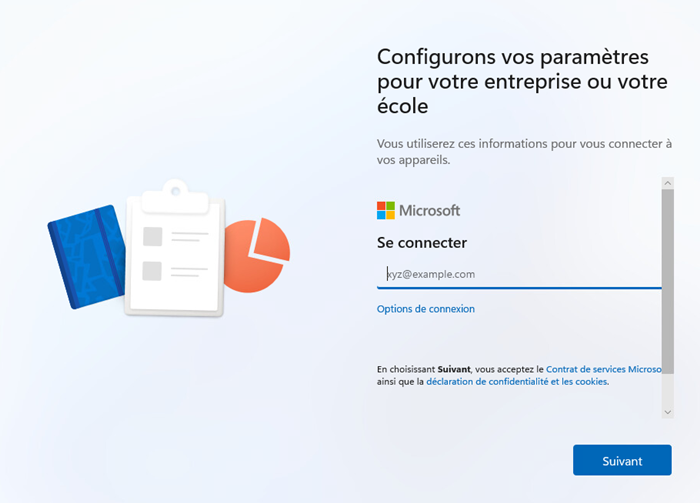

*Windows vous recommande d'utiliser un compte Microsoft à l'installation*

### Compte Microsoft

L'utilisation d'un compte Microsoft peut apporter certains avantages intéressants lorsqu'il est question de l'installation de Windows:

- **La synchronisation des paramètres:** Vos paramètres, thèmes, mots de passe et autres configurations sont synchronisés sur tous vos appareils Windows, ce qui facilite la transition d'un appareil à l'autre.

- **Accès aux services Microsoft:** Vous avez un accès direct à des services comme OneDrive, Microsoft Store, et Microsoft 365, ce qui peut améliorer votre expérience utilisateur.

- **Sécurité renforcée:** Un compte Microsoft offre des fonctionnalités de sécurité supplémentaires, comme la vérification en deux étapes, ce qui peut aider à protéger votre compte contre les accès non autorisés.

- **Mise à jour et support:** En utilisant un compte Microsoft, vous recevez plus facilement des mises à jour et un meilleur support pour les applications et les fonctionnalités liées à Microsoft.

Néanmoins, ces avantages s'accompagnent également d'inconvénients à ne pas négliger:

- **Dépendance à internet:** Pour profiter pleinement des avantages d'un compte Microsoft, une connexion Internet est souvent nécessaire, ce qui peut être un inconvénient dans certaines situations

- **Confidentialité:** L'utilisation d'un compte Microsoft implique un partage de données avec Microsoft, ce qui peut susciter des préoccupations en matière de confidentialité pour certains utilisateurs.

- **Complexité:** Pour certains utilisateurs, la gestion d'un compte Microsoft peut sembler plus complexe que l'utilisation d'un compte local, surtout s'ils ne sont pas familiers avec les services cloud.

- **Limitations d'un compte local:** Si vous utilisez un compte Microsoft, vous n'aurez pas la même flexibilité qu'avec un compte local en termes de contrôle total sur votre appareil. En effet, certains paramètres peuvent être automatiquement gérés ou modifiés par Microsoft, ce qui peut réduire votre contrôle sur l'expérience globale de votre appareil.

### Compte local

Vous l'aurez sans doute compris à travers les différents avantages et inconvénients que j'ai listés ci-dessus, le compte local est généralement plus facile d'utilisation et possède moins de dépendance. Le compte local n'a pas besoin d'internet et n'existe que dans l'ordinateur dans lequel vous le créer. C'est pourquoi nous utiliserons ce type de compte pour nos laboratoires.

:::note[Les comptes dans un contexte de laboratoire]
À travers vos différents laboratoires tout au long de vos études, vous aurez plusieurs laboratoires à réaliser et plusieurs ordinateurs à installer (virtuel ou non). Il est tout à fait inutile d'y relier votre compte Microsoft puisque vous ne bénéficierez pas toujours d'une connexion internet. Qui plus est, la majorité de ces machines de laboratoires seront détruites et réinstallées rapidement. Il est donc inutile d'y lier votre compte Microsoft.
:::

Ceci étant dit, Microsoft ne vous proposera pas, d'entrée de jeu, de créer un compte local. Il faudra faire une petite « passe-passe ». 

1. Cliquez sur « Options de connexion » :

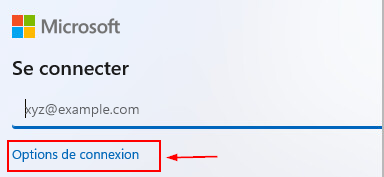

2. Dans les options de connexion, cliquez sur « Joindre le domaine à la place » :

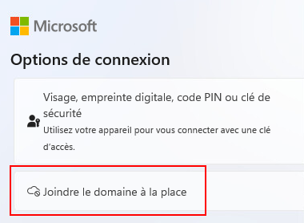

3. De là, suivez les étapes proposées par l'installateur.

### Qui suis-je ?

Lorsque vous passez d'un utilisateur à l'autre dans le système, ou pour toute autre raison, vous pourriez ne plus vous souvenir avec quel utilisateur vous êtes connecté sur le système. La commande `whoami` vous retournera le nom de l'ordinateur sur lequel vous vous trouvez ainsi que l'utilisateur ayant entré la commande.

<div className="tabsborder">
    <Tabs>
        <TabItem value="WhoAmI" label="Commande" default>
            ```Batch
            whoami
            ```
        </TabItem>
        <TabItem value="ResultatWhoAmI" label="Résultat">
           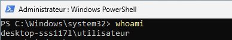
        </TabItem>
    </Tabs>
</div><br/>

### Le profil d'un utilisateur

Chaque utilisateur sur l'ordinateur, local ou non, possède ce que l'on nomme un profil d'utilisateur. Le profil d'un utilisateur est un ensemble de répertoires lui appartenant situé dans un répertoire parent à son nom dans `C:\Users\`. On retrouvera généralement les dossiers: Bureau, Contacts, Documents, Favoris, Images, Liens, Musique, Objets 3D, OneDrive, Parties enregistrées, Recherches, Téléchargements, Vidéos et AppData.

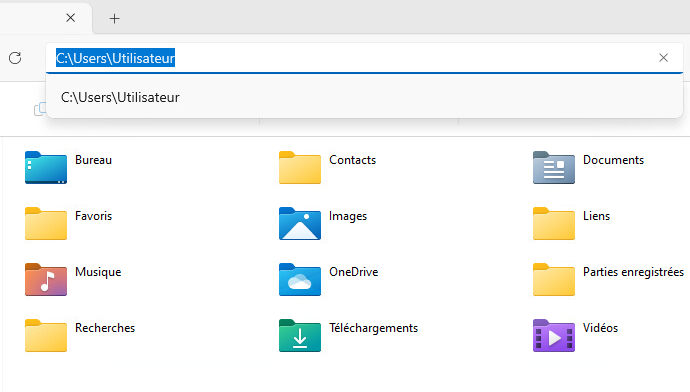

### Les comptes d'utilisateur prédéfinis

Même si vous avez créé votre premier utilisateur lors de l'installation de Windows 11, vous n'êtes pas seul au monde dans votre système d'exploitation (eh non!). Rassurez-vous, d'autres utilisateurs existent à votre insu. Ces utilisateurs, ce sont les utilisateurs prédéfinis. Ils ont été créés à l'installation de Windows, mais ils sont désactivés pour des raisons de sécurité, et ils le restent habituellement. Les comptes d'utilisateurs prédéfinis sont repérables depuis la console de gestion de l'ordinateur (clic-droit sur le menu démarrer, puis cliquez sur gestion de l'ordinateur ).

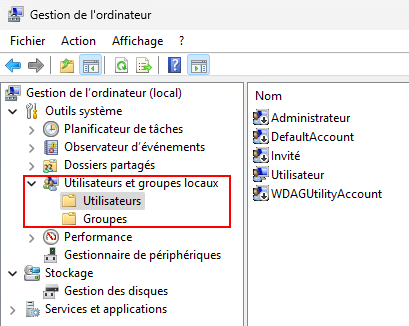

- **Compte Administrateur:** Il s'agit d'un compte possédant des droits d'administration (évidemment) sur le système. Il est toujours présent dans chaque système mais son nom variera en fonction de la langue. Il est désactivé par défaut pour des raisons de sécurité, mais il est très facile de l'activer.

- **DefaultAccount:** C'est un compte système spécial créé à des fins internes, et il est inactif par défaut. Il n'est pas destiné à l'interaction directe de l'utilisateur et ne nécessite pas d'attention particulière sauf dans des cas très spécifiques de dépannage ou de configuration avancée.

- **Invité:** Le compte est invité est utilisé dans des cas où l'ordinateur concerné serait destiné à être utilisé par un large public. Par exemple dans le cas où un ordinateur serait en démonstration dans un kiosque ou dans le cas d'un ordinateur disponible dans un guichet libre-service.

- **WDAGUtilityAccount:** C'est un compte système utilisé spécifiquement pour Windows Defender, permettant l'exécution d'applications dans un environnement sécurisé et isolé. Ce compte n'est pas destiné à une utilisation par les utilisateurs, et son rôle principal est de contribuer à la sécurité du système en isolant les processus d'application afin de prévenir les risques d'attaque.

Vous pouvez obtenir la liste des utilisateurs locaux sur le PC en exploitant la commande PowerShell `Get-LocalUser` comme dans l'exemple qui suit:

<div className="tabsborder">
    <Tabs>
        <TabItem value="GetLocalUser" label="Commande" default>
            ```Powershell
            Get-LocalUser
            ```
        </TabItem>
        <TabItem value="ResultatGetLocalUser" label="Résultat">
           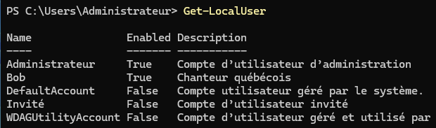
        </TabItem>
    </Tabs>
</div><br/>

### Les comptes à privilèges administratifs

Certains comptes possèdent ce que l'on nomme des privilèges d'administration. Lorsqu'un compte bénéficie de privilèges administratifs, il peut:

- Installer et désinstaller des applications
- Changer des paramètres de réseau
- Changer la configuration du système
- Créer et supprimer des utilisateurs ou des groupes
- Lire et modifier la majorité des fichiers
- Gérer les disques et les partitions
- Modifier la base de registre
- Etc...

#### Le *User Account Control* (ou UAC) 🛡️

Il s'agit d'une fonctionnalité qui a été introduite avec Windows Vista suite aux enjeux de sécurité relevés dans Windows XP. Même si un utilisateur possède des droits d'administration, ces droits devront être activés en quelques sortes. On dira alors qu'on procède à une élévation de privilège. On pourrait comparer cette fonctionnalité à l'utilisation de *sudo* sous Linux.

Les programmes ou les actions qui nécessitent une élévation de privilège à travers le **UAC**, sont repérables grâce à un petit bouclier comme celui-ci:

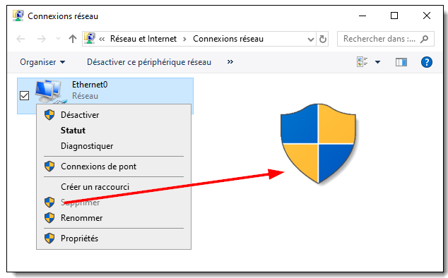

Le *User Account Control* lancera des avertissements si vous avez ouvert une session avec un compte à privilèges et que vous tentez de lancer un exécutable nécessitant ces privilèges. C'est le cas, par exemple, lorsque vous tentez d'installer un logiciel ou un programme:

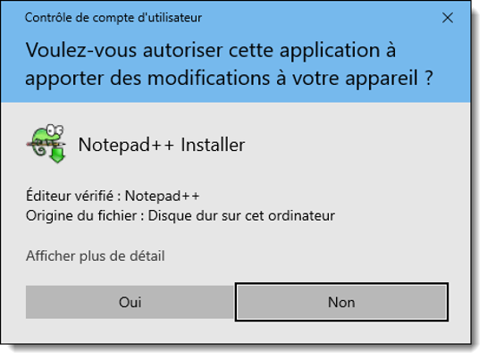

:::tip[Élever ses privilèges manuellement]
Il est possible d'élever ses privilèges manuellement en sélectionnant *Exécuter en tant qu'administrateur* depuis le menu contextuer d'un logiciel ou un programme.

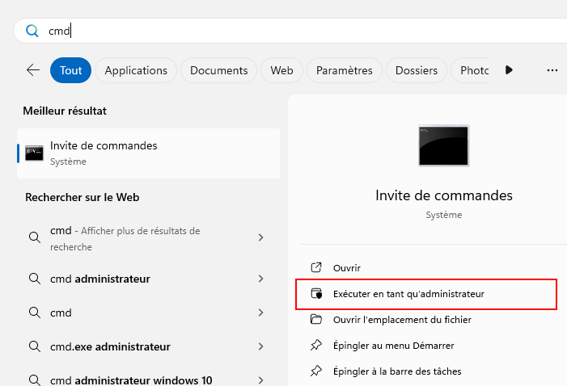
:::

### Créer un compte d'utilisateur local

Pour créer un nouvel utilisateur, vous pouvez utiliser la console « Gestion de l'ordinateur ». Pour ce faire, faites un clic à l'aide du bouton de droite de la souris sur le dossier `Utilisateurs` puis sélectionnez « Nouvel utilisateur ». Vous aurez alors accès à un formulaire pour compléter la création de l'utilisateur concerné.

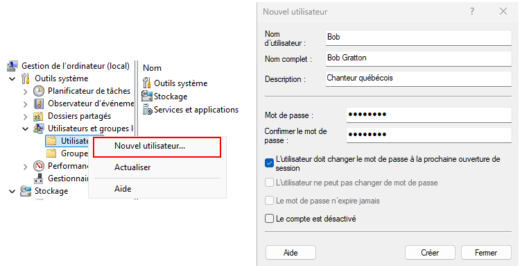

Il est également possible de créer un utilisateur avec PowerShell en utilisant la commande `New-LocalUser`. Vous devrez obligatoirement passer les paramètres `-Name` et `-Password` pour que la commande puisse s'exécuter convenablement.

<div className="tabsborder">
    <Tabs>
        <TabItem value="NewLocalUser" label="Commande" default>
            ```Powershell
            New-LocalUser -Name Éric -FullName 'Éric Lapointe' -Password $(ConvertTo-SecureString "Password" -AsPlainText -Force)
            ```
        </TabItem>
        <TabItem value="ResultatNewLocalUser" label="Résultat">
           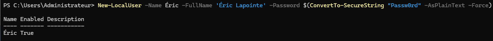
        </TabItem>
    </Tabs>
</div><br/>

:::caution
Dans la commande PowerShell précédente, vous aurez possiblement remarquez que le mot de passe ne peut être entré simplement en texte clair. La raison en est fort simple: Windows ne peut stocker un mot de passe en texte clair pour des raisons de sécurité. De plus, même la commande ci-dessus n'est pas parfaite d'un point de vue sécurité car elle pourrait enregistrer le mot de passe dans les événements Windows en texte clair. Si vous procédez de la sorte pour créer vos utilisateurs, assurez-vous de demander une mise à jour du mot de passe lors de la première connexion de l'utilisateur. Ainsi, vous diminuerez les risques liés aux mots de passe des utilisateurs.
:::

### Propriétés d'un utilisateur local

Dans le menu contextuel des utilisateurs, vous trouverez différentes options, principalement en ce qui concerne leur mot de passe.

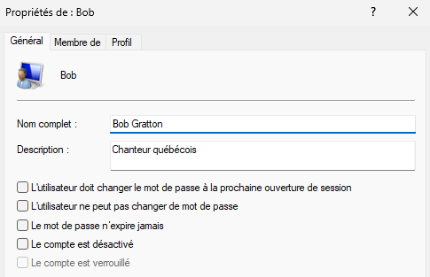

Je me permet d'aborder les options au bas de la fenêtre avec vous. Soit l'option *Le compte est désactivé* et *Le compte est verrouillé*.

 - **Le compte est désactivé:** On désactive généralement un compte pour des raisons de sécurité. Un compte désactivé ne peut, en aucune circonstance, être utilisé pour ouvrir une session. Par exemple, si un utilisateur quitte pour un voyage de plusieurs semaine, il pourrait être envisageable de désactiver son compte pour s'assurer que personne ne puisse tenter de s'y connecter durant son départ.

 - **Le compte est verrouillé:** Par défaut, il existe une stratégie de sécurité concernant les mots de passe sous Windows. Cette stratégie est en place pour éviter le piratage d'un compte par *bruteforce*.

    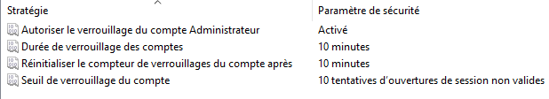

    Cette stratégie de sécurité indique que si une ouverture de session échoue à 10 reprises sur une période de 10 minutes, le compte concerné se verrouillera automatiquement pour une période de 10 minutes. Un compte verrouillé est donc inutilisable seulement pour une période de temps donné.

## Les groupes

Un groupe est un ensemble d’utilisateurs qui possèdent des droits ou des autorisations communes

Principaux groupes prédéfinis:
- Administrateurs: dispose de droits d’administration
- Utilisateurs: dispose d’un accès régulier au système
- Autres groupes donnant des droits spécialisés

Par défaut, le premier utilisateur du système est placé dans le groupe Administrateurs, les utilisateurs subséquents dans Utilisateurs.

### Les groupes prédéfinis

Dans la console de gestion des utilisateurs que nous avons ouvert un peu plus tôt, vous aurez sans doute remarquez la section Groupes. Cette section contient les groupes prédéfinis, qui sont créés lors de l'installation de Windows. Il sont au nombre de 21... C'est beaucoup de groupes lorsqu'on réalise qu'il n'y a qu'un seul utilisateur d'activé lors de l'installation.

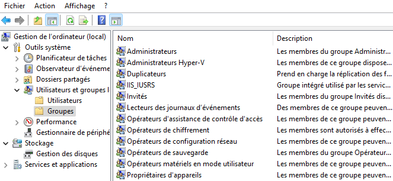

Même si le nombre de groupe peut paraitre énorme à première vue, ils ont bel et bien tous une raison d'être et permettent une gestion sécurisée des utilisateurs. L'utilisateur final risque de ne jamais utiliser ces groupes, mais dans un environnement professionnel, ceux-ci pourraient être exploités.

Évidemment, il est possible d'obtenir la liste des groupes locaux avec PowerShell avec la commande `Get-LocalGroup`

<div className="tabsborder">
    <Tabs>
        <TabItem value="GetLocalGroup" label="Commande" default>
            ```Powershell
            Get-LocalGroup
            ```
        </TabItem>
        <TabItem value="ResultatGetLocalGroup" label="Résultat">
           
        </TabItem>
    </Tabs>
</div><br/>

### Créer un groupe local

Pour créer un groupe, on précedera sensiblement de la même façon que pour créer un utilisateur. Il faut d'abord accéder au menu contextuel de la section « Groupes » dans la console de gestion de l'ordinateur puis sélectionner « Nouveau groupe... » et remplissez le formulaire.

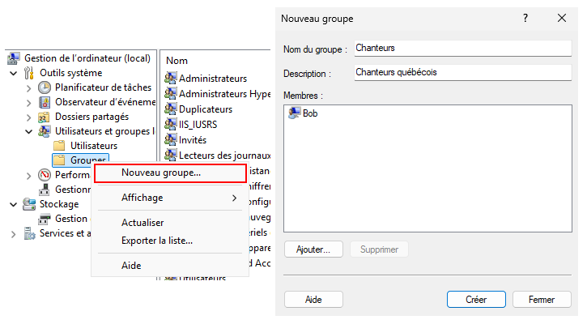

Pour créer un groupe avec PowerShell, nous pouvons utiliser la commande `New-LocalGroup`. Le seul paramètre obligatoire à cette commande est `-Name` puisqu'il faut bien donner un nom à votre nouveau groupe.

<div className="tabsborder">
    <Tabs>
        <TabItem value="NewLocalGroup" label="Commande" default>
            ```Powershell
            New-LocalGroup -Name Étudiants
            ```
        </TabItem>
        <TabItem value="ResultatNewLocalGroup" label="Résultat">
           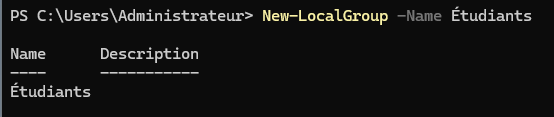
        </TabItem>
    </Tabs>
</div><br/>

### Propriétés d'un groupe local

Lorsque vous accédez aux propriétés d'un groupe local, vous accédez en fait à la liste des membres qu'il contient. Vous aurez également la possibilité d'ajouter un ou plusieurs membres au groupe concerné:

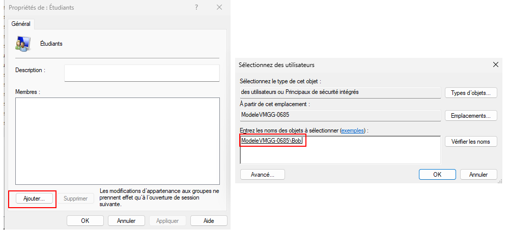

:::tip[Un groupe dans un groupe ?]
Un groupe peut très bien être membre d'un autre groupe à son tour. C'est ce qu'on appelle du *nesting*. Néanmoins, pourquoi ferions-nous quelque chose comme ça ? Habituellement c'est pour mieux gérer les permissions sur différents éléments. Nous en reparlerons dans la section dédiée aux permissions.
:::

Pour voir la liste des membres d'un groupe en Powershell, nous utiliserons la commande `Get-LocalGroupMember` en précisant le nom du groupe qui nous intéresse.

<div className="tabsborder">
    <Tabs>
        <TabItem value="GetLocalGroupMember" label="Commande" default>
            ```Powershell
            Get-LocalGroupMember -Name Administrateurs
            ```
        </TabItem>
        <TabItem value="ResultatGetLocalGroupMember" label="Résultat">
           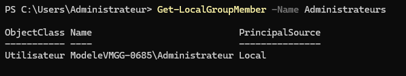
        </TabItem>
    </Tabs>
</div><br/>

### Ajouter des membres à un groupe

Il existe plusieurs méthodes pour ajouter des membres à un groupe. D'ailleurs, nous en avons déjà vu une lorsque nous avons abordé les propriétés d'un groupe. Ceci étant dit, vous pouvez également procéder autrement.

#### Méthode 1 - *En créant un groupe*

Lorsque vous créez un groupe, vous avez la possibilité d'y ajouter des membres directement. [Revoyez cette section au besoin.](./09-Utilisateurs%20et%20groupes.md#créer-un-groupe-local)

#### Méthode 2 - *Propriétés de l'utilisateur*

Lorsque vous accédez aux propriétés d'un utilisateurs, un onglet se trouve au haut de la fenêtre (*membre de*). Cet onglet vous permet d'ajouter l'utilisateur concerné dans différents groupes:

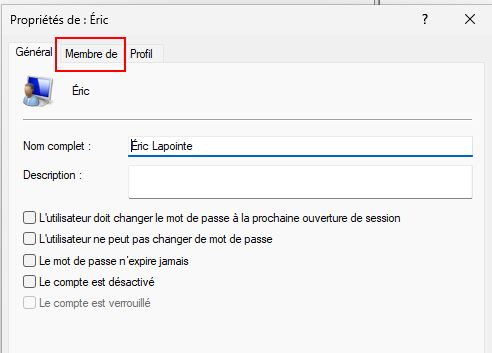

#### Méthode 3 - *Menu contextuel d'un groupe*
Lorsque vous accédez au menu contextuel d'un groupe, il y a une option nommée « *Ajouter au groupe...* ». Cette option vous permet également d'ajouter de membres au groupe concerné.

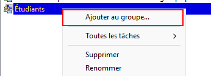

#### Méthode 4 - *Via PowerShell*
La commande `Add-LocalGroupMember` permet d'ajouter un membre à un groupe. Vous devrez passer le paramètre `-Group` afin de préciser dans quel groupe vous désirez ajouter l'utilisateur ainsi que le paramètre `-Member` pour préciser quel utilisateur doit être ajouter au groupe.

<div className="tabsborder">
    <Tabs>
        <TabItem value="AddLocalGroupMember" label="Commande" default>
            ```Powershell
            Add-LocalGroupMember -Group Étudiants -Member Bob
            ```
        </TabItem>
        <TabItem value="ResultatAddLocalGroupMember" label="Résultat">
           
        </TabItem>
    </Tabs>
</div><br/>
