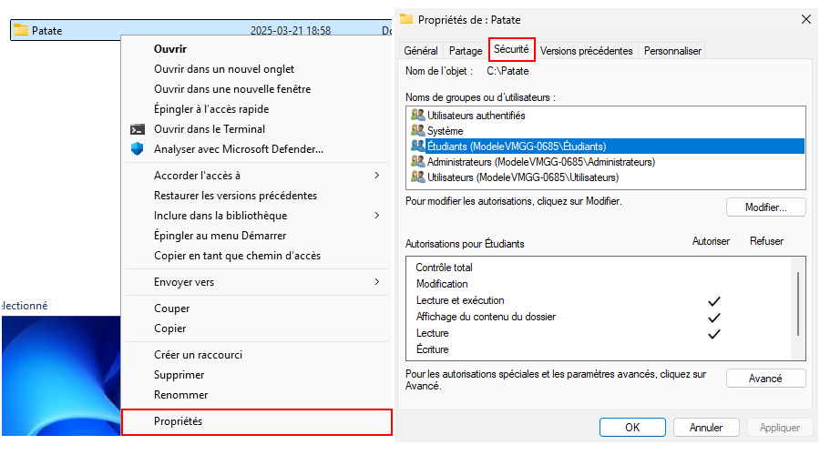

import useBaseUrl from '@docusaurus/useBaseUrl';
import ThemedImage from '@theme/ThemedImage';
import Tabs from '@theme/Tabs';
import TabItem from '@theme/TabItem';

# Permissions 🔐

Sous Windows, les fichiers et les dossiers possède une liste d'accès discrétionnaire (*DACL*). Dans le jargon informatique, il se peut que vous entendiez parler d'*ACL*, c'est la même chose, du moins en ce qui concerne Windows. Les *DACL* nous permettent d'**accorder** ou de **refuser** certaines permissions à des utilisateurs ou des groupes.

## Accéder à la liste de contrôle d'accès

Pour accéder à la liste des permissions d'un item, il nous suffit généralement d'aller dans les propriétés de l'élément puis de sélectionner l'onglet « Sécurité ».

