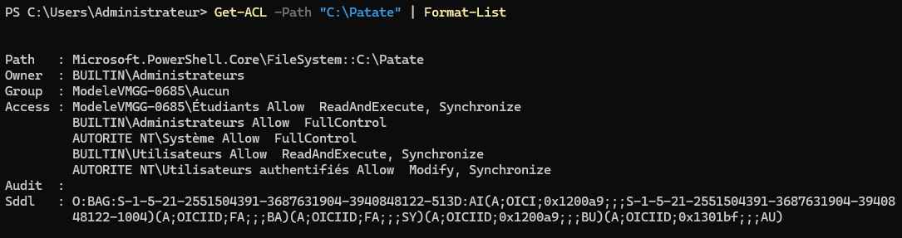
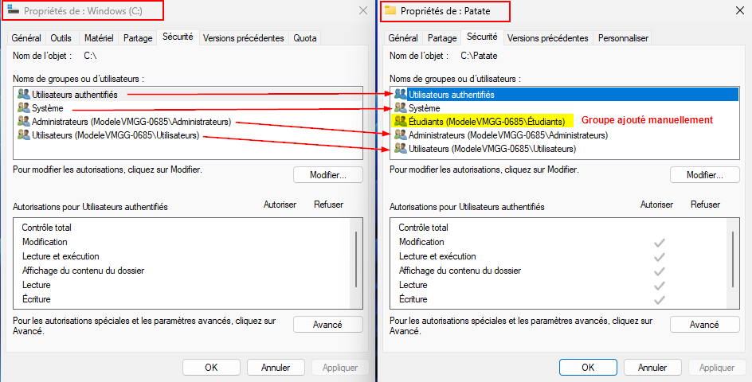
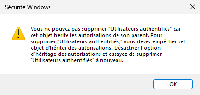
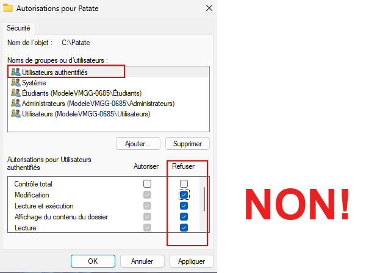
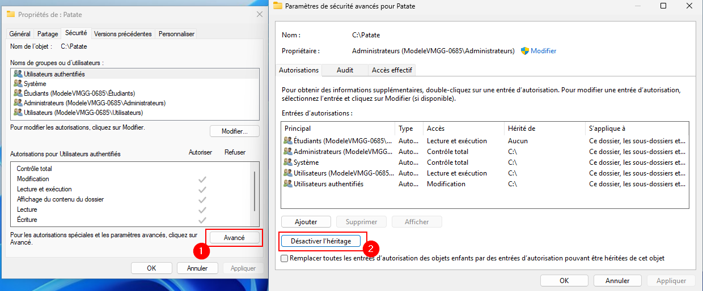
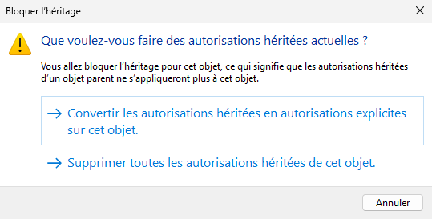
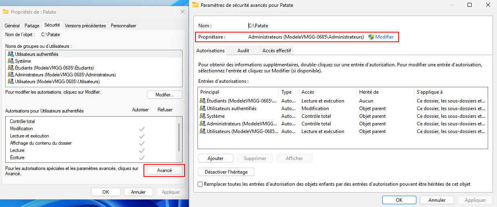
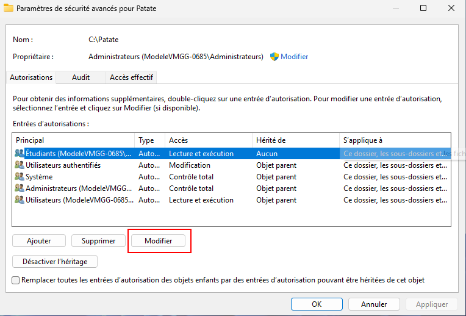
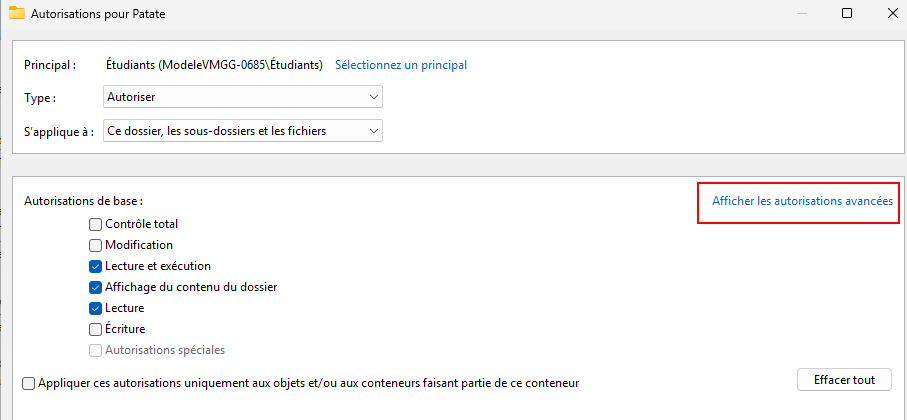
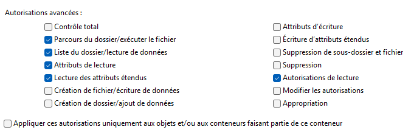

import useBaseUrl from '@docusaurus/useBaseUrl';
import ThemedImage from '@theme/ThemedImage';
import Tabs from '@theme/Tabs';
import TabItem from '@theme/TabItem';

# Permissions 🔐

Sous Windows, les fichiers et les dossiers possèdent une liste d'accès discrétionnaire (*DACL*). Dans le jargon informatique, il se peut que vous entendiez parler d'*ACL*, c'est la même chose, du moins en ce qui concerne Windows. Les *DACL* nous permettent d'**<span class='green-text'>accorder</span>** ou de **<span class='red-text'>refuser</span>** certaines permissions à des utilisateurs ou des groupes.

## Accéder à la liste de contrôle d'accès

Pour accéder à la liste des permissions d'un item, il nous suffit généralement d'aller dans les propriétés de l'élément puis de sélectionner l'onglet « Sécurité ».


Vous trouverez à cet endroit une vue d'ensemble des permissions qui sont attribuées sur l'élément concerné. Au haut de la fenêtre, nous retrouvons les utilisateurs et les groupes d'utilisateurs qui possèdent certaines autorisations. En bas, nous voyons la liste des principales autorisations qui sont généralement attribuées ainsi que deux colonnes: **<span class='green-text'>Autoriser</span>** et **<span class='red-text'>Refuser.</span>**

Vous pouvez également obtenir la liste de contrôle d'accès à l'aide de PowerShell en utilisant la commande `Get-ACL`:

<div className="tabsborder">
    <Tabs>
        <TabItem value="GetACL" label="Commande" default>
            ```Powershell
            Get-ACL -Path "C:\Patate" | Format-List
            ```
        </TabItem>
        <TabItem value="ResultatGetACL" label="Résultat">
           
        </TabItem>
    </Tabs>
</div><br/>

## Les différentes permissions

Concentrons-nous d'abord sur les différentes autorisations et leurs impacts:

| Permission                  | Description |
|-----------------------------|------------|
| **Contrôle total**          | Permets de lire, modifier, supprimer et changer les permissions du dossier et des fichiers. |
| **Modification**            | Autorise la modification et la suppression des fichiers, mais pas la gestion des permissions. |
| **Lecture et exécution**    | Permets d'ouvrir et d'exécuter les fichiers (utile pour les applications). |
| **Affichage du contenu du dossier** | Autorise la navigation dans le dossier sans ouvrir les fichiers. |
| **Lecture**                 | Permets de lire les fichiers et leurs propriétés, mais sans modification. |
| **Écriture**                | Autorise la création et la modification de fichiers sans pouvoir les supprimer. |

### Autoriser, refuser ou rien ?

À la base, il faut autoriser une permission à un utilisateur ou à un groupe d'utilisateurs pour permettre à ce dernier de lire, modifier ou écrire dans un dossier ou un fichier. Si l'autorisation n'est pas accordée, le comportement par défaut est un refus. Alors, pourquoi **refuser** expressément une permission en utilisant la colonne à cet effet ?

D'abord, l'utilisation de la colonne **refuser** n'est pas une chose commune et elle est peu recommandée. Le refus d'une permission aura toujours préséance sur une autorisation. Nous analyserons un exemple un peu plus loin ou la colonne refuser pourrait nous jouer des tours à notre insu.

### Bonnes pratiques

Prenez l'habitude de n'utiliser que la colonne **Autoriser** lorsque vous attribuez des permissions. Ainsi, si vous ne voulez pas qu'un utilisateur ou un groupe possède une permission donnée, vous n'avez qu'à ne rien cocher dans la liste des permissions.

## L'héritage des droits

Dans l'image présentée un peu plus haut, nous sommes en mesure de voir tous les groupes concernés par des permissions sur le dossier `C:\Patate`. 5 groupes d'utilisateurs apparaissent:

- Utilisateurs authentifiés *(Il s'agit de n'importe quel utilisateur s'étant identifié sur le poste)*
- Système *(C'est le compte de Windows. Il est plus puissant qu'un compte Administrateur)*
- Étudiants *(Un groupe que j'ai créé moi-même pour l'exemple)*
- Administrateurs *(Les Administrateurs du poste, dont fait partie l'utilisateur « Administrateur »)*
- Utilisateurs *(Les comptes de type utilisateur)*

Lorsque j'ai créé ce dossier, à la racine du disque `C:\`, je n'ai ajouté que le groupe `Étudiants`. Tous les autres groupes d'utilisateurs ont été ajoutés automatiquement via ce que l'on nomme **l'héritage des droits**.

L'héritage des droits est un principe selon lequel les objets enfants héritent des droit d'un objet parent. Dans le cas qui nous concerne, notre dossier est à la racine du disque `C:\`. Il héritera donc des droits qui sont attribués directement sur le disque `C:\`:




### Supprimer les permissions héritées

Comment pourrais-je procéder alors si je ne voulais pas de ces permissions automatiquement héritées ? Disons que j'aimerais conserver seulement le groupe « Étudiants » dans ma liste de permission. Je pourrais d'abord tenter de supprimer le groupe « Utilisateurs authentifiés » en cliquant sur « Modifier » puis « Supprimer »:


Mais j'obtiendrai assurémment l'erreur suivante qui stipule que je ne peux pas supprimer des permissions qui sont héritées de l'objet parent:



Comment procéder alors pour empêcher le groupe « Utilisateurs authentifiés » d'accéder à mon dossier `C:\Patate` ? Je pourrais peut-être refuser des permissions:



En procédant ainsi, vous refuser des permissions au groupe « Utilisateurs authentifiés » dont les utilisateurs sont aussi membre du groupe « Étudiants ». Comme un refus a toujours préséance sur une autorisation, **<span class='red-text'>les étudiants n'auront plus d'accès non plus.</span>**

### Désactivation de l'héritage

Comment faire alors pour retirer les groupes d'utilisateurs et les permissions héritées ?

Il vous faudra expréssement désactiver l'héritage des droits. Pour procéder, cliquez sur *Avancé* dans l'onglet sécurité de l'élément concerné. Dans la fenêtre qui s'ouvre, cliquez sur *Désactiver l'héritage*:



Lorsque vous cliquerez sur *Désactiver l'héritage*, vous aurez assurémment un avertissement de Windows comme celui-ci:



Comme l'objet concerné possède actuellement des permissions héritées de son parent, Windows vous demande que faire de ces permissions alors que vous êtes sur le point de désactiver ce processus d'héritage. Voici le choix qui s'offre à vous:

1. Les autorisations qui sont présentemment héritées de l'objet parent sont converties en autorisations explicites, c'est-à-dire en autorisation *standards*. Les groupes et les utilisateurs qui possédaient des permissions les conserveront, à moins que vous modifier ces permissions par la suite. <span class='green-text'> Ce choix est généralement une valeur sûre et vous permet de faire une gestion détaillée des autorisations qui étaient préalablement héritées.</span>

2. Vous supprimez toutes les autorisations héritées. Dans l'exemple que nous étudions avec le dossier `C:\Patate`, cela impliquerait la suppression de toutes les autorisations de tous les groupes d'utilisateurs à l'exception du groupe « Étudiants ». <span class='red-text'> En d'autres mots, si vous ne faites pas partie du groupe « Étudiants », vous n'aurez plus aucun accès que ce soit, et ce, **même si vous êtes un administrateur!**</span> C'est une méthode radicale et à utiliser avec précaution.

Une fois l'héritage des droits désactivés pour l'élément concerné, toutes les permissions qui le concerne devront être gérées directement dans ses propriétés.

### Bonnes pratiques

Si vous désactivez l'héritage des droits, gardez en tête que les administrateurs d'un système, ainsi que le système lui-même, devraient posséder la grande majorité des accès sur un système. En d'autres mots, le compte `Système` et le groupe `Administrateurs` devrait toujours apparaître dans votre liste de groupes et d'utilisateurs et posséder à peu près toutes les permissions.

## Propriétaire

Le propriétaire d'un fichier ou d'un dossier peut toujours modifier la liste de contrôle d'accès *(ACL)*. Généralement, c'est l'utilisateur qui a créé l'item qui en est le propriétaire. Néanmoins, un administrateur peut en prendre possession s'il le désire.

L'identité du propriétaire d'un item est repérable dans les paramètres de sécurité avancés:



## Autorisations avancées

Les paramètres de sécurité avancés permettent également de faire l'administration de permissions avancées. Quoique la grande majorité du temps les permissions de base suffisent à faire une administration plutôt juste des listes d'accès, il est possible d'administrer ces dernières de manière beaucoup plus granulaire.

Dans la fenêtre des paramètres de sécurité avancés, sélectionnez un groupe d'utilisateurs ou un utilisateur et cliquez sur « Modifier »:



Dans la fenêtre qui s'ouvre, cliquez sur « Afficher les autorisations avancées »:



De là vous aurez accès à une liste de permissions beaucoup plus détaillée:



Voici une brève description pour chacune de ces permissions:

| Permission                                      | Description |
|------------------------------------------------|-------------|
| **Contrôle total**                             | Permets de lire, modifier, supprimer et gérer les permissions et propriétaires du dossier et des fichiers. |
| **Parcours du dossier/exécuter le fichier**    | Autorise la navigation dans les dossiers et l’exécution des fichiers. |
| **Liste du dossier/lecture de données**        | Permets d'afficher le contenu du dossier et de lire les fichiers. |
| **Attributs de lecture**                       | Autorise la lecture des attributs de fichiers (ex. : lecture seule, cachée). |
| **Lecture des attributs étendus**              | Permets de voir les attributs avancés d'un fichier définis par certaines applications. |
| **Création de fichiers/écriture de données**    | Autorise la création de nouveaux fichiers et l'écriture dans les fichiers existants. |
| **Création de dossiers/ajout de données**       | Permets de créer de nouveaux sous-dossiers et d'ajouter des fichiers dans un dossier. |
| **Attributs d’écriture**                       | Autorise la modification des attributs des fichiers et dossiers. |
| **Écriture d’attributs étendus**               | Permets de modifier les attributs avancés d'un fichier définis par certaines applications. |
| **Suppression de sous-dossier et fichier**     | Autorise la suppression des fichiers et des sous-dossiers même si l'utilisateur ne peut pas modifier leur contenu. |
| **Suppression**                                | Permets de supprimer les fichiers et dossiers. |
| **Autorisations de lecture**                   | Permets de voir les permissions appliquées sur le fichier ou le dossier. |
| **Modifier les autorisations**                 | Autorise le changement des permissions d'accès sur les fichiers et dossiers. |
| **Appropriation**                              | Permets de devenir propriétaire d’un fichier ou d’un dossier et d’en modifier les permissions. |
