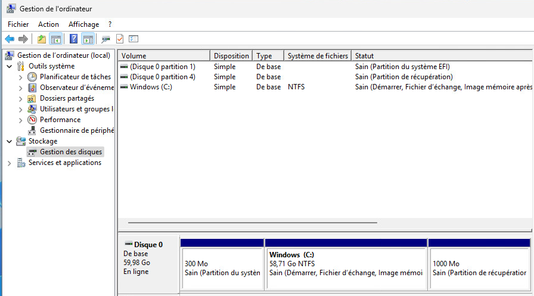

import useBaseUrl from '@docusaurus/useBaseUrl';
import ThemedImage from '@theme/ThemedImage';
import Tabs from '@theme/Tabs';
import TabItem from '@theme/TabItem';

# Disques et partitions 💾

Lorsqu'on installe un système d'exploitation, qu'on ajoute un disque dur ou qu'on veut organiser ses fichiers, la gestion des disques devient essentielle. Une bonne maîtrise des partitions permet de :

- Préparer un disque pour l'installation d'un système d'exploitation.
- Séparer les données personnelles des fichiers système.
- Optimiser l'utilisation de l'espace disque.
- Sécuriser ou organiser les données (sauvegardes, chiffrement, etc.).

Dans Windows, plusieurs outils sont à notre disposition pour gérer les disques, que ce soit en mode graphique ou en ligne de commande.

## Disque physique, partition et volume

Un **disque physique** est un support de stockage tangible, comme un disque dur (hdd), un disque électronique (ssd) ou même une clé USB. C'est que l'on branche physiquement à l'ordinateur.

Une **partition** est une subdivision d'un disque physique. Un disque peut être divisé en plusieurs partitions, et chaque partition est traitée par le système d'exploitation comme une unité distincte. Par exemple, un disque peut avoir une partition pour le système d'exploitation (C:), une autre pour les données personnelles (D:), et ainsi de suite.

Dans un système d'exploitation, **un volume** désigne une unité logique de stockage qui peut inclure une ou plusieurs partitions, ou même une partie d'une partition, utilisée pour stocker des données. C'est une abstraction utilisée par le système d'exploitation pour gérer les données sur le disque de manière plus flexible.

    <ThemedImage
        alt="Schéma"
        sources={{
            light: useBaseUrl('/img/Windows/hdd_w.svg'),
            dark: useBaseUrl('/img/Windows/hdd_d.svg'),
        }}
    />

## La table de partition : MBR vs GPT

La table de partition indique comment le disque est divisé. Comme les partitions ne sont pas littéralement écrites au crayon sur le disque, la table de partition conserve les endroits où débute et se termine chaque partition.

### MBR

C'est un format de table de partition qui est sur le point de disparaitre. Cependant, il pourrait vous arriver de croiser cette table de partition encore quelques années:

- Utilisé depuis les années 80
- Limité à 4 partitions: 3 principales + 1 étendue (dans laquelle on peut créer des partitions logiques)
- Capacité maximale par partition de 2To
- Compatible avec les systèmes BIOS

### GPT

- Format plus récent, faisant partie de la norme UEFI
- Supporte jusqu'à 128 partitions sur Windows
- Limite de taille des partitions de 9.4Zo (9.4 milliards de Terra-octets 🤯)
- Plus robuste: stocke plusieurs copies de la table de partition
- Obligatoire pour démarrage avec UEFI

## Les types de partition

Lorsque vous utilisez une table de partition GPT, il n'y a qu'un seul type de partition : primaire! Néanmoins, lorsque vous utilisez une table de partition de type MBR, il existe plus d'un type de partition dépendamment de ce que vous désirez accomplir:

- **Partition primaire:**
    - Peut contenir un système d'exploitation ou des données.
    - Le système d'exploitation ne peut démarrer qu'à partir d'une partition primaire.
- **Partition étendue:**
    - Partition spéciale qui permet de créer plusieurs partitions logiques.
    - Utile pour ne pas être limité par le seuil de 4 partitions imposé par MBR.
- **Partition logique:**
    - N'existe qu'au sein d'une partition étendue.
    - Ne peut contenir que des données (pas de OS)

## Disques de base vs disques dynamiques ⚙️

### Disques de base (par défaut)

- Utilisent les partitions traditionnelles (MBR ou GPT).
- Simples, compatibles avec tous les systèmes d'exploitation.
- Chaque volume correspond à une partition.
- Suffisants pour la plupart des usages.

### Disques dynamiques

Les disques dynamiques permettent une gestion plus avancée des volumes. C'est une technologie permettant d'ajouter une couche d'abstraction supplémentaire, ce qui ajoute une plus grande flexibilité dans l'administration des stockages.

#### Avantages

- Création de **volumes fractionnés (spanned)** : étendent un volume sur plusieurs disques.
- Création de **volumes répartis (striped)** (RAID 0) : performances accrues.
- Création de **volumes en miroir (mirrored)** (RAID 1) : redondance des données.
- Gestion de **volumes RAID-5** (en version serveur seulement).

#### Caractéristiques

- Fonctionnement sans partitions traditionnelles, avec des volumes dynamiques.
- Possibilité de redimensionner et combiner des volumes plus librement.
- Conversion possible depuis un disque de base (attention, changement irréversible sans perte de données sans outil tiers).
- Incompatibilité avec d'autres OS ou environnement de récupération si Windows ne démarre pas.

#### Recommandations

- À éviter sur des systèmes multiboot ou des disques externes.
- Aujourd’hui, **Storage Spaces** est souvent préféré pour les fonctionnalités similaires, mais plus modernes et flexibles.

## Les systèmes de fichiers 🍕

J'aime bien faire la comparaison entre un système de fichiers et une pizza. Peu importe votre restaurant préféré, une pizza pepperoni fromage restera toujours une pizza pepperoni fromage. Pourtant, chaque chef de restaurant vous dira que c'est leur recette la meilleure. Pourquoi ? Certains vous diront que c'est parce qu'ils commencent avec un ingrédient avant d'en mettre un second alors que d'autres vous diront que le secret est dans la sauce.

Les systèmes de fichiers, c'est sensiblement pareil. C'est la manière dont les fichiers sont organisés et stockés sur un volume. Il existe une panoplie de système de fichiers. Certains sont plus axés sur la sécurité, d'autres sur la capacité de stockage, etc. Ils ont tous leur recette 😉

- **NTFS (New Technology File System):**
    - Système de fichiers par défaut de Windows.
    - Supporte les fichiers plus grands que 4Go.
- **FAT32:**
    - Ancien, mais encore utilisé pour la compatibilité (ex.: Clé USB)
    - Taille des fichiers limitée à plus ou moins 3,8Go
    - Taille des partitions limitée à 32Go sous Windows
    - Compatible avec Windows, Linux, macOS et plusieurs consoles de jeux
- **exFAT (Extended File Allocation Table):**
    - Conçu pour les supports amovibles (clé USB, disques externes, etc.)
    - Pas de limite de taille de fichier ou de partition
    - Compatible avec Windows, macOS et Linux

## Point de montage

Windows est un système d'exploitation à racine multiple. Chaque volume se voit attribuer une lettre correspondant à sa racine.

:::tip[Le saviez-vous ?]
Ce n'est pas obligatoire d'octroyer une racine à volume. Nous pourrions procéder de la même façon que nous le faisons sous Linux, c'est-à-dire en créant un point de montage directement dans un dossier vide du système.
:::

## Outils de gestion des disques

La gestion des disques sous Windows peut se faire via plusieurs interfaces, chacune adaptée à un contexte particulier : interface graphique conviviale pour les utilisateurs, ligne de commande pour les administrateurs ou les scripts automatisés.

### Console de gestion des disques

La console de gestion des disques de Windows est accessible directement depuis la console de gestion de l'ordinateur ou en entrant la commande `diskmgmt.msc` de la fenêtre *Exécuter...* 

La console possède certaines fonctionnalités intéressantes, mais demeure assez limitée lorsque vient le temps d'effectuer des opérations avancées.

**Fonctionnalités principales:**
- Affiche tous les disques physiques et leurs partitions.
- Permets de créer, supprimer, formater des partitions.
- Permets de modifier la lettre d'un volume.
- etc.

### DiskPart (Invite de commande classique)

L'outil DiskPart s'utilise à travers l'invite de commande classique de Windows. C'est un outil relativement puissant qui vous permettra d'entreprendre plus d'actions que via la console de gestion des disques.

Pour utiliser DiskPart, ouvrez une invite de commande en tant qu'Administrateur et tapez simplement la commande `diskpart`. Voici quelques commandes utiles à expérimenter avec DiskPart:

- `list disk` : Affiche tous les disques.
- `select disk 1` : Sélectionne le disque 1.
- `create partition primary size=10240` : Crée une partition de type primaire de 10Go.
- `format fs=ntfs quick` : Formate la partition rapidement en NTFS.

### PowerShell

PowerShell offre évidemment des cmdlets modernes pour la gestion des disques. Le principal avantage de l'utilisation de PowerShell est la possibilité de scripter les actions à entreprendre sur les disques, ce qui peut s'avérer très intéressant dans les environnements d'entreprise.

**Quelques cmdlets utiles:**

- `Get-Disk`: Affiche les disques détectés.
- `Get-Partition`: Affiche les partitions.
- `New-Partition` : Crée une nouvelle partition.
- `Format-Volume` : Formate une partition.
- `Assign-DriveLetter` : Associe une lettre à un volume. 

Vous aurez la possibilité d'expérimenter quelques-unes de ces commandes dans le laboratoire d'aujourd'hui.