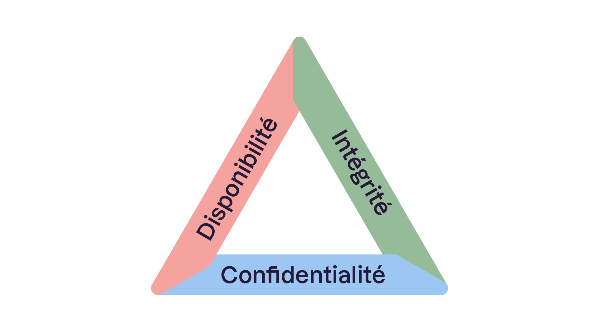
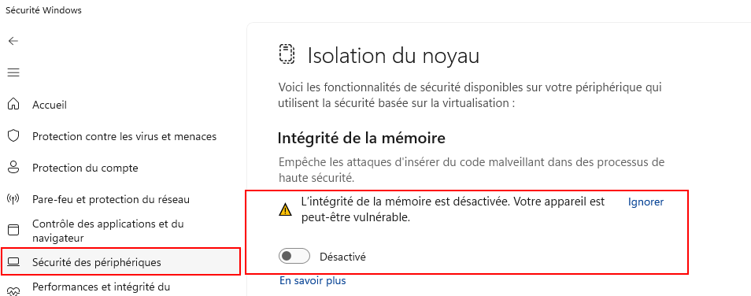
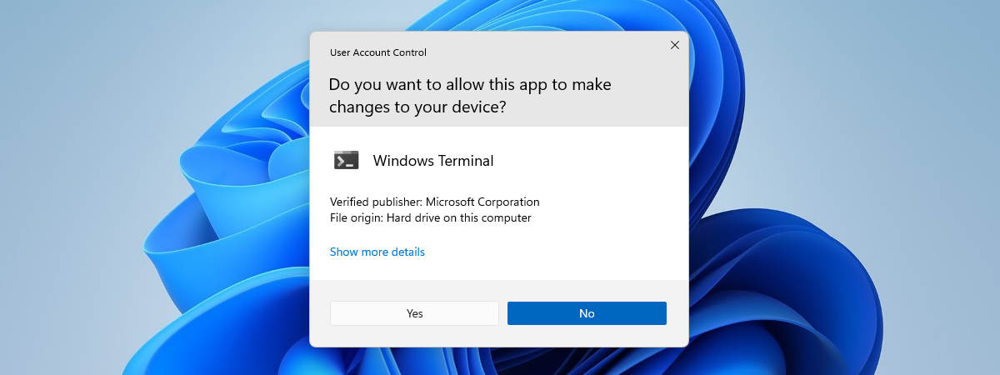
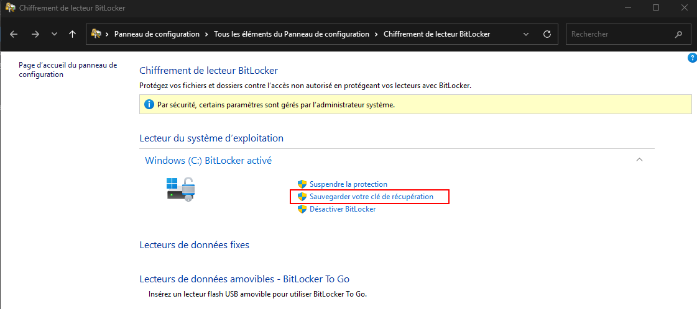
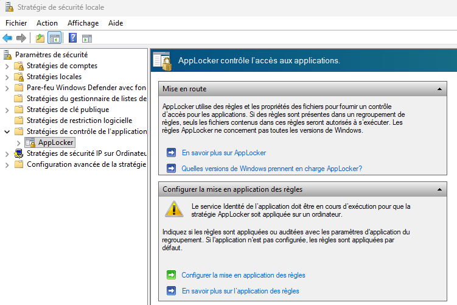

import useBaseUrl from '@docusaurus/useBaseUrl';
import ThemedImage from '@theme/ThemedImage';
import Tabs from '@theme/Tabs';
import TabItem from '@theme/TabItem';

# Sécurité 🛡

## Introduction à la sécurité dans Windows 11

### Contexte et enjeux 🌍 

Avant d'explorer les mécanismes de Windows 11, il est essentiel de comprendre le cadre conceptuel sur lequel repose toute la sécurité informatique: *CIA(CID)*

- **Confidentialité** (*Confidentiality*) : seules les personnes autorisées peuvent accéder aux données.
- **Intégrité** (*Integrity*) : les données ne peuvent être modifiées que par des acteurs légitimes.
- **Disponibilité** (*Availability*) : les systèmes et données sont accessibles quand on en a besoin.

Chaque fonctionnalité de sécurité étudiée dans ce cours peut être rattachée à un ou plusieurs de ces principes. Garder ce modèle en tête aide à comprendre pourquoi un *feature* existe, pas seulement comment il fonctionne.

Un attaquant cherche des vecteurs d'attaque: des chemins d'accès exploitables vers un système. Ces vecteurs peuvent être:

- **Techniques** : vulnérabilités logicielles, pilotes non signés, ports réseau ouverts.
- **Humains** : phishing, ingénierie sociale, mots de passe faibles.
- **Physiques** : vol d'un appareil, accès direct à un disque dur.

Windows 11 est conçu pour réduire ces surfaces d'attaque à chaque niveau : matériel, authentification, réseau et application.

**Évolution des menaces**  
Le paysage des cyberattaques évolue constamment et se complexifie. Windows 11 doit faire face à diverses formes d’attaques allant du ransomware au phishing en passant par les attaques zero-day qui ciblent aussi bien les utilisateurs individuels que les entreprises. Les attaquants exploitent des vulnérabilités aussi bien humaines que techniques, d'où l'importance d'une sécurité robuste.

**Attentes des utilisateurs**  
Les utilisateurs, qu’ils soient particuliers ou professionnels, exigent une protection accrue de leurs données sensibles, financières ou personnelles. Windows 11 répond à ces attentes en intégrant des mécanismes de protection avancés pour instaurer un climat de confiance.

**Approche de sécurité par défaut**  
Dès son installation, Windows 11 offre des fonctionnalités de sécurité prêtes à l’emploi. Plutôt que de se reposer sur des options à activer manuellement, le système est conçu pour sécuriser l'ensemble du processus, du démarrage à l'exécution, et ainsi réduire les risques d'attaque.

---

## Sécurité liée au matériel

### TPM (Trusted Platform Module) 2.0 🔐 

**Définition et rôle**  
Le TPM est une puce dédiée intégrée directement dans la carte mère. Il agit comme un coffre-fort numérique en stockant de manière sécurisée des clés de chiffrement, des certificats et d'autres données sensibles. Windows 11 exige la version 2.0 pour garantir une base de sécurité matérielle solide.

**Utilisations**  
Ce module est notamment utilisé pour :
- Le chiffrement des disques avec BitLocker
- L'authentification via Windows Hello (PIN et biométrie)
- La sécurisation des données sensibles au niveau du hardware

Ainsi, même si le système d'exploitation est compromis, les clés cryptographiques restent protégées dans le TPM et ne peuvent être extraites par un logiciel malveillant.

**Vérifier la présence du TPM:** 
Dans Windows 11 : `Win + R` → `tpm.msc`. L'outil affiche la version du TPM et son état.

### Secure Boot

**Fonctionnement**  
À chaque démarrage, le processus de Secure Boot vérifie l'intégrité et la signature numérique de composants critiques : le chargeur de démarrage (*bootloader*), le noyau (*kernel*) et certains pilotes essentiels. Seuls les éléments signés et validés par Microsoft ou le constructeur sont autorisés à s'exécuter.

**Importance**  
Cette vérification empêche le démarrage de *bootkits* et de *rootkits*, des malwares qui s'installent avant le chargement de l'OS pour échapper à la détection. C'est la première ligne de défense qui sécurise l'intégrité du système dès son allumage.

**Lien CIA** : Secure Boot garantit principalement l'**intégrité** du processus de démarrage.

### Core Isolation et Memory Integrity

**Core Isolation**  
Ce mécanisme exploite la virtualisation matérielle (*Virtualization-Based Security*) pour isoler certains processus critiques du système dans un environnement sécurisé séparé. Même si une partie du système est compromise, la propagation de l'attaque vers ces processus protégés est bloquée.

**Memory Integrity (HVCI *Hypervisor-Protected Core Integrity*)**  
En vérifiant en continu l'intégrité du code chargé en mémoire, HVCI empêche l'injection de code malveillant dans les processus sensibles du noyau. Les pilotes non signés ou modifiés sont rejetés avant de pouvoir s'exécuter.

### Chaîne de confiance matériel 🔗

**De l'allumage à l'exécution**
 
| Étape | Rôle |
|-------|------|
| **1. Allumage** | Le processeur démarre et transfère immédiatement le contrôle au firmware de la carte mère. Aucun système d'exploitation n'est encore en mémoire. |
| **2. UEFI** | C'est le premier logiciel qui s'exécute. Il initialise le matériel (RAM, disques, périphériques) et prépare l'environnement avant de lancer le chargeur de démarrage de Windows. |
| **3. Secure Boot** | Intégré à l'UEFI, Secure Boot vérifie la **signature numérique** du chargeur de démarrage Windows (*bootmgr*). Si la signature est absente ou invalide (fichier modifié par un malware), le démarrage est bloqué immédiatement. |
| **4. TPM vérifie l'intégrité** | Pendant le démarrage, le TPM enregistre des empreintes (*mesures*) de chaque composant chargé. Il compare ces mesures à des valeurs de référence connues. Si quelque chose a été modifié depuis le dernier démarrage sain, le TPM refuse de libérer les clés BitLocker. |
| **5. Chargement du noyau** | Le noyau Windows (*kernel*, `ntoskrnl.exe`) est chargé en mémoire. C'est le cœur du système d'exploitation, il gère les ressources matérielles et constitue la couche entre le matériel et les applications. Sa compromission donnerait un accès total au système. |
| **6. VBS / Core Isolation** | La *Virtualization-Based Security* (VBS) crée un environnement isolé grâce à l'hyperviseur. Les processus critiques (comme la gestion des identifiants) s'exécutent dans cet environnement séparé, hors de portée même d'un noyau compromis. |
| **7. HVCI protège la mémoire** | *Hypervisor-Protected Code Integrity* vérifie que tout nouveau code chargé en mémoire est signé et autorisé. Un pilote malveillant ou un module injecté sans signature valide est rejeté avant de pouvoir s'exécuter. |
| **8. Applications s'exécutent** | Une fois toutes les couches validées, les applications utilisateur démarrent dans un environnement dont l'intégrité a été vérifiée de bout en bout. |

Chaque étape valide la suivante. Si un maillon est compromis, la chaîne s'arrête. C'est ce qu'on appelle une **chaîne de confiance** (*chain of trust*).

---

## Sécurité liée à l’accès utilisateur 👤

### Principe du moindre privilège et comptes utilisateur
 
**Comptes standard vs. comptes administrateur**
Windows 11 distingue deux types de comptes principaux :
- **Compte standard** : accès limité aux ressources système. Recommandé pour l'usage quotidien.
- **Compte administrateur** : accès complet. À utiliser uniquement pour les tâches de gestion.
 
Travailler en permanence avec un compte administrateur augmente considérablement la surface d'attaque : un malware exécuté dans ce contexte hérite de tous les privilèges.

### UAC (*User Account Control*)
 
**Qu'est-ce que l'UAC ?**
L'UAC est le mécanisme qui demande confirmation (ou les identifiants administrateur) chaque fois qu'une action nécessite des privilèges élevés. Il matérialise le principe du moindre privilège en pratique quotidienne.
 
**Fonctionnement:** 
Lorsqu'une application tente d'effectuer une action administrative :
1. Windows intercepte la demande.
2. Une invite UAC apparaît (le bureau bascule en mode sécurisé).
3. L'utilisateur approuve ou refuse explicitement.
 
**Niveaux de configuration:** 
L'UAC dispose de 4 niveaux accessibles via `secpol.msc` (politiques de sécurité) ou le Panneau de configuration :
- **Toujours notifier** : le plus sécurisé.
- **Notifier uniquement pour les modifications d'applications** (par défaut).
- **Notifier sans assombrir le bureau** : moins sécurisé.
- **Ne jamais notifier** : désactive l'UAC (**fortement déconseillé.**)

 
**Lien CIA** : l'UAC protège l'**intégrité** du système en empêchant les modifications non autorisées.

### Windows Hello

**Qu'est-ce que Windows Hello ?**  
Windows Hello est une méthode d'authentification moderne qui remplace ou complète les mots de passe traditionnels. Elle permet l'accès via données biométriques (reconnaissance faciale, empreinte digitale) ou un code PIN propre à l'appareil.

**Modes d'authentification**
 
- **Reconnaissance faciale** : caméras infrarouges qui capturent et comparent les traits du visage à un modèle enregistré. Résistant aux photos (détection de profondeur).

- **Empreinte digitale** : capteur dédié qui lit et compare l'empreinte à une version sécurisée stockée dans le TPM.

- **Code PIN** : propre à l'appareil, stocké dans le TPM, ne transite jamais sur le réseau. Plus sécurisé qu'un mot de passe réseau en cas de vol de credentials en transit.
 
**Sécurisation des données d'authentification** 
Les modèles biométriques et le PIN sont stockés localement dans le TPM, chiffrés et jamais transmis. Une application malveillante ne peut pas les extraire car ils ne quittent jamais la puce.
 
**Pourquoi le PIN est-il plus sûr qu'un mot de passe ?** 
Un mot de passe peut être intercepté lors de son envoi sur le réseau (attaque *pass-the-hash*, *credential stuffing*). Le PIN ne quitte jamais l'appareil, il déverrouille uniquement le TPM local. Sans l'appareil physique, le PIN est inutile.

---

## Sécurité des données 📁 

### Chiffrement: Concepts fondamentaux

**Chiffrement au repos vs. en transit:**

- **Au repos** (*at rest*) : les données sont chiffrées lorsqu'elles sont stockées sur le disque. Si le disque est volé, les données restent illisibles sans la clé.

- **En transit** (*in transit*) : les données sont chiffrées pendant leur transfert sur le réseau (ex. : HTTPS, VPN).

BitLocker couvre le chiffrement *au repos*. Il ne protège pas contre un attaquant qui accède au système pendant qu'il est démarré et déverrouillé.

### BitLocker
 
**Fonctionnement:** 
BitLocker chiffre l'ensemble du volume disque à l'aide de l'algorithme AES (128 ou 256 bits). La clé de chiffrement est gérée et protégée par le TPM. Au démarrage, le TPM vérifie l'intégrité du système avant de libérer la clé.
 
**Scénario d'attaque contré:** 
Un attaquant vole un laptop. Il retire le disque et le branche sur sa propre machine. Sans le TPM d'origine et la clé de récupération, les données restent illisibles. Le chiffrement rend donc le vol physique inutile.
 
**Clé de récupération:** 
En cas de modification matérielle détectée (remplacement de la carte mère, mise à jour du BIOS), le TPM refuse de libérer la clé et BitLocker demande la clé de récupération à 48 chiffres. Cette clé doit être sauvegardée. Perte de la clé = perte définitive des données.
 
**Chiffrement de l'appareil:** 
Sur certains appareils compatibles, une version simplifiée de BitLocker s'active automatiquement avec le compte Microsoft, offrant une protection transparente sans configuration manuelle.

### Gestion des mises à jour (Windows Update) 🔄️
 
**Pourquoi les mises à jour sont critiques** 
Les vulnérabilités non corrigées (*unpatched vulnerabilities*) constituent l'un des vecteurs d'attaque les plus exploités. WannaCry (2017), par exemple, a paralysé des centaines de milliers de systèmes en exploitant une vulnérabilité Windows pour laquelle un correctif existait depuis deux mois.
 
**Types de mises à jour**
- **Mises à jour de sécurité** : corrigent des vulnérabilités connues. Priorité absolue.
- **Mises à jour cumulatives** : regroupent plusieurs correctifs.
- **Mises à jour de fonctionnalités** : nouvelles versions majeures de Windows.
 
**Bonne pratique**
Configurer les mises à jour automatiques et ne jamais reporter indéfiniment les correctifs de sécurité. En environnement professionnel, les mises à jour sont souvent testées puis déployées via WSUS ou Intune.

---

## Protection contre les menaces 🚨 

### Microsoft Defender Antivirus

**Détection en temps réel:** 
Microsoft Defender Antivirus effectue une analyse continue des fichiers, processus et comportements pour identifier toute activité suspecte. Il combine plusieurs approches :
- **Signatures** : comparaison à une base de données de malwares connus.
- **Heuristique** : détection de comportements suspects même sans signature connue.
- **Protection cloud** : analyse en temps réel via Microsoft Intelligence Security Graph.
 
**Mises à jour automatiques:** 
Les définitions de virus se mettent à jour plusieurs fois par jour via Windows Update, garantissant une protection contre les menaces les plus récentes.
 
**Tester sans risque avec les fichiers EICAR:** 
Le fichier de test EICAR est un standard industriel : un fichier inoffensif reconnu par tous les antivirus comme un "virus de test". Il permet de vérifier que la protection fonctionne sans utiliser de vrai malware.

### Filtres et Protection Web

**SmartScreen:** 
SmartScreen analyse les URL, applications et téléchargements en temps réel pour identifier et bloquer les contenus potentiellement dangereux. Il s'appuie sur une réputation calculée à partir de millions d'utilisateurs : un fichier téléchargé pour la première fois par peu de personnes est suspect.
 
**Protection du navigateur (Microsoft Edge):** 
Edge isole les sessions de navigation via *Application Guard*. Les sites non fiables s'exécutent dans un conteneur isolé. Même si un site compromis exploite une vulnérabilité du navigateur, l'attaque reste confinée au conteneur.
 
**Protection contre le phishing:** 
Windows 11 intègre une protection contre la saisie de mots de passe sur des sites de phishing détectés, et avertit si un mot de passe Windows est réutilisé sur un site tiers.

### Pare-feu Windows Defender

**Fonctionnement global:** 
Le pare-feu contrôle les flux réseau entrants et sortants selon trois profils :
- **Domaine** : réseau d'entreprise avec contrôleur de domaine.
- **Privé** : réseau domestique ou de confiance.
- **Public** : réseau Wi-Fi public, règles les plus restrictives.
 
**Règles personnalisables:** 
Les administrateurs peuvent créer des règles par application, port ou protocole. Par exemple : autoriser uniquement une application spécifique à communiquer sur le port 443, bloquer tout trafic entrant vers un service donné.
 
**Visualiser les règles actives:**  
Dans la fenêtre *Exécuter*, tapez `wf.msc` (Pare-feu Windows Defender avec sécurité avancée).

---

## Journalisation et surveillance 📊 

### Observateur d’événements

**Enregistrement des incidents**
L'Observateur d'événements (*Event Viewer*) consigne tous les événements système, sécurité et application sous forme de logs structurés. Chaque événement possède un **Event ID** unique.
 
**Exemples d'event IDs de sécurité importants:** 
 
| Event ID | Signification |
|----------|--------------|
| 4624 | Connexion réussie |
| 4625 | Échec de connexion |
| 4648 | Tentative de connexion avec credentials explicites |
| 4720 | Création d'un compte utilisateur |
| 4732 | Ajout d'un membre à un groupe privilégié |
| 7045 | Installation d'un nouveau service (vecteur d'attaque fréquent) |
 
**Utilisation pour l'analyse**
Ces journaux sont la base de tout *incident response* : reconstituer la chronologie d'une attaque, détecter des tentatives d'intrusion, identifier des comportements anormaux.

### Tableau de Bord Sécurité Windows

**Vue d'ensemble centralisée:** 
Le tableau de bord Sécurité Windows offre une vision globale de l'état de protection : antivirus, pare-feu, mises à jour, santé de l'appareil, contrôle des applications. Un indicateur rouge signale immédiatement les problèmes nécessitant attention.
 
**Accès** : `Win + R` → `windowsdefender`

### Politiques de Sécurité et GPO

**Configuration centralisée**  
Les stratégies de groupe (GPO) permettent aux administrateurs de définir des configurations de sécurité uniformes sur l’ensemble des machines d’un réseau. Cela assure une gestion cohérente et conforme des politiques de sécurité dans les environnements professionnels.

---

## Contrôle des applications
 
### AppLocker et WDAC
 
**AppLocker:** 
Permet de définir des règles qui autorisent ou bloquent l'exécution d'applications selon : l'éditeur (signature numérique), le chemin d'accès, ou le hash du fichier. Par exemple : interdire l'exécution de tout exécutable depuis `%TEMP%` (un vecteur d'attaque très courant pour les malwares).
 
**Windows Defender Application Control (WDAC):** 
Solution plus robuste qu'AppLocker, opérant au niveau du noyau. Elle définit une liste blanche d'applications autorisées à s'exécuter, bloquant tout le reste par défaut. Utilisée dans les environnements à haute sécurité.
 
**Configuration** : `secpol.msc` → Stratégies de contrôle des applications → AppLocker.

---

### Isolation et confinement 🔒 
 
**Windows Sandbox:** 
Environnement Windows 11 temporaire et totalement isolé pour exécuter des applications suspectes. À la fermeture, tout le contenu est effacé. Aucun impact sur le système hôte.
 
**Activation** : Fonctionnalités Windows → Windows Sandbox (nécessite Windows 11 Pro/Enterprise).
 
**Mode S:** 
Limite l'installation d'applications uniquement au Microsoft Store. Toutes les applications du Store sont vérifiées par Microsoft. Sacrifie de la flexibilité pour une sécurité maximale. C'est une version de Windows adaptée aux environnements contrôlés (écoles, kiosques).
