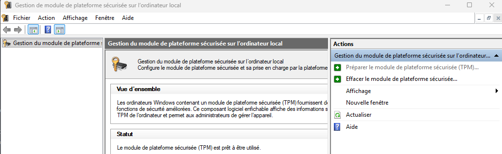

import useBaseUrl from '@docusaurus/useBaseUrl';
import ThemedImage from '@theme/ThemedImage';
import Tabs from '@theme/Tabs';
import TabItem from '@theme/TabItem';

# Sécurité 🛡

## Introduction à la sécurité dans Windows 11

### Contexte et enjeux 🌍 

Avant d'explorer les mécanismes de Windows 11, il est essentiel de comprendre le cadre conceptuel sur lequel repose toute la sécurité informatique: *CIA(CID)*

- **Confidentialité** (*Confidentiality*) : seules les personnes autorisées peuvent accéder aux données.
- **Intégrité** (*Integrity*) : les données ne peuvent être modifiées que par des acteurs légitimes.
- **Disponibilité** (*Availability*) : les systèmes et données sont accessibles quand on en a besoin.

Chaque fonctionnalité de sécurité étudiée dans ce cours peut être rattachée à un ou plusieurs de ces principes. Garder ce modèle en tête aide à comprendre pourquoi un *feature* existe, pas seulement comment il fonctionne.

Un attaquant cherche des vecteurs d'attaque: des chemins d'accès exploitables vers un système. Ces vecteurs peuvent être:

- **Techniques** : vulnérabilités logicielles, pilotes non signés, ports réseau ouverts.
- **Humains** : phishing, ingénierie sociale, mots de passe faibles.
- **Physiques** : vol d'un appareil, accès direct à un disque dur.

Windows 11 est conçu pour réduire ces surfaces d'attaque à chaque niveau : matériel, authentification, réseau et application.

**Évolution des menaces**  
Le paysage des cyberattaques évolue constamment et se complexifie. Windows 11 doit faire face à diverses formes d’attaques allant du ransomware au phishing en passant par les attaques zero-day qui ciblent aussi bien les utilisateurs individuels que les entreprises. Les attaquants exploitent des vulnérabilités aussi bien humaines que techniques, d'où l'importance d'une sécurité robuste.

**Attentes des utilisateurs**  
Les utilisateurs, qu’ils soient particuliers ou professionnels, exigent une protection accrue de leurs données sensibles, financières ou personnelles. Windows 11 répond à ces attentes en intégrant des mécanismes de protection avancés pour instaurer un climat de confiance.

**Approche de sécurité par défaut**  
Dès son installation, Windows 11 offre des fonctionnalités de sécurité prêtes à l’emploi. Plutôt que de se reposer sur des options à activer manuellement, le système est conçu pour sécuriser l'ensemble du processus, du démarrage à l'exécution, et ainsi réduire les risques d'attaque.

---

## Sécurité liée au matériel

### TPM (Trusted Platform Module) 2.0 🔐 

**Définition et rôle**  
Le TPM est une puce dédiée intégrée directement dans la carte mère. Il agit comme un coffre-fort numérique en stockant de manière sécurisée des clés de chiffrement, des certificats et d'autres données sensibles. Windows 11 exige la version 2.0 pour garantir une base de sécurité matérielle solide.

**Utilisations**  
Ce module est notamment utilisé pour :
- Le chiffrement des disques avec BitLocker
- L'authentification via Windows Hello (PIN et biométrie)
- La sécurisation des données sensibles au niveau du hardware

Ainsi, même si le système d'exploitation est compromis, les clés cryptographiques restent protégées dans le TPM et ne peuvent être extraites par un logiciel malveillant.

**Vérifier la présence du TPM**
Dans Windows 11 : `Win + R` → `tpm.msc`. L'outil affiche la version du TPM et son état.

### Secure Boot

**Fonctionnement**  
À chaque démarrage, le processus de Secure Boot vérifie l'intégrité et la signature numérique de composants critiques : le chargeur de démarrage (*bootloader*), le noyau (*kernel*) et certains pilotes essentiels. Seuls les éléments signés et validés par Microsoft ou le constructeur sont autorisés à s'exécuter.

**Importance**  
Cette vérification empêche le démarrage de *bootkits* et de *rootkits*, des malwares qui s'installent avant le chargement de l'OS pour échapper à la détection. C'est la première ligne de défense qui sécurise l'intégrité du système dès son allumage.

**Lien CIA** : Secure Boot garantit principalement l'**intégrité** du processus de démarrage.

### Core Isolation et Memory Integrity

**Core Isolation**  
Ce mécanisme exploite la virtualisation pour isoler certains processus critiques du système des autres composants. Cela limite la propagation des attaques, même si une partie du système est compromise.

**Memory Integrity (HVCI)**  
En surveillant en continu la mémoire et en vérifiant l’intégrité des données en temps réel, Memory Integrity empêche l’injection de code malveillant dans les processus sensibles. Cela renforce la protection de l’ensemble du système pendant son exécution.

### ⚙️ Synergie entre les technologies matérielles

**Chaîne de confiance**  
Les technologies telles que le TPM et Secure Boot instaurent une base de confiance dès le démarrage. Ensuite, Core Isolation et Memory Integrity poursuivent la protection en garantissant l'intégrité des opérations en cours. L'ensemble de ces solutions forme une chaîne robuste qui sécurise chaque étape du cycle de vie du système.

**Impact global**  
Cette approche multi-niveaux assure que, qu'il s'agisse du démarrage ou de l'exécution des applications, le système reste constamment protégé contre divers types de menaces.

---

## 👤 Sécurité liée à l’accès utilisateur

### 🚀 Présentation de Windows Hello

**Qu'est-ce que Windows Hello ?**  
Windows Hello est une méthode avancée d'authentification qui remplace ou complète les mots de passe traditionnels. Elle permet l'accès à l'appareil via des données biométriques (reconnaissance faciale, empreinte digitale) ou un code PIN unique à l’appareil.

**Objectif principal**  
L'objectif est d'offrir une authentification à la fois rapide et sécurisée, en réduisant les risques associés à l'utilisation de mots de passe faibles ou compromis.

### 🔄 Modes d’Authentification et Fonctionnement

**Reconnaissance faciale**  
Cette méthode utilise des caméras équipées de capteurs infrarouges pour capturer et comparer les traits du visage de l'utilisateur avec un modèle préalablement enregistré.

**Empreinte digitale**  
Grâce à des capteurs dédiés, l'empreinte digitale de l'utilisateur est lue et comparée à une version sécurisée stockée dans le système.  

**Code PIN**  
Le code PIN, propre à l'appareil, est stocké de manière sécurisée dans le TPM. Il ne transite jamais sur le réseau, assurant ainsi une couche de sécurité supplémentaire par rapport aux mots de passe traditionnels.

### 🔒 Sécurisation des Données d’Authentification

**Stockage sécurisé**  
Les modèles biométriques ainsi que le code PIN sont stockés localement dans le TPM, garantissant qu'ils ne peuvent être récupérés ou exposés par des applications malveillantes.

**Chiffrement et vérifications**  
Chaque information utilisée lors du processus d'authentification est chiffrée et validée en temps réel, contribuant à une protection dynamique et robuste contre les tentatives d'accès non autorisées.

### 🌟 Avantages de Windows Hello

**Sécurité améliorée**  
L’association des méthodes biométriques et du code PIN offre un niveau de sécurité élevé, limitant efficacement les risques liés aux attaques par phishing ou par force brute.

**Simplicité et rapidité**  
L’authentification via Windows Hello se fait quasiment instantanément, améliorant l’expérience utilisateur tout en garantissant un haut niveau de protection.

---

## 📁 Sécurité des données

### 🔏 Chiffrement et Protection des Disques

**BitLocker**  
BitLocker permet de chiffrer l'ensemble du disque, protégeant ainsi les données contre les accès non autorisés même en cas de vol ou de perte de l'appareil. Le TPM est utilisé pour gérer et sécuriser les clés de chiffrement, ajoutant une couche de sécurité matérielle essentielle.

**Chiffrement de l’appareil**  
Certains appareils bénéficient d'une version simplifiée du chiffrement, conçue pour offrir une protection efficace sans nécessiter une configuration complexe. Cette approche assure la sécurité des données de manière automatisée et transparente pour l'utilisateur.

---

## 🚨 Protection contre les menaces

### 🛡️ Microsoft Defender Antivirus

**Détection en temps réel**  
Microsoft Defender Antivirus effectue une analyse continue des fichiers et processus afin d’identifier rapidement toute activité suspecte ou malveillante. Il agit de manière proactive pour neutraliser les menaces dès leur apparition.

**Mises à jour automatiques**  
Le système se met régulièrement à jour pour intégrer les dernières définitions de virus et les signatures de nouvelles menaces, garantissant ainsi une protection toujours à jour.

### 🌐 Filtres et Protection Web

**SmartScreen**  
SmartScreen analyse les URL, les applications et les téléchargements en temps réel pour identifier et bloquer les contenus potentiellement dangereux ou frauduleux. 

**Protection du navigateur**  
Des mécanismes intégrés dans Microsoft Edge isolent les sessions de navigation, minimisant ainsi les risques de contamination en cas de visite de sites compromis.

### 🔥 Pare-feu Windows Defender

**Fonctionnement global**  
Le pare-feu de Windows Defender contrôle les flux de données entrants et sortants en fonction du profil réseau (domaine, privé, public). Il offre une protection essentielle en bloquant les connexions suspectes et non autorisées.

**Règles personnalisables**  
Les administrateurs peuvent définir des règles spécifiques pour différentes applications et services, adaptant la sécurité réseau aux besoins particuliers de chaque environnement.

---

## 📊 Journalisation et surveillance

### 📋 Observateur d’événements

**Enregistrement des incidents**  
L'Observateur d’événements consigne l’ensemble des logs générés par le système, ce qui permet de garder une trace détaillée des accès et des anomalies survenues.

**Utilisation pour l’analyse**  
Ces journaux constituent une ressource précieuse pour diagnostiquer les problèmes de sécurité, détecter des tentatives d'intrusion et analyser les comportements suspects dans l'environnement.

### 📈 Tableau de Bord Sécurité Windows

**Vue d’ensemble en temps réel**  
Ce tableau de bord offre une vision globale de l'état de la sécurité du système, affichant les informations sur le pare-feu, l’antivirus et l’intégrité du système, permettant ainsi une surveillance centralisée.

**Outil de gestion centralisé**  
Grâce à cet outil, il est plus facile de réagir rapidement en cas d'incident et d'apporter les ajustements nécessaires pour renforcer la sécurité globale de l’appareil.

### ⚙️ Politiques de Sécurité et GPO

**Configuration centralisée**  
Les stratégies de groupe (GPO) permettent aux administrateurs de définir des configurations de sécurité uniformes sur l’ensemble des machines d’un réseau. Cela assure une gestion cohérente et conforme des politiques de sécurité dans les environnements professionnels.

---

## 🚀 Application de la sécurité

### 🛡 Contrôle et Restriction des Applications

**AppLocker et Windows Defender Application Control (WDAC)**  
Ces outils permettent de limiter l'exécution d'applications non autorisées, en empêchant ainsi le lancement de logiciels potentiellement dangereux ou non validés par les politiques de sécurité de l'organisation.

### 🔒 Sécurisation via l’Isolation

**Windows Sandbox et Mode S**  
Windows Sandbox offre un environnement temporaire et isolé pour exécuter des applications à risque, tandis que le Mode S limite l'installation d'applications uniquement au Microsoft Store. Ces fonctionnalités permettent de minimiser l'impact d'éventuelles intrusions en confinant les risques dans des environnements contrôlés.

---

## ☁️ Intégration avec l’écosystème Microsoft

### Intégration avec Azure et Active Directory

**Azure AD Join et Gestion Centralisée**  
Windows 11 s'intègre étroitement avec Azure Active Directory, facilitant la gestion des identités et des accès. Cette intégration permet d'appliquer des politiques de sécurité à l'échelle de l'organisation et d'assurer une gestion centralisée des appareils.

**Windows Hello for Business et Intune**  
Ces solutions complètent l’approche de sécurité en entreprise en proposant des méthodes d’authentification forte et en facilitant le déploiement et la gestion de stratégies de sécurité à distance via Microsoft Intune.

