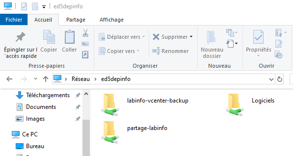

import useBaseUrl from '@docusaurus/useBaseUrl';
import ThemedImage from '@theme/ThemedImage';
import Tabs from '@theme/Tabs';
import TabItem from '@theme/TabItem';
---
draft: true
---
# Partage de ressources 🤝

## Introduction

Le partage de ressources sous Windows permet de rendre accessibles certains éléments du système (dossiers, fichiers, imprimantes) à d'autres utilisateurs du réseau. Cela est réalisé grâce au protocole **SMB (Server Message Block)**. Les ressources partagées sont consultables via l’Explorateur de fichiers, à l’aide d’un chemin **UNC (Universal Naming Convention)** :

\\\\MONSERVEUR\Monpartage



---

## Le protocole SMB

Le protocole **SMB** est un protocole réseau de type **client/serveur** utilisé principalement dans les systèmes Windows. Il est rétrocompatible avec ses versions antérieures.

### SMB vs CIFS vs Samba 💃

- **SMB** : Protocole original.
- **CIFS (Common Internet File System)** : Extension du protocole SMB. Terme souvent utilisé de manière interchangeable avec SMB.
- **Samba** : Implémentation libre et open source du protocole SMB/CIFS, utilisée pour permettre l’interopérabilité entre systèmes UNIX/Linux et Windows.

---

## Rétrocompatibilité et négociation de version

Windows négocie automatiquement la version du protocole SMB à utiliser lors de l’établissement d’une connexion. Cela permet une compatibilité entre différentes versions de Windows, tant que les versions du protocole sont activées sur les machines.

> Version SMB négociée entre deux systèmes Windows.  
> 🔴 SMBv1 = non sécurisée, ⚠️ SMBv2 = correcte, 🟢 SMBv3 = recommandée.

|                  | Windows XP | Windows Vista | Windows 7 | Windows 8 | Windows 8.1 | Windows 10 | Windows 11 | Windows Server 2022 |
|------------------|------------|----------------|------------|------------|--------------|--------------|--------------|------------------------|
| **Windows XP**         | <span class='red-text'>1.0</span> | <span class='red-text'>1.0</span> | <span class='red-text'>1.0</span> | <span class='red-text'>1.0</span> | <span class='red-text'>1.0</span> | <span class='red-text'>1.0</span> | <span class='red-text'>1.0</span> | <span class='red-text'>1.0</span> |
| **Windows Vista**      | <span class='red-text'>1.0</span> | <span class='yellow-text'>2.0</span> | <span class='yellow-text'>2.0</span> | <span class='yellow-text'>2.0</span> | <span class='yellow-text'>2.0</span> | <span class='yellow-text'>2.0</span> | <span class='yellow-text'>2.0</span> | <span class='yellow-text'>2.0</span> |
| **Windows 7**          | <span class='red-text'>1.0</span> | <span class='yellow-text'>2.0</span> | <span class='yellow-text'>2.1</span> | <span class='yellow-text'>2.1</span> | <span class='yellow-text'>2.1</span> | <span class='yellow-text'>2.1</span> | <span class='yellow-text'>2.1</span> | <span class='yellow-text'>2.1</span> |
| **Windows 8**          | <span class='red-text'>1.0</span> | <span class='yellow-text'>2.0</span> | <span class='yellow-text'>2.1</span> | <span class='green-text'>3.0</span> | <span class='green-text'>3.0</span> | <span class='green-text'>3.0</span> | <span class='green-text'>3.0</span> | <span class='green-text'>3.0</span> |
| **Windows 8.1**        | <span class='red-text'>1.0</span> | <span class='yellow-text'>2.0</span> | <span class='yellow-text'>2.1</span> | <span class='green-text'>3.0</span> | <span class='green-text'>3.0</span> | <span class='green-text'>3.0</span> | <span class='green-text'>3.0</span> | <span class='green-text'>3.0</span> |
| **Windows 10**         | <span class='red-text'>1.0</span> | <span class='yellow-text'>2.0</span> | <span class='yellow-text'>2.1</span> | <span class='green-text'>3.0</span> | <span class='green-text'>3.0</span> | <span class='green-text'>3.1.1</span> | <span class='green-text'>3.1.1</span> | <span class='green-text'>3.1.1</span> |
| **Windows 11**         | <span class='red-text'>1.0</span> | <span class='yellow-text'>2.0</span> | <span class='yellow-text'>2.1</span> | <span class='green-text'>3.0</span> | <span class='green-text'>3.0</span> | <span class='green-text'>3.1.1</span> | <span class='green-text'>3.1.1</span> | <span class='green-text'>3.1.1</span> |
| **Windows Server 2022**| <span class='red-text'>1.0</span> | <span class='yellow-text'>2.0</span> | <span class='yellow-text'>2.1</span> | <span class='green-text'>3.0</span> | <span class='green-text'>3.0</span> | <span class='green-text'>3.1.1</span> | <span class='green-text'>3.1.1</span> | <span class='green-text'>3.1.1</span> |

> 💡 La version négociée est toujours la plus **récente compatible entre les deux systèmes**.
---

## SMBv1 et la faille EternalBlue 🔵

La version 1 de SMB contenait une faille de sécurité critique connue sous le nom de **EternalBlue** (CVE-2017-0144). Cette faille a été utilisée notamment lors de la cyberattaque **WannaCry** 😭.

:::tip[Le saviez-vous ?]
L’attaque WannaCry a paralysé des hôpitaux, des entreprises et même des gouvernements... en quelques heures seulement.
En mai 2017, le monde entier a découvert la brutalité d’un ransomware basé sur une faille Windows : WannaCry. Cette attaque s’appuyait sur une vulnérabilité du protocole SMBv1 exploitée par l’outil EternalBlue, développé à l’origine par la NSA et ensuite leaké par un groupe de hackers.

🛑 WannaCry se propageait automatiquement d’un ordinateur à l’autre à travers les réseaux, sans même nécessiter d'interaction humaine (pas besoin de cliquer sur un lien ou un fichier). En quelques heures, plus de 230 000 systèmes dans 150 pays ont été chiffrés.

Parmi les victimes :

Le NHS (système de santé britannique),

Renault, Telefónica, FedEx, et des milliers d'autres...

💰 Les utilisateurs devaient payer une rançon en Bitcoin pour récupérer leurs fichiers. Mais souvent… même en payant, ils ne récupéraient rien.
:::

Depuis Windows 10 version 1709 et Windows Server 1709, **SMBv1 est désactivé par défaut** pour des raisons de sécurité. Il est **fortement déconseillé** de le réactiver.

---

## Partages visibles et cachés dans l’Explorateur

Vous pouvez explorer les ressources partagées d’un serveur en saisissant simplement son nom UNC :

\\\\MONSERVEUR

Les partages dont le nom se termine par un **$** sont **cachés** : ils n’apparaissent pas lors de la navigation. Il faut connaître leur nom exact pour y accéder.

---

## Console de gestion des partages

Windows permet de gérer les partages via la **console de gestion des dossiers partagés** :

```
fsmgmt.msc
```

Depuis cette console, vous pouvez :
- Créer de nouveaux partages
- Modifier ou supprimer des partages existants
- Visualiser les connexions actives et les fichiers ouverts


---

## Partages administratifs

Par défaut, Windows crée automatiquement des **partages administratifs** à des fins de gestion. Exemples :
- `C$` : Racine du disque C
- `ADMIN$` : Répertoire Windows
- `IPC$` : Canal de communication pour les services Windows

Ces partages sont accessibles uniquement aux administrateurs du système.

---

## Permissions : NTFS vs Partage

| Élément               | Permissions de partage     | Permissions NTFS (locales)     |
|-----------------------|----------------------------|---------------------------------|
| Application           | Réseau (en entrée)         | Accès local ou distant         |
| Portée                | Globale sur tout le partage| Spécifique à chaque fichier    |
| Évaluation            | Par le service de partage  | Par le système de fichiers     |
| Disponibilité         | Uniquement via un partage  | En tout temps (même localement)|

**Important** : Pour accéder à un fichier partagé, l'utilisateur doit avoir les **permissions suffisantes dans les deux systèmes**.

Regardons quelques exemples pratiques avec un utilisateur fictif nommé Bob:

**<span class='green-text'>Exemple 1:</span> Bob tente d'accéder à un dossier à distance sans droit de partage ni permissions locales:**

<div style={{textAlign: 'center'}}>
    <ThemedImage
        alt="Schéma"
        sources={{
            light: useBaseUrl('/img/Serveurs1/AucunDroitDistant_W.gif'),
            dark: useBaseUrl('/img/Serveurs1/AucunDroitDistant_D.gif'),
        }}
    />
</div>

* * *
<br/>

**<span class='green-text'>Exemple 2:</span> Bob tente d'accéder à un dossier localement sans droit de partage ni permissions locales:**
<br/>

<div style={{textAlign: 'center'}}>
    <ThemedImage
        alt="Schéma"
        sources={{
            light: useBaseUrl('/img/Serveurs1/AucunDroitLocal_W.gif'),
            dark: useBaseUrl('/img/Serveurs1/AucunDroitLocal_D.gif'),
        }}
    />
</div>

* * *
<br/>

**<span class='green-text'>Exemple 3:</span> Bob tente d'accéder à un dossier à distance sans droit de partage mais avec des permissions locales:**
<br/>

<div style={{textAlign: 'center'}}>
    <ThemedImage
        alt="Schéma"
        sources={{
            light: useBaseUrl('/img/Serveurs1/DroitLocalDistant_W.gif'),
            dark: useBaseUrl('/img/Serveurs1/DroitLocalDistant_D.gif'),
        }}
    />
</div>

* * *
<br/>

**<span class='green-text'>Exemple 4:</span> Bob tente d'accéder à un dossier à localement sans droit de partage mais avec des permissions locales:**
<br/>

<div style={{textAlign: 'center'}}>
    <ThemedImage
        alt="Schéma"
        sources={{
            light: useBaseUrl('/img/Serveurs1/DroitLocalLocal_W.gif'),
            dark: useBaseUrl('/img/Serveurs1/DroitLocalLocal_D.gif'),
        }}
    />
</div>

* * *
<br/>

**<span class='green-text'>Exemple 5:</span> Bob tente d'accéder à un dossier à distance avec des droits de partage mais sans permissions locales:**
<br/>

<div style={{textAlign: 'center'}}>
    <ThemedImage
        alt="Schéma"
        sources={{
            light: useBaseUrl('/img/Serveurs1/DroitDistantDistant_W.gif'),
            dark: useBaseUrl('/img/Serveurs1/DroitDistantDistant_D.gif'),
        }}
    />
</div>

* * *
<br/>

**<span class='green-text'>Exemple 6:</span> Bob tente d'accéder à un dossier localement avec des droits de partage mais sans permissions locales:**
<br/>

<div style={{textAlign: 'center'}}>
    <ThemedImage
        alt="Schéma"
        sources={{
            light: useBaseUrl('/img/Serveurs1/DroitDistantLocal_W.gif'),
            dark: useBaseUrl('/img/Serveurs1/DroitDistantLocal_D.gif'),
        }}
    />
</div>

* * *
<br/>

**<span class='green-text'>Exemple 7:</span> Bob tente d'accéder à un dossier à distance avec des droits de partage et des permissions locales:**
<br/>

<div style={{textAlign: 'center'}}>
    <ThemedImage
        alt="Schéma"
        sources={{
            light: useBaseUrl('/img/Serveurs1/AccesDistantDistant_W.gif'),
            dark: useBaseUrl('/img/Serveurs1/AccesDistantDistant_D.gif'),
        }}
    />
</div>

---

## Permissions effectives

Lorsqu’un utilisateur tente d’accéder à une ressource partagée, les **permissions effectives** correspondent à l’intersection la plus restrictive des permissions NTFS et de partage.

| Utilisateur     | Permission de partage | Permission NTFS     | Résultat (permission effective)      |
|------------------|------------------------|-----------------------|----------------------------------------|
| Alice            | Lecture                | Lecture               | ✅ Lecture autorisée                   |
| Bob              | Lecture                | Contrôle total        | ✅ Lecture autorisée                   |
| Charlie          | Contrôle total         | Lecture               | ✅ Lecture autorisée                   |
| Denise           | Contrôle total         | Contrôle total        | ✅ Contrôle total autorisé             |
| Étienne          | Aucune                 | Lecture               | ❌ Accès refusé                        |
| Fatima           | Lecture                | Aucune                | ❌ Accès refusé   

> 💡 La permission **effective** est toujours la plus restrictive entre les deux types de permissions.  
> Même si une permission de partage est généreuse, l’utilisateur doit aussi avoir les permissions NTFS correspondantes !
---

## Groupes de permissions (ensembles)

Windows propose des **ensembles de permissions prédéfinies**. Ces ensembles regroupent plusieurs permissions granulaires :

| Ensemble        | Contenu (exemples)                       |
|------------------|-------------------------------------------|
| Lecture          | Lire les fichiers et les dossiers         |
| Modification     | Lecture + écriture + suppression          |
| Contrôle total   | Tous les droits, y compris la gestion ACL |

Plus d’infos : [Permissions Windows (carte interactive)](https://mapage.clg.qc.ca/profdinfo/web/420-KA9-LG/permissions.html)

---

## Bonnes pratiques

- Utilisez **les permissions NTFS** pour définir la sécurité fine.
- Les **permissions de partage** devraient être les plus larges possibles (ex. : Contrôle total) et la restriction se fait au niveau NTFS.
- Désactivez SMBv1 pour éviter les failles connues.
- Documentez les partages invisibles (`$`) et limitez leur usage aux besoins spécifiques.
- Utilisez des **groupes d'utilisateurs** pour simplifier la gestion des permissions.

---

## Pour aller plus loin

- [Microsoft Docs - Share and Storage Management](https://docs.microsoft.com/en-us/windows-server/storage/)
- [Comparaison SMB1/2/3 (Microsoft)](https://docs.microsoft.com/en-us/windows-server/storage/file-server/smb-overview)
