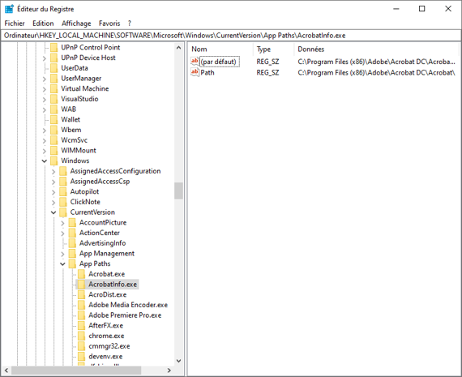
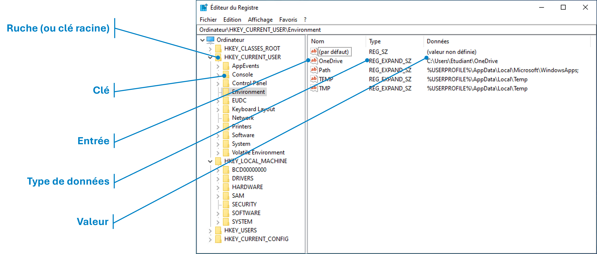
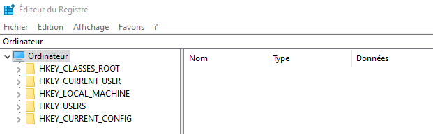
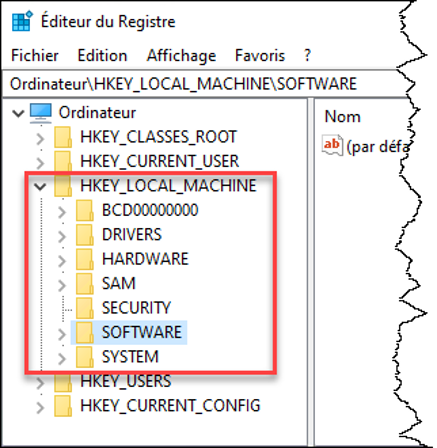
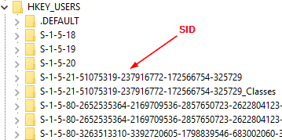
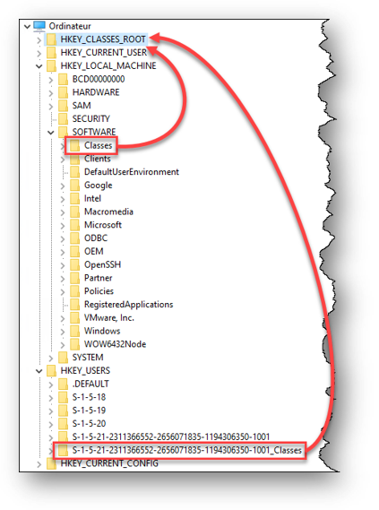
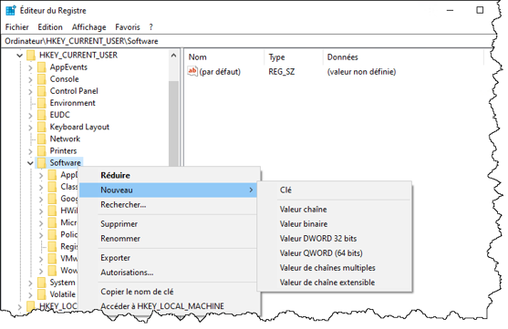
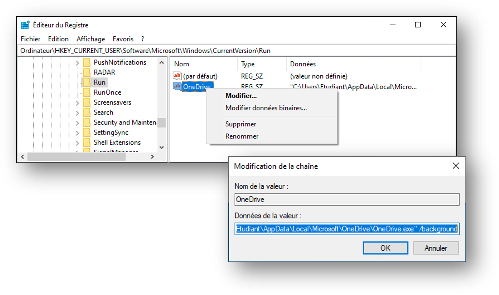
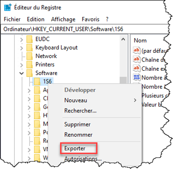
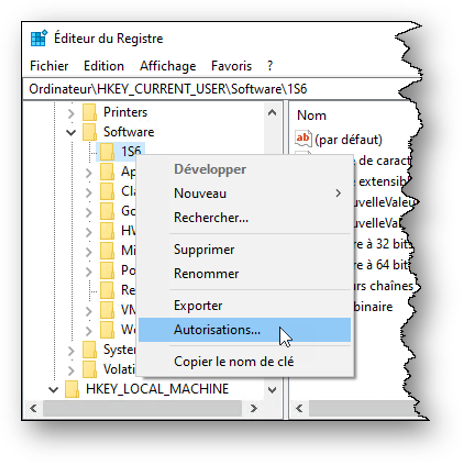

import useBaseUrl from '@docusaurus/useBaseUrl';
import ThemedImage from '@theme/ThemedImage';
import Tabs from '@theme/Tabs';
import TabItem from '@theme/TabItem';

# Base de registre 🛠️

## Le registre Windows

Le registre est une **base de données interne à Windows** qui **centralise la configuration** du système d'exploitation. 

Son principal objectif est :

- ✅ Éviter l'éparpillement des fichiers de configuration
- ✅ Offrir un emplacement central pour toutes les informations de configuration système, utilisateurs, applications



## Qu'est-ce que l'on retrouve dans le registre ?

Presque tout :

- Les utilisateurs et les groupes
- La configuration des périphériques
- La configuration des services
- Les préférences de nos applications

Et bien plus encore, comme la configuration réseau, les associations de fichiers, les composants COM, etc.

## Éditer la base de registre : Précautions ⚠️ 

- Les modifications sont <span class='red-text'>**irréversibles**</span>
- Elles peuvent <span class='red-text'>**dégrader ou rendre inutilisable**</span> le système d'exploitation
- Toujours effectuer une <span class='red-text'>**sauvegarde avant modification**</span>
- Ne pas modifier sans être absolument sûr de ce que l'on fait

Pour modifier la base de registre, plusieurs options s'offrent à nous :

- **Interface graphique** : `regedit.exe`
- **Invite de commande** : `reg.exe`
- **PowerShell** : Utilisation de cmdlets comme `Get-ItemProperty`, `Set-ItemProperty`, `New-Item`, `Remove-Item`

## Terminologie



## Fichiers du registre

La base de registre est composée de plusieurs **fichiers physiques** (appelés *ruches*) situés principalement sous :

- `C:\Windows\System32\config\`
- `C:\Users\<NomUtilisateur>\`

Exemples de fichiers :
- `SYSTEM`
- `SOFTWARE`
- `SAM`
- `SECURITY`
- `NTUSER.DAT`

## Principales ruches (racines)



| Ruche | Rôle |
|:---|:---|
| **[HKEY_LOCAL_MACHINE (HKLM)](./15-Base%20de%20registre.md#hkey_local_machine-hklm)** | Configuration globale de la machine |
| **[HKEY_USERS (HKU)](./15-Base%20de%20registre.md#hkey_users-hku)** | Configuration de tous les utilisateurs |
| **[HKEY_CURRENT_USER (HKCU)](./15-Base%20de%20registre.md#hkey_current_user-hkcu)** | Configuration de l'utilisateur courant |
| **[HKEY_CLASSES_ROOT (HKCR)](./15-Base%20de%20registre.md#hkey_classes_root-hkcr)** | Configuration des associations de fichiers et objets COM |
| **[HKEY_CURRENT_CONFIG (HKCC)](./15-Base%20de%20registre.md#hkey_current_config-hkcc)** | Configuration courante du matériel |

### HKEY_LOCAL_MACHINE (HKLM)

- Contient la **configuration globale** du système.
- Accès nécessaire aux **droits d'administrateur** pour modifier.



### HKEY_CURRENT_USER (HKCU)

- Contient la **configuration propre à l'utilisateur courant**
- Fichier associé : `NTUSER.DAT`
- L'utilisateur **peut écrire** sans être administrateur


### HKEY_USERS (HKU)

- Contient les ruches de **tous les utilisateurs** connus du système
- `.DEFAULT` correspond à `SYSTEM`
- Sous-clés identifiées par les **SIDs**



### HKEY_CLASSES_ROOT (HKCR)

- Fusion de :
  - `HKLM\SOFTWARE\Classes` (système)
  - `HKU\<SID>_Classes` (utilisateur)
- Sert aux **associations de fichiers** et **régistration COM**



### HKEY_CURRENT_CONFIG (HKCC)

- Réflexion dynamique de la **configuration matérielle** active
- Contient peu de données directement

## Créer une clé ou une valeur

**Par interface graphique** (via `regedit`):



**Par PowerShell** :
```powershell
New-Item -Path "HKCU:\Software\MonAppli"
New-ItemProperty -Path "HKCU:\Software\MonAppli" -Name "Version" -Value "1.0" -PropertyType String
```

## Modifier une valeur de registre

**Par interface graphique** : clic droit > Modifier



**Par PowerShell** :
```powershell
Set-ItemProperty -Path "HKCU:\Software\MonAppli" -Name "Version" -Value "2.0"
```

## Types de valeurs

| Type | Description |
|:---|:---|
| REG_SZ | Chaîne de caractères simple |
| REG_DWORD | Nombre 32 bits |
| REG_QWORD | Nombre 64 bits |
| REG_BINARY | Données brutes |
| REG_MULTI_SZ | Liste de chaînes |
| REG_EXPAND_SZ | Chaîne de caractères avec variables d'environnement |

## Exporter et importer une clé

- **Exporter** : clic droit sur une clé > "Exporter" > fichier `.reg`
- **Importer** : double-clic sur le fichier `.reg` ou utiliser `reg import`

### GUI


### PowerShell
```powershell
reg export "HKCU\Software\MonAppli" monappli_backup.reg
reg import monappli_backup.reg
```

## Permissions sur le registre

Tout comme les fichiers NTFS, **les clés de registre** ont des **listes de contrôle d'accès (ACL)**.

- Autorisations : Lecture, Écriture, Suppression
- Permissions héritées ou personnalisées
- Les droits peuvent être gérés via l'interface graphique ou par script (ex: `Set-Acl` en PowerShell)

